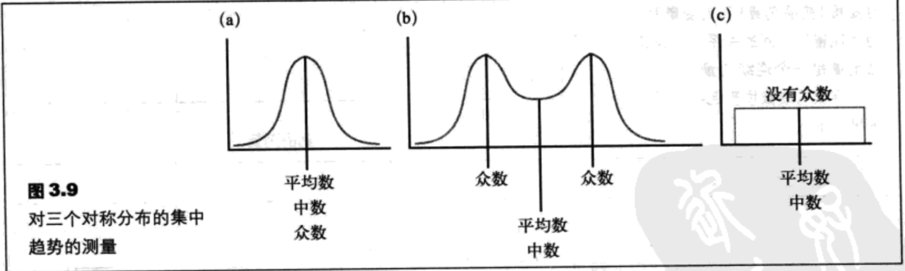

- [集中趋势](#%e9%9b%86%e4%b8%ad%e8%b6%8b%e5%8a%bf)
  - [概述](#%e6%a6%82%e8%bf%b0)
  - [平均数](#%e5%b9%b3%e5%9d%87%e6%95%b0)
  - [中数](#%e4%b8%ad%e6%95%b0)
  - [众数](#%e4%bc%97%e6%95%b0)
  - [集中趋势与分布形状](#%e9%9b%86%e4%b8%ad%e8%b6%8b%e5%8a%bf%e4%b8%8e%e5%88%86%e5%b8%83%e5%bd%a2%e7%8a%b6)
    - [对称分布](#%e5%af%b9%e7%a7%b0%e5%88%86%e5%b8%83)
    - [偏态分布](#%e5%81%8f%e6%80%81%e5%88%86%e5%b8%83)

## 集中趋势
### 概述
`集中趋势`是一个统计测量，它确定了能够代表分布中心的一个数值。集中趋势的目的是找到最典型或最能代表整个组的单个数值。

### 平均数
一个分布的`平均数`是数据的总和除以数据的个数。

- 总体平均数：$\mu=\frac{\sum X}{N}$ (3.1)
- 样本平均数：$M=\frac{\sum X}{n}$ (3.2)
- 加权平均数：$M=\frac{\sum X_1 + \sum X_2}{n_1+n_2}$

### 中数
`中数`是恰好将一个分布一分为二的数值，分布中恰好有50%的个体具有小于或等于中数的数值。中数也相当于第50个百分位数。

### 众数
在一个频数分布中，`众数`是具有最大频率的分数或类别。

### 集中趋势与分布形状
#### 对称分布

#### 偏态分布

