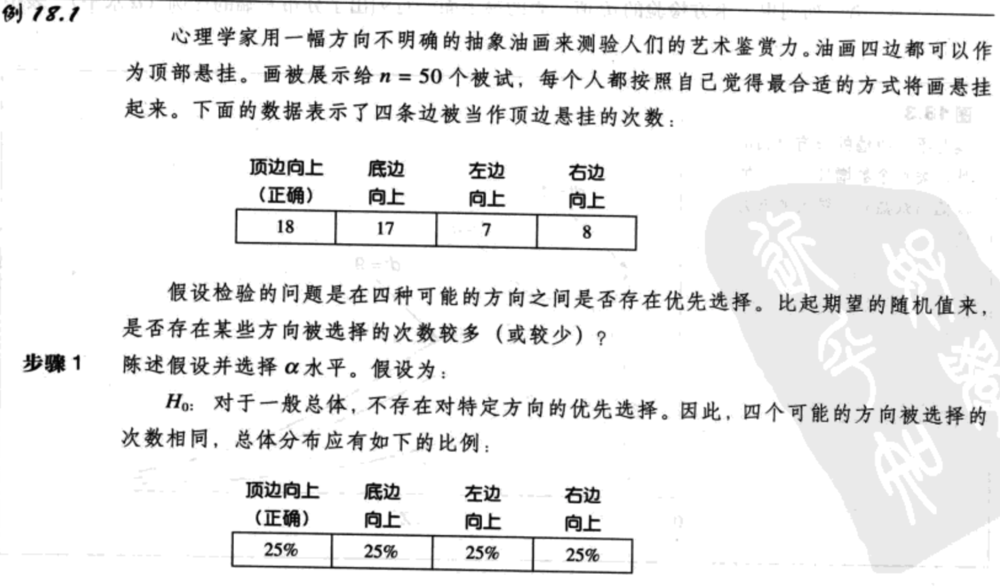
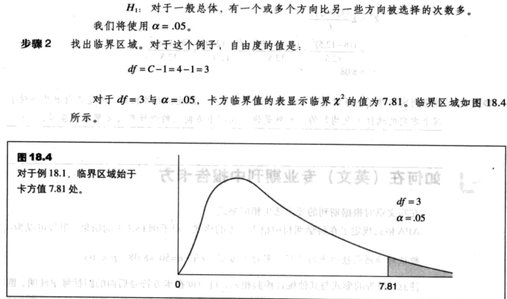
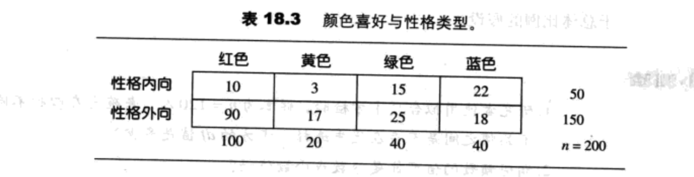
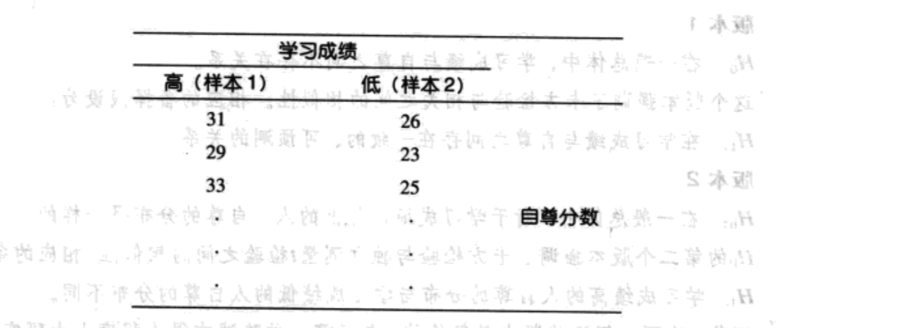
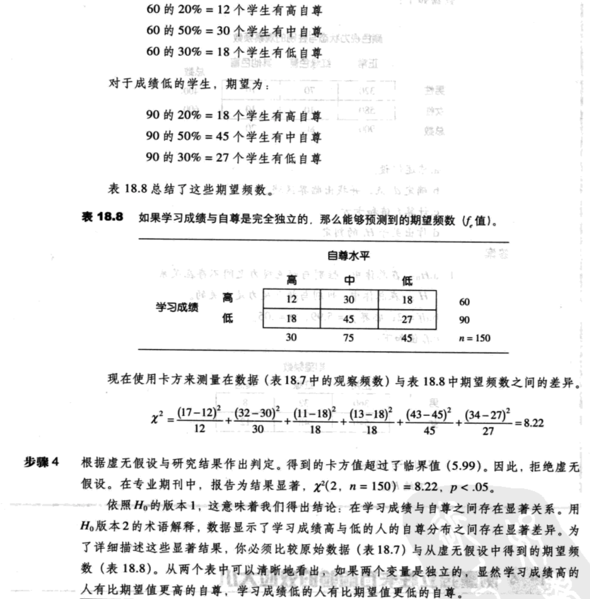
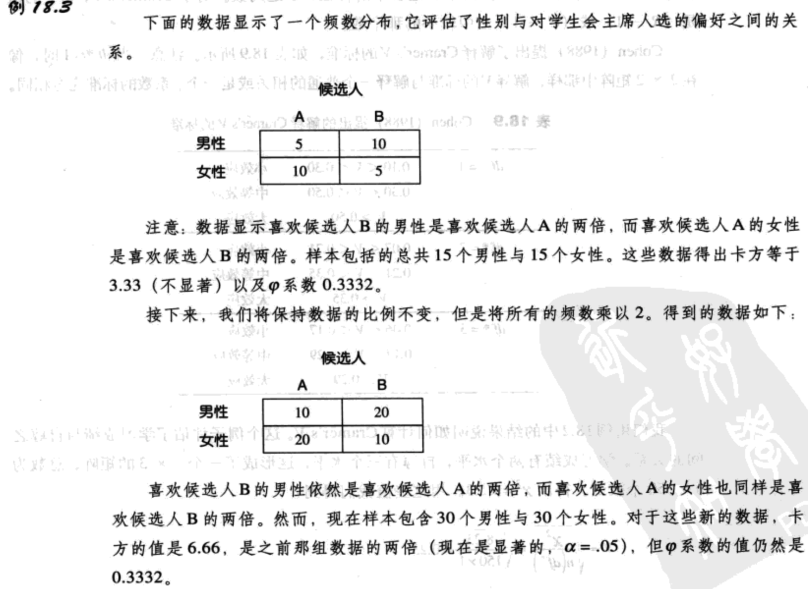

- [相关与非参数检验-卡方检验：拟合度与独立性检验](#%e7%9b%b8%e5%85%b3%e4%b8%8e%e9%9d%9e%e5%8f%82%e6%95%b0%e6%a3%80%e9%aa%8c-%e5%8d%a1%e6%96%b9%e6%a3%80%e9%aa%8c%e6%8b%9f%e5%90%88%e5%ba%a6%e4%b8%8e%e7%8b%ac%e7%ab%8b%e6%80%a7%e6%a3%80%e9%aa%8c)
  - [参数与非参数统计的检验](#%e5%8f%82%e6%95%b0%e4%b8%8e%e9%9d%9e%e5%8f%82%e6%95%b0%e7%bb%9f%e8%ae%a1%e7%9a%84%e6%a3%80%e9%aa%8c)
  - [拟合度的卡方检验](#%e6%8b%9f%e5%90%88%e5%ba%a6%e7%9a%84%e5%8d%a1%e6%96%b9%e6%a3%80%e9%aa%8c)
    - [拟合度检验的虚无假设](#%e6%8b%9f%e5%90%88%e5%ba%a6%e6%a3%80%e9%aa%8c%e7%9a%84%e8%99%9a%e6%97%a0%e5%81%87%e8%ae%be)
    - [拟合度检验的数据](#%e6%8b%9f%e5%90%88%e5%ba%a6%e6%a3%80%e9%aa%8c%e7%9a%84%e6%95%b0%e6%8d%ae)
    - [期望频数](#%e6%9c%9f%e6%9c%9b%e9%a2%91%e6%95%b0)
    - [卡方](#%e5%8d%a1%e6%96%b9)
    - [卡方分布与自由度](#%e5%8d%a1%e6%96%b9%e5%88%86%e5%b8%83%e4%b8%8e%e8%87%aa%e7%94%b1%e5%ba%a6)
    - [拟合度的卡方检验举例](#%e6%8b%9f%e5%90%88%e5%ba%a6%e7%9a%84%e5%8d%a1%e6%96%b9%e6%a3%80%e9%aa%8c%e4%b8%be%e4%be%8b)
    - [拟合度与单样本t检验](#%e6%8b%9f%e5%90%88%e5%ba%a6%e4%b8%8e%e5%8d%95%e6%a0%b7%e6%9c%act%e6%a3%80%e9%aa%8c)
  - [独立性的卡方检验](#%e7%8b%ac%e7%ab%8b%e6%80%a7%e7%9a%84%e5%8d%a1%e6%96%b9%e6%a3%80%e9%aa%8c)
    - [观察频数与期望频数](#%e8%a7%82%e5%af%9f%e9%a2%91%e6%95%b0%e4%b8%8e%e6%9c%9f%e6%9c%9b%e9%a2%91%e6%95%b0)
    - [决定期望频数的简单公式](#%e5%86%b3%e5%ae%9a%e6%9c%9f%e6%9c%9b%e9%a2%91%e6%95%b0%e7%9a%84%e7%ae%80%e5%8d%95%e5%85%ac%e5%bc%8f)
    - [卡方与自由度](#%e5%8d%a1%e6%96%b9%e4%b8%8e%e8%87%aa%e7%94%b1%e5%ba%a6)
    - [独立性卡方检验、皮尔逊相关与独立测量t检验](#%e7%8b%ac%e7%ab%8b%e6%80%a7%e5%8d%a1%e6%96%b9%e6%a3%80%e9%aa%8c%e7%9a%ae%e5%b0%94%e9%80%8a%e7%9b%b8%e5%85%b3%e4%b8%8e%e7%8b%ac%e7%ab%8b%e6%b5%8b%e9%87%8ft%e6%a3%80%e9%aa%8c)
  - [测量独立性卡方检验的效应大小](#%e6%b5%8b%e9%87%8f%e7%8b%ac%e7%ab%8b%e6%80%a7%e5%8d%a1%e6%96%b9%e6%a3%80%e9%aa%8c%e7%9a%84%e6%95%88%e5%ba%94%e5%a4%a7%e5%b0%8f)
    - [$\varphi$系数](#varphi%e7%b3%bb%e6%95%b0)
    - [Cramer’s V](#cramers-v)
  - [卡方检验的假设与限定](#%e5%8d%a1%e6%96%b9%e6%a3%80%e9%aa%8c%e7%9a%84%e5%81%87%e8%ae%be%e4%b8%8e%e9%99%90%e5%ae%9a)
  - [卡方检验的特殊应用](#%e5%8d%a1%e6%96%b9%e6%a3%80%e9%aa%8c%e7%9a%84%e7%89%b9%e6%ae%8a%e5%ba%94%e7%94%a8)
    - [卡方与皮尔逊相关](#%e5%8d%a1%e6%96%b9%e4%b8%8e%e7%9a%ae%e5%b0%94%e9%80%8a%e7%9b%b8%e5%85%b3)
    - [φ系数](#%cf%86%e7%b3%bb%e6%95%b0)
    - [独立测量t检验与方差分析](#%e7%8b%ac%e7%ab%8b%e6%b5%8b%e9%87%8ft%e6%a3%80%e9%aa%8c%e4%b8%8e%e6%96%b9%e5%b7%ae%e5%88%86%e6%9e%90)
    - [独立样本的中数检验](#%e7%8b%ac%e7%ab%8b%e6%a0%b7%e6%9c%ac%e7%9a%84%e4%b8%ad%e6%95%b0%e6%a3%80%e9%aa%8c)

## 相关与非参数检验-卡方检验：拟合度与独立性检验
### 参数与非参数统计的检验
参数与非参数检验之间最明显的一个差别是使用数据的类型。迄今为止，一方面，我们讨论过的所有参数检验都需要数值；另一方面，对于非参数检验，被试通常需要分类，如男性与女性或高、中、低IQ。注意，这些类别涉及对称名或顺序量表的测量，它们通常不可以用于计算平均数与方差。取而代之的是，许多非参数检验的数据只是简单的频数，如在n=100个社区居民中，男性的人数与女性的人数。

最后，你应该注意，非参数检验一般不像参数检验那样灵活；非参数检验更有可能检测不出在两个处理间真实存在的差异。因此，只要实验的数据允许你在参数与非参数检验间选择，就应该选择参数检验。

### 拟合度的卡方检验
`拟合度的卡方检验`使用样本数据来检验关于总体分布的形状或比例的假设。检验确定了得到的样本比例与虚无假设中陈述的总体比例之间的拟合度。

对于卡方检验，习惯上将测量量表表示为一系列矩形，每个矩形分别与量表中的类别相对应。每个类别相应地频数被简单表示为矩形中的数字。图18.1所示为怎样将一组n=40个学生眼睛颜色的分布表示为图、表或一组矩形。注意，对于这个例子的测量量表由四组眼睛颜色的类别（蓝色、棕色、绿色及其他）组成。

#### 拟合度检验的虚无假设
对于拟合度的卡方检验，虚无假设规定了总体在每个类别中的比例（或百分率）。

虽然研究者可以选择任意比例作为虚无假设，但通常会将虚无假设陈述为一些明确定义好的基本原理。一般H0可归入下面类别：

1. **没有优先选择**。虚无假设经常陈述在不同的类别之间没有优先选择。在这种情况下，H0为：总体中的类别是平均分配的。例如，假设陈述了在三种软饮料品牌之间不存在优先选择，因此总体分布为：
2. **与已知总体之间没有差异**。虚无假设可以陈述为一个总体中的比例与已经的另一个总体中的比例没有不同。例如，假设已知60%的美国人支持总统的外交政策，40%反对。研究者可能想知道欧洲是否也存在相同的态度模式。虚无假设为：两个总体之间不存在差异，并规定欧洲人的态度分布为：

#### 拟合度检验的数据
`观察频数`是样本中被归入特定类别的个体个数。每个个体都被归入一个类别，且只被归入一个类别。

#### 期望频数
每个类别的`期望频数`是由虚无假设与样本大小（n）预测的频数值。期望频数定义了在样本比例与虚无假设中陈述的比例完美吻合的情况下产生的理想的假设的样本分布。

#### 卡方
一般任意假设检验的目的是确定样本数据是否支持或驳斥关于总体的假设。在拟合度卡方检验中，样本被表示成一组观察频数（$f_0$值），虚无假设被用于生成一组期望频数（$f_e$值）。

卡方测量了数据（$f_0$）与假设（$f_e$）的拟合程度：

$\chi^2=\sum{\frac{(f_0-f_e)^2}{f_e}}\ (18.2)$

卡方值的计算有如下的步骤：

1. 找出每个类别的$f_0$（数据）与$f_e$（假设）之间的差异。
2. 将差异平方。这保证了所有值都是正数。
3. 然后，用平方差异除以$f_e$。关于这个步骤的调整见补充阅读18.1
4. 最后，将所有类别的值相加。

#### 卡方分布与自由度
1. 卡方公式中包括将平方值相加，因此不可能得到负值。所有卡方值大于等于零。
2. 当H0正确时，你期望数据($f_0$值)接近于假设($f_e$值)。因此，当H0正确时，我们期望卡方值较小。

这两个因素说明，典型的卡方分布应是正偏态的（图18.2）。

从技术上来说，每个特定的卡方分布可以由自由度（df）决定，而不是类别的个数。在拟合度检验中，自由度为：

df=C-1 (18.3)

其中C是类别个数。关于df公式的简短讨论见补充阅读18.2。图18.3表示了df与卡方分布形状之间的一般关系。当df增加时，卡方分布的峰值（众数）变得越来越大。

#### 拟合度的卡方检验举例

#### 拟合度与单样本t检验
虽然卡方检验与单样本t检验明显不同，但也是很相似的。具体来说，两个检验都是使用从单一样本中得出的数据作出对单一总体的假设检验。

确定应该使用卡方检验或t检验的最主要因素是从每个个体得到的测量类型。如果样本数据由数值（等距或等比量表）组成，我们就可以计算样本平均数并使用t检验来评估关于总体平均数的假设。例如，研究者可以测量部分社区居民的样本个体的IQ值，然后可以使用t检验评估关于所有社区居民总体IQ的假设。如果样本中的个体被归入非数值的类别（称名或顺序量表），你可以使用卡方检验来评估关于总体比例的假设。例如，研究者可能依照性别计算在社区居民的样本中男性和女性人数，然后使用卡方检验来评估关于总体比例的假设。

### 独立性的卡方检验
当两个变量之间没有稳定可预测的关系时，即为`独立`。在这种情况下，一个变量的频数分布与另一个变量的类别是不相关的（或依赖的）。因此，当两个变量相互独立时，一个变量的频数分布与第二个变量的类别将有同样的形状。

H0：对于学生的一般总体，在颜色喜好与性格之间不存在关系。

H0：在学生的总体中，性格内向的人的颜色喜好分布与性格外向的人的颜色喜好分布之间不存在显著差异。两个分布有相同的形状。

#### 观察频数与期望频数
H0：对于两种性别类别，颜色喜好的频数分布形状相同的（同样的比例）。

根据表18.3，完整的颜色喜好比例如下：

- 200中的100=50%喜欢红色
- 200中的20=10%喜欢黄色
- 200中的40=20%喜欢绿色
- 200中的40=20%喜欢篮色

对于性格内向的人的样本（50人），我们得到的期望频数：
- 50%=0.50选择红色：$f_e=0.50 * 50 = 25$
- 10%=0.50选择黄色：$f_e=0.10 * 50 = 5$
- 20%=0.50选择绿色：$f_e=0.20 * 50 = 10$
- 20%=0.50选择篮色：$f_e=0.20 * 50 = 10$

对于性格外向的人的样本（150人），我们得到的期望频数：
- 50%=0.50选择红色：$f_e=0.50 * 150 = 75$
- 10%=0.50选择黄色：$f_e=0.10 * 150 = 15$
- 20%=0.50选择绿色：$f_e=0.20 * 150 = 30$
- 20%=0.50选择篮色：$f_e=0.20 * 150 = 30$

#### 决定期望频数的简单公式
$f_e=\frac{f_cf_r}{n}\ (18.4)$

- $f_c$是列总和
- $f_r$是行总和
- n是整个样本的个体个数

代入得：

$f_e=\frac{f_cf_r}{n}=\frac{20 * 50}{200}=5$

#### 卡方与自由度
独立性卡方检验使用的公式与拟合度卡方检验是完全一样的：

$\chi^2=\sum\frac{(f_0-f_e)^2}{f_e}$

总共可以自由选择的$f_e$值个数是(R-1)(C-1)，其中R是行数，C是列数。独立性卡方检验的自由度有公式：

df=(R-1)(C-1) (18.5)

#### 独立性卡方检验、皮尔逊相关与独立测量t检验
假定一个研究者在调查10岁儿童的学习成绩与自尊之间的关系。研究者指明了两个变量，研究的问题涉及它们之间的关系。根据研究者将如何测量两个变量，相关、独立测量t检验或独立性卡方检验将成为评估这种关系的恰当的统计过程。

例如，如果研究者得到了两个变量的数值，那么得到的数据可以计算[皮尔逊相关](relevance.md#皮尔逊相关)。在这种情况下，数据形式如下：

被试 | 学习成绩 | 自尊分数
---|------|-----
A | 98 | 31
B | 78 | 26
C | 81 | 27
D | 65 | 23
. | . | .
. | . | .
. | . | .

研究者将计算数据的平均数、SS值和SP值，**皮尔逊相关将描述学习成绩与自尊之间的关系程度与方向**。

如果研究者将个体的学习成绩归入两个类别：高与低，然后使用每个个体自尊的数值，那么得到的数据将适于[独立测量t检验](2independent-sample-t-score.md)。

在这种情况下，数据将为：

现在，研究者有了两个分开的样本，他要计算每个样本的平均数与SS。**独立测量t检验将用于确定学习成绩高的人与学习成绩低的人的自尊是否存在显著差异。显著差异说明与学习成绩间存在关系**。

研究者也可以选择将个体两个变量的情况归入类别。例如，每个学生可以被归入学习成绩高与低的类别与自尊高、中、低的类别。得到的数据为频数分布，它可以像表18.7那样表示成一个矩阵。注意，**这些数据不涉及任何的数值，而只是一组频数，适用于卡方检验**。

### 测量独立性卡方检验的效应大小
#### $\varphi$系数
$\varphi$系数的值可以直接从卡方计算出来：

$\varphi=\sqrt{\frac{\chi^2}{n}}\ (18.6)$

$\varphi$系数的值完全由2x2数据矩阵的比例决定，与频数大小的绝对值完全无关。然而，卡方值不仅被比例影响，还被频数的大小影响。这个区别如下面的例子所示。

因而两个样本的比例是一样的，$\varphi$系数的值没有变化。然而，比起较小的样本，较大的样本提供了更令人信服的证据，因此较大的样本可以提供更显住的结果。

#### Cramer’s V

依照Cohen的指导标准（表18.9），这个值说明两个变量之间的关系大小。

### 卡方检验的假设与限定

### 卡方检验的特殊应用
#### 卡方与皮尔逊相关
当两个变量都是由数值组成时，应使用皮尔逊相关评估变量间的关系。也就是说，当X与Y是从等距或等比量表中得到的数值时。另一方面，如果数据是由将个体归类到类别中而得到的，如称名或顺序量表的测量数据，应使用独立卡方检验。尽管两种统计方法都可用来评估两个变量之间的关系，但有一个主要的区别是二者所使用的数据类型不同。`卡方检验的数据是频数，而皮尔逊相关的则是数值。`

这两个统计过程的另一个区别是它们的根本目的。独立性卡方检验评估的是关系的显著性。也就是说，它要确定从样本数据中观察到的关系是否显著大于偶然的随机期望。你也可以用皮尔逊相关评估显著性，但相关的主要目的是测量关系的强度。具体来说，平方相关$r^2$，提供了对效应大小的测量，它描述了一个变量的方差中能够由它与另一个变量的关系决定的那部分比例。

#### φ系数
在本章前面的部分中，我们注意到两个二元变量（只有两个值的变量）之间的关系可以用$\varphi$系数相关或2x2独立卡方检验来评估。在例18.3中，我们检验了性别（男性/女性）与对选举候选人的偏好（候选人A/候选人B）之间的关系。$\varphi$系数提供了一个相关，它表明了关系的强度，而卡方检验评估了关系的显著性。

#### 独立测量t检验与方差分析
独立测量t检验与ANOVA是检验自变量与因变量之间关系的统计过程。两个检验都要求因变量的分数由等距或等比量表测量的数值组成。

独立性卡方检验时常可以被用来代替t或ANOVA，特别是在以下情况中：
1. 自变量实际上是准自变量时，即由截然独立的被试（男人与女人；8岁与10岁）组成时。
2. 因变量包含将个体归入称名或顺序量表的类别时。

例如，加入研究者想检验4岁男孩与4岁女孩词汇能力之间的差异。这个研究的数据将需要两个独立样本（男孩与女孩）。如果每个儿童的词汇能力都可以用一个数字分数表示，男孩与女孩之间的平均数差异可以用独立测量t检验或ANOVA来评估。另一方面，如果每个儿童只是被简单归入词汇能力的高、中或低的类别的话，数据较适合使用卡方检验。

#### 独立样本的中数检验
中数检验是独立测量t检验（或ANOVA）的非参数代替，它能确定在两个或多个独立样本之间是否存在显著差异。中数检验的虚无假设为：来自总体的不同样本具有相同的中数（没有差异）。备择假设：样本来自不同总体，它们的中数不同。

中数检验背后的逻辑是从同一个总体分布中取出几个不同的样本，每个样本中应该有大约一半的数据大于总体中数，大约一半数据小于总体中数。也就是说，所有这些不同的样本应该分布在同样的中数附近。另一方面，如果样本来自具有不同中数的总体，那么样本的数据要么偏大，要么偏小。

中数检验的第一步是将所有不同样本的数据放在一起，然后找出这个结合组的中数。然后，构建一个矩阵，每个样本组成一列，每列有两行：一行是大于中数的个体；另一行是小于中数的个体。最后，对于每个样本，你计算有多少个个体在结合组的中数之上，有多少个在结合组的中数之下，这些值就是矩阵中的观察频数。

