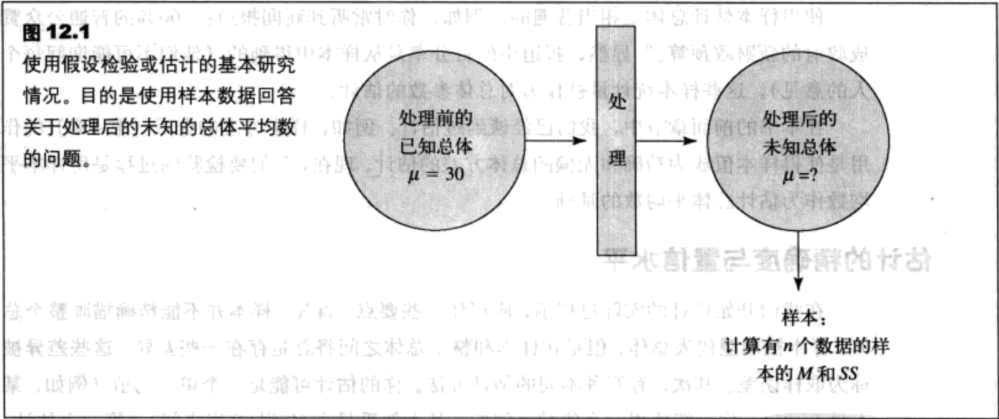
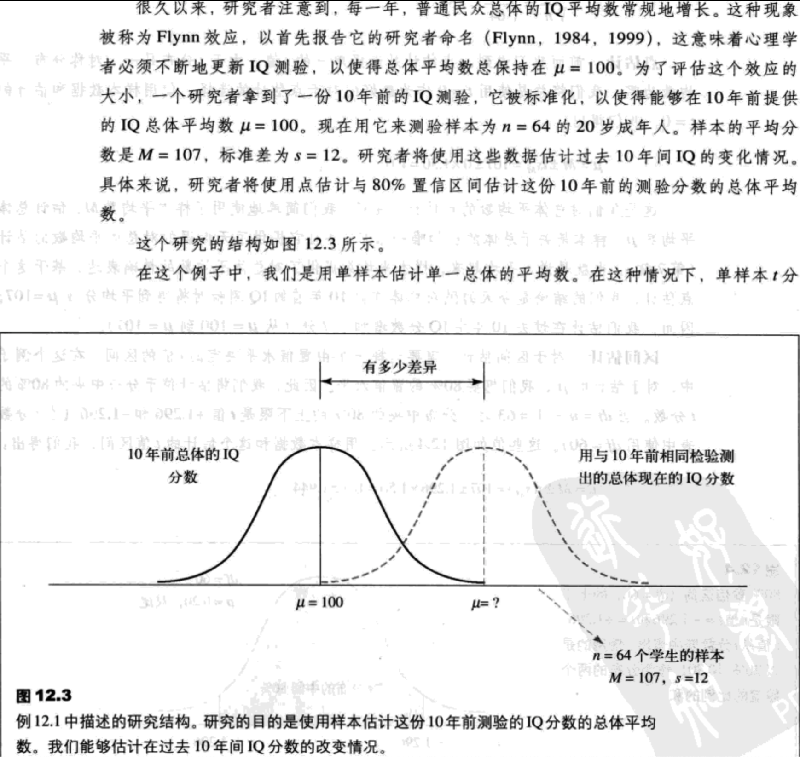
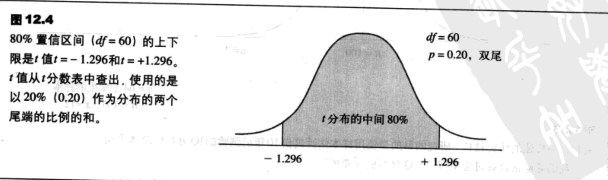
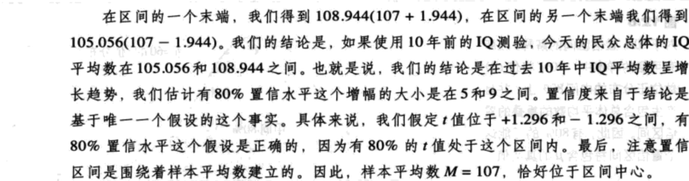
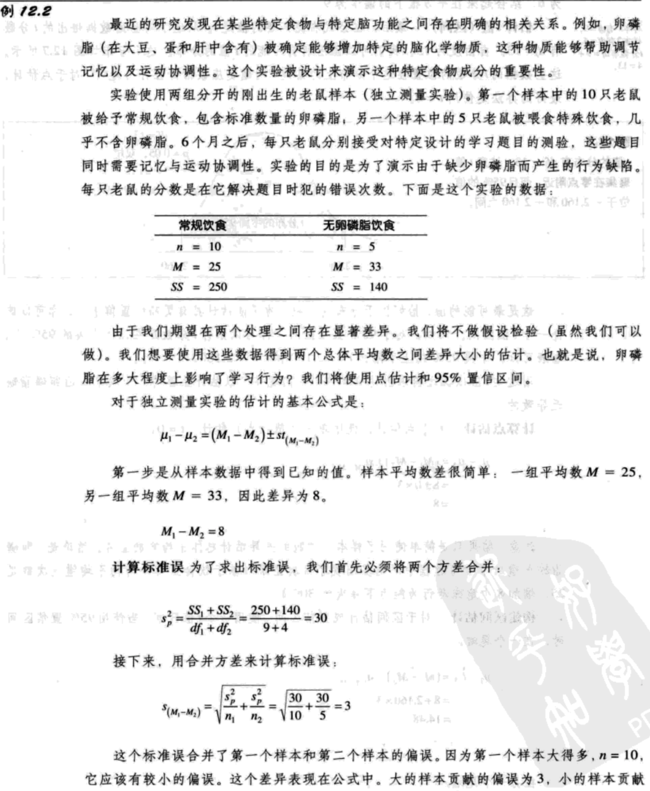
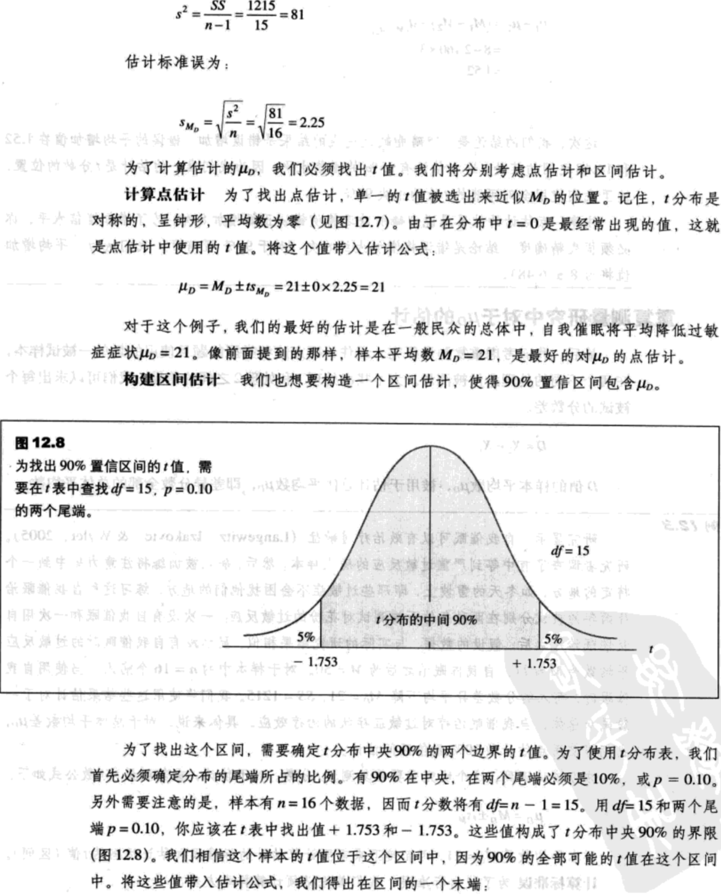

- [平均数差异推论-估计](#%e5%b9%b3%e5%9d%87%e6%95%b0%e5%b7%ae%e5%bc%82%e6%8e%a8%e8%ae%ba-%e4%bc%b0%e8%ae%a1)
  - [估计概述](#%e4%bc%b0%e8%ae%a1%e6%a6%82%e8%bf%b0)
  - [对t分数的估计](#%e5%af%b9t%e5%88%86%e6%95%b0%e7%9a%84%e4%bc%b0%e8%ae%a1)
    - [单样本研究中对μ的估计](#%e5%8d%95%e6%a0%b7%e6%9c%ac%e7%a0%94%e7%a9%b6%e4%b8%ad%e5%af%b9%ce%bc%e7%9a%84%e4%bc%b0%e8%ae%a1)
    - [独立测量研究中对μ1-μ2的估计](#%e7%8b%ac%e7%ab%8b%e6%b5%8b%e9%87%8f%e7%a0%94%e7%a9%b6%e4%b8%ad%e5%af%b9%ce%bc1-%ce%bc2%e7%9a%84%e4%bc%b0%e8%ae%a1)
    - [重复测量研究中对μD的估计](#%e9%87%8d%e5%a4%8d%e6%b5%8b%e9%87%8f%e7%a0%94%e7%a9%b6%e4%b8%ad%e5%af%b9%ce%bcd%e7%9a%84%e4%bc%b0%e8%ae%a1)

## 平均数差异推论-估计
### 估计概述
用样本统计量推断总体参数的推论性过程称为`估计`。

`点估计`是使用单一的数值作为对未知量的估计。

`区间估计`使用值域对未知量进行估计。区间估计伴随着一定水平的信心（或可能性），称为`置信区间`。

假设检验 | 估计
-----|---
目的：检验关于总体参数的假设——通常为虚无假设，陈述处理没有效应。 | 目的：估计未知的总体参数的值——通常是未知的总体平均数。
A.对于假设检验，你开始于假设一个未知的总体参数的值，这个值被设定在虚无假设中。 | A.对于估计，不需要计算t分数，而是需要估计t值应该是多少。作出这个估计的策略是选择“合理的”t值。
B.假设值被带入公式，计算t值。 | B.与假设检验相同，“合理的”t值被定义为有限大概率出现在分布中央附近（见图12.2）。
C.如果假设值提供了“合理的”t值，我们的结论是这个假设是“合理的”，并且我们未能拒绝H0.如果结果是极端t值，H0则被拒绝。 | C.将“合理的”t值带入公式，计算求出未知的总体参数的值。
D.“合理的”t值的定义是它的位置在分布中间。通常，“合理的”值有很大概率出现在分布中央。极端值则有极低的概率出现在这个位置，因而被认为是“不合理的”（见图12.2）。 | D.由于在公式中使用了“合理的”t值，因此也就假定了这个计算将提供“合理的”总体参数的估计。

关于未知的总体参数的公式如下：

    总体平均数（或平均数差）= 样本平均数（或平均数差） +/- t(估计标准误) （12.1）

我们将用这个一般公式计算估计，考虑下列关于公式12.1的两点

1. 在公式的右侧，样本平均数和估计标准误的值可以直接从样本数据计算出来。因而，只有t值是未知的。如果我们能确定这个未知值，就能使用这个公式计算未知的总体平均数。
2. 如果我们不能求出特定的t值，但是，我们知道t分布的整体情况，我们可以使用分布估计t值。
    1. 对于点估计，最好的办法是使用t=0，即分布的精确中心。我们没有理由猜测分布存在偏差（高于平均数或低于平均数），因而t=0是个合理的值。另外，t=0是最可能出现的值，当值从分布的中央到分布的尾端移动时，概率将稳定地递减。
    2. 对于区间估计，我们将使用在零点附近的一个t值的值域。例如，为了使我们估计的正确性有90%的置信水平，我们只需使用在分布中央的90%的t值。注意，我们是在估计样本数据与在t分布中央的90%的值相应。

### 对t分数的估计
t分数公式如下：

    总体平均数（或平均数差）= 样本平均数（或平均数差） +/- t(估计标准误)

对于单一样本t分数，我们将用样本平均数M，估计未知的总体平均数$\mu$。对于单一样本t分数的估计公式是：

$\mu=M \pm t_{s_M}\ (12.2)$

对于独立测量t分数，我们将用两个样本平均数的差$M_1-M_2$，估计两个总体平均数中的差$\mu_1-\mu_2$。独立测量t分数的估计公式是：

$\mu_1-\mu_2=M_1-M_2 \pm t_{s_{M_1-M_2}}\ (12.3)$

最后，重复测量t分数将被用于用样本平均数的差$M_D$，估计一般总体平均数的差$\mu_D$。重复测量t分数的估计公式是：

$\mu_D=M_D \pm t_{s_{M_D}}\ (12.4)$

#### 单样本研究中对μ的估计
例12.1

#### 独立测量研究中对μ1-μ2的估计

#### 重复测量研究中对μD的估计

