- [频数分布](#%e9%a2%91%e6%95%b0%e5%88%86%e5%b8%83)
  - [概述](#%e6%a6%82%e8%bf%b0)
  - [频数分布表](#%e9%a2%91%e6%95%b0%e5%88%86%e5%b8%83%e8%a1%a8)
    - [比例与百分比](#%e6%af%94%e4%be%8b%e4%b8%8e%e7%99%be%e5%88%86%e6%af%94)
    - [分组频数分布表](#%e5%88%86%e7%bb%84%e9%a2%91%e6%95%b0%e5%88%86%e5%b8%83%e8%a1%a8)
  - [频数分布图](#%e9%a2%91%e6%95%b0%e5%88%86%e5%b8%83%e5%9b%be)
    - [等距或等比数据的频数分布图](#%e7%ad%89%e8%b7%9d%e6%88%96%e7%ad%89%e6%af%94%e6%95%b0%e6%8d%ae%e7%9a%84%e9%a2%91%e6%95%b0%e5%88%86%e5%b8%83%e5%9b%be)
      - [直方图](#%e7%9b%b4%e6%96%b9%e5%9b%be)
      - [折线图](#%e6%8a%98%e7%ba%bf%e5%9b%be)
    - [称名数据或顺序数据的频数分布图](#%e7%a7%b0%e5%90%8d%e6%95%b0%e6%8d%ae%e6%88%96%e9%a1%ba%e5%ba%8f%e6%95%b0%e6%8d%ae%e7%9a%84%e9%a2%91%e6%95%b0%e5%88%86%e5%b8%83%e5%9b%be)
      - [柱形图](#%e6%9f%b1%e5%bd%a2%e5%9b%be)
    - [总体分布的频数分布图](#%e6%80%bb%e4%bd%93%e5%88%86%e5%b8%83%e7%9a%84%e9%a2%91%e6%95%b0%e5%88%86%e5%b8%83%e5%9b%be)
  - [频数分布的形状](#%e9%a2%91%e6%95%b0%e5%88%86%e5%b8%83%e7%9a%84%e5%bd%a2%e7%8a%b6)
  - [百分位数、百分等级与内插法](#%e7%99%be%e5%88%86%e4%bd%8d%e6%95%b0%e7%99%be%e5%88%86%e7%ad%89%e7%ba%a7%e4%b8%8e%e5%86%85%e6%8f%92%e6%b3%95)
    - [累积频数和累积百分率](#%e7%b4%af%e7%a7%af%e9%a2%91%e6%95%b0%e5%92%8c%e7%b4%af%e7%a7%af%e7%99%be%e5%88%86%e7%8e%87)
    - [内插法](#%e5%86%85%e6%8f%92%e6%b3%95)
  - [茎叶图](#%e8%8c%8e%e5%8f%b6%e5%9b%be)
    - [茎叶图与频数分布的比较](#%e8%8c%8e%e5%8f%b6%e5%9b%be%e4%b8%8e%e9%a2%91%e6%95%b0%e5%88%86%e5%b8%83%e7%9a%84%e6%af%94%e8%be%83)

## 频数分布
### 概述
`频数分布`是一种组织好的关于位于测量量表每个类别上的个数数目的数据表。

### 频数分布表

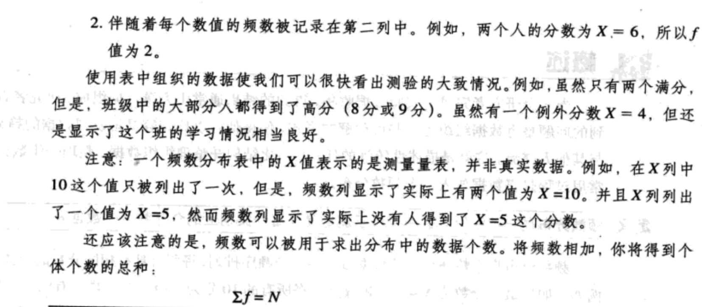

#### 比例与百分比
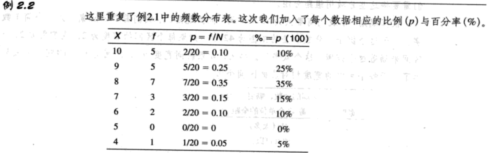

#### 分组频数分布表
下面这些规则可以帮助你构造一个分组频数分布表。

1. 分组频数分布表应该具有大约10个组距。
2. 每个区间的宽度应为相对简单的数字。
3. 每个组距的最小数值应为宽度的倍数。
4. 所有区间应具有相同宽度。它们应该无间断无重复地涵盖所有数值，使得任意特定数值都恰好只属于一个区间。

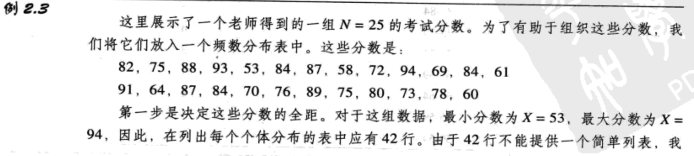
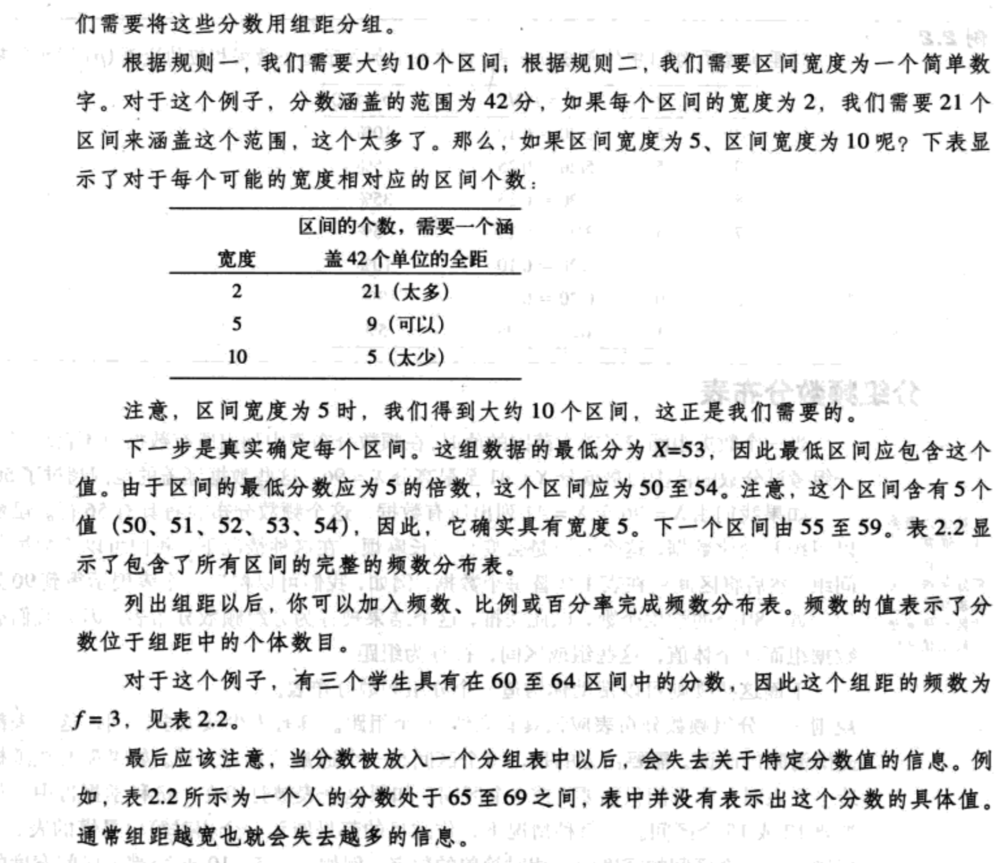
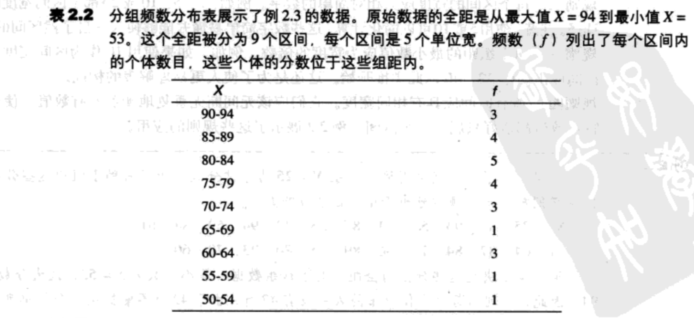

### 频数分布图
#### 等距或等比数据的频数分布图
##### 直方图
为了构造一个直方图，首先将数字（测量类别）沿X轴列出，然后画出位于每个X值上的一个矩形，使得：

1. 矩形的高度对应每个类别的频数；
2. 矩形的宽度为每个类别的实限。

由于矩形的宽度为每个类别的实限，相邻的矩形将连在一起，中间没有空隙或间隔。

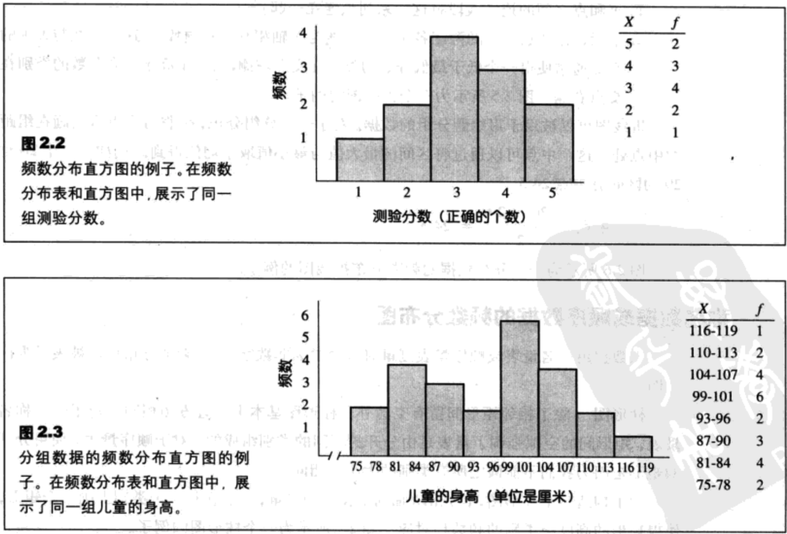

`修正的直方图`：对传统直方图的轻微改动使得频数分布更容易理解。在修正的图中，代替每个分数中的矩形的是一摞方块，每个方块代表一个个体。因此，在每个分数上，方块数目与这个分数中的频数相对应。

##### 折线图
为了构造一个折线图，首先将数字（测量类别）沿X轴列出，然后，

1. 每个坐标的中心上方有一个点，它的垂直位置对应这这一类别的频数；
2. 点和点之间的连续线段将这一系列点连在一起；
3. 最后，在分数全距的两段各画一条直线与X轴相交（零频数）。这两条线与X轴的交点通常使得一个低于分数的类别在交点左侧，另一个高于最高分数的类别在交点右侧。

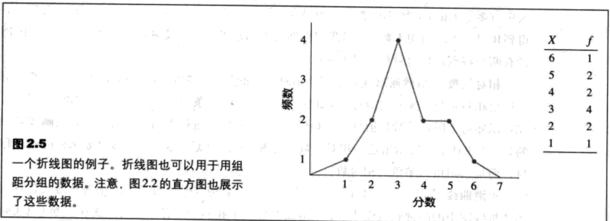

折线图可以被用于用组距分组的数据。对于一个分组分布，你将每个点直接画在组距的中点处，这个中点可以通过将区间的最大值与最小值取平均值得到。

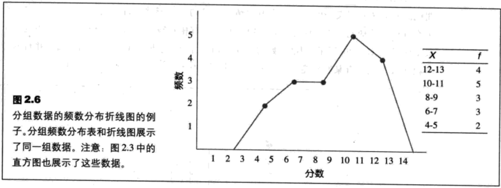

#### 称名数据或顺序数据的频数分布图
##### 柱形图
除了相邻矩形间留有空隙外，柱形图基本上与直方图相同。对于一个称名量表，矩形间的空隙强调了量表是由分开的不同的类别组成的。对于顺序量表，使用分开的矩形是因为我们不能假定所有类别的大小都相同。

#### 总体分布的频数分布图
当你能得到一个总体中每个分数的确切频数时，就可以构建与样本的频数分布图相同的直方图、折线图或是柱形图。

`相对频数`：虽然通常我们不能得出总体中的每个分数的具体频数，但是，你通常可以得出相对频数。（图2.8）

`平滑曲线`：当一个总体由等比量表的数字分数构成时，习惯上用平滑曲线代替直方图或折线图中的阶梯状或锯齿状。平滑曲线显示了我们并非将一系列点连在一起（真实频数），而是将从一个分数至另一个分数的相对变化展示出来。（图2.9）

### 频数分布的形状
在一个`对称分布`中，可以通过中心画一条垂直线使得分布的一侧为另一侧的镜像。

在一个`偏态分布`中，分数倾向于堆积在量表的一端并向另一端逐渐变细。分数逐渐向分布的一端变细的部位被称为分布的`尾`。

尾在右侧的偏态分布被称为`正偏态分布`，因为尾指向X轴的正方向（大于0）。如果尾指向左侧，则这个分布被称为`负偏态分布`。

### 百分位数、百分等级与内插法
一个特定分数的`等级`或`百分等级`被定义为分布中分数低于或与特定分数相等的个体的百分率。

当一个分数被它的百分等级确认时，这个分数被称为`百分位数`。

#### 累积频数和累积百分率
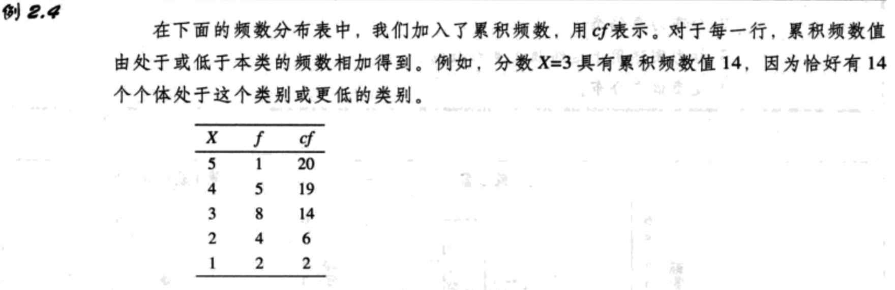

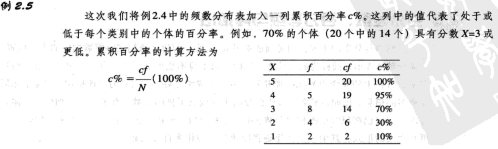

#### 内插法

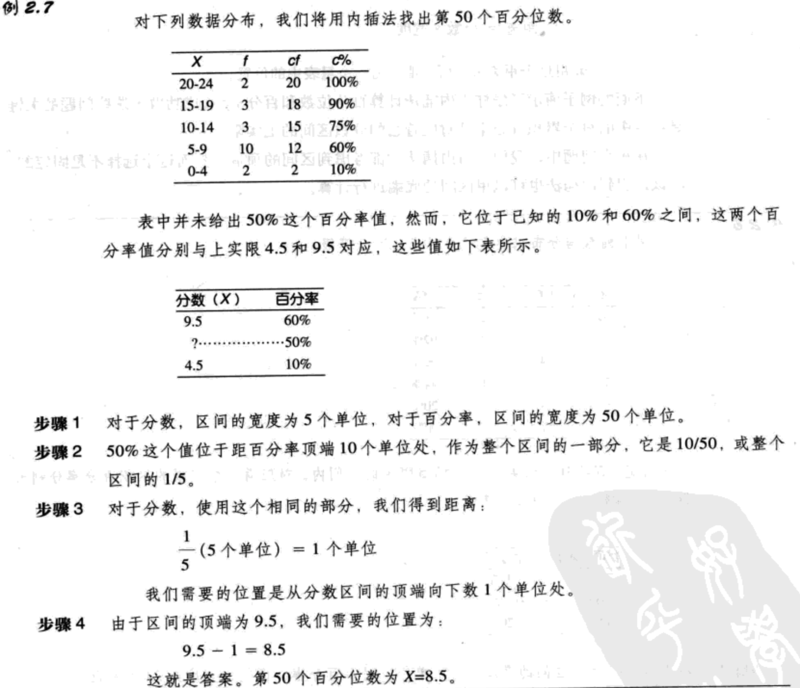

### 茎叶图

#### 茎叶图与频数分布的比较
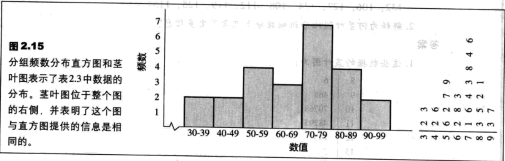