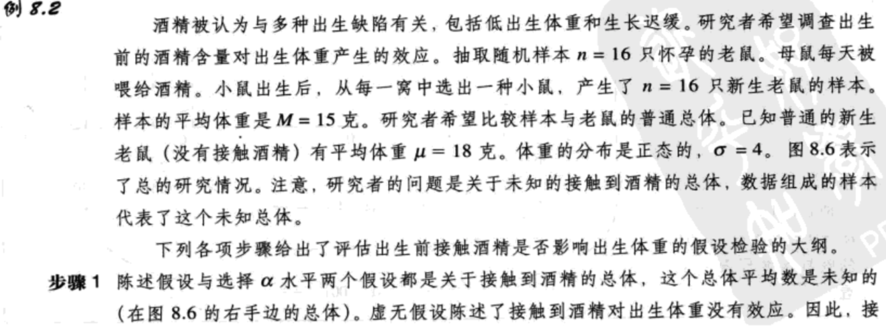

- [假设检验](#%e5%81%87%e8%ae%be%e6%a3%80%e9%aa%8c)
  - [假设检验的逻辑](#%e5%81%87%e8%ae%be%e6%a3%80%e9%aa%8c%e7%9a%84%e9%80%bb%e8%be%91)
  - [进一步讨论z分数](#%e8%bf%9b%e4%b8%80%e6%ad%a5%e8%ae%a8%e8%ae%baz%e5%88%86%e6%95%b0)
  - [假设检验的不确定性以及误差](#%e5%81%87%e8%ae%be%e6%a3%80%e9%aa%8c%e7%9a%84%e4%b8%8d%e7%a1%ae%e5%ae%9a%e6%80%a7%e4%bb%a5%e5%8f%8a%e8%af%af%e5%b7%ae)
    - [第一类误差](#%e7%ac%ac%e4%b8%80%e7%b1%bb%e8%af%af%e5%b7%ae)
    - [第二类误差](#%e7%ac%ac%e4%ba%8c%e7%b1%bb%e8%af%af%e5%b7%ae)
    - [选择α水平](#%e9%80%89%e6%8b%a9%ce%b1%e6%b0%b4%e5%b9%b3)
    - [假设检验的例子](#%e5%81%87%e8%ae%be%e6%a3%80%e9%aa%8c%e7%9a%84%e4%be%8b%e5%ad%90)
  - [方向性（单尾）假设检验](#%e6%96%b9%e5%90%91%e6%80%a7%e5%8d%95%e5%b0%be%e5%81%87%e8%ae%be%e6%a3%80%e9%aa%8c)
  - [关于假设检验：测量效应大小（科恩d值）](#%e5%85%b3%e4%ba%8e%e5%81%87%e8%ae%be%e6%a3%80%e9%aa%8c%e6%b5%8b%e9%87%8f%e6%95%88%e5%ba%94%e5%a4%a7%e5%b0%8f%e7%a7%91%e6%81%a9d%e5%80%bc)
  - [统计效能](#%e7%bb%9f%e8%ae%a1%e6%95%88%e8%83%bd)

## 假设检验
### 假设检验的逻辑
`假设检验`是一种统计方法，它使用样本数据评估关于总体参数的假设。

`虚无假设（H0）`陈述了在普通总体中没有改变、没有差异、或没有相关。在实验中，H0预测对于总体，自变量（处理）对因变量没有效应。

`备择假设（H1）`陈述了普通总体存在改变、差异或相关。在实验中，H1预测自变量（处理）将对因变量有影响。

`α水平`或`显著水平`是一个概率值，它被用于定义在虚无假设是正确的情况下非常不可能出现的样本结果。`临界区域`是由在虚无假设正确的情况下非常不可能出现的极端样本值组成的临界区域界限。由α水平决定，如果样本数据位于临界区域中，则拒绝虚无假设。


### 进一步讨论z分数
在假设检验中，z分数公式的结构如下：

$z=\frac{M-\mu}{\sigma_M}$=(样本平均数-假设的总体平均数)/M和μ之间的标准误

注意，公式的分子是样本数据和虚无假设之间的直接比较。具体来说，分子测量的是在样本平均数和假设总体平均数之间的差异。公式分母中的标准误测量了在随机的情况下样本平均数和总体平均数之间应该存在的差异。因此，z分数公式（以及大多数其他的检验统计）形成了一个比例：

z=得到的差异/偶然引起的差异

因此，例如，z=3.00意味着在样本和假设之间的差异是期望随机出现差异的3倍。

通常，**检验统计量的目的为确定研究的效应（得到的差异）是否比随机的期望值更大** 。只要检验统计值大于1.00，就意味着得到的结果（分子）大于随机期望的值（分母）。然而，你应该知道，大多数研究者不满意结果只是大于随机期望的值。相反，常规的研究标准要求结果在实质上大于随机值。具体来说，假设检验需要检验统计足够大，以满足基于α水平的判定标准。当α水平为.05或.01时，这通常意味着这个比例必须在2或3左右；即在拒绝虚无假设前，得到的差异必须是随机期望值的2或3倍。

### 假设检验的不确定性以及误差
#### 第一类误差
`第一类误差`发生在研究者拒绝虚无假设，但它实际上是在正确的情况下。在一个典型的研究中，第一类误差意味着研究者做出结论处理存在效应，但事实上它没有效应。-`假阳性`

假设检验的`α水平`是这个检验将导致第一类误差的概率，即α水平确定了在虚无假设正确的情况下得到样本数据在临界区域上的概率。

#### 第二类误差
`第二类误差`发生在当研究者不能拒绝一个错误的虚无假设时。在典型的研究中，第二类误差意味着假设检验不能检测出真正的处理效应。-`假阴性`


#### 选择α水平


#### 假设检验的例子



如果当虚无假设是正确的情况下，一个结果非常不可能出现，那么，这个结果就被称为是`显著的`或统计上显著的，即效应充分到足以拒绝虚无假设。因此，如果假设检验的判定是拒绝H0，那么处理`有显著效应`。


### 方向性（单尾）假设检验
在方向性检验，或`单尾检验`中，统计假设（H0和H1）规定了总体平均数的增加或减少，即它们作出关于效应方向的陈述。

为了用符号表示方向性假设，通常从备择假设开始更为简单。我们知道，通常老鼠平均每天吃μ=10克食物，H1陈述了由于减肥药的作用，食物消耗会减少。因此，用符号表示：

```
H1：μ<10 （由于药的作用，每天的食物消耗小于10克）
H0：μ≥10 （由于药的作用，每天的食物消耗是至少10克）
```


### 关于假设检验：测量效应大小（科恩d值）
一个简单也是最直接的测量效应大小的方法是`科恩d值`。

科恩d值=平均数差/标准数差 (8.1)

对于z分数假设检验，平均数差异就是样本平均数（处理后）和最初的总体平均数（处理前）的差异。这个平均数差异M-μ，也出现在z分数检验的分子上。在计算中使用标准差是为了使平均数差异的大小标准化，这与在分布中标准化z分数的位置是同样的道理。标准化过程如图8.12所示。图的上部是处理使SAT分数出现了15点的平均数差异；在处理前，平均SAT分数是500，处理后是515。注意，SAT分数的标准差是σ=100，因此15点的差异显得很小。对于这个例子，科恩d值是：

科恩d值=平均数差/标准差=15/100=0.15 (8.1)

考虑如图8.12b中所示的处理效应。这次，处理提供了在IO分数中15的平均数差异；在处理前，平均IO是100，处理后平均是115。因为IQ分数的标准差是σ=15，15的平均数差异现在被认为是大的。对于这个例子，科恩d值是：

科恩d值=平均数差/标准差=15/15=1.00 (8.1)


### 统计效能
`统计检验效能`是检验能正确地拒绝错误的虚无假设的概率，即效能是检验能够识别真正存在的处理效应的概率。


