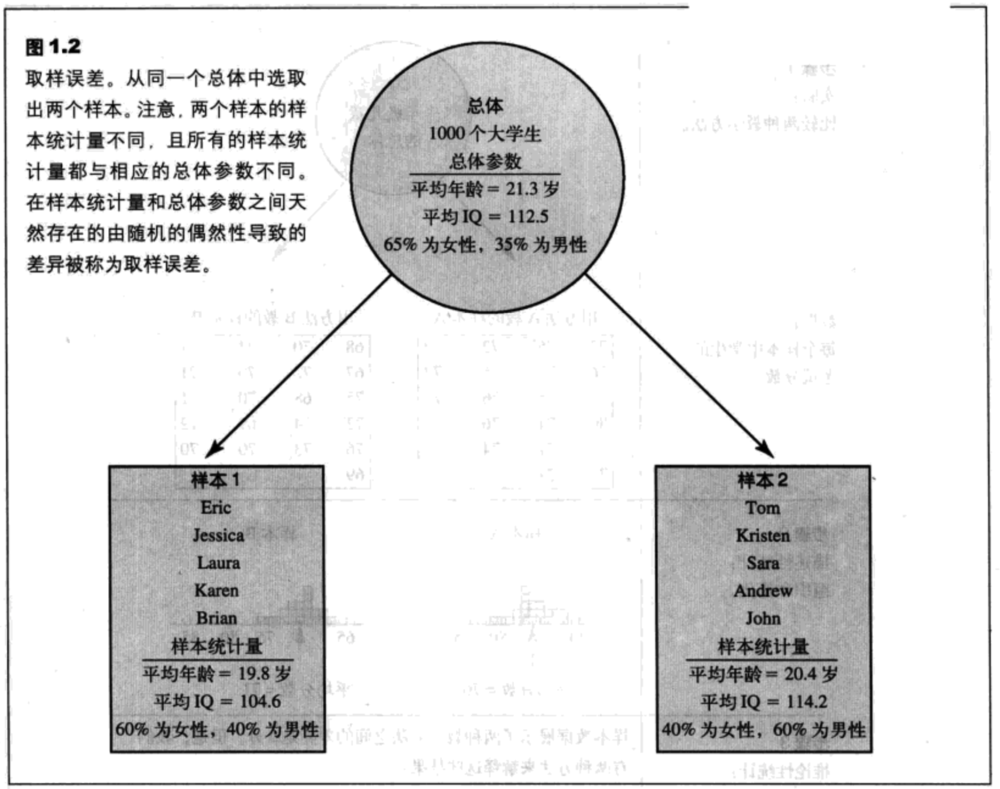
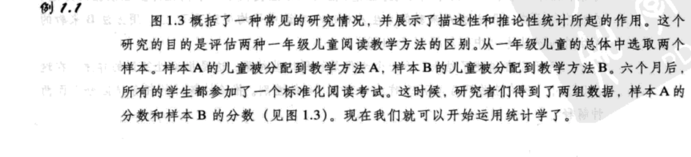
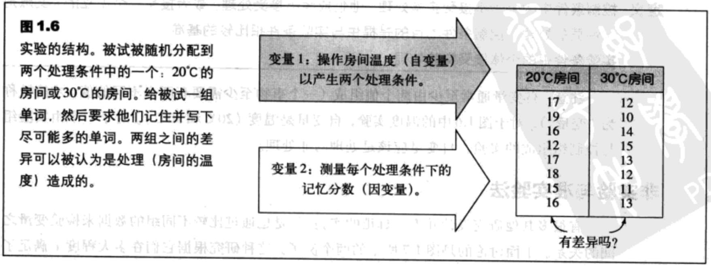

- [统计学入门](#%e7%bb%9f%e8%ae%a1%e5%ad%a6%e5%85%a5%e9%97%a8)
  - [统计、科学与观察](#%e7%bb%9f%e8%ae%a1%e7%a7%91%e5%ad%a6%e4%b8%8e%e8%a7%82%e5%af%9f)
  - [总体与样本](#%e6%80%bb%e4%bd%93%e4%b8%8e%e6%a0%b7%e6%9c%ac)
  - [数据结构、研究方法与统计](#%e6%95%b0%e6%8d%ae%e7%bb%93%e6%9e%84%e7%a0%94%e7%a9%b6%e6%96%b9%e6%b3%95%e4%b8%8e%e7%bb%9f%e8%ae%a1)
    - [相关法](#%e7%9b%b8%e5%85%b3%e6%b3%95)
    - [实验法](#%e5%ae%9e%e9%aa%8c%e6%b3%95)
    - [实验法的术语](#%e5%ae%9e%e9%aa%8c%e6%b3%95%e7%9a%84%e6%9c%af%e8%af%ad)
    - [非实验与准实验法](#%e9%9d%9e%e5%ae%9e%e9%aa%8c%e4%b8%8e%e5%87%86%e5%ae%9e%e9%aa%8c%e6%b3%95)
  - [变量与测量](#%e5%8f%98%e9%87%8f%e4%b8%8e%e6%b5%8b%e9%87%8f)
    - [构念与操作定义](#%e6%9e%84%e5%bf%b5%e4%b8%8e%e6%93%8d%e4%bd%9c%e5%ae%9a%e4%b9%89)
    - [离散变量与连续变量](#%e7%a6%bb%e6%95%a3%e5%8f%98%e9%87%8f%e4%b8%8e%e8%bf%9e%e7%bb%ad%e5%8f%98%e9%87%8f)

## 统计学入门
### 统计、科学与观察
统计服务于两个目的

1. 统计用于整理及总结信息，使得研究者看出在研究中发生了什么，并与其他研究者交流结果。
2. 统计帮助研究者回答了引出研究的普遍问题，它根据获得的结果来确定结论究竟是什么。

`统计`指整理、总结并解释信息的一系列数学过程。

### 总体与样本
`总体`是在一个特定研究中所有感兴趣个体的集合。

`样本`是从一个总体中选择出来的个体的集合，通常在研究中被期望代表总体。

`参数`是一个值，通常是一个数字值，它描述了一个总体。参数可以从单个测量中得到，或从对总体的一组测量中推导出来。

`统计量`是一个值，通常是一个数字值，它描述了一个样本。统计量可以从单个测量中得到，或从对样本的一组测量中推到出来。

通常，每个总体参数都与一个样本统计量相对应。

`数据`是测量或观察，它通常被称为一个分数或原始分数。

`描述性统计`是用于总结、组织并简化数据的统计过程。

`推论性统计`是允许我们研究样本，然后将研究结果推广至样本来自的总体的技术。

`取样误差`是存在于样本统计量和总体参数间的差异或误差的数量。

统计在研究中的应用：

### 数据结构、研究方法与统计
`变量`是一种针对不同个体具有不同值得特性或条件。

`常量`是一个特性或条件，它不会变化，并且对每一个个体都是相同的。

#### 相关法

在`相关法`中，观察两个变量并确定它们之间是否存在关系。

#### 实验法
一种比较不同组的分数的特殊研究方法被称为`实验法`。它有两个特性：

1. **操纵**。研究者操纵一个变量，将它的值从一个水平变化至另一个水平。然后观察（测量）第二个变量，来确定这种操纵是否导致了变化的产生。
2. **控制**。研究者必须控制研究情况，使得其他无用的变量不能影响需要研究的变量关系。

在`实验法`中，操纵一个变量并观察或测量另一个变量，为了建立两个变量间的因果关系，实验需要控制所有其他的变量，使它们不会影响结论。

#### 实验法的术语
`自变量`是被研究者操纵的变量。在行为研究中，自变量通常由被试参与的两个（或多个）处理条件组成。自变量由在观察因变量之前就操纵好的“前”条件组成。

`因变量`是被观察的那个变量，用于评估处理效应。

`控制条件`中的个体不接受实验处理。他们或者不接受处理，或者接手一个中立的，安慰剂性质的处理。控制条件的目的是提供与实验条件相比较的基准。

`实验条件`中的个体接受实验处理。

#### 非实验与准实验法
很多研究对两个组进行了比较，但是，这两组不是通过操纵自变量得到的。相反，这些组通常由被试变量（如男性与女性）或是时间变量（如处理前与处理后）决定。在这些非实验研究中，决定组别的变量被称为`准自变量`。

### 变量与测量
#### 构念与操作定义
`构念`是内部属性或特性，它不能被直接观察到，但是可以描述并解释行为。

`操作定义`是一个测量过程（一系列操作），它测量了外部行为，并使用测量结果作为定义和对假设的构念的测量。注意，操作定义有两个部分

1. 它描述了一系列测量构念的操纵；
2. 它用测量结果定义了构念。

#### 离散变量与连续变量

