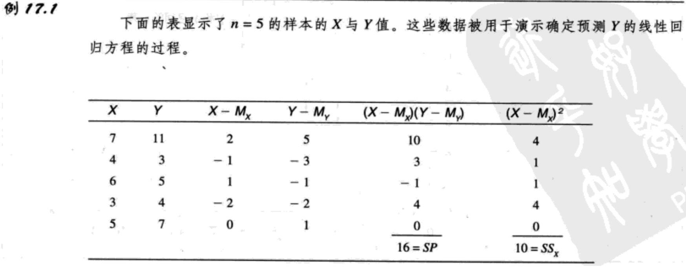
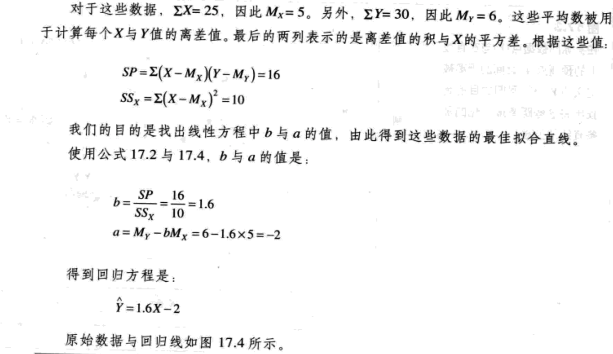
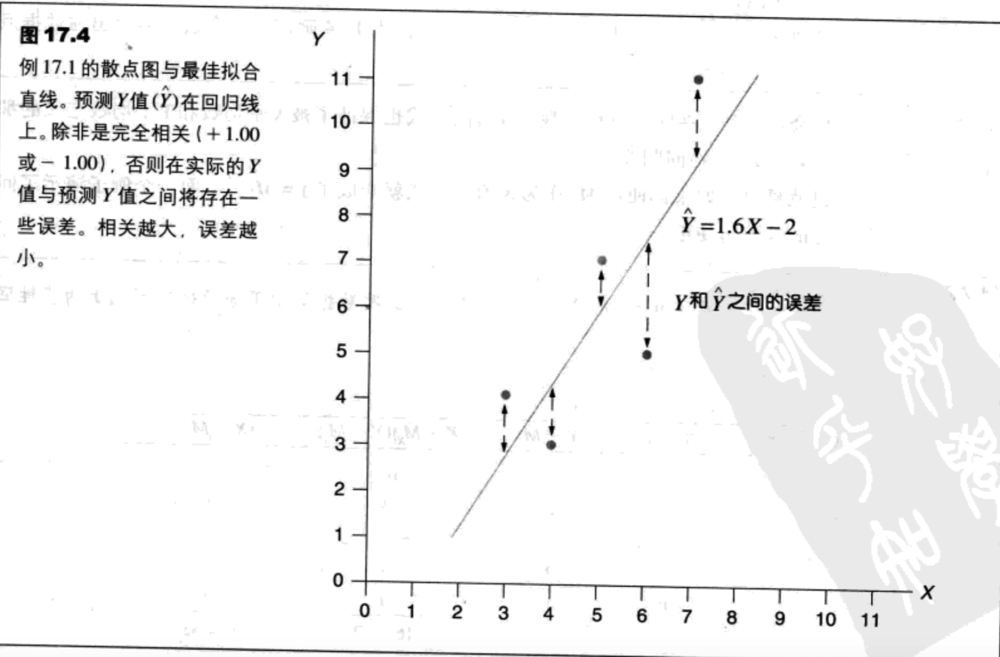
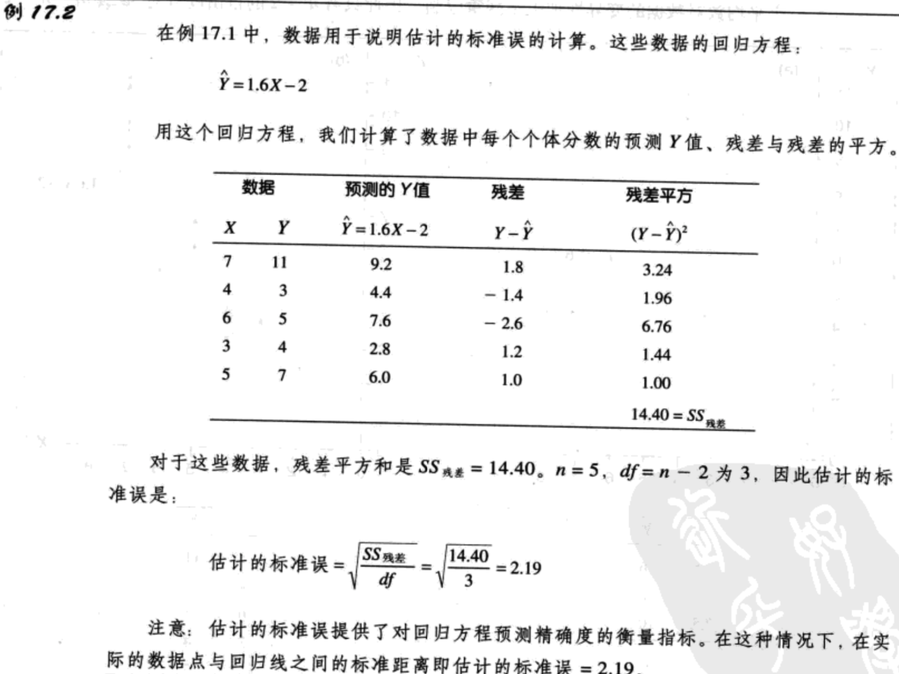
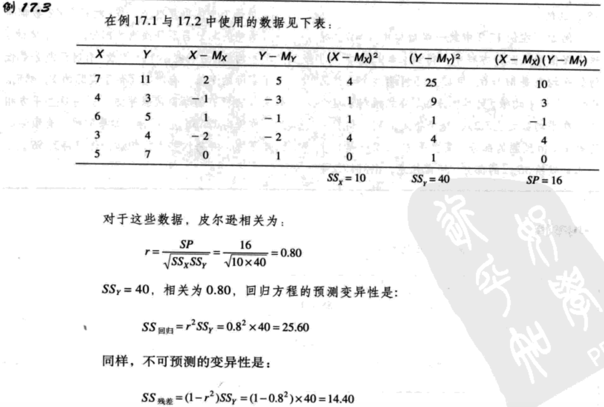

## 相关与非参数检验-回归
### 线性方程与回归
用于找出一组数据的最佳拟合直线的统计技术被称为`回归`，作为结果的直线被称为回归线。

#### 线性方程
通常，在两个变量X与Y之间的线性关系，可以被表示为公式：$Y=bX+a\ (17.1)$，a与b是固定的常数。

#### 最小二乘
为了确定线与数据点的拟合度，第一步是定义线与每个数据点之间的算术距离。对于数据中的每个X值，线性方程将在线上确定Y值。这个值是预测的Y值，被称为$\hat{Y}$。在这个预测值与数据的实际Y值之间的距离为：

距离值=$Y-\hat{Y}$

误差平方和=$\sum(Y-\hat{Y})^2$

现在我们可以将最佳拟合线定义为误差平方和最小的那条线。相应的方法被称为`最小二乘法`。

用符号表示，线性方程的形式为：$\hat{Y}=bX+a$

$b=\frac{SP}{SS_X}\ (17.2)$，其中SP是积和，$SS_X$是X的平方和。

另一个经常使用的斜率公式是基于X和Y的标准差。这个公式是：$b=r\frac{S_Y}{S_X}\ (17.3)$

其中$S_Y$是Y分数的标准差，$S_X$是X分数的标准差。公式中参数a的值为：$a=M_Y-bM_X\ (17.4)$

`Y的回归方程`是线性方程$\hat{Y}=bX+a\ (17.5)$。其中常数b由公式17.2或17.3确定，常数a由公式17.4确定。这个公式能得出在数据点与直线之间的最小的平方误差。

#### 标准化回归方程
迄今为止，我们讲过了原始数据的回归方程，然而，研究者偶尔也会在找出回归方程之前将X与Y标准化为z分数。这样，得到的公式通常被称为`标准化回归方程`，与原始分数版本相比，它的形式大大被简化了。因为z分数是标准化的。具体来说，一组z分数的平均数总是0，标准差总是1.因此，标准化回归方程变成了：

$\hat{z}_Y=\beta z_X\ (17.6)$

首先注意，我们现在用每个X值的z分数来预测相应的Y值的z分数。另外，注意，斜率常数在原始分数公式中用b表示，现在则用$\beta$表示。因为两组z分数的平均数都是零，因此回归方程中的常数a消失了。最后，当变量X被用来预测变量Y时，$\beta$的值等于X与Y的皮尔逊相关。因此，标准回归方程也可以写成：

$\hat{z}_Y=r z_X\ (17.7)$

因为将原始分数变为z分数的过程往往繁琐，研究者通常用计算原始分数回归方程的版本（公式17.5）来代替标准化形式。

#### 估计的标准误
`估计的标准误`衡量了回归线与实际的数据点之间的标准距离。

为了计算估计的标准误，我们首先需要找出离差的平方和（SS）。离差即实际的Y（从数据中得到的）与预测$\bar{Y}$（从回归线上得到的）之间的距离。其平方和通常被称为SS残差。

SS残差=$\sum(Y-\bar{Y})^2\ (17.8)$

得到的SS值然后除以其自由度，得到了方差：

方差=$\frac{SS}{df}$

估计的标准误的自由度是df=n-2。自由度为n-2，而不是习惯的n-1，理由是我们现在只测量到一条线的离差，而不是到平均数的离差。我们必须知道SP才能找出回归线的斜率（公式中的b值）。而为了计算SP，你必须同时知道X与Y的平均数。找出这两个平均数对数据的变异性加上了两重限制，因此只有n-2的自由度（对SS残差df=n-2的一个更直观的解释是，恰好两个点确定一条直线。如果自由两个数据点，那么，它们总是能完美地与直线拟合，因此将不存在误差。只有当你有多于两个点时，才存在一些决定最佳拟合线的自由）。

计算估计的标准误的最后一步是计算方差的平方根，来得出标准距离。最好的公式是：

估计的标准误=$\sqrt{\frac{SS_{residual}}{df}}=\sqrt{\frac{\sum(Y-\hat{Y})^2}{n-2}}\ (17.9)$

#### 标准误与相关的关系
在第16章中，我们观察到相关的平方提供了对预测的精确性的测量：$r^2$是决定系数，因为它确定了Y的变异性中可以被XY关系解释的那部分的比例。

因为$r^2$测量了Y的变异性中可以被回归方程预测的那部分，我们可以使用$1-r^2$来测量没有预测的部分。因此：

预测变异性=$SS_{regression}=r^2SS_Y\ (17.10)$

不可预测的变异性=$SS_{residual}=(1-r^2)SS_Y\ (17.11)$

注意：当r=1.00时，预测是完美的，没有残差。当相关接近零点时，数据点远离回归线，残差变大。用公式17.11计算$SS_{regression}$，得到估计的标准误为：

估计的标准误=$\sqrt{\frac{SS_{regression}}{df}}=\sqrt{\frac{(1-r^2)SS_Y}{n-2}}$

### 回归方程的显著性检验：回归分析
两个MS值被定义为：
$MS_{regression}=\frac{SS_{regression}}{df_{regression}}(df=1)$

$MS_{residual}=\frac{SS_{residual}}{df_{residual}}(df=1)$

F分数：

$F=\frac{MS_{regression}}{MS_{residual}}(df=1,n-2)\ (17.12)$

SS与自由度的完整分析如图17.6所示。

### 有两个预测变量的多元回归
#### 两个预测变量的回归方程

#### 回归方差所占的百分比与残差

#### 根据残差计算$R^2$与$1-R^2$

#### 估计的标准误

#### 多元回归方程的显著性检验：回归分析

### 评估每个预测值的贡献

