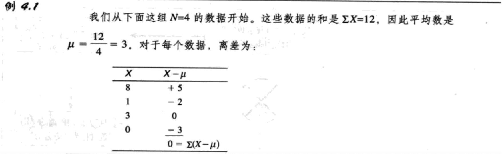
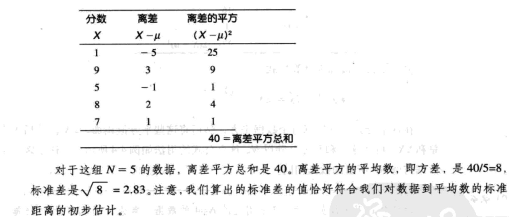

- [变异性](#%e5%8f%98%e5%bc%82%e6%80%a7)
  - [概述](#%e6%a6%82%e8%bf%b0)
  - [全矩和四分位距](#%e5%85%a8%e7%9f%a9%e5%92%8c%e5%9b%9b%e5%88%86%e4%bd%8d%e8%b7%9d)
  - [总体的方差和标准差](#%e6%80%bb%e4%bd%93%e7%9a%84%e6%96%b9%e5%b7%ae%e5%92%8c%e6%a0%87%e5%87%86%e5%b7%ae)
    - [总体方差及标准差的公式](#%e6%80%bb%e4%bd%93%e6%96%b9%e5%b7%ae%e5%8f%8a%e6%a0%87%e5%87%86%e5%b7%ae%e7%9a%84%e5%85%ac%e5%bc%8f)
    - [方差及标准差](#%e6%96%b9%e5%b7%ae%e5%8f%8a%e6%a0%87%e5%87%86%e5%b7%ae)
  - [样本的方差和标准差](#%e6%a0%b7%e6%9c%ac%e7%9a%84%e6%96%b9%e5%b7%ae%e5%92%8c%e6%a0%87%e5%87%86%e5%b7%ae)
  - [无偏估计与有偏估计](#%e6%97%a0%e5%81%8f%e4%bc%b0%e8%ae%a1%e4%b8%8e%e6%9c%89%e5%81%8f%e4%bc%b0%e8%ae%a1)

## 变异性
### 概述
`变异性`提供了对一个分布中的数据分散开或聚集在一起的程度的数量测量。

一个好的对变异性的测量将会服务于两个目的：
1. **变异性描述了分布。** 具体来说，它表示了数据是否聚集在一起或分布在较大区域内。通常，变异性是根据距离定义的。它表示了两个数值之间的距离，或某个数值和平均数之间的距离。
2. **变异性测量了单个数据（或一组数据）能否很好地代表整个分布。** 变异性的这个方面对用相对小的样本来回答关于总体问题的推论统计是非常重要的。

### 全矩和四分位距
`全矩`是在最大的X值上实限和最小的X值下实限之间的差值。

例如，考虑下面的数据：

```
3,7,12,8,5,10
```

对于这些数据，$X_{max}=12,X_{min}=3$。因此，全矩等于：12.5-2.5=10

`四分位距`是被分布的中间50%覆盖的距离：四分位距=Q3-Q1.

- Q1:确定分步最低的25%和其余值分开的界限；
- Q3:确定分步最高的25%和其余值分开的界限；

`半四分位矩`=(Q3-Q1)/2.

### 总体的方差和标准差
`离差`是数据到平均数的距离：数据的离差=X-μ



`总体方差`=平均离差平方。方差是离差的平方的平均数。

`标准差`=$\sqrt{Variance}$

例4.2

我们将计算下列总体（N=5）的方差和标准差：

1，9，5，8，7



#### 总体方差及标准差的公式
`平方和`（`SS`）是离差平方的总和。

$SS=\sum(X-\mu)^2\ (4.1)$


$SS=\sum X^2-\frac{(\sum X)^2}{N}\ (4.2)$


#### 方差及标准差
`方差`被定义为平方差的平均数，`标准差`是方差的平方根。用σ表示总体标准差，σ2表示总体方差：

总体标准差=$\sigma=\sqrt{\sigma^2}=\sqrt{\frac{SS}{N}}\ (4.3)$

总体方差=$\sigma^2=\frac{SS}{N}\ (4.4)$

总体方差=$\sigma^2=\frac{\sum(X-\mu)^2}{N}\ (4.5)$

### 样本的方差和标准差
需要注意到样本和总体之间的区别。为了校正样本变异性的偏误，需要对样本方差和标准差的计算公式作出调整。样本方差（用符号$s^2$表示）被定义为：

样本方差=$s^2=\frac{SS}{n-1}\ (4.8)$

样本方差=$s^2=\frac{\sum(X-M)^2}{n-1}\ (4.9)$

样本标准差=$s=\sqrt{s^2}=\sqrt{\frac{SS}{n-1}}\ (4.10)$

对于一个有n个数值的样本，样本方差的`自由度（df）`被定义为df=n-1。自由度决定样本中独立的和可以自由改变的数值的个数。

$s^2=\frac{SS}{df}=\frac{SS}{n-1}$

### 无偏估计与有偏估计
一方面，如果从很多不同样本中得到样本统计量的平均数等于相应的总体参数值，则一个样本统计量是`无偏的`；另一方面，如果一个样本统计量的平均数总是低估或高估相应的总体参数，那么这个统计量是`有偏的`。
