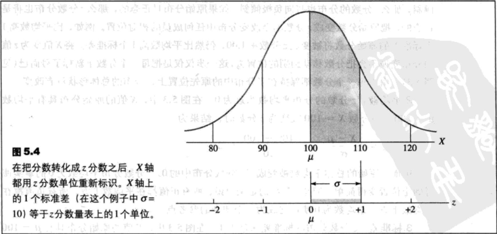
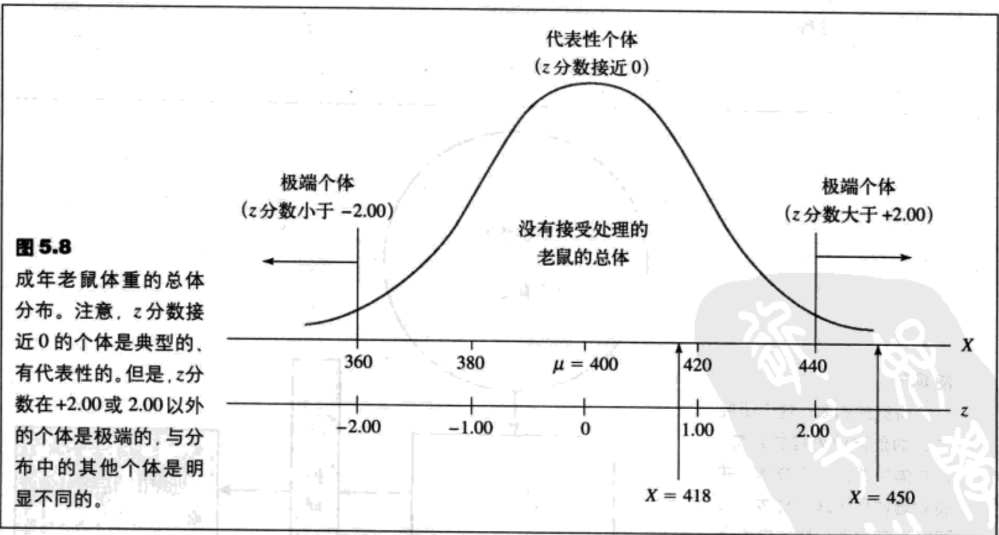

- [z分数](#z%e5%88%86%e6%95%b0)
  - [z分数介绍](#z%e5%88%86%e6%95%b0%e4%bb%8b%e7%bb%8d)
  - [z分数及在分布中的位置](#z%e5%88%86%e6%95%b0%e5%8f%8a%e5%9c%a8%e5%88%86%e5%b8%83%e4%b8%ad%e7%9a%84%e4%bd%8d%e7%bd%ae)
  - [使用z分数将分布标准化](#%e4%bd%bf%e7%94%a8z%e5%88%86%e6%95%b0%e5%b0%86%e5%88%86%e5%b8%83%e6%a0%87%e5%87%86%e5%8c%96)
  - [其他基于z分数的标准分布](#%e5%85%b6%e4%bb%96%e5%9f%ba%e4%ba%8ez%e5%88%86%e6%95%b0%e7%9a%84%e6%a0%87%e5%87%86%e5%88%86%e5%b8%83)
  - [计算样本的z分数](#%e8%ae%a1%e7%ae%97%e6%a0%b7%e6%9c%ac%e7%9a%84z%e5%88%86%e6%95%b0)
  - [推论性统计前瞻](#%e6%8e%a8%e8%ae%ba%e6%80%a7%e7%bb%9f%e8%ae%a1%e5%89%8d%e7%9e%bb)

## z分数
### z分数介绍
把X值转换为z分数有两个重要目的：
1. 每个z分数都揭示了原始X值在分布内的位置。
2. z分数构成一个标准化分布，使之可以与其他同样已经转换为z分数的分布相比较。

### z分数及在分布中的位置
`z分数`指出了每一个X值在分布中的精确位置。z分数的符号（+或-）表示这个分数比平均数高（正）或者比平均数低（负）。z分数的数值用从X到μ有几个标准差指出了其到平均数的距离。因而，在一个μ=100，σ=15的智商分布中，一个X=130的分数将被转换为z=+2.00。z值说明这个分数比平均数高（+）出2个标准差（30）。

转换成z分数的公式：$z=\frac{X-\mu}{\sigma}\ (5.1)$

### 使用z分数将分布标准化
z分数的分布具有以下性质：
1. 形状。z分数分布的形状将同原始分数的分布完全相同。
2. 平均数。z分数的分布平均数永远为0。
3. 标准差。z分数分布的标准差永远为1。

一个`标准化分布`由经过变换后的分数组成，这些分数经过变换使得μ和σ成为预先设定的值。标准化分布被用来比较不同的分布。

### 其他基于z分数的标准分布
把分布标准化来得到新μ和σ值的过程包含两步：
1. 原始分数变换为z分数；
2. z分数进一步变成新的X值，使得预先设定的μ和σ值被达到。

### 计算样本的z分数
无论是对于样本还是总体来说，z分数的定义都是一样的。因此，对于一个样本，每一个X值都被转换成了一个z分数，使得：
- z分数的符号表示了X值是高于（+）还是低于（-）样本平均数；
- z分数的数值确定了从分数到样本平均值的距离相当于几个样本标准差。
- 公式表示：$z=\frac{X-M}{s}$
  - M:样本平均数
  - s:样本标准差

（勘误：z分数的和是∑z=0）

### 推论性统计前瞻
例5.7 一个研究者要评估一个新生长激素的作用。已经普通成年老鼠平均体重$\mu$=400克。不同老鼠体重有所不同，体重的分布呈正态，标准差为$\sigma$=20克。总体分布如图5.8所示。研究者选择一个新生的老鼠，给它注射生长激素。当老鼠成年之后，称得它的体重来决定是否有证据表明此激素是有效的。

首先，假设被注射了激素的老鼠体重为X=418克。虽然这高于普通老鼠的平均数（$\mu$=400克），但是，这是否令人信服地说明激素起了作用呢？如果你看一下图5.8中的分布，你会发现，一只重418克的老鼠和没有经过注射的普通老鼠相比并没有显著差距。具体来说，这只被注射的老鼠位于分布中心的位置，其z分数是：

$z=\frac{X-\mu}{\sigma}=\frac{418-400}{20}=0.90$

由于被注射了的老鼠看起来和普通老鼠一样，结论是这种激素看起来没有什么效果。

现在，假设这只注射了激素的老鼠成年后体重X=450克。在普通老鼠的分布中（图5.8），这个动物的z分数是：

$z=\frac{X-\mu}{\sigma}=\frac{450-400}{20}=2.50$

在此情况下，注射了激素的老鼠比绝大多数普通老鼠明显大，那么得出结论，这种激素对体重有影响是很自然的。