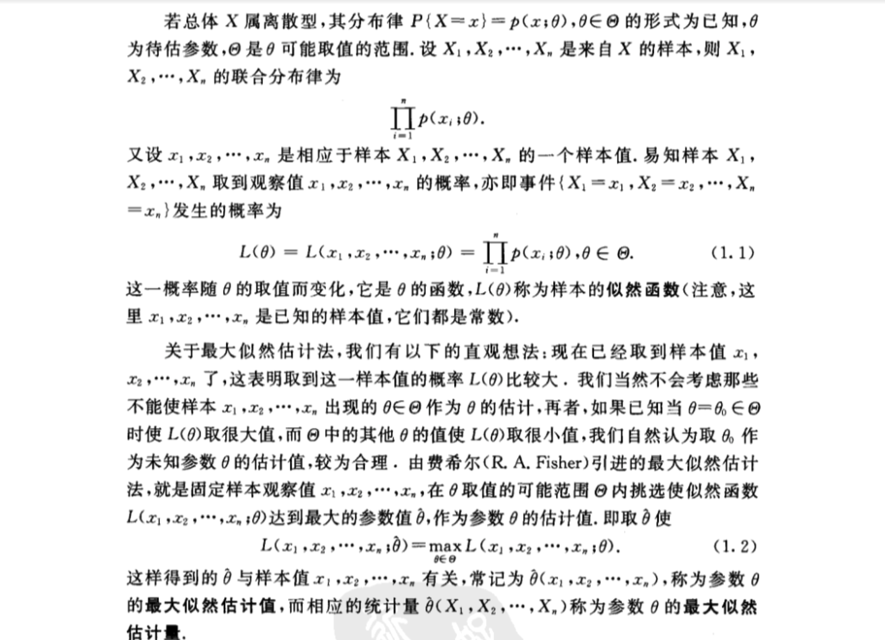
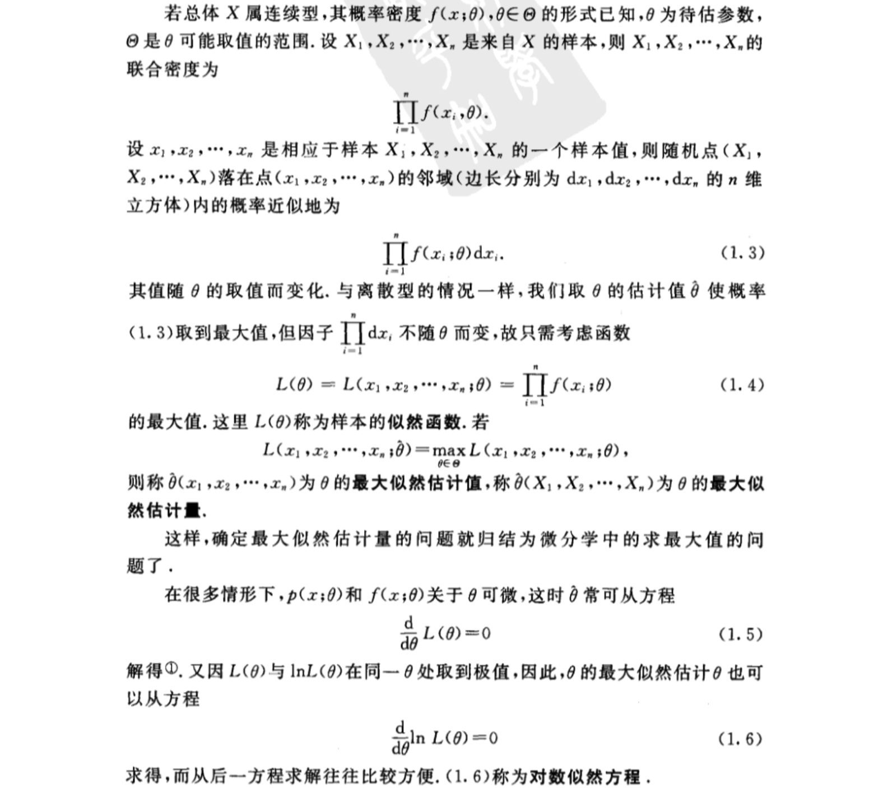
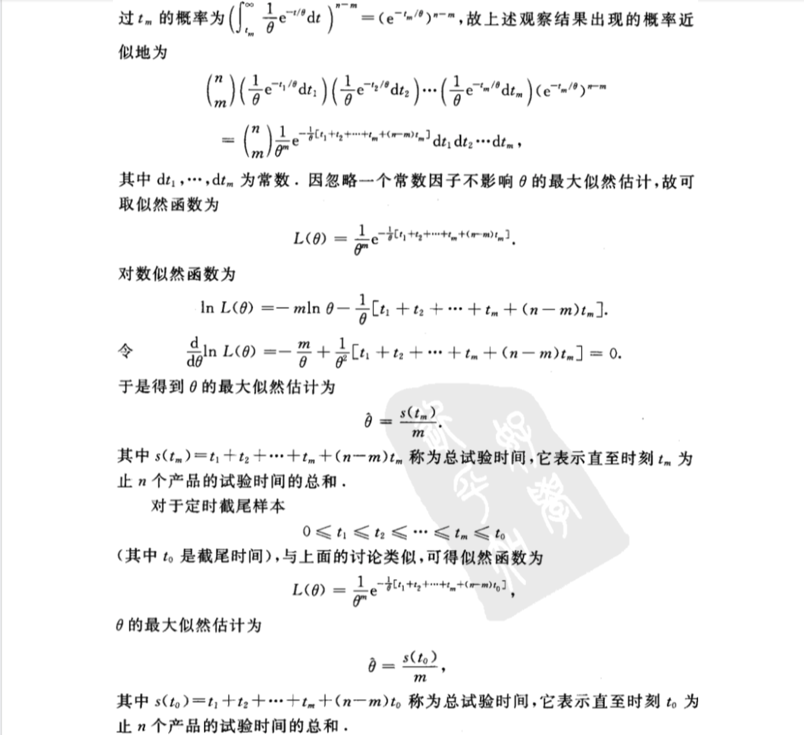
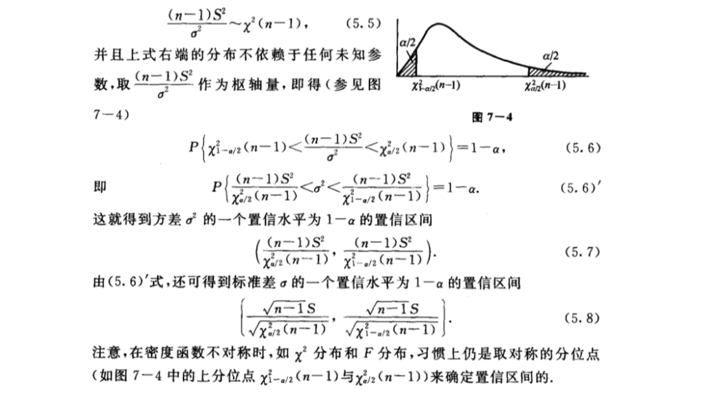
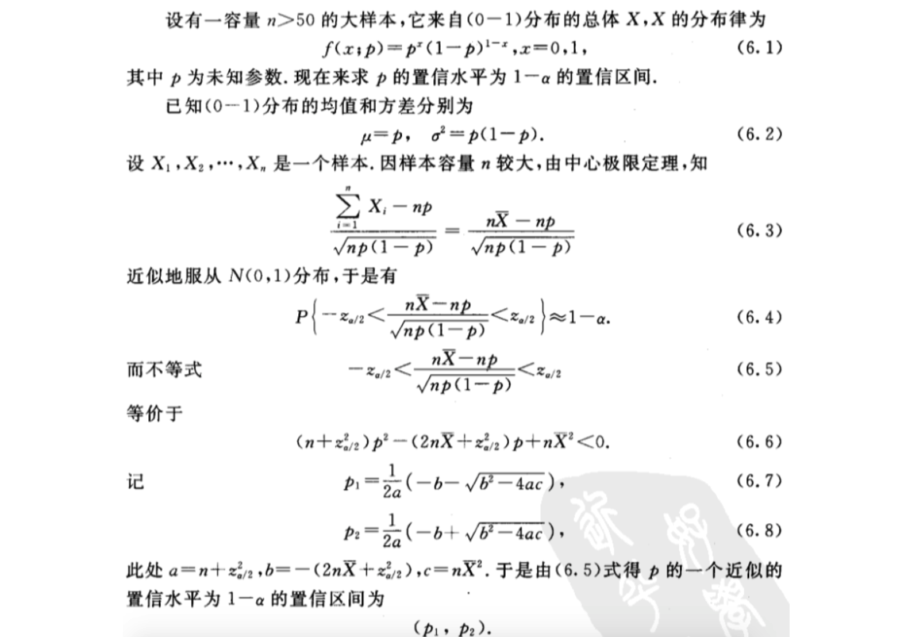
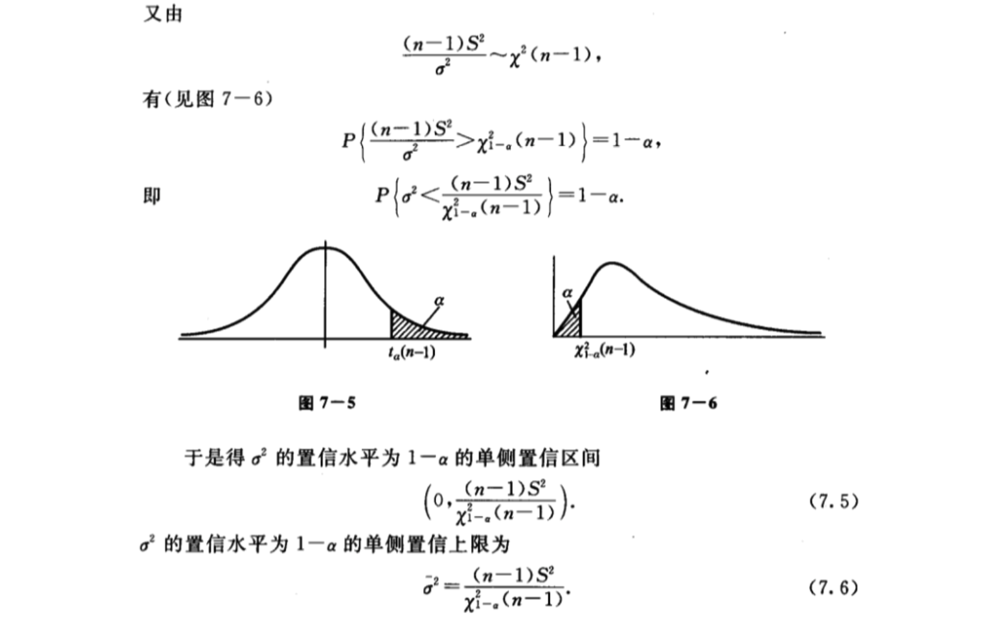

- [第七章 参数估计](#%e7%ac%ac%e4%b8%83%e7%ab%a0-%e5%8f%82%e6%95%b0%e4%bc%b0%e8%ae%a1)
  - [1 点估计](#1-%e7%82%b9%e4%bc%b0%e8%ae%a1)
    - [（一）矩估计法](#%e4%b8%80%e7%9f%a9%e4%bc%b0%e8%ae%a1%e6%b3%95)
    - [（二）最大似然估计法](#%e4%ba%8c%e6%9c%80%e5%a4%a7%e4%bc%bc%e7%84%b6%e4%bc%b0%e8%ae%a1%e6%b3%95)
  - [2 基于截尾样本的最大似然估计](#2-%e5%9f%ba%e4%ba%8e%e6%88%aa%e5%b0%be%e6%a0%b7%e6%9c%ac%e7%9a%84%e6%9c%80%e5%a4%a7%e4%bc%bc%e7%84%b6%e4%bc%b0%e8%ae%a1)
  - [3 估计量的评选标准](#3-%e4%bc%b0%e8%ae%a1%e9%87%8f%e7%9a%84%e8%af%84%e9%80%89%e6%a0%87%e5%87%86)
  - [4 区间估计](#4-%e5%8c%ba%e9%97%b4%e4%bc%b0%e8%ae%a1)
  - [5 正态总体均值和方差的区间估计](#5-%e6%ad%a3%e6%80%81%e6%80%bb%e4%bd%93%e5%9d%87%e5%80%bc%e5%92%8c%e6%96%b9%e5%b7%ae%e7%9a%84%e5%8c%ba%e9%97%b4%e4%bc%b0%e8%ae%a1)
    - [（一）单个总体N(μ,σ2)的情况](#%e4%b8%80%e5%8d%95%e4%b8%aa%e6%80%bb%e4%bd%93n%ce%bc%cf%832%e7%9a%84%e6%83%85%e5%86%b5)
      - [1 均值μ的置信区间](#1-%e5%9d%87%e5%80%bc%ce%bc%e7%9a%84%e7%bd%ae%e4%bf%a1%e5%8c%ba%e9%97%b4)
      - [2 方差σ2的置信区间](#2-%e6%96%b9%e5%b7%ae%cf%832%e7%9a%84%e7%bd%ae%e4%bf%a1%e5%8c%ba%e9%97%b4)
    - [（二）两个总体N(μ1,σ12)，N(μ2,σ22)的情况](#%e4%ba%8c%e4%b8%a4%e4%b8%aa%e6%80%bb%e4%bd%93n%ce%bc1%cf%8312n%ce%bc2%cf%8322%e7%9a%84%e6%83%85%e5%86%b5)
      - [1 两个总体均值差μ1-μ2的置信区间](#1-%e4%b8%a4%e4%b8%aa%e6%80%bb%e4%bd%93%e5%9d%87%e5%80%bc%e5%b7%ae%ce%bc1-%ce%bc2%e7%9a%84%e7%bd%ae%e4%bf%a1%e5%8c%ba%e9%97%b4)
      - [2 两个总体方差比的σ12/σ22置信区间](#2-%e4%b8%a4%e4%b8%aa%e6%80%bb%e4%bd%93%e6%96%b9%e5%b7%ae%e6%af%94%e7%9a%84%cf%8312%cf%8322%e7%bd%ae%e4%bf%a1%e5%8c%ba%e9%97%b4)
  - [6 （0-1）分布参数的区间估计](#6-0-1%e5%88%86%e5%b8%83%e5%8f%82%e6%95%b0%e7%9a%84%e5%8c%ba%e9%97%b4%e4%bc%b0%e8%ae%a1)
  - [7 单侧置信区间](#7-%e5%8d%95%e4%be%a7%e7%bd%ae%e4%bf%a1%e5%8c%ba%e9%97%b4)
  - [正态总体均值和方差的置信区间（置信水平为1-α）](#%e6%ad%a3%e6%80%81%e6%80%bb%e4%bd%93%e5%9d%87%e5%80%bc%e5%92%8c%e6%96%b9%e5%b7%ae%e7%9a%84%e7%bd%ae%e4%bf%a1%e5%8c%ba%e9%97%b4%e7%bd%ae%e4%bf%a1%e6%b0%b4%e5%b9%b3%e4%b8%ba1-%ce%b1)

# 第七章 参数估计
## 1 点估计

### （一）矩估计法

### （二）最大似然估计法

## 2 基于截尾样本的最大似然估计

## 3 估计量的评选标准

## 4 区间估计

## 5 正态总体均值和方差的区间估计
### （一）单个总体N(μ,σ2)的情况
设已给定置信区间水平为$1-\alpha$，并设X1,X2,...,Xn为总体$N(\mu,\sigma^2)$的样本，$\bar{X},S^2$分别是样本均值和样本方差。

#### 1 均值μ的置信区间

#### 2 方差σ2的置信区间
此处，根据实际问题的需要，只介绍$\mu$未知的情况。$\sigma^2$的无偏估计为$S^2$，由第六章3定理二知：

### （二）两个总体N(μ1,σ12)，N(μ2,σ22)的情况
设已给定置信水平为$1-\alpha$，并设X1,X2,...,Xn是来自第一个总体的样本；Y1,Y2,...Yn是来自第二个总体的样本，这两个样本相互独立。且设$\bar{X},\bar{Y}$分别为第一、第二个总体的样本均值，$S^2_1,S^2_2$分别是第一、第二个总体的样本方差。

#### 1 两个总体均值差μ1-μ2的置信区间

#### 2 两个总体方差比的σ12/σ22置信区间

## 6 （0-1）分布参数的区间估计

## 7 单侧置信区间

## 正态总体均值和方差的置信区间（置信水平为1-α）

