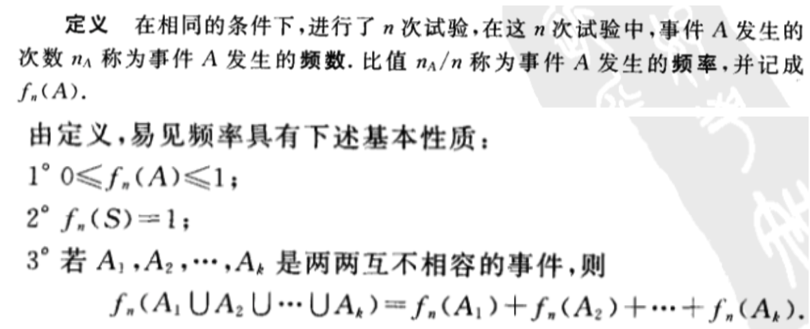

- [第一章 概率论的基本概念](#%e7%ac%ac%e4%b8%80%e7%ab%a0-%e6%a6%82%e7%8e%87%e8%ae%ba%e7%9a%84%e5%9f%ba%e6%9c%ac%e6%a6%82%e5%bf%b5)
  - [1 随机试验](#1-%e9%9a%8f%e6%9c%ba%e8%af%95%e9%aa%8c)
  - [2 样本空间、随机事件](#2-%e6%a0%b7%e6%9c%ac%e7%a9%ba%e9%97%b4%e9%9a%8f%e6%9c%ba%e4%ba%8b%e4%bb%b6)
  - [3 频率与概率](#3-%e9%a2%91%e7%8e%87%e4%b8%8e%e6%a6%82%e7%8e%87)
    - [（一）频率](#%e4%b8%80%e9%a2%91%e7%8e%87)
    - [（二）概率](#%e4%ba%8c%e6%a6%82%e7%8e%87)
  - [4 等可能概型（古典概型）](#4-%e7%ad%89%e5%8f%af%e8%83%bd%e6%a6%82%e5%9e%8b%e5%8f%a4%e5%85%b8%e6%a6%82%e5%9e%8b)
  - [5 条件概率](#5-%e6%9d%a1%e4%bb%b6%e6%a6%82%e7%8e%87)
    - [（一）条件概率](#%e4%b8%80%e6%9d%a1%e4%bb%b6%e6%a6%82%e7%8e%87)
    - [（二）乘法定理](#%e4%ba%8c%e4%b9%98%e6%b3%95%e5%ae%9a%e7%90%86)
    - [（三）全概率公式与贝叶斯公式](#%e4%b8%89%e5%85%a8%e6%a6%82%e7%8e%87%e5%85%ac%e5%bc%8f%e4%b8%8e%e8%b4%9d%e5%8f%b6%e6%96%af%e5%85%ac%e5%bc%8f)
  - [6 独立性](#6-%e7%8b%ac%e7%ab%8b%e6%80%a7)

# 第一章 概率论的基本概念
## 1 随机试验
1. 可以在相同的条件下重复进行；
2. 每次试验的可能结果不止一个，并且能事先明确试验的所有可能结果；
3. 进行一次试验之前不能确定哪一个结果会出现。

在概率论中，我们将具有上述三个特点的试验称为`随机试验`。

## 2 样本空间、随机事件
我们将随机试验E的所有可能结果组成的集合称为E的`样本空间`，记为S。样本空间的元素，即E的每个结果，称为`样本点`。

一般，我们称试验E的样本空间S的子集为E的`随机事件`，简称`事件`。

## 3 频率与概率
### （一）频率

### （二）概率

## 4 等可能概型（古典概型）
1. 试验的样本空间只包含有限个元素；
2. 试验中每个基本事件发生的可能性相同。

具有以上两个特点的试验是大量存在的。这种试验称为`等可能概型`。

## 5 条件概率
### （一）条件概率

### （二）乘法定理

### （三）全概率公式与贝叶斯公式

## 6 独立性
