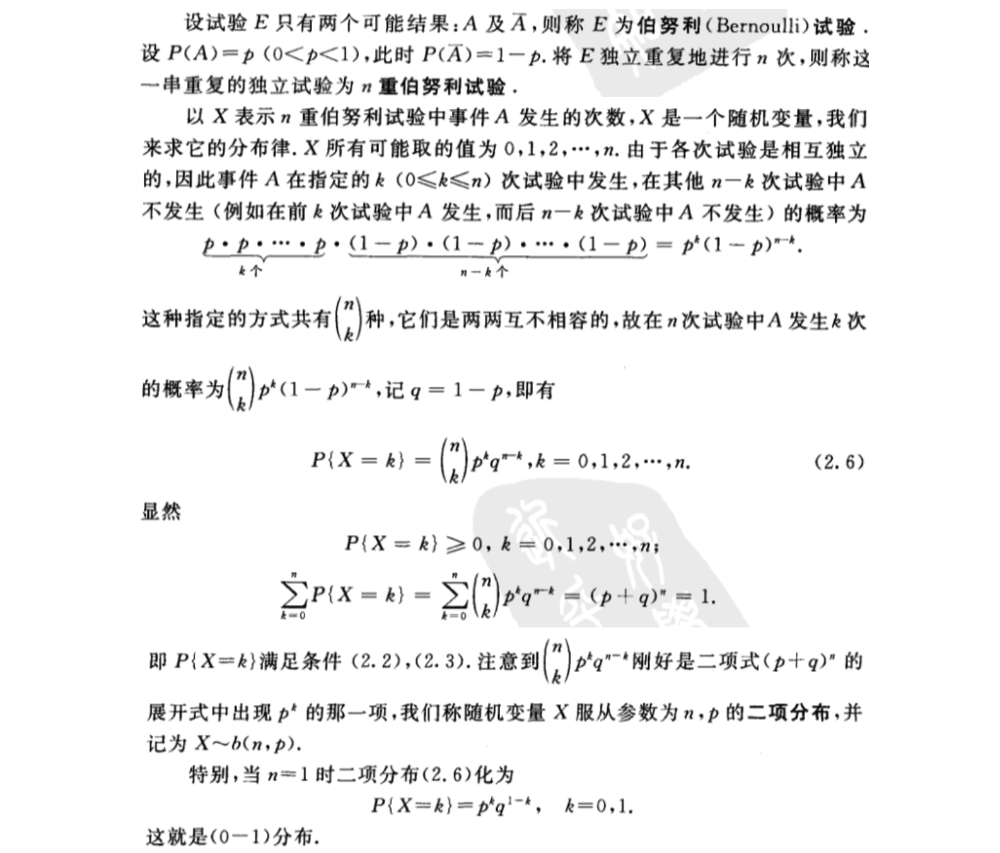
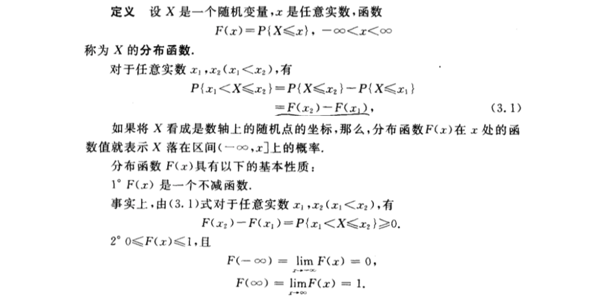
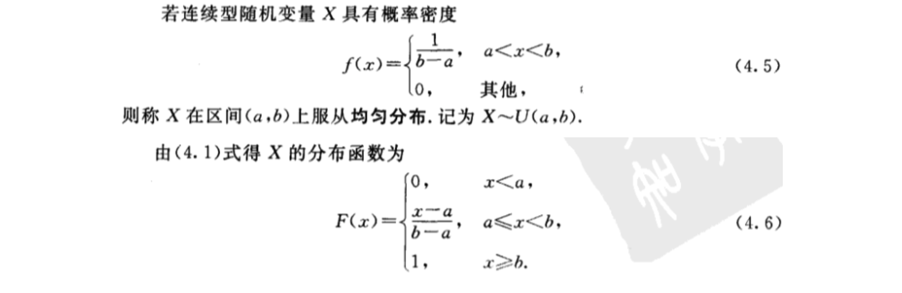
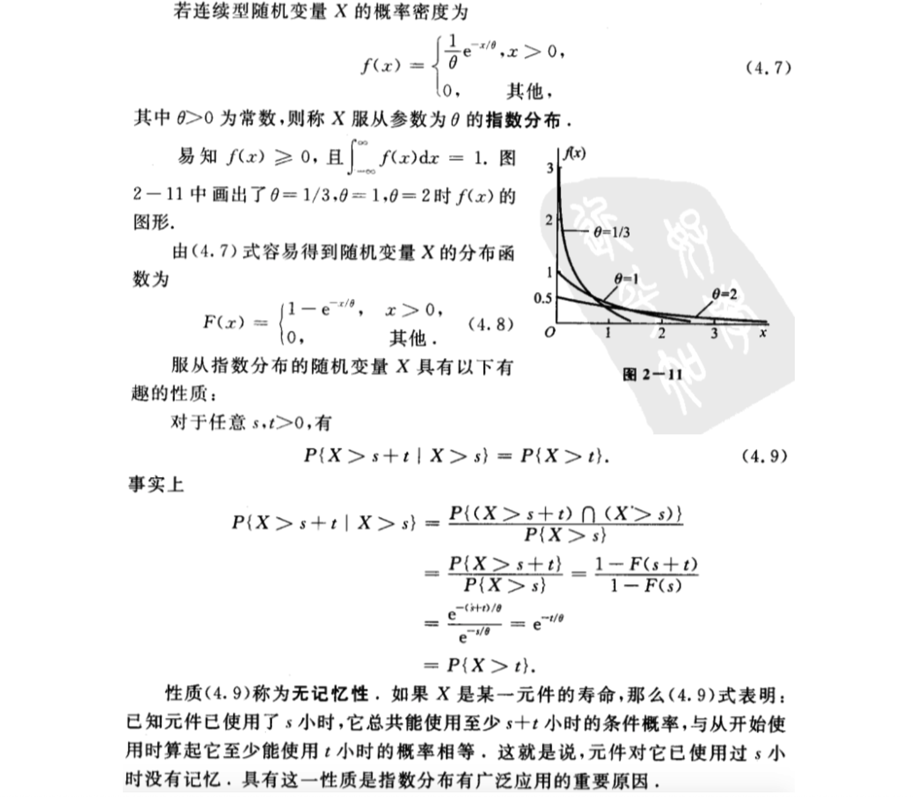
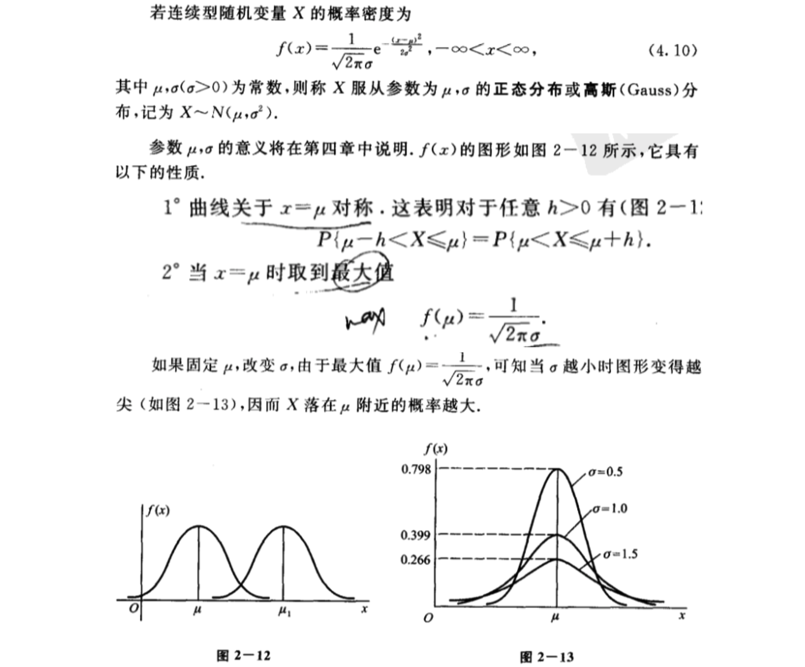
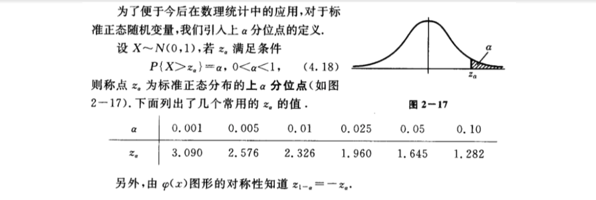
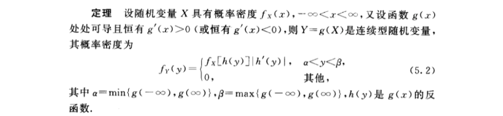
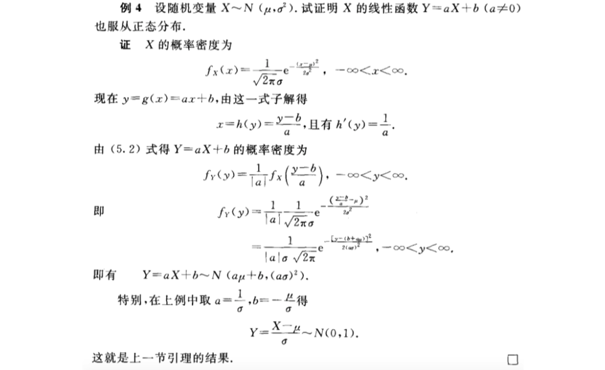

- [第二章 随机变量及其分布](#%e7%ac%ac%e4%ba%8c%e7%ab%a0-%e9%9a%8f%e6%9c%ba%e5%8f%98%e9%87%8f%e5%8f%8a%e5%85%b6%e5%88%86%e5%b8%83)
  - [1 随机变量](#1-%e9%9a%8f%e6%9c%ba%e5%8f%98%e9%87%8f)
  - [2 离散型随机变量及其分布律](#2-%e7%a6%bb%e6%95%a3%e5%9e%8b%e9%9a%8f%e6%9c%ba%e5%8f%98%e9%87%8f%e5%8f%8a%e5%85%b6%e5%88%86%e5%b8%83%e5%be%8b)
    - [（一）（0-1）分布](#%e4%b8%800-1%e5%88%86%e5%b8%83)
    - [（二）伯努利试验、二项分布](#%e4%ba%8c%e4%bc%af%e5%8a%aa%e5%88%a9%e8%af%95%e9%aa%8c%e4%ba%8c%e9%a1%b9%e5%88%86%e5%b8%83)
    - [（三）泊松分布](#%e4%b8%89%e6%b3%8a%e6%9d%be%e5%88%86%e5%b8%83)
      - [泊松定理（泊松分布逼近二项分布）](#%e6%b3%8a%e6%9d%be%e5%ae%9a%e7%90%86%e6%b3%8a%e6%9d%be%e5%88%86%e5%b8%83%e9%80%bc%e8%bf%91%e4%ba%8c%e9%a1%b9%e5%88%86%e5%b8%83)
  - [3 随机变量的分布函数](#3-%e9%9a%8f%e6%9c%ba%e5%8f%98%e9%87%8f%e7%9a%84%e5%88%86%e5%b8%83%e5%87%bd%e6%95%b0)
  - [4 连续型随机变量及其密度函数](#4-%e8%bf%9e%e7%bb%ad%e5%9e%8b%e9%9a%8f%e6%9c%ba%e5%8f%98%e9%87%8f%e5%8f%8a%e5%85%b6%e5%af%86%e5%ba%a6%e5%87%bd%e6%95%b0)
    - [（一）均匀分布](#%e4%b8%80%e5%9d%87%e5%8c%80%e5%88%86%e5%b8%83)
    - [（二）指数分布](#%e4%ba%8c%e6%8c%87%e6%95%b0%e5%88%86%e5%b8%83)
    - [（三）正态分布](#%e4%b8%89%e6%ad%a3%e6%80%81%e5%88%86%e5%b8%83)
      - [转换标准正态](#%e8%bd%ac%e6%8d%a2%e6%a0%87%e5%87%86%e6%ad%a3%e6%80%81)
      - [3σ法则](#3%cf%83%e6%b3%95%e5%88%99)
      - [上α分位点](#%e4%b8%8a%ce%b1%e5%88%86%e4%bd%8d%e7%82%b9)
  - [5 随机变量的函数的分布](#5-%e9%9a%8f%e6%9c%ba%e5%8f%98%e9%87%8f%e7%9a%84%e5%87%bd%e6%95%b0%e7%9a%84%e5%88%86%e5%b8%83)
    - [（证明）转换标准正态分布](#%e8%af%81%e6%98%8e%e8%bd%ac%e6%8d%a2%e6%a0%87%e5%87%86%e6%ad%a3%e6%80%81%e5%88%86%e5%b8%83)

# 第二章 随机变量及其分布
## 1 随机变量
**定义** 设随机试验的样本空间为S={e}。X=X(e)是定义在样本空间S上的实值单值函数。称X=X(e)为随机变量。

## 2 离散型随机变量及其分布律

### （一）（0-1）分布

### （二）伯努利试验、二项分布

### （三）泊松分布

#### 泊松定理（泊松分布逼近二项分布）
**泊松定理** 设$\lambda>0$是一个常数，n是任意正整数，设$np_n=\lambda$，则对于任一固定的非负整数k，有

$lim_{n \to\infty}\binom{n}{k}p^k_n(1-p_n )^{n-k}=\frac{\lambda^k e^{-k}}{k!}$

## 3 随机变量的分布函数

## 4 连续型随机变量及其密度函数

### （一）均匀分布

### （二）指数分布

### （三）正态分布

#### 转换标准正态

#### 3σ法则
一般，若 $X \sim N(\mu,sigma^2)$，我们只要通过一个线性变换就能将它化成标准正态分布。

**引理** 若$X \sim N(\mu,sigma^2)$，则$Z=\frac{X-\mu}{\sigma}\sim N(0,1)$。

#### 上α分位点

## 5 随机变量的函数的分布

### （证明）转换标准正态分布

