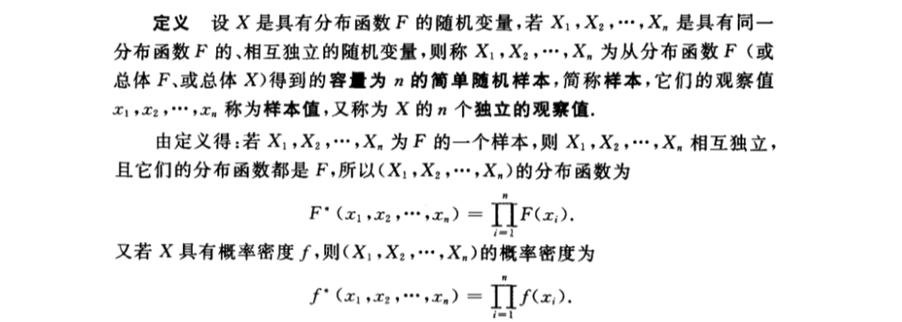
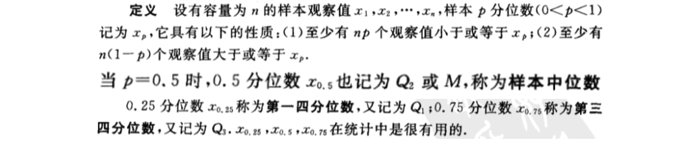
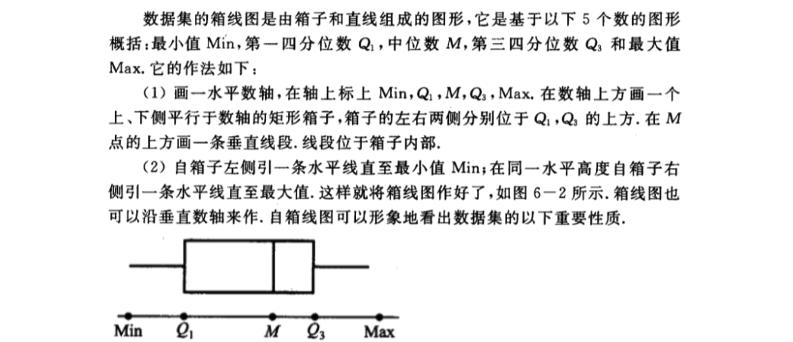
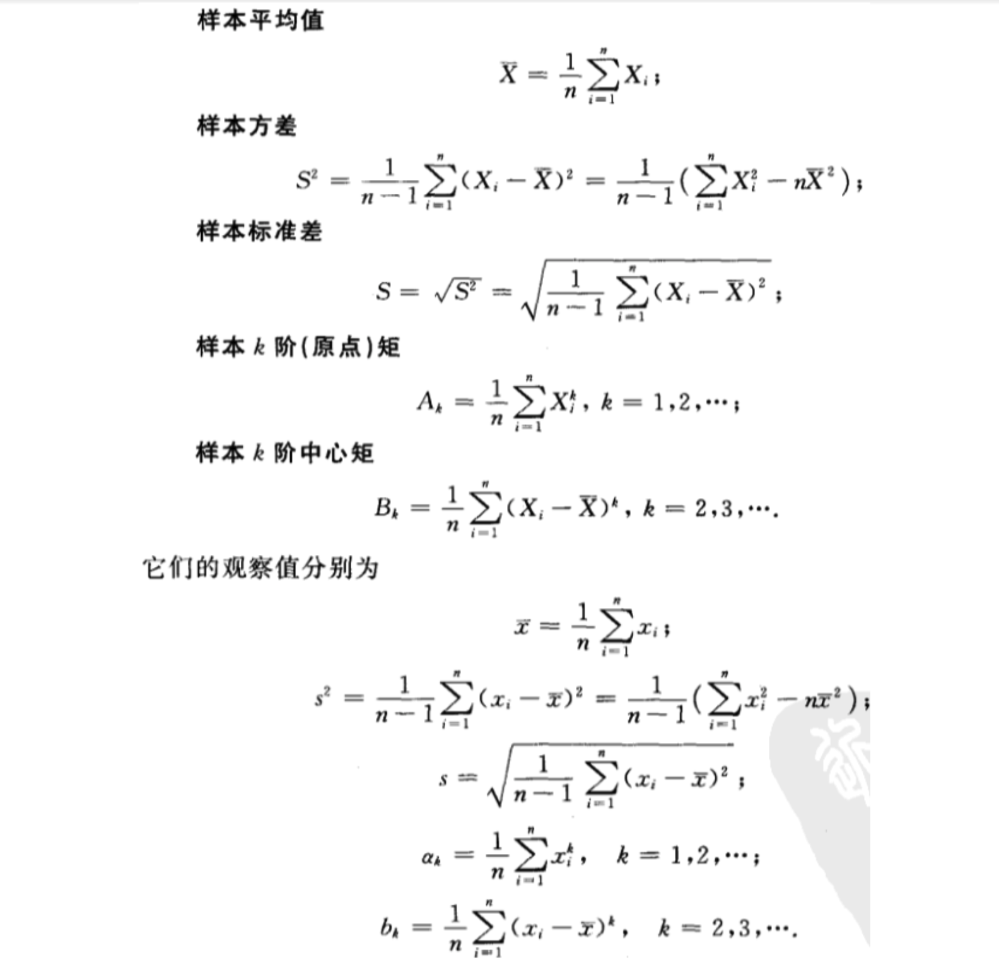
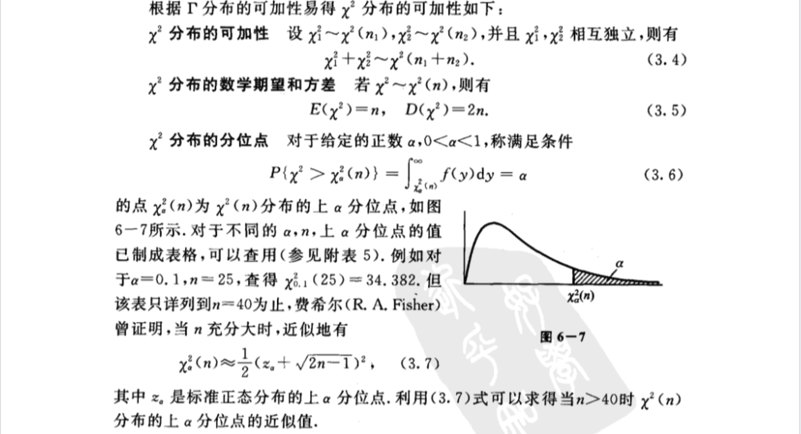
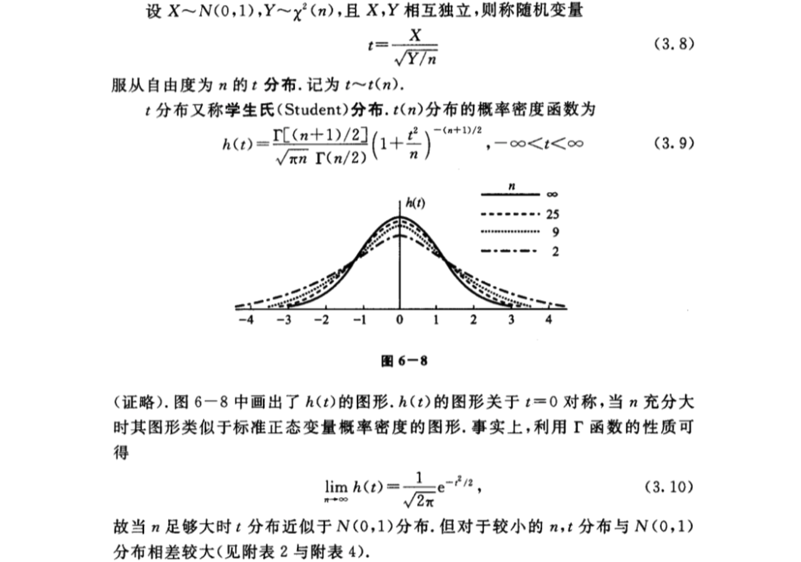
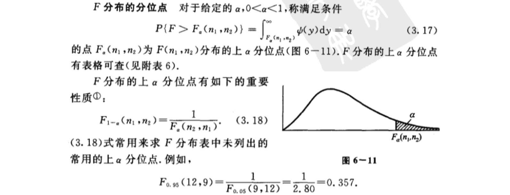
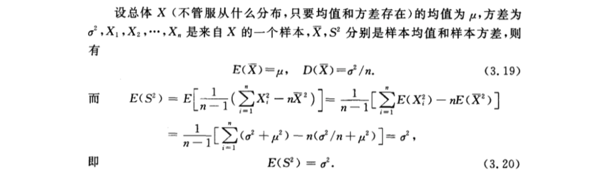

- [第六章 样本及抽样分布](#%e7%ac%ac%e5%85%ad%e7%ab%a0-%e6%a0%b7%e6%9c%ac%e5%8f%8a%e6%8a%bd%e6%a0%b7%e5%88%86%e5%b8%83)
  - [1 随机样本](#1-%e9%9a%8f%e6%9c%ba%e6%a0%b7%e6%9c%ac)
  - [2 直方图和箱线图](#2-%e7%9b%b4%e6%96%b9%e5%9b%be%e5%92%8c%e7%ae%b1%e7%ba%bf%e5%9b%be)
    - [（一）直方图](#%e4%b8%80%e7%9b%b4%e6%96%b9%e5%9b%be)
    - [（二）箱线图](#%e4%ba%8c%e7%ae%b1%e7%ba%bf%e5%9b%be)
      - [分位数](#%e5%88%86%e4%bd%8d%e6%95%b0)
      - [箱线图](#%e7%ae%b1%e7%ba%bf%e5%9b%be)
      - [修正箱线图](#%e4%bf%ae%e6%ad%a3%e7%ae%b1%e7%ba%bf%e5%9b%be)
  - [3 抽样分布](#3-%e6%8a%bd%e6%a0%b7%e5%88%86%e5%b8%83)
    - [统计量](#%e7%bb%9f%e8%ae%a1%e9%87%8f)
    - [（一）χ2分布](#%e4%b8%80%cf%872%e5%88%86%e5%b8%83)
    - [（二）t分布](#%e4%ba%8ct%e5%88%86%e5%b8%83)
    - [（三）F分布](#%e4%b8%89f%e5%88%86%e5%b8%83)
    - [（四）正态总体的样本均值与样本方差的分布](#%e5%9b%9b%e6%ad%a3%e6%80%81%e6%80%bb%e4%bd%93%e7%9a%84%e6%a0%b7%e6%9c%ac%e5%9d%87%e5%80%bc%e4%b8%8e%e6%a0%b7%e6%9c%ac%e6%96%b9%e5%b7%ae%e7%9a%84%e5%88%86%e5%b8%83)

# 第六章 样本及抽样分布
## 1 随机样本

## 2 直方图和箱线图
### （一）直方图

### （二）箱线图
#### 分位数

#### 箱线图

#### 修正箱线图

## 3 抽样分布
### 统计量
**定义** 设X1,X2,...,Xn是来自总体X的一个样本，g(X1,X2,...,Xn)是X1,X2,...,Xn的函数，若g中不含未知的参数，则称g(X1,X2,...,Xn)是一`统计量`。

因为X1,X2,...,Xn都是随机变量，而统计量g(X1,X2,...,Xn)是随机变量的函数，因此统计量是一随机变量。设x1,x2,...,xn是相应于样本X1,X2,...,Xn的样本值，则称g(x1,x2,...,xn)是g(X1,X2,...,Xn)的`观察值`。

下面列出几个常用的统计量，设X1,X2,...,Xn是来自总体X的一个样本，x1,x2,...,xn是这一样本的观察值，定义

### （一）χ2分布

### （二）t分布

### （三）F分布

### （四）正态总体的样本均值与样本方差的分布

