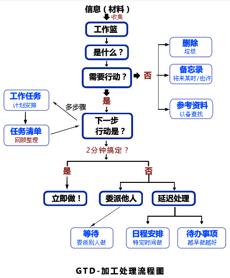

[豆瓣链接](https://book.douban.com/subject/1085660/)

    作者: (美) 戴维﹒艾伦 
    出版社: 中信出版社
    副标题: 无压工作的艺术
    译者: 张静 
    出版年: 2003-09-01
    页数: 305
    定价: 21.00元
    装帧: 精装
    ISBN: 9787800738609

- [第1章 新情况,新做法](#%e7%ac%ac1%e7%ab%a0-%e6%96%b0%e6%83%85%e5%86%b5%e6%96%b0%e5%81%9a%e6%b3%95)
  - [问题:新的要求,匮乏的资源](#%e9%97%ae%e9%a2%98%e6%96%b0%e7%9a%84%e8%a6%81%e6%b1%82%e5%8c%ae%e4%b9%8f%e7%9a%84%e8%b5%84%e6%ba%90)
    - [工作不再有清楚的界线](#%e5%b7%a5%e4%bd%9c%e4%b8%8d%e5%86%8d%e6%9c%89%e6%b8%85%e6%a5%9a%e7%9a%84%e7%95%8c%e7%ba%bf)
  - [承诺:武术家的“一切就绪的状态”](#%e6%89%bf%e8%af%ba%e6%ad%a6%e6%9c%af%e5%ae%b6%e7%9a%84%e4%b8%80%e5%88%87%e5%b0%b1%e7%bb%aa%e7%9a%84%e7%8a%b6%e6%80%81)
    - [“心静如水”的比喻](#%e5%bf%83%e9%9d%99%e5%a6%82%e6%b0%b4%e7%9a%84%e6%af%94%e5%96%bb)
    - [你能够在需要时进入自己的“高效状态”吗?](#%e4%bd%a0%e8%83%bd%e5%a4%9f%e5%9c%a8%e9%9c%80%e8%a6%81%e6%97%b6%e8%bf%9b%e5%85%a5%e8%87%aa%e5%b7%b1%e7%9a%84%e9%ab%98%e6%95%88%e7%8a%b6%e6%80%81%e5%90%97)
    - [原则:有效地处理内心中的承诺](#%e5%8e%9f%e5%88%99%e6%9c%89%e6%95%88%e5%9c%b0%e5%a4%84%e7%90%86%e5%86%85%e5%bf%83%e4%b8%ad%e7%9a%84%e6%89%bf%e8%af%ba)
    - [管理承诺时的基本要求](#%e7%ae%a1%e7%90%86%e6%89%bf%e8%af%ba%e6%97%b6%e7%9a%84%e5%9f%ba%e6%9c%ac%e8%a6%81%e6%b1%82)
    - [“知识工作”的本质](#%e7%9f%a5%e8%af%86%e5%b7%a5%e4%bd%9c%e7%9a%84%e6%9c%ac%e8%b4%a8)
    - [为什么有些事情总是萦绕在你的心头](#%e4%b8%ba%e4%bb%80%e4%b9%88%e6%9c%89%e4%ba%9b%e4%ba%8b%e6%83%85%e6%80%bb%e6%98%af%e8%90%a6%e7%bb%95%e5%9c%a8%e4%bd%a0%e7%9a%84%e5%bf%83%e5%a4%b4)
  - [“材料”的转化](#%e6%9d%90%e6%96%99%e7%9a%84%e8%bd%ac%e5%8c%96)
  - [过程:管理你的行动](#%e8%bf%87%e7%a8%8b%e7%ae%a1%e7%90%86%e4%bd%a0%e7%9a%84%e8%a1%8c%e5%8a%a8)
    - [管理行动是一个重要的挑战](#%e7%ae%a1%e7%90%86%e8%a1%8c%e5%8a%a8%e6%98%af%e4%b8%80%e4%b8%aa%e9%87%8d%e8%a6%81%e7%9a%84%e6%8c%91%e6%88%98)
    - [横向和纵向的行动管理](#%e6%a8%aa%e5%90%91%e5%92%8c%e7%ba%b5%e5%90%91%e7%9a%84%e8%a1%8c%e5%8a%a8%e7%ae%a1%e7%90%86)
- [第2章 横向管理工作进程的5个阶段](#%e7%ac%ac2%e7%ab%a0-%e6%a8%aa%e5%90%91%e7%ae%a1%e7%90%86%e5%b7%a5%e4%bd%9c%e8%bf%9b%e7%a8%8b%e7%9a%845%e4%b8%aa%e9%98%b6%e6%ae%b5)
  - [收集](#%e6%94%b6%e9%9b%86)
    - [百分之百地捕获一切“未尽事宜”](#%e7%99%be%e5%88%86%e4%b9%8b%e7%99%be%e5%9c%b0%e6%8d%95%e8%8e%b7%e4%b8%80%e5%88%87%e6%9c%aa%e5%b0%bd%e4%ba%8b%e5%ae%9c)
    - [影响成功收集的因素](#%e5%bd%b1%e5%93%8d%e6%88%90%e5%8a%9f%e6%94%b6%e9%9b%86%e7%9a%84%e5%9b%a0%e7%b4%a0)
  - [加工处理](#%e5%8a%a0%e5%b7%a5%e5%a4%84%e7%90%86)
  - [组织管理](#%e7%bb%84%e7%bb%87%e7%ae%a1%e7%90%86)
  - [回顾](#%e5%9b%9e%e9%a1%be)
    - [成功的关键因素:每周查阅](#%e6%88%90%e5%8a%9f%e7%9a%84%e5%85%b3%e9%94%ae%e5%9b%a0%e7%b4%a0%e6%af%8f%e5%91%a8%e6%9f%a5%e9%98%85)
  - [行动](#%e8%a1%8c%e5%8a%a8)
    - [选择行动方案的三个范例](#%e9%80%89%e6%8b%a9%e8%a1%8c%e5%8a%a8%e6%96%b9%e6%a1%88%e7%9a%84%e4%b8%89%e4%b8%aa%e8%8c%83%e4%be%8b)
- [第3章 纵向管理:巧妙制定工作计划](#%e7%ac%ac3%e7%ab%a0-%e7%ba%b5%e5%90%91%e7%ae%a1%e7%90%86%e5%b7%a7%e5%a6%99%e5%88%b6%e5%ae%9a%e5%b7%a5%e4%bd%9c%e8%ae%a1%e5%88%92)
  - [强化“纵向”工作重心](#%e5%bc%ba%e5%8c%96%e7%ba%b5%e5%90%91%e5%b7%a5%e4%bd%9c%e9%87%8d%e5%bf%83)
  - [自然式计划模式](#%e8%87%aa%e7%84%b6%e5%bc%8f%e8%ae%a1%e5%88%92%e6%a8%a1%e5%bc%8f)
  - [自然式计划法的技巧:5个阶段](#%e8%87%aa%e7%84%b6%e5%bc%8f%e8%ae%a1%e5%88%92%e6%b3%95%e7%9a%84%e6%8a%80%e5%b7%a75%e4%b8%aa%e9%98%b6%e6%ae%b5)
    - [目的](#%e7%9b%ae%e7%9a%84)
    - [原则](#%e5%8e%9f%e5%88%99)
    - [前景/结果](#%e5%89%8d%e6%99%af%e7%bb%93%e6%9e%9c)
    - [聚焦的力量](#%e8%81%9a%e7%84%a6%e7%9a%84%e5%8a%9b%e9%87%8f)
    - [阐明结果](#%e9%98%90%e6%98%8e%e7%bb%93%e6%9e%9c)
    - [集思广益](#%e9%9b%86%e6%80%9d%e5%b9%bf%e7%9b%8a)
    - [捕捉住你的想法](#%e6%8d%95%e6%8d%89%e4%bd%8f%e4%bd%a0%e7%9a%84%e6%83%b3%e6%b3%95)
    - [组织管理的基本要素](#%e7%bb%84%e7%bb%87%e7%ae%a1%e7%90%86%e7%9a%84%e5%9f%ba%e6%9c%ac%e8%a6%81%e7%b4%a0)
    - [下一步行动](#%e4%b8%8b%e4%b8%80%e6%ad%a5%e8%a1%8c%e5%8a%a8)
    - [你到底需要制定多少计划呢?](#%e4%bd%a0%e5%88%b0%e5%ba%95%e9%9c%80%e8%a6%81%e5%88%b6%e5%ae%9a%e5%a4%9a%e5%b0%91%e8%ae%a1%e5%88%92%e5%91%a2)
    - [需要进一步地阐明问题吗?](#%e9%9c%80%e8%a6%81%e8%bf%9b%e4%b8%80%e6%ad%a5%e5%9c%b0%e9%98%90%e6%98%8e%e9%97%ae%e9%a2%98%e5%90%97)
    - [需要采取更多的行动吗?](#%e9%9c%80%e8%a6%81%e9%87%87%e5%8f%96%e6%9b%b4%e5%a4%9a%e7%9a%84%e8%a1%8c%e5%8a%a8%e5%90%97)
- [第4章 确定时间、空间和工具](#%e7%ac%ac4%e7%ab%a0-%e7%a1%ae%e5%ae%9a%e6%97%b6%e9%97%b4%e7%a9%ba%e9%97%b4%e5%92%8c%e5%b7%a5%e5%85%b7)
  - [预留时间](#%e9%a2%84%e7%95%99%e6%97%b6%e9%97%b4)
  - [确定空间](#%e7%a1%ae%e5%ae%9a%e7%a9%ba%e9%97%b4)
- [第5章 收集阶段:填充工作篮](#%e7%ac%ac5%e7%ab%a0-%e6%94%b6%e9%9b%86%e9%98%b6%e6%ae%b5%e5%a1%ab%e5%85%85%e5%b7%a5%e4%bd%9c%e7%af%ae)
  - [具体的收集工作](#%e5%85%b7%e4%bd%93%e7%9a%84%e6%94%b6%e9%9b%86%e5%b7%a5%e4%bd%9c)
  - [大脑中的搜集活动:清扫大脑](#%e5%a4%a7%e8%84%91%e4%b8%ad%e7%9a%84%e6%90%9c%e9%9b%86%e6%b4%bb%e5%8a%a8%e6%b8%85%e6%89%ab%e5%a4%a7%e8%84%91)
- [第6章 处理阶段:清空工作篮](#%e7%ac%ac6%e7%ab%a0-%e5%a4%84%e7%90%86%e9%98%b6%e6%ae%b5%e6%b8%85%e7%a9%ba%e5%b7%a5%e4%bd%9c%e7%af%ae)
  - [加工处理的关键性问题:“下一步行动是什么?”](#%e5%8a%a0%e5%b7%a5%e5%a4%84%e7%90%86%e7%9a%84%e5%85%b3%e9%94%ae%e6%80%a7%e9%97%ae%e9%a2%98%e4%b8%8b%e4%b8%80%e6%ad%a5%e8%a1%8c%e5%8a%a8%e6%98%af%e4%bb%80%e4%b9%88)
    - [如果不需要采取对策时,又应该怎么办呢?](#%e5%a6%82%e6%9e%9c%e4%b8%8d%e9%9c%80%e8%a6%81%e9%87%87%e5%8f%96%e5%af%b9%e7%ad%96%e6%97%b6%e5%8f%88%e5%ba%94%e8%af%a5%e6%80%8e%e4%b9%88%e5%8a%9e%e5%91%a2)
    - [如果需要采取行,那到底是什么呢?](#%e5%a6%82%e6%9e%9c%e9%9c%80%e8%a6%81%e9%87%87%e5%8f%96%e8%a1%8c%e9%82%a3%e5%88%b0%e5%ba%95%e6%98%af%e4%bb%80%e4%b9%88%e5%91%a2)
- [第7章 管理阶段:建立好清单](#%e7%ac%ac7%e7%ab%a0-%e7%ae%a1%e7%90%86%e9%98%b6%e6%ae%b5%e5%bb%ba%e7%ab%8b%e5%a5%bd%e6%b8%85%e5%8d%95)
  - [基本类型](#%e5%9f%ba%e6%9c%ac%e7%b1%bb%e5%9e%8b)
  - [记录在你日程表上的行动](#%e8%ae%b0%e5%bd%95%e5%9c%a8%e4%bd%a0%e6%97%a5%e7%a8%8b%e8%a1%a8%e4%b8%8a%e7%9a%84%e8%a1%8c%e5%8a%a8)
  - [将来某时/也许](#%e5%b0%86%e6%9d%a5%e6%9f%90%e6%97%b6%e4%b9%9f%e8%ae%b8)
- [第8章 检查阶段:回过头看看](#%e7%ac%ac8%e7%ab%a0-%e6%a3%80%e6%9f%a5%e9%98%b6%e6%ae%b5%e5%9b%9e%e8%bf%87%e5%a4%b4%e7%9c%8b%e7%9c%8b)
  - [要看什么?什么时候?](#%e8%a6%81%e7%9c%8b%e4%bb%80%e4%b9%88%e4%bb%80%e4%b9%88%e6%97%b6%e5%80%99)
  - [“大局”的回顾](#%e5%a4%a7%e5%b1%80%e7%9a%84%e5%9b%9e%e9%a1%be)
- [第9章 行动阶段:选最佳方案](#%e7%ac%ac9%e7%ab%a0-%e8%a1%8c%e5%8a%a8%e9%98%b6%e6%ae%b5%e9%80%89%e6%9c%80%e4%bd%b3%e6%96%b9%e6%a1%88)
  - [选择当前行动的4个标准](#%e9%80%89%e6%8b%a9%e5%bd%93%e5%89%8d%e8%a1%8c%e5%8a%a8%e7%9a%844%e4%b8%aa%e6%a0%87%e5%87%86)
  - [评估每日工作的3个标准](#%e8%af%84%e4%bc%b0%e6%af%8f%e6%97%a5%e5%b7%a5%e4%bd%9c%e7%9a%843%e4%b8%aa%e6%a0%87%e5%87%86)
  - [回顾检查的6个层次](#%e5%9b%9e%e9%a1%be%e6%a3%80%e6%9f%a5%e7%9a%846%e4%b8%aa%e5%b1%82%e6%ac%a1)
- [第10章 创造性地思考工作](#%e7%ac%ac10%e7%ab%a0-%e5%88%9b%e9%80%a0%e6%80%a7%e5%9c%b0%e6%80%9d%e8%80%83%e5%b7%a5%e4%bd%9c)
  - [你目前应该策划哪些工作呢?](#%e4%bd%a0%e7%9b%ae%e5%89%8d%e5%ba%94%e8%af%a5%e7%ad%96%e5%88%92%e5%93%aa%e4%ba%9b%e5%b7%a5%e4%bd%9c%e5%91%a2)
- [第11章 窍门1:养成收集和自省的习惯](#%e7%ac%ac11%e7%ab%a0-%e7%aa%8d%e9%97%a81%e5%85%bb%e6%88%90%e6%94%b6%e9%9b%86%e5%92%8c%e8%87%aa%e7%9c%81%e7%9a%84%e4%b9%a0%e6%83%af)
- [第12章 窍门2:下一步行动](#%e7%ac%ac12%e7%ab%a0-%e7%aa%8d%e9%97%a82%e4%b8%8b%e4%b8%80%e6%ad%a5%e8%a1%8c%e5%8a%a8)
- [第13章 窍门3:关注结果](#%e7%ac%ac13%e7%ab%a0-%e7%aa%8d%e9%97%a83%e5%85%b3%e6%b3%a8%e7%bb%93%e6%9e%9c)

## 第1章 新情况,新做法
*焦虑是由于缺乏控制力,组织管理、准备和行动不足所造成的。——戴维 ·凯克奇( David·Kekich)*

这里所介绍的方法主要基于两个目的:
* 抓住所有一切需要处理的事情(现在的、以后的、将来某时的;大的、小的、或者不大不小的)把它们统统置入一个脱离大脑的逻辑系统中。
* 训练自己在接受一切“输入信息”的前期作出决定。这样一来,在任何时候,你都把下一步行动计划掌握在手,可以实施或者进行再议。

### 问题:新的要求,匮乏的资源
#### 工作不再有清楚的界线
我们感到身上的压力与日俱增,一个主要的原因在于:工作的性质发生了快速而巨大的变化。仅仅在20世纪的后50年中,在这个工业化的世界里,工作的性质已经由流水线装配、制造,以及搬运一类的活动转变为彼得·德鲁克(PeterDrucker)所恰如其分地描述的那种“知识工作”(knowledge work)。

还有一个问题:要想更加出色地完成这些任务,你能够搜寻到多少相关的资料呢?回答是:通过因特网,你可以轻而易举地获取数目无穷无尽的信息,至少存在着这样的潜力。几乎每一件事情都可能处理得更加完善,而且现在促成这一切成为现实的信息,已数不胜数、唾手可得。

另一个问题是,工作缺乏明确的边界导致每一个人的工作量加大。

### 承诺:武术家的“一切就绪的状态”
#### “心静如水”的比喻
*如果你的大脑中空空如也,总是处于一切就绪的状态,它就会向一切事情敞开大门。——Shunryu·Suzuki*

任何造成你反应过度或不足的事情都可能控制住你,事情往往如此。

#### 你能够在需要时进入自己的“高效状态”吗?
*有一件事我们可以做到,最幸福快乐的人是那些尽力而为的人,我们完全可以达到这一境界,我们能够全身心地投入。我们可以全神贯注地关注我们面前的机遇。——马克·范·多琳 (Mark·Van·Doren)*

#### 原则:有效地处理内心中的承诺
任何没有找到应有的位置和恰当的存在方式的事物,都会盘踞在我们的脑海中,成为悬而未决的问题。为了能够高效地应付这一切问题,首先,你必须收集所有那些“经常唤醒你模糊记忆”的事情,然后着手计划如何一一地解决掉。

#### 管理承诺时的基本要求
如果希望出色地管理好所有的工作,那么,你需要做到下面几点:
* 如果这件事总占据着你的头脑,你的思维就会受阻。任何一件你认为没有完成的事情,都必须置于一个客观可靠的体系中,或者是我称之为“工作篮”的工具之中—必须经常回访并且清理它。
* 你必须明白你的工作到底是什么。你还必须作出判断:需要采取什么行动来推动工作的发展进程。
* 一旦决定了需要采取的行动方案,你必须在某一个你会经常查阅的体系中安排组织好这些行为的提示信息。

*像实干家一样思考问题,像思想家一样付诸行动。——亨利·伯格森 (Henry·Bergson)*

所发生的一切只是,你更加明确地了解到你所期盼的结果和确定了下一步需要采取的行动方案。然而,是什么创造了这一切呢?回答是:思考。你并不需要进行很多思考,仅仅需要一些,能够把你所承担的责任和投入的资源凝聚到一起就绰绰有余了。

#### “知识工作”的本质
欢迎参与到“知识工作”的真实经验以及意义深远的运作原则中来。原则是:你对工作投入的思考必须比你认识到的多得多,但是又比你所担心的工作量少得多。就像彼得·德鲁克所描写的那样:“在知识工作中,任务没有被指定,它需要被确定。‘这项工作的预期成果是什么?’这是一个提高知识工作者工作效率的关键性问题。这个问题可能导致一些极具风险性的决定。通常,没有正确的答案,只有不同的选择。想要获取高效益,一定要明确地认定预期结果。”

*行动来源于思想。——拉尔夫·沃尔多·爱默生(Ralph·Waldo·Emerson)*

#### 为什么有些事情总是萦绕在你的心头
在通常情况下,你对一些事总是念念不忘,这是因为你希望它们当前的状况能有所改善,另外:
* 你还没有确切地认定它们的预期结果是什么;
* 你还没有决定你下一步的具体行动到底是什么;
* 你还没有把后果和即将采取行动的提示信息存入你所依赖的体系中去。

这就是为什么你忘不掉这些事情的原因了。直到你澄清了所有的问题,作出一切必要的决定,并把结果存储到那个系统中去,同时心里十分清楚,需要时你能够随时调用查询这个系统,你的大脑才会放松下来。你可以骗过所有的人,但是你却无法愚弄自己的大脑。通常情况下,当你对某件事感到无能为力时,你的某根神经仍然会持续不断地对你施加压力,这仅仅会进一步增加你的精神负担。

### “材料”的转化
我是这样定义“材料”(Stuff)的:任何进入你的精神或现实世界中但尚未找到归属的事情,所有你尚未推理出理想的解决方法和下一步具体行动的事情。

只要它们还保持着“材料”的身份,人们便无法加以控制。我们需要把所有我们尽力管理的“材料”转化为可以付诸行动的事务。

“材料”在本质上并不是一件坏事。就其本质而言,如果某些事情吸引了我们的注意力,那么,它们往往以“材料”的形式表现出来。但是,一旦“材料”进入到我们的生活和工作中,便需要被定义和解释。作为脑力劳动者,这是我们的责任。

### 过程:管理你的行动
#### 管理行动是一个重要的挑战
你利用你的时间都做了些什么事情呢?你是如何运用你获取的信息的呢?你是如何调用你的身体和关注焦点事物的精力的呢?这些是当你面临着分配有限资源的时候必须作出的选择。真正的问题是,在某一时间,如何恰当地选择你要做的事情、如何管理我们的行动。

很多人手头有许多事情有待推进,但连他们自己都还没有搞清楚要做些什么。常常听到有人抱怨“我没有时间去......”,这完全是可以理解的,因为许多工作似乎都难以控制。之所以有这种感觉,是因为你根本没有能力一口气完成一项工作,你仅仅能够完成这项任务中的某一个步骤。在多数情况下,很多推动整个工作进程的步骤实际上仅仅需要一两分钟的时间就可以搞定。

*开始便是行动的一半。——希腊谚语*

事情极少由于时间匮乏而受阻。它们陷入困境往往是由于未能判定行动而造成的。

#### 横向和纵向的行动管理
你需要从横向和纵向两个角度出发来控制各种任务、工作和行动。“横向的”控制保证了所有行动都具有连贯性、逻辑性,让我们把你的神智想像成警察局的雷达吧, 它一刻不停地对你周围的一切事物进行扫描监测。它可能捕捉到 24 小时内吸引你注意力的上千件事情中的任何一件:药店、管家、玛萨姑妈、战略计划、午餐、办公室里枯萎的植物、一位抱怨不迭的顾客、需要擦的皮鞋,买邮票、存一张支票、预订旅馆、取消一次员工会议、今晚去看一场电影等等。你也许会对自己在仅仅一天的时间里需要考虑和处理如此之多的事情而感到惊异不已,因此,你需要配备一个完善的系统来辅助你记录尽可能多的工作,并在需要时及时地提供必要的提示,确保你能够快速而轻松地从一件事情过渡到另一件。

相比之下,“纵向的”控制则是指针对每个具体的主题和工作所进行的思考。比如,吃晚饭时,你和你的配偶谈论起下一次度假,这时,你内心深处的“监控雷达” 开始锁定这一信息—你们将去哪里,什么时候去,将做些什么,要作什么准备等;或 者你即将对部门进行重组,你和老板需要商讨一些决策;或者你仅仅需要挑选一个日期,在那天给一位顾客打一个电话。从广泛的意义上讲,这就是“工作计划”,它的重点聚集在某一情况或某一个人身上,勾勒出执行过程中一切必要的想法、细节、重要环节和事情的先后次序,至少在目前是这样的。

横向控制和纵向控制的目标是一致的:解除你精神上的负担,并把事情做好。

## 第2章 横向管理工作进程的5个阶段
在工作时都将经历这 5 个阶段:
1. 收集一切引起我们注意力的事情;
2. 加工处理后,确定它们的实质以及解决方法;
3. 组织整理得出的结论;
4. 把它们列为我们行动的选择方案;
5. 行动,这就构成了我们生活中的“横向”管理层,随时添加新事务。

### 收集
#### 百分之百地捕获一切“未尽事宜”
在你翻阅这本书时,许多你必须处理的事情正在处于收集之中。信箱里收到了新的邮件,工作中增添了新的备忘录,计算机向你提示新的电子邮件已经到达,语音信箱里积聚着来自各方的留言。但是,与此同时,你正在从周围的环境以及你的大脑里, 一刻不停地收集着那些原本不属于这些区域的信息。即使它们不会像电子邮件那样一目了然,这类“材料”仍然需要某种解决方法。如:在你书柜里的记事簿上,某些决策思路迟迟不能付诸实施;在你书桌的抽屉里,某些坏了的小电器需要修理一下或者干脆扔掉;在你的咖啡桌上,放着一些过期的杂志—这些全都属于这类“材料”的范畴。

大致说来,在广泛的意义上,一切事情都处于人们的收集之中。如果没有一个可靠的外在体系对它们进行直接的管理,那么,这些事情必定会藏匿于你脑中的某个角落里。

#### 影响成功收集的因素
* 每一个悬而未决的事情都必须存储于你的收集系统之中,而不是在你的大脑里。
* 你应该尽可能地控制收集工具的数量,够用即可。
* 你必须定期地清空这些设备。

### 加工处理
你不必再去追踪任何用不了2分钟时间即可以搞定的工作,也没有必要记录已经告一段落的事情。需要紧追不放的是那些将在某一个特定时间或日期里将要发生的事情(把它们记入你的日程表中);那些处理得越快越好的事情(把它们添加到你的“下一步行动”的清单中);以及所有你等待其他人去办理的事情(把这些填入“等候”目录中去)。

### 组织管理
对于那些不可能采取行动的事务来说,它们可以划分为垃圾、孵化工具和参考资料存储器。如果某件事不需要立即采取行动,你可以把它轻轻地抛进垃圾桶,或者“存入备忘录”以备日后再次评估,或者归档保存起来以便今后需要参阅时能够及时地选取。在管理那些能够解决掉的事情时,你需要一张工作任务清单、一个保存工作计划和资料的存储器或文件夹、一个日程表、一张下一步行动的提示清单,以及一张你所期待的回复信息的提示清单。

### 回顾
根据你的需要,经常地回顾你的清单,把它们赶出你的大脑。“工作任务”、“等待处理”和“将来某时/也许”,这些清单应该根据你的具体需要经常查阅,避免它们给你造成工作中的混乱。

#### 成功的关键因素:每周查阅
你应该对所有悬而未决的问题、现行工作计划、“下一步行动”、“日程安排”、“等待处理”,甚至“将来某时/也许”清单每周查阅一次。你自己也同时得到一次机会, 确认大脑中无牵无挂,过去几天中的零星琐事已经统统被收集起来,得到了妥善的分类管理。

### 行动
每一个行动决策都是凭直觉作出的。问题在于,如何从希望这个选择是正确的过渡到对它的正确性深信不疑。

#### 选择行动方案的三个范例
信你自己的感觉。如果你已经收集了当前面临的所有工作、任务和事情,并且进行了加工、归纳以及经常地查阅和回顾,那么,你对于工作和价值观的思考是明智而且注重实效的,这无形中将大大地激发和强化你的感性判断。

当你需要处理的事情远远地超越了你的应付能力,你需要做的便是相信自己的选择。

1. 在某一时刻,决策行动的4个标准的模式
在星期三3点22分时,你如何选择下一步行动呢?你可以按照次序采用下面4个标准:

* 环境
* 有多少时间
* 有多少精力
* 重要性

2. 评估每日工作的3种模式
当你着手处理事务,也就是人们在一般情况下提到的“工作”时,你可能是在从事以下3种不同类型的活动:

* 处理事先安排好的工作
* 处理随时冒出来的事件
* 定义你自己的工作

3. 回顾和检查工作6个标准的模式
可以从6个不同的角度加以衡量。我们可以高度的概念进行类比:

* 5万英尺以上:生活
* 4万英尺:3~5年的展望
* 3万英尺:1~2年的目标
* 2万英尺:责任范围
* 1万英尺:当前的工作

跑道:目前的行动这是一份写得密密麻麻的工作清单,记录了你需要处理的一切事务: 所有你需要打的电话,所有等待回复的电子邮件,所有要跑腿处理的事情,还有你打算向老板汇报的日程安排,以及希望同配偶交流的信息。即使你现在能够停止地球的运转,不再从你自己或其他人那里接收更多的信息,你大概也要忙碌 300~500 小时, 才能把手头的事情一一解决。

1万英尺:当前的工作目前你手中有30~100项工作亟待处理,这些都是你希望在相当短的时间内取得成效的事情。例如,在家里添置一台电脑,组织开一次销售会议,把公司总部迁往新址,去看牙医等。

2万英尺:责任范围自身承担的种种责任和义务,致使你承受了先前的大部分工作。对于大 多数人而言,这些工作可以划分为 10~15 个范畴。在这些重点领域里,你希望取得成 果或者保持现有的水准。你的工作性质也许涉及到某些责任,如战略计划、行政支持、员工培训、市场调研、客户服务或者资产管理。此外,你还需要关注个人生活中众多具有重要意义的方面:健康、家庭、财政收支、住 宅环境、宗教信仰、娱乐休闲等。把所有这些责任和义务一并诉诸文字,并经常回顾 和自检,这将有助于你更加综合全面地对自己的任务清单进行分析和评估。

3万英尺:1-2年的目标从现在起1-2年内,你希望在生活和工作的各个领域达到哪些目标,这为你定义工作又创造了一个崭新的领域。随着一些新的责任和义务的产生,你需要经常调整自己的工作重心,以完成所制定的目标。在个人生活的领域中,情况也大同小异,你希望使某些事情尽快到位,这将增强你生活中某些方面的重要性,同时弱化另一些方面的问题。

4万英尺:3-5年的展望展望未来3-5年的发展前景,你必定会从一个更加广阔的角度着眼:管理策略、周边环境发展的趋势、事业和生活转变的条件。内在的因素包括事业、家庭和财政方面的长期目标,外部世界的发展变化,包括技术进步、全球化进程、市场趋势及竞争等,势必影响到你的工作和组织管理方法。在这一层次的决策将会轻而易举地改变你其他各个阶段的工作内容。

5万英尺以上:生活这就是我们整个生活的全景。你的公司为什么会存在呢?你自己为什么会存在?任何事物的主要目标为我们提供了定义其性质的核心手段。这是对工作的最终描 述,你制定的所有目标、前景展望、规划、任务及行动都来自于这个工作描述,同时也为其获得成功指明方向。

## 第3章 纵向管理:巧妙制定工作计划
轻松自如地控制一切的主要因素是:

1. 明确判定工作的预期结果以及下一步具体行动;
2. 把一切尚待解决的工作的提示信息安置在一个安全可靠的系统中,并定期回顾和检查。这就是我所命名的横向工作重心。

当你着手处理平凡琐事的时候,必须着眼于大局,这样一来,所有的烦琐小事才能够沿着正确的方向发展。——阿尔文·托夫勒(Alvin·Toffler)

### 强化“纵向”工作重心
在大多数情况下和大部分时间里,你仅仅需要横向工作重心。然而,有时你也许需要更严格地控制某一项工作,找出解决方案,或者确保行动方案切实可行。这就是我们所说的纵向工作重心。

我们的最终目标是把各种工作和情况赶出你的大脑,但不要丢弃任何具有潜在价值的想法。

### 自然式计划模式
世界上经验最丰富的计划家就是你的大脑。人的大脑只有经过5个步骤才能够完成任何一项任务:

1. 定义目标和原则
2. 展望成果
3. 集思广益
4. 组织管理
5. 明确下一步的行动方案

一个简单的事例:计划出去吃饭

你上一次出去吃饭时,最初的动机是什么?原因可能有很多:因为饥肠辘辘,或是朋友之间的社交活动,为了庆祝某一个特殊的日子,签订一笔生意的合同,或是为了谈情说爱。只要是出于上述的某一个原因,你就马上开始进行计划了。你的意愿就是你的目标,它自然而然地启动了你内心深处的计划过程。你的原则规定了你所作计划的界限。可能你自己并不一直注意到外出就餐的这些原则,但是你的思维却从来没有逾越这一边界:食物和服务的标准、支付能力、方便程度以及舒适度。无论如何,在制定计划时,你的目标和原则决定了你的动机和计划。

一旦作出决定要实现这一目标,首先进入你脑海的实质性问题是什么呢?恐怕并不是“计划,第二部分,第1点,第3小点”。你的第一批想法很可能是这样的事情,如“在餐厅吃意大利风味的晚餐”,或者“在比斯特罗咖啡馆街边的桌旁坐一坐”。你很可能还会想像出晚餐时的一些美好体验,或者设想一下晚餐的结局,也许你还想到了共同吃饭的人、气氛什么的,这就是你对结果的预期。当外出就餐的原因成为你的目的时,对晚餐进行的种种想像便成为你的展望。

一旦认同了这种展望,你的大脑便会自然而然地开始想些什么问题呢?我们应该几点出发?这家餐馆今天晚上营业吗?人会不会非常多?天气怎么样?是否应该换身衣服?汽油还够吗?现在饿不饿?这就是浮想联翩。一旦作出承诺要达到某一目标,在达到之前,你就会身不由己地向自己接二连三地发问。这些问题是这个创造性过程中的一个组成部分。当大脑意识到,在你设定的目标和你目前的状况之间存在着一定的差距,这时它会千方百计地弥补这一差距,以消除这种“认知不协调”,这就是自然式计划法中“如何......”这一阶段的起始点。但是,这种思考模式显示出一定的随意性。你会想到有关外出就餐方方面面的事情。当然,你不必把所有浮现在脑海里的事情逐一地写下来,但是,整个过程在你的大脑里却不断地重复着。如果你最要好的朋友最近取得了成功,而你负责为此举办一个庆祝活动,那么你头脑中可能浮现出的各种复杂烦琐的细节问题,至少会证明这种“信封背面”式思维的价值。)

一旦头脑里装满了大量的想法和细枝末节,你也就不由自主地开始了组织整理的工作。你会这样想,“首先,我们需要弄清楚那家餐厅是否开门营业”,或者“我们给安德森一家打个电话,看一看他们是否愿意同我们一同出去吃晚饭”。一旦你对相关的结果产生了各式各样的想法,大脑将自动地根据事情的组成要素、重要程度和事件发展的先后顺序,分门别类地进行归纳整理。组成要素是指“我们要考虑逻辑性问题、人员和地点方面的事宜”,重要程度是指“搞清楚大家是否愿意外出就餐是非常关键的”,先后顺序是指“首先,我们需要确认那家餐厅是否营业,然后给安德森一家打电话,接着更衣准备外出”。

最后,为了促使第一要素的顺利实现,你主要集中在下一步具体的行动方案上。“给苏珊娜餐厅打个电话,问问那里是否开门,然后预订一下座位。”

### 自然式计划法的技巧:5个阶段
#### 目的
预先了解和掌握任何行为的目的,这将对理智清晰地分析问题,富于创造性地推动事情的发展,以及人们互相之间的通力协作具有重要的指导价值。

通常,作出一个艰难决策的惟一途径就是,回到目的上来。

思考“为什么”这个问题的价值，下面仅仅是思考这个问题的某些好处:

* 界定成功
* 创造了决策标准集结资源
* 激发动机
* 阐明重点
* 拓宽选择

你的目标是否清晰而具体呢?如果你切切实实地体验到了聚焦工作重心所带来的种种益处:动机充足、决策标准、资源集结和富于创造力,那么,你的目标就称得上足够详细而精确。

#### 原则
你所遵循的标准和价值观,如同上述阐明的推动和指导工作发展进程的主要标准一样,具有同样的价值。

*简单清楚的目标和原则可以激发复杂而机智的行动。复杂烦琐的规则和条例将导致简单而愚昧的行动。——迪伊·霍克(Dee·Hock)*

重视原则的另一个重要原因是:它们明确了积极有效行为的含义,并为此提供了参照点。

#### 前景/结果
为了能够最富有成效地利用你可以获取的资源,无论是那些你已经意识到了的资源,还是尚未认知的,在你的大脑里都必须清楚地勾勒出一幅成功的蓝图:成功将是一番什么样的景象?听上去会怎样?有什么的感觉呢?目标和原则提供了动机和监控手段,而前景则是描绘最终成果的一个现实的蓝图。这就是一个“什么”的问题,而不是“为什么”的问题。

#### 聚焦的力量
我们头脑中所坚持不懈地遵循的信念,能够影响我们观察到的事物以及我们的具体表现。我的兴趣在于,提供一种具有实用价值的集中精力的模式,特别是在考虑工作时。

*想像力比知识更重要。——阿尔伯特·爱因斯坦*

*自发的创造机制是以目的论为根据的。它是遵循着目标和成果而运作的。一旦你为它设立了明确的目标,你就可以依赖它的自助导航系统引导你达到这个目标。这要比你完全凭借自己的意识思维效果好得多。“你”通过思考最终结果为它提供一个目标。那么,你的自动系统凭借什么来提供手段呢?——麦克斯韦·莫尔茨(Maxwell·Maltz)*

#### 阐明结果
直到亲眼看到自己做这件事,你才能够对其运作方法有所了解。通常,在你促使事物在现实生活中发生以前,你需要首先在大脑中进行构思。

在知识工作的领域中,最有效的技能之一就是创造出清晰可见的结果,这也是我们需要进行艰苦磨练的重要技能之一。这一点并非听上去那样简单。我们需要在各个不同的层面上不断地对我们试图达到的目标加以界定,此外,还要持之以恒地对可以获取的资源进行重新划分,以期以最高的效率完成这些工作。

当目标实现了之后,又是怎样的一番景象呢?你希望客户在听了你的报告之后有什么样的感受?你希望他了解到哪些情况采取哪些行动?从现在算起,3年后,你的事业将有何发展?一个财政部门理想的副经理将会把工作进行到何种程度?你的网站目前到底是何种尊容?如果它达到了你心目中确立的目标,那又应该拥有什么样的实际功效呢?

下面是展望前景的3个基本步骤:

1. 在限定的期限之前,考虑这项工作。
2. 想像“大获全胜”的景象。(暂时中止“是的,但是......”)
3. 捕捉你想像中应该到位的各种特点、各个方面和品质。

#### 集思广益
一旦你知道你希望发生的情况及其原因,“如何实现”这一无意识的生理连贯反应便开始发挥其作用了。当你对头脑中浮现出的、不同于你目前现状的设想表示认同时,你就会情不自禁地开始弥补这一差距,或者开动脑筋。这时,一些想法便会跌跌撞撞地窜入你的头脑中,毫无章法可循—琐碎的、重要的、普通的或是绝妙的。

*获得一个好主意的最佳途径是拥有许多的想法。——莱纳斯·波林(Linus·Pauling)*

你的大脑希望填补存在于这里和那里之间的空白,不过其行动毫无顺序可言。

#### 捕捉住你的想法
*没有什么比你只拥有一个想法更危险的事情了。——埃米尔·查特(Emile·Chartier)*

*只有那些轻松自如地对付自己想法的人,才能够驾驭这些想法。只有能够驾驭自己观点的人,才不会沦落为观点的奴隶。——林语堂*

有许多技巧都可以用来启动思维,强化打破常规的思考模式。这些基本原则可以归纳为以下3点:

* 不判断,不质疑,不评估,不批判。
* 追求数量,不求质量。
* 把分析组织工作置于次要的位置上。

#### 组织管理的基本要素
关键步骤如下:

1. 明确意义重大的事件
2. 按照(下面一个或多个标准)排序
    * 构成因素
    * 先后顺序
    * 重要程度
3. 必要程度的详述

#### 下一步行动
计划工作的最后一个阶段,归根到底就是决定如何分配和再分配自然资源,以便真正地推动工作的发展进程。

* 针对当前这项工作的每一个行进中的环节,决策下一步的行动。
* 如果有必要的话,在计划过程中就决定下一步的行动方案。

#### 你到底需要制定多少计划呢?
一个简单的回答就是, 只要能够让它摆脱对你大脑的纠缠就足够了。如果一项工作还徘徊在你的大脑中,你就需要进行更多的策划和构思。

#### 需要进一步地阐明问题吗?
如果增强问题的透明度是你目前的首选,那么,你可以沿着自然式计划法的阶梯循序渐进。如果在计划这一阶段上缺乏清晰和条理,人们就必须开动脑筋、集思广益,挖掘出充足的想法和主意。如果在动脑筋、挖点子这一阶段思路模糊不清、混乱不堪,就有必要重新回顾一下既定的预期效果了。倘若预期效果或者前景含糊不明确,你必须回过头来,重新分析一下你当前工作的目的何在。

#### 需要采取更多的行动吗?
如果你所需要的是落实更多的行动,就必须遵循自然式计划模式继续向前推进。再问你自己一次:“预期的后果是什么呢?”如果你已经明确地回答了这个问题,但事情仍然毫无成效,恐怕你应该把注意力放在具体的操作细节以及视角上来。

## 第4章 确定时间、空间和工具
### 预留时间
我建议你留出一大块完整的时间来启动这一管理计划,给自己安排一个独立的工作区域,注意要有空间,并配备必要的家具和工具。如果你的工作区安排的恰如其分,简单高效,这就能够大大减少处理事务时内心深处潜在的抵触情结,甚至它还会把你吸引到桌边,有效地加快你的工作节奏。对于大多数人来说,比较理想的时间段应该是连续的两个整天。

实施完整的收集过程将占用你6个小时或者更多时间。而对于那些你希望使之具体化的事务来说,进行加工处理并决定下一步的行动,可能又将不知不觉花去8个小时。

专门空出两天时间来处理这个过程,对于你的工作效率和精神健康而言,都将具有成倍的价值。

### 确定空间
你需要确定一个具体的地点来充当处理事务的中心区域。如果在你的工作场所已经拥有了一张办公桌和相应的办公空间,这大概是最佳的起点了。如果你在家中办公,那么显而易见,这将是你最主要的办公场所。如果你在这两处都已经拥有办事的空间了,你会希望在这两个地点建立起统一的可以交替使用的运作体系。

构成一个工作空间的最基本要素,仅仅是一个用于书写的桌面及一个可能存放工作篮的空间。

假如你的办公室系统简洁而紧凑,可以随身携带,你对如何快速处理事物的方法也了如指掌,那你就可以在任何地方开始办公。然而,你仍然需要在家里开拓一个“基地”,并准备好一套得心应手的工具和宽敞明亮的空间来存储参考资料。所有资料最好抬手可得。

## 第5章 收集阶段:填充工作篮
### 具体的收集工作
第一步是搜索你周围的环境,检查一下哪些事物没有到位,把它们放入工作篮。开始收集那些不完善的,以及那些已经确定行动方案,正在等待执行的事务。把它们全都扔到工作篮,以便日后随时调用。

### 大脑中的搜集活动:清扫大脑
一旦认为已经把周围环境中需要处理的事宜全部搜索到一起,你会进而希望搜寻那些仍然存储在你脑海中的事项。是什么事还在时刻侵占你的注意力。而你却又无法在工作篮中找到它们呢?这时,一叠简单的白纸开始真正地发挥作用了。我建议你分别在不同的纸上一一写下这些想法或者诸如此类令人精力分散的事情。

## 第6章 处理阶段:清空工作篮
当你完成了加工处理工作篮的活动时,你将:

1. 丢弃你不再需要的一切;
2. 完成任何用不了2分钟就能搞定的事情;
3. 把任何可以委托他人处理的事情交代出去;
4. 为所有需要走过2分钟时间的工作注明提示信息,并分类纳入你的管理系统之中;
5. 根据获取的信息,明确你目前一些较为重要的工作和任务。

有几个基本原则可以遵循:

1. 从最上面的一项开始处理。
2. 一次只处理一件事情。
3. 永远不要把任何事情再次放回工作篮

### 加工处理的关键性问题:“下一步行动是什么?”
#### 如果不需要采取对策时,又应该怎么办呢?
很可能的是,你的工作篮中存在着一些不需要采取行动的任务。在这种情况下, 一般有三种情况:

1. 垃圾
2. 待孵化的项目
3. 参考资料

#### 如果需要采取行,那到底是什么呢?
在认清下一步的具体行动之前,你需要考虑更多的事情,才有可能应对任何出现的变化。为了对下一步的行动作决策,你必须首先明确你希望达到的目标。一旦你决定了下一步的行动,这时,你就面临着3种选择:

* 实施(如果2分钟内可以完成的话)
* 指派给他人(如果你自己并不是最佳的执行者);
* 交给你的管理系统(作为日后处理的一种选择)。

## 第7章 管理阶段:建立好清单
### 基本类型
从组织管理的角度来看,你希望了解和管理的事情可以为7大类:

* 一个“工作”清单
* 工作的辅助性资料
* 记录在日程表中的行动和信息
* 各种“下一步行动”的清单
* 一个“等待”清单
* 参考资料
* 一个“将来某时/也许”清单

### 记录在你日程表上的行动
日程表应该只显示“重要而艰巨的工作”,围绕着它推进你其余的行动。许多人希望把行动放在他们有心情去完成这件事情的那一天的日程安排中,比如星期一。但是到那时,也许情况就会发生变化了,因此这件事又不得不一再地拖延下去了。要抑制住这种种情况。你需要依赖你的日程表,把它视为一块圣域。它界定了你每天所有的责任的严格精确的界限。当你忙碌的时候,这些工作也应该能够一目了然。如果日程表中包括你必须在某一天搞定的工作,事情也就简单多了。

### 将来某时/也许
将来某时/也许清单并非是可以随手丢弃的。也许它们最终被证明是一些你从末涉及到的、最有趣的或者最富于事情。典型的类型包括有:

1. 为你的家庭弄到或者建造房屋
2. 开始培养的业余爱好
3. 计划学习的技能
4. 挖掘富于的表达方法
5. 需要购买的服装的附属物品
6. 希望获得的玩具
7. 打算外出旅行
8. 希望参加的组织
9. 打算参与的服务性工作
10. 想看的事情和想去做的事情

*我们解决问题的力量在于我们不去处理某些情况的能力。——亚力士多德*

## 第8章 检查阶段:回过头看看
你必须获得这份承诺:目前实施的行动是你必须这样做的,而你未进行的那些工作,对你来说也无关紧要。遵循一定的规律回顾检查你的管理系统,并使其内容不断地更新,功效正常发挥,这是赢得控制权和支配的权的先决条件。

例如,你手上有一堆电话要打。一旦你的清单并不能包括你所有需要打的电话,你的大脑就不再信任这个系统了,因此,它也不能从低水准的脑力劳动中解脱出来了。结果你的大脑又不得不重新担负起记忆、加工处理和提醒的责任,也就会像以前一样低效率的运转。所有这一切意味着,你的系统绝不能处于静止不动的状态。

在这一阶段,你需要处理两种主要情况:

1. 你需要关注哪部分的内容?什么时候?
2. 为了确保整个系统持续运转,解放你的大脑,使之能够从事更高层次的思考和组织管理活动,你需要采取什么行动?多久一次?

### 要看什么?什么时候?
当你的手头上有一部电话和一些可以自由支配的时间,这时你应该至少扫一眼那张你需要处理的电话清单。你可以抓住一件最重要的去处理,也可以做到一个事情都不去碰,总之游刃有余。当你正准备去参加与老板或者合伙人的讨论时,花一分钟浏览一下日程上所记录的与他未了的事宜,你会看到自己正在发挥这段时间的最佳功效。当你打算去干洗店取回衣物时,首先快速地检查一下还有没有可以在途中解决的差事。

人们经常问我:“你花多少时间来回顾检查你的系统?”我的回答是:“只要我能够对当前的行动感觉良好就足够了。”

### “大局”的回顾
*思考是工作和生活的精髓,同时也是最难做到的事情。帝国的创建者们在争分夺秒地算计着,而其它人却在嬉戏。如果你不是自觉地去努力进行这种自我指导的思维过程,那么你就是在向懒惰屈服让步,你将永远丧失控制自己生活的能力。——戴维凯克奇*

## 第9章 行动阶段:选最佳方案
有3个方面的评估标准对行动的决策过程极有帮助:

1. 选择当前行动的4个标准
2. 评估每日工作的3个标准
3. 回顾检查的6个层次

### 选择当前行动的4个标准
记住,当你决策下一步行动方案时,是依据下面的4重标准进行的:

1. 环境
2. 时间
3. 精力
4. 重要性

*我们都可能遇到这种情况:有时,思维敏捷;有时,应该远离思考。——Deniel·Cohen*

### 评估每日工作的3个标准
在一天的工作中,在任何一个时间点,你所下面的3种活动之一:

1. 处理预先明确的工作
2. 处理随时出现的新工作
3. 安排下一步的工作。

### 回顾检查的6个层次
工作中的6个层次可以参照高度进行考虑:

1. 5万英尺以上:生活
2. 4万英尺:3~5年的计划
3. 3万英尺:1~2年的目标
4. 2万英尺:责任范围
5. 1万英尺:当前的工作
6. 跑道:目前的行动

## 第10章 创造性地思考工作
### 你目前应该策划哪些工作呢?
在明确大多数任务的预期结果时,你并不需要进行某种形式的前期计划,只需要在脑子里想一下,这些事情的一步方案就会自然产生了。然而,有两种类型的工作至少值得我们进行某种形式的安排策划:

1. 即使你已经决定了下一步行动,却仍然吸引你注意力的事务;
2. 还有一些情况,有关它们的具体潜在价值和帮助的想法和细节刚刚出现。

第一种类型——你知道,这些事情的其他一些方面还有特进一步的确定和安排。因此,除了明确下一步的行动,你还需要一个更加彻底的解决方法。针对这些事情,你应该进一步具体地采用自然计划模式中的另外4个阶段,选用一个或者多个阶段:目的和原则、前景展望/预期结果、集思广益或者组织管理。

第二种类型——有关这类事情的想法刚刚露出一个头来,特别是在海滩上、汽车中或者会议上,需要一个恰当的场所把它们统统地装进来。这样一来,这些念头可以暂时地在那里“小住”一段时间以备不时之需。

*让我们把超前的焦虑变成超前的思考和策划——温斯顿·丘吉尔*

## 第11章 窍门1:养成收集和自省的习惯
焦虑和内疚并不是因为承担太多的工作而造成的,这是由于你撕毁了同自己签订的协议而导致后果。如果你的消极情绪来自于毁约,那有3种方法来对付这种局面,消除负面影响:

1. 不签订协议
2. 完成协议
3. 重新协商协议

所有这些方法都有助于摆脱不良的情绪。

## 第12章 窍门2:下一步行动
*领先的秘密在于开始行动。开始行动的秘密在于把复杂的大宗任务分解成为可以操作的细小工作,然后开始实施第一项内容。——马克·吐温*

*无论问题多大、多严峻,你总可以向解决它们的方向迈出小小的一步,来根除掉束手无策的感觉。行动起来吧。——乔治*

*一个行动计划面临着风险和代价,但是比起懒散懈怠所导致的长期危险和代价来说,它们要少得多。——J·F·Kennedy*

*人们总是把自己的问题归咎于环境。我不相信环境,所有在这个世界上出人头地的人都是那些勇于站起来寻找机会的人。如果无法找到,他们就自己创造条件。——萧伯纳*

## 第13章 窍门3:关注结果
只有当你对预期结果一清二楚时,才有可能定义出恰当的举措。如果你对促成事物发生的具体行动仍然没有把握,你的预期目标必定与现实生活严重地脱节。你可以从这两方面入手来解决问题,你必须这样去做。

生活中只存在两个问题:

1. 你知道你想要得到的东西,但你不知道应该如何获取它;
2. 你不知道你到底想要什么。

如果这种说法是真实的(我认为是的),那么,也就只存在着两种解决方法:

1. 制定一个目标
2. 促成这件事

挑战就是把高层次的理想目标融入平凡的日常活动中去。最终它们需要同样的思考过程。

*生活无法为我们提供皆宜更多的快乐:克服重重困难,从成功的台阶攀登上另一个台阶,然后萌发新的意愿,并亲眼目睹它们一一实现。——Dr.Samuel·Johnson*

*理想文义者认为,短期的问题无关紧要。愤世嫉俗的人相信,长期的目标没有什么了不起。而现实主义者认定,短期内已经完成的和未完成的工作状况,决定了长期目标的实现——Sidney·J·Harris*

*没有明确任务的展望只是梦想。缺乏前景的任务只是痛苦的劳作。同时拥有前景和任务才是世界的希望。——英格半萨塞克斯教堂1730*
