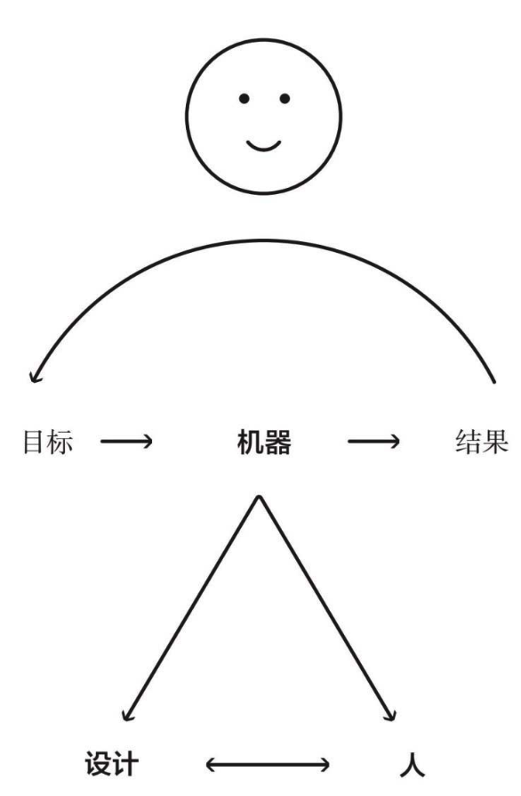
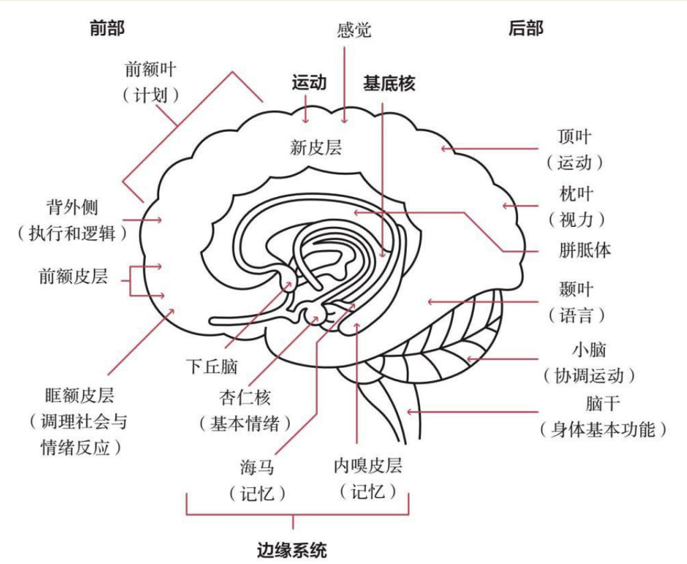
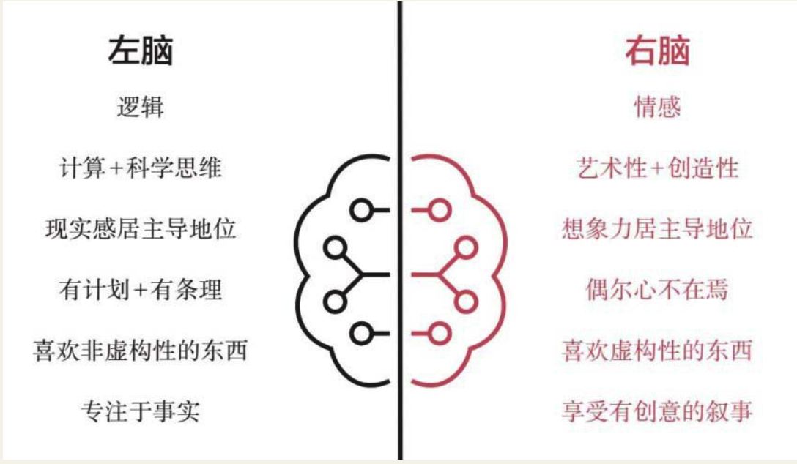
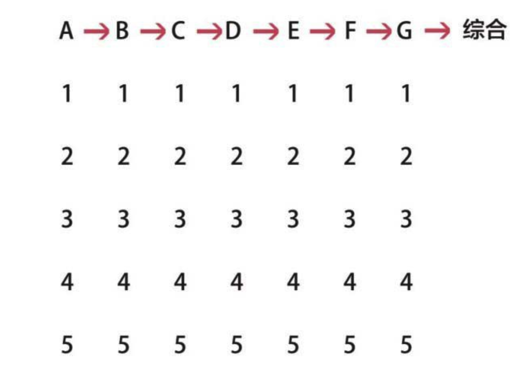
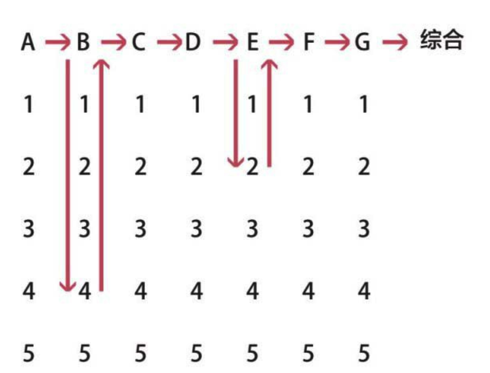
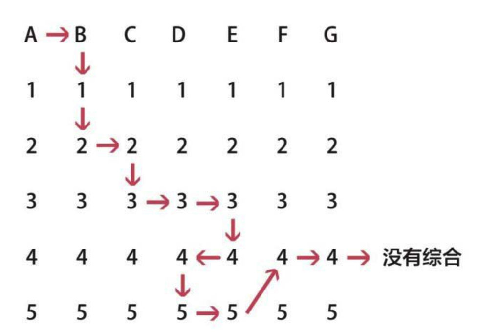
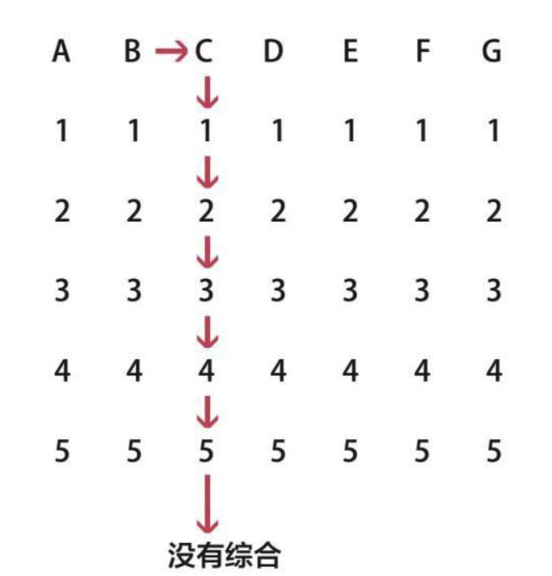
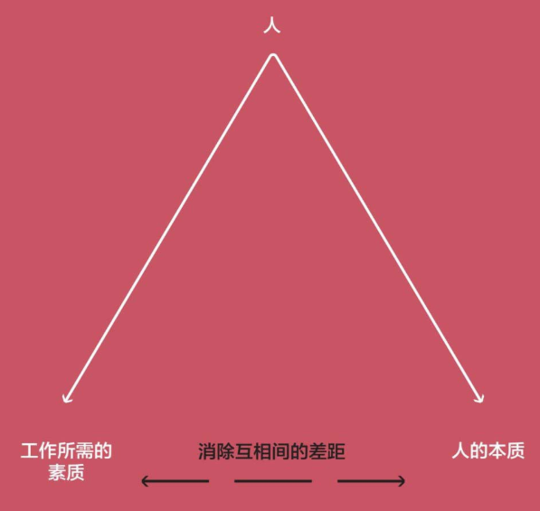
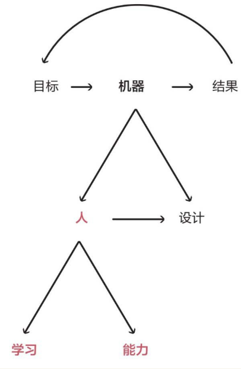

    作者: [美] 瑞·达利欧
    出版社: 中信出版社
    原作名: Principles: Life and Work
    译者: 刘波 / 綦相
    出版年: 2018-1
    页数: 576
    装帧: 精装
    ISBN: 9787508684031

[豆瓣链接](https://book.douban.com/subject/27608239/)

- [导言](#导言)
- [第二部分 生活原则](#第二部分-生活原则)
  - [拥抱现实，应对现实](#拥抱现实应对现实)
    - [做一个超级现实的人](#做一个超级现实的人)
    - [真相（或者更精确地说，对现实的准确理解）是任何良好结果的根本依据](#真相或者更精确地说对现实的准确理解是任何良好结果的根本依据)
    - [做到头脑极度开放、极度透明](#做到头脑极度开放极度透明)
    - [观察自然，学习现实规律](#观察自然学习现实规律)
    - [进化是生命最大的成就和最大的回报](#进化是生命最大的成就和最大的回报)
    - [理解自然提供的现实教训](#理解自然提供的现实教训)
    - [痛苦+反思=进步](#痛苦反思进步)
    - [考虑后续与再后续的结果](#考虑后续与再后续的结果)
    - [接受结果](#接受结果)
    - [从更高的层次俯视机器](#从更高的层次俯视机器)
  - [用五步流程实现你的人生愿望](#用五步流程实现你的人生愿望)
    - [有明确的目标](#有明确的目标)
    - [找出问题，并且不容忍问题](#找出问题并且不容忍问题)
    - [诊断问题，找到问题的根源](#诊断问题找到问题的根源)
    - [规划方案](#规划方案)
    - [坚定地从头至尾执行方案](#坚定地从头至尾执行方案)
  - [做到头脑极度开放](#做到头脑极度开放)
    - [认识你的两大障碍](#认识你的两大障碍)
    - [奉行头脑极度开放](#奉行头脑极度开放)
    - [领会并感激：深思熟虑的意见分歧](#领会并感激深思熟虑的意见分歧)
    - [识别你应当注意的头脑封闭和头脑开放的不同迹象](#识别你应当注意的头脑封闭和头脑开放的不同迹象)
    - [理解你如何做到头脑极度开放](#理解你如何做到头脑极度开放)
  - [理解人与人大不相同](#理解人与人大不相同)
    - [明白你与其他人的思维方式能带来的力量](#明白你与其他人的思维方式能带来的力量)
    - [理解大脑里的主要斗争，以及如何控制这些斗争，以实现“你”的愿望](#理解大脑里的主要斗争以及如何控制这些斗争以实现你的愿望)
    - [认识自己和他人的特性](#认识自己和他人的特性)
    - [无论你要实现什么目标，让合适的人各司其职以支持你的目标，是成功的关键](#无论你要实现什么目标让合适的人各司其职以支持你的目标是成功的关键)
  - [学习如何有效决策](#学习如何有效决策)
    - [要认识到：（1）影响好决策的最大威胁是有害的情绪；（2）决策是一个两步流程（先了解后决定）](#要认识到1影响好决策的最大威胁是有害的情绪2决策是一个两步流程先了解后决定)
    - [综合分析眼前的形势](#综合分析眼前的形势)
    - [综合分析变化中的形势](#综合分析变化中的形势)
    - [高效地综合考虑各个层次](#高效地综合考虑各个层次)
      - [好的情况](#好的情况)
      - [不好的情况](#不好的情况)
    - [综合分析现实、理解如何行动的最好工具是逻辑、理性和常识](#综合分析现实理解如何行动的最好工具是逻辑理性和常识)
    - [根据预期价值计算做决策](#根据预期价值计算做决策)
    - [比较更多信息带来的价值和不做决定造成的成本，决定优先顺序](#比较更多信息带来的价值和不做决定造成的成本决定优先顺序)
    - [使用原则](#使用原则)
  - [生活原则总结](#生活原则总结)
- [第三部分 工作原则](#第三部分-工作原则)
  - [打造良好的文化](#打造良好的文化)
    - [相信极度求真和极度透明](#相信极度求真和极度透明)
      - [适应极度求真和极度透明的环境](#适应极度求真和极度透明的环境)
      - [实践中的极度求真和极度透明](#实践中的极度求真和极度透明)
    - [做有意义的工作，发展有意义的人际关系](#做有意义的工作发展有意义的人际关系)
      - [忠于共同的使命，而非对此三心二意之人](#忠于共同的使命而非对此三心二意之人)
      - [对相互交往要一清二楚](#对相互交往要一清二楚)
      - [要认识到机构规模过大会对建立有意义的人际关系构成威胁](#要认识到机构规模过大会对建立有意义的人际关系构成威胁)
      - [要记住很多人只是假装为你工作，而实际上是在追求一己私利](#要记住很多人只是假装为你工作而实际上是在追求一己私利)
      - [珍视诚实、能力强、表里如一的员工](#珍视诚实能力强表里如一的员工)
    - [打造允许犯错，但不容忍罔顾教训、一错再错的文化](#打造允许犯错但不容忍罔顾教训一错再错的文化)
      - [意识到错误是事物演变过程中的自然连带部分](#意识到错误是事物演变过程中的自然连带部分)
      - [不要纠结于一时的成败，要放眼于达成目标](#不要纠结于一时的成败要放眼于达成目标)
      - [观察错误模式，判断是否因缺点引起](#观察错误模式判断是否因缺点引起)
      - [记住在经历痛苦后要反思](#记住在经历痛苦后要反思)
      - [知道哪些错误可以接受，哪些错误无法容忍，不要让你的员工犯不可接受的错误](#知道哪些错误可以接受哪些错误无法容忍不要让你的员工犯不可接受的错误)
    - [求取共识并坚持](#求取共识并坚持)
      - [认识到冲突对建立良好的人际关系至关重要](#认识到冲突对建立良好的人际关系至关重要)
      - [知道怎样求取共识和掌控分歧](#知道怎样求取共识和掌控分歧)
      - [保持开放心态，同时也要坚定果断](#保持开放心态同时也要坚定果断)
      - [如果由你主持会议，应把握好对话](#如果由你主持会议应把握好对话)
      - [伟大的合作如同爵士乐演奏](#伟大的合作如同爵士乐演奏)
      - [珍惜志同道合者](#珍惜志同道合者)
      - [如果你发现自己无法调和相互间的主要分歧——尤其是价值观层面的——要考虑是否值得维持这种关系](#如果你发现自己无法调和相互间的主要分歧尤其是价值观层面的要考虑是否值得维持这种关系)
    - [做决策时要从观点的可信度出发](#做决策时要从观点的可信度出发)
      - [采用创意择优，需要你了解每个人观点的长处](#采用创意择优需要你了解每个人观点的长处)
      - [关注可信度最高、与你观点不一致的人，尽量理解其推理过程](#关注可信度最高与你观点不一致的人尽量理解其推理过程)
      - [考虑好你要扮演老师、学生、同事中的哪个角色](#考虑好你要扮演老师学生同事中的哪个角色)
      - [要了解人们提出意见的过程和逻辑](#要了解人们提出意见的过程和逻辑)
      - [处理分歧务必高效](#处理分歧务必高效)
      - [每个人都有权利和义务去设法了解重要的事情](#每个人都有权利和义务去设法了解重要的事情)
      - [要更关注决策机制是否公允，而非是否如你自己所愿](#要更关注决策机制是否公允而非是否如你自己所愿)
    - [知道如何超越分歧](#知道如何超越分歧)
      - [要牢记：相互达成协议时不能忽视原则](#要牢记相互达成协议时不能忽视原则)
      - [不要让大家把发牢骚、提建议、公开辩论的权利与决策权相混淆](#不要让大家把发牢骚提建议公开辩论的权利与决策权相混淆)
      - [不要对重大分歧不闻不问](#不要对重大分歧不闻不问)
      - [一旦做出决定，任何人都必须服从，即便个人可能有不同意见](#一旦做出决定任何人都必须服从即便个人可能有不同意见)
      - [如果创意择优与机构的利益相冲突，就难免会造成危害](#如果创意择优与机构的利益相冲突就难免会造成危害)
      - [要知道一旦有权做决定的人不想依原则行事，规矩就会被破坏](#要知道一旦有权做决定的人不想依原则行事规矩就会被破坏)
  - [用对人](#用对人)
    - [比做什么事更重要的是找对做事的人](#比做什么事更重要的是找对做事的人)
      - [你最重要的决策是选好工作的责任人](#你最重要的决策是选好工作的责任人)
      - [负最终责任的人应是对行为后果承担责任的人](#负最终责任的人应是对行为后果承担责任的人)
      - [要记住事情背后是人的力量](#要记住事情背后是人的力量)
    - [要用对人，因为用人不当的代价高昂](#要用对人因为用人不当的代价高昂)
      - [让合适的人做合适的事](#让合适的人做合适的事)
      - [要记住人与人存在差异，认识不同、思维不同使不同的人适合不同工作](#要记住人与人存在差异认识不同思维不同使不同的人适合不同工作)
      - [对待你的团队要像体育界管理者那样：没人能靠一己之力单独取胜，但每个人都必须战胜对手](#对待你的团队要像体育界管理者那样没人能靠一己之力单独取胜但每个人都必须战胜对手)
      - [关注人的过往经历](#关注人的过往经历)
      - [找人不仅是干份具体工作，你还要愿意与其分享你的生活](#找人不仅是干份具体工作你还要愿意与其分享你的生活)
      - [考虑薪酬时，要提供稳定性也要让人看到机会](#考虑薪酬时要提供稳定性也要让人看到机会)
      - [要记住维系伟大的合作关系，比金钱更重要的是体贴和宽厚](#要记住维系伟大的合作关系比金钱更重要的是体贴和宽厚)
      - [出色的人不容易找，所以要想着怎样留住人](#出色的人不容易找所以要想着怎样留住人)
    - [持续培训、测试、评估和调配员工](#持续培训测试评估和调配员工)
      - [要懂得你和你的下属将经历个人成长](#要懂得你和你的下属将经历个人成长)
      - [不断提供反馈](#不断提供反馈)
      - [准确评价人，不做“好好先生”](#准确评价人不做好好先生)
      - [严厉的爱既是最难给的，也是最重要的爱（因为它很不受欢迎）](#严厉的爱既是最难给的也是最重要的爱因为它很不受欢迎)
      - [对人的观察不要讳莫如深](#对人的观察不要讳莫如深)
      - [让学习过程变得开放、有成长性和不断重复](#让学习过程变得开放有成长性和不断重复)
      - [了解人们怎样处事和判断这种处事方式能否取得好结果，这比了解他们做了什么更重要](#了解人们怎样处事和判断这种处事方式能否取得好结果这比了解他们做了什么更重要)
      - [如果你跟某人真的就他们的缺点取得共识，这些缺点可能真的存在](#如果你跟某人真的就他们的缺点取得共识这些缺点可能真的存在)
      - [培训、保护或辞退员工，不要修复](#培训保护或辞退员工不要修复)
      - [换岗是为了人尽其才，有利于整个团队](#换岗是为了人尽其才有利于整个团队)
      - [不要降低标准](#不要降低标准)
  - [建造并进化你的机器](#建造并进化你的机器)
    - [像操作一部机器那样进行管理以实现目标](#像操作一部机器那样进行管理以实现目标)
      - [从高层面俯视你的机器和你自己](#从高层面俯视你的机器和你自己)
      - [应对每个问题的手段都要服务于两种目的……](#应对每个问题的手段都要服务于两种目的)
      - [了解管理、微观管理和不管理的区别](#了解管理微观管理和不管理的区别)
      - [了解员工及其工作的动力，因为人是你最重要的资源](#了解员工及其工作的动力因为人是你最重要的资源)
      - [明确职责](#明确职责)
      - [深入探究你的机器以了解你能从它那里期待些什么](#深入探究你的机器以了解你能从它那里期待些什么)
      - [像公司的拥有者那样思考，要求你的同事也这样做](#像公司的拥有者那样思考要求你的同事也这样做)
      - [承认并应对好关键人物风险](#承认并应对好关键人物风险)
      - [不要对所有人等同视之，要合理对待、有所区别](#不要对所有人等同视之要合理对待有所区别)
      - [优秀的领导一般不是表面上看起来那么简单](#优秀的领导一般不是表面上看起来那么简单)
      - [确保你和你的员工承担相应的责任，也欢迎别人监督你负起责任](#确保你和你的员工承担相应的责任也欢迎别人监督你负起责任)
      - [清楚地传达计划，用明确的量化指标对进展予以评估](#清楚地传达计划用明确的量化指标对进展予以评估)
      - [在无法充分完成职责时，将问题提交给上级解决……](#在无法充分完成职责时将问题提交给上级解决)
    - [发现问题，不容忍问题](#发现问题不容忍问题)
      - [如果你不担心，你就要担心了；如果你担心，你就不必担心](#如果你不担心你就要担心了如果你担心你就不必担心)
      - [对机器进行设计和监督，确保能发现哪些事情做得好、哪些不够好，否则就自己动手做](#对机器进行设计和监督确保能发现哪些事情做得好哪些不够好否则就自己动手做)
      - [在分析问题时要非常具体，不要泛泛而谈](#在分析问题时要非常具体不要泛泛而谈)
      - [不要害怕解决难题](#不要害怕解决难题)
    - [诊断问题，探究根源](#诊断问题探究根源)

# 导言
自己思考！

- 你想要什么？
- 事实是什么？
- 如何行动？

# 第二部分 生活原则
## 拥抱现实，应对现实
了解现实如何运行，构想我想要创造的东西，将其实现。

我学到的东西将主要来自对挫折的反思。就像长跑者忍耐痛苦去体验“跑步者的愉悦感”一样，我已经基本上走出了为犯错而痛苦的阶段，而是享受从犯错中学习的愉悦。我相信通过练习你也能改变自己的习惯，体验同样的 **“从犯错中学习的愉悦感”**。

### 做一个超级现实的人
**梦想+现实+决心=成功的生活**。

### 真相（或者更精确地说，对现实的准确理解）是任何良好结果的根本依据
当真相与愿望不符时，大多数人抗拒真相。

### 做到头脑极度开放、极度透明
对于快速学习和有效改变而言，头脑极度开放、极度透明是价值无限的。学习过程是一连串的实时反馈循环：我们做决定，看到结果，然后根据结果改进对现实的理解。做到头脑极度开放能够增强这些反馈循环的效率。

**不要担心其他人的看法，使之成为你的障碍**。学着做到极度透明，就像学习如何公开发言一样：一开始你会难堪，但你练得越多，你就越能应付自如。

拥抱极度求真和极度透明将带来更有意义的工作和更有意义的人际关系。**这需要练习和改变人的习惯**。我发现大多数习惯的改变通常需要约18个月，这也一样。

### 观察自然，学习现实规律
与动物不同，大多数人努力调和自身的情感、`本能`（来自人类大脑与动物相似的部分）与`理性`（来自人类大脑更发达的部分）。这一冲突导致人混淆了事实和自己想要的事实。

人在尝试理解任何东西（经济、市场、天气等）时，都可以从两种视角出发：

1. 自上而下：努力找到这些东西背后的唯一驱动法则或规律。例如，在理解市场时，人可以研究影响所有经济和市场的普适法则，如供求关系；在理解物种时，人可以集中了解基因密码是如何对所有物种发生作用的。
2. 自下而上：研究每种具体情况及其背后的法则或规律，例如，小麦市场独特的法则或规律，或者使鸭子区别于其他物种的基因序列。

不要固守你对事物“应该”是什么样的看法，这将使你无法了解真实的情况。多数人把对自己或者自己关心的人不利的事情叫作坏事情，而忽视了更大的好。

**一个东西要“好”，就必须符合现实的规律，并促进整体的进化，这能带来最大的回报**。

进化是宇宙中最强大的力量，是唯一永恒的东西，是一切的驱动力。

不进化就死亡。关键在于经历失败、学习和快速的改进。如果你不停地学习和改进，你的进化过程就会循环上升。

### 进化是生命最大的成就和最大的回报
进化是出于本能的，所以大多数人都会感觉到内心深处的这种动力。

自然的一个奇妙之处是，自然中充满了个体生物，各自以符合自身利益的方式行动，不理解也不引导整体的变化，但它们构成了一个美妙运转且不断进化的整体系统。

**个体的激励机制必须符合群体的目标**。

**现实为了整体趋向最优化，而不是为了个体**。

**通过快速试错以适应现实是无价的**。

意识到你既是一切又什么都不是，并决定你想成为什么样子。我们渺小、短命得不可思议，无论取得什么样的成就，其影响都是微不足道的。同时，我们又本能地希望有意义，希望进化，而我们只能产生一丁点儿意义。所有这些一点点的意义加起来，才是宇宙进化的推动力。

**你的未来取决于你的视角。你必须决定，你将在多大程度上把他人的利益置于自身利益之上，以及你将以这样的方式对待哪些人。这是因为你将不断遇到迫使你做出上述抉择的情况**。就个人而言，我现在发现，拥抱现实、从自然的视角俯视自身、做宇宙整体微不足道的一小部分，是件很美妙的事。我本能的和有意识的目标都只是进化，利用自己的生命和特性，以某种微弱的方式为进化做贡献。

### 理解自然提供的现实教训
**当我开始从理解现实规律的视角看待现实，而不是认为现实不对时，我发现几乎所有起初看起来“不好”的东西，如雨天、缺点甚至死亡，都是由于我对于自己想要拥有的东西持有先入为主之见。我逐渐意识到，我产生这些最初的反应，是因为我没有把事物放到大背景下看待，即现实的构造是让整体实现最优，而不是尽力实现我的愿望**。

把你的进化最大化。

这种持续地追求学习和改进的动力，让人类天生地对进步感到快乐，对快速进步感到兴奋。尽管大多数人觉得他们是在追求能让自己快乐的东西（玩具、大房子、金钱、地位等），但这些只能带来小的满足，远远无法与进步能给大多数人带去的长期的满足感相比。

记住“没有痛苦就没有收获”。虽然我们不喜欢痛苦，但自然的一切创造都有目的，所以自然让我们痛苦是有意图的。那么意图是什么？痛苦让我们清醒，帮助我们进步。

自然的一项根本法则是，为了赢得力量，人必须努力突破极限，而这是痛苦的。正像卡尔·荣格所说，“人需要困难，这对健康来说是必需的”。但多数人本能地躲避痛苦。

### 痛苦+反思=进步
**如果你能养成一种习惯，面对精神痛苦时能够自动地反思痛苦而不是躲避痛苦，你将能够快速地学习和进化**。

迎接而非躲避痛苦。如果你不是放任自己，而是养成习惯，总是在一定程度的痛苦中工作，你将更快地进化。养成享受痛苦的习惯，从痛苦中学习，将让人“步入新境界”。我所说的“步入新境界”是指，你将喜欢上以下三点：

- 找到、接受，并学会如何应对你的弱点；
- 更喜欢周围的人对你坦诚，而不是隐瞒对你的负面看法；
- 展现真实的自我，而不是强行把弱点伪装成优势。

接受严厉的爱。建议你不要为自己的缺点感到羞愧，要明白任何人都有缺点。把缺点摆上桌面将帮助你戒掉坏习惯，养成好习惯，获得真正的能力，拥有充足的理由保持乐观。

### 考虑后续与再后续的结果
直接结果经常是诱惑，导致我们失去真正想要的东西，直接结果有时也是障碍。

### 接受结果
不管在生活中遇到什么情况，如果你能负起责任，进行良好的决策，而不是抱怨你无法控制的东西，你将更有可能成功并找到幸福。心理学家称此为拥有`“内控点”`。

### 从更高的层次俯视机器
我把这种超越自己和其他人的处境并客观地俯视处境的能力，称为 **“更高层次的思考”**。更高层次的思考能让你学习和影响生活中的各种因果关系，利用这些因果关系得到你想要的结果。

把自己想象成一部在大机器里运转的小机器，并明白你有能力改变你的机器以实现更好的结果。你有你的目标。你用来实现目标的方式，我称为**你的机器**。它包括设计（必须做的事）和人（由谁来做这些必须做的事）。人包括你和帮助你的人。尽管合理的设计必不可少，但这只是战斗的一半。同样重要的是让合适的人来执行这些任务。

通过比较你实现的结果和你的目标，你就能确定如何改进你的机器。要看看如何改进或改变设计或人员，以实现你的目标。用图形来展示，这个过程就是一个反馈循环，参见下页图。

区别作为机器设计者的你和作为机器中工作者的你。大多数人一直都把自己看作机器中的工作者。如果你能够看到这两种角色之间的区别，并且看到成为自身生活的良好设计者与管理者要比成为机器中的工作者重要得多，你就走到了正确的道路上。想要取得成功，作为设计者和管理者的你必须客观看待作为工作者的你，不高看自己，也不让自己承担不应该承担的任务。大多数人都是凭情感行动，只看眼前，而没有从上述战略性的视角出发。他们的生活中充满了没有方向性的情感体验，随波逐流。

大多数人犯下的最大错误是不客观看待自己以及其他人，这导致他们一次次地栽在自己或其他人的弱点上。

成功的人能超越自身，客观看待事物，并管理事物以塑造改变。例如，假如作为设计者和管理者的你发现，作为工作者的你某件事情做不好，你就应该解雇这个作为工作者的你，找到一个好的替代者，而在此过程中你必须一直作为自身生活的设计者和管理者。

如果你的头脑足够开放，足够有决心，你几乎可以实现任何愿望。

## 用五步流程实现你的人生愿望
在我看来，个人进化过程（即我在上一条描述的循环）通过5个不同的步骤发生。这五步大概是：

1. 有明确的目标。
2. 找到阻碍你实现这些目标的问题，并且不容忍问题。
3. 准确诊断问题，找到问题的根源。
4. 规划可以解决问题的方案。
5. 做一切必要的事来践行这些方案，实现成果。

必须按顺序一步步来。例如，设定目标的时候就设定目标，不要想如何实现目标或者出错了怎么办。当你诊断问题的时候，不要想你将如何解决问题，只是诊断。混淆这两个步骤会导致不理想的结果，因为这会妨碍你发现真正的问题。

你必须以清醒、理性的方式来推进这个过程，从更高的层面俯视自身，做到一丝不苟的诚实。如果你被自己的情绪压倒，就退后一步，暂时停下来，直到恢复清醒的思考能力。

### 有明确的目标
排列优先顺序：尽管你几乎可以得到你想要的任何东西，但你不可能得到你想要的所有东西。

**不要混淆目标和欲望**。合理的目标是你真正需要实现的东西，欲望则是你想要但会阻止你实现目标的东西。欲望通常是直接结果。例如，你的目标也许是体形健美，而你的欲望是吃好吃但不健康的食物。

调和你的目标和欲望，以明确你在生活中真正想要的东西。以激情为例。没有激情的生活枯燥乏味，你不会愿意过，但关键在于如何处理自己的激情。是让激情消耗你，驱使你做出不理性的行为，还是你驾驭激情，从而得到动力来追求你真正的目标？

不要把成功的装饰误认为成功本身。有追求成就的方向感是很重要的。有的人痴迷于一双1200美元的鞋或一辆时髦的汽车，这样的人很少会感到快乐，因为他们不知道自己真正想要的是什么，因而也不知道什么能满足他们。

如果你拥有灵活性并自我归责，那么几乎没有什么能阻止你成功。

知道如何对待挫折和知道如何前进一样重要。

### 找出问题，并且不容忍问题
把令人痛苦的问题视为考验你的潜在进步机会。

不要逃避问题，因为问题根植于看起来并不美好的残酷现实。思考难以解决的问题也许会让你焦虑，但不思考（因此不尝试解决）肯定会让你更焦虑。承认你的弱点并不是向弱点投降，而是克服弱点的第一步。

不要把问题的某个原因误认为问题本身。“我无法得到充足的睡眠”不是一个问题，而是一个问题的潜在原因（或者可能是问题的结果）。

区分大问题和小问题。你的时间和精力有限，确保你正将其用于探寻大问题，即一旦解决便能带来最大回报的问题。

找出一个问题之后，不要容忍问题。

### 诊断问题，找到问题的根源
先把问题是什么弄明白，再决定怎么做。

区分直接原因和根本原因。直接原因通常是导致问题的行动（或不行动），所以通常用动词描述（我因为没有查列车时刻表而错过了火车）。根本原因是更深层的原因，通常用形容词描述（我因为健忘而没有查列车时刻表）。只有消除根本原因才能真正解决问题，为此你必须区分症状和疾病本身。

认识到了解人（包括你自己）的特性，有助于对其形成合理预期。

### 规划方案
前进之前先回顾。

把你的问题看作一部机器产生的一系列结果。

谨记实现你的目标通常有很多途径。你只需要找出一条有效途径。

把你的方案设想为一个电影剧本，然后循序渐进地思考由谁来做什么事。然后改进。你应当从总体框架出发，一步步落实到具体任务和预计的时间线（如“在未来两周里选好能找到人才的猎头”）。无疑，在你推进的过程中，成本、时间、人员等方面的现实问题都会浮现，这将促使你进一步完善方案，直到机器里的所有齿轮都啮合良好、流畅运转。

把你的方案写下来，让所有人都能看到，并对照方案执行。

要明白，规划一个好方案不一定需要很多时间。谨记：规划先于行动！

### 坚定地从头至尾执行方案
规划做得再好，不执行也无济于事。你需要坚定地执行方案，这需要严格遵守方案的自律。你应当时刻谨记任务及其意在实现的目标之间的联系。

良好工作习惯的重要性常被大大低估。成功执行方案的人都拥有合理排序的应做事项列表，并确保每一项都有井然有序的标记。

建立清晰的衡量标准来确保你在严格执行方案。理想的做法是让其他人客观评估并报告你的进度。如果你未能实现目标，这就是另一个需要诊断和解决的问题。

成功的诀窍就是这些！

谨记，这五步中的每一步都源自你的价值观。你的价值观决定了你想要什么，即你的目标。同时谨记，这五步是层层递进的。每完成一步，你都会获得一定的信息，很可能有助于你改进其他步骤。这五步都完成后，你可以设定一个新目标，再做一遍。

## 做到头脑极度开放
### 认识你的两大障碍
理解你的自我意识障碍。我说的 **“自我意识障碍”** 是指你潜意识里的防卫机制，它使你难以接受自己的错误和弱点。你有一些根植于内心最深处的需求和恐惧，例如需要被爱，害怕失去别人的爱；需要生存，害怕死亡；需要让自己有意义，害怕自己无意义。这些需求都源自你大脑里的一些原始部分，如杏仁核。这些原始部分都是大脑颞叶里的构造，而颞叶处理情绪。

这些区域会简单化地处理事物，做出本能的反应。这些区域渴望赞誉，把批评视为一种攻击，尽管大脑更高级的部分能够理解，建设性的批评对你有利。

更高级的意识源于你的大脑皮层，更具体地说是在叫作“前额皮层”的部分。这是你的大脑里最具有人类特征的部分。相对于大脑的其余部分，人类的前额皮层比大多数其他物种的大。

“两个你”在争夺对你的控制权。如果你足够仔细地观察，你确实能看到人脑两个不同部分争吵的情况。例如，当一个人“对自己感到愤怒”时，他的 **前额皮层在和杏仁核（或者大脑其他较低层次的部分）争吵** 。当一个人问“我怎么放任自己把这一整块蛋糕都吃了”时，答案是：“因为较低层次的你战胜了深思熟虑的较高层次的你。”

理解你的思维盲点障碍。除了自我意识障碍之外，你（以及其他所有人）还都有思维盲点，即你的思维方式有时会阻碍你准确看待事物。

如果你跟大多数人一样，那么你就不会明白其他人看待事物的方式，也不善于探求其他人的想法，因为你一心只想着告诉对方自己认为正确的想法。换句话说，你是一个头脑封闭的人，有太多先入之见。头脑封闭的代价极为高昂：当其他人向你展示各种美妙的可能性和可怕的威胁时，你会视而不见；当其他人提出可能是建设性甚至能救命的批评时，你也不能领会。

适应和进化有三种途径：

1. 训练自己的头脑以反直觉的方式思考（例如有创造力的人通过自律和练习变得更有条理）；
2. 利用辅助机制（例如程序化的提醒器）；
3. 在自己的短板上，依靠擅长者的帮助。

在我看来，自我意识和思维盲点这两大障碍就是人的致命缺陷，导致聪颖勤奋的人无法发挥自身的全部潜力。

### 奉行头脑极度开放
要做到头脑极度开放，你必须：

1. 诚恳地相信你也许并不知道最好的解决办法是什么，并认识到，与你知道的东西相比，能不能妥善处理“不知道”才是更重要的。
2. 认识到决策应当分成两步：先分析所有相关信息，然后决定。
3. 不要担心自己的形象，只关心如何实现目标。
4. 认识到你不能“只产出不吸纳”。大多数人的情况是，与“吸纳”（学习）相比，“产出”（表达想法和制造东西）的热情似乎要高得多。
5. 认识到为了能够从他人的角度看待事物，你必须暂时悬置判断，只有设身处地，你才能合理评估另一种观点的价值。
6. 谨记，你是在寻找最好的答案，而不是你自己能得出的最好答案。
7. 搞清楚你是在争论还是在试图理解一个问题，并根据你和对方的可信度，想想哪种做法最合理。

### 领会并感激：深思熟虑的意见分歧
在深思熟虑的意见分歧中，**你的目标不是让对方相信你是对的，而是弄明白谁是对的**，并决定该怎么做。

### 识别你应当注意的头脑封闭和头脑开放的不同迹象
以下是一些线索，可以帮你辨别自己或其他人是否头脑封闭：

头脑封闭的人 | 头脑开放的人
-------|-------
不喜欢看到自己的观点被挑战。他们通常会因无法说服对方而感到沮丧，而不是好奇对方为何看法不同。他们在把事情弄错时会产生坏情绪，更关心自己能不能被证明是正确的，而不是提出问题，了解其他人的观点。 | 更想了解为什么会出现分歧。当其他人不赞同时他们不会发怒。他们明白自己总有可能是错的，值得花一点时间考虑对方的观点，以确定自己没有忽略一些因素或犯错。
更喜欢做陈述而不是提问。尽管在特定情况下，可信度高的人有权做出陈述，但真正头脑开放的人，甚至是我认识的可信度最高的人，也经常会问很多问题。可信度低的人经常告诉我，他们的陈述其实是隐性的问题，只不过是被表述为低自信程度的陈述。尽管有时的确如此，但据我的经验，更多情况下不是。| 真诚地相信自己可能是错的，提出真诚的问题。他们还经常权衡自己的相对可信度，以确定自己应该主要扮演学生、老师还是对等者的角色。
更关心是否被理解，而不是理解其他人。当对方不赞同时，他们通常会认定自己没有被理解，而不是想想是不是自己没有理解对方的观点。| 经常觉得有必要从对方的视角看待事物。
会说类似这样的话：“我可能错了……但这是我的观点。”这是我经常听到的一种典型暗示。这往往是一种敷衍性的表态，人们借此来固守自己的观点，还感觉自己是开明的。如果你的陈述以这样的方式开头——“我可能是错的”或“你不一定信我的话”，那么你最好接下来提一个问题，而不是做出一个断言。| 知道何时做陈述，何时提问。
阻挠其他人发言。如果在对话中一方看起来不给对方留说话空间的话，他就可能是在阻挠对方说话。为了应对这种阻挠，可以实行我之前提到的“两分钟法则”。| 总是更喜欢倾听而不是发言。他们鼓励其他人表达观点。
难以同时持有两种想法。他们让自己的观点独大，挤掉别人的观点。| 会在考虑其他人的观点的同时保留自己深入思考的能力，他们可以同时思考两个或者更多相互冲突的概念，反复权衡其相对价值。
缺乏深刻的谦逊意识。谦逊通常来自人的失败经历，失败让人以一种开明心态积极了解自己不知道的东西。| 看待事物时，时刻在心底担忧自己可能是错的。

### 理解你如何做到头脑极度开放
经常利用痛苦来引导自己进行高质量的思考。如果你过于坚持一个观点，当某个人或某件事挑战该观点时，你就经常会产生心理痛苦，尤其是当相关挑战涉及你的某种缺点的时候。这种心理痛苦是一个迹象，说明你可能是错的，你需要以高质量的方式思考这个问题。为此你需要先让自己冷静下来。这可能有些难：大脑杏仁核会收缩，你也许会觉得它在踢你，你的身体会紧张，或者你的心中会涌起一种恼怒感，想发脾气。每当出现这些情绪时，你都需要注意，这些都是头脑封闭的迹象。意识到这些迹象后，你就可以将其作为线索来控制自己的行为，引导自己走向头脑开放。长期这样练习将增强你的能力，让“更高层次的你”始终处于控制地位。

将头脑开放作为一种习惯。基本上，你养成什么样的习惯，就将有什么样的生活。如果你始终把愤怒感、挫败感作为提醒自己的迹象，从而冷静，慢下来，以深思熟虑的方式看待眼前的问题，逐渐地，你的负面情绪出现的频率就会大大下降，你就会直接成为我上文描述的那种头脑开放的人。

认识自己的思维盲点。假如你是一个头脑封闭的人，又在自己有盲点的领域形成了一种观点，结果可能是致命的。所以，花点时间记录一下，你经常在哪些方面因为看不到别人看到的东西而做出糟糕的决策。可以请其他人帮你，尤其是那些曾看到你所忽略的东西的人。列一张单子，钉在墙上，仔细盯着看。每当你准备在这些方面自行做出决定（尤其是重大决定）的时候，你都要明白你是在大冒险，不会实现想要的结果。

## 理解人与人大不相同
因为不同人的大脑构造不同，所以我们体验现实的方式千差万别，而任何人的单一体验本质上都是存在扭曲的。

### 明白你与其他人的思维方式能带来的力量
我过去经常对别人的决策感到愤怒和沮丧，但我逐渐明白，他们并不是有意识地采取这种看起来低效率的做法，只不过是依据自己看到的情况来做事，而那是由他们大脑的运行方式决定的。我还意识到，不光我觉得他们离谱，他们也觉得我离谱。

我们拥有各种天生特征，既可能帮助自己也可能伤害自己，取决于如何应用。例如，一个有高度创造性和目标导向性的人擅长设想新主意，但可能会低估日常生活细节的价值，而后者也很重要。一个任务导向的人善于处理细节，但可能会低估创造性的价值，甚至可能会为了效率而压制创造性。如果你不了解人（包括你自己）的特性就对他们抱有期待，你肯定会遇到麻烦。

以下是我已经学习到的一些知识：

人脑的复杂程度超出我们的想象。据估计人脑中有890亿个小“计算机”（称为神经元），由数万亿根“电线”（称为神经突和化学性突触）连接在一起。

新生儿的大脑里就包含了数亿年生物进化累积的成果。

所有哺乳动物、鱼类、鸟类、两栖动物、爬行动物的脑都拥有同一套伟大的构造，是在近3亿年前形成的，且一直在进化。

这一“所有脊椎动物共有的脑”的进化是自下而上进行的，也就是说，较低的区域是进化意义上最古老的，顶层区域是最新的。脑干控制着维系各种生物生命的潜意识过程，包括心跳、呼吸、神经系统，以及应激程度和机敏程度。脑干上面的小脑负责让肌肉对感觉做出反应，从而控制肢体的运动。再上面是大脑，包括基底核（控制习惯）、边缘系统的其他部分（控制情绪反应和一些动作）、大脑皮层（产生记忆、思想和意识）。大脑皮层最新和最发达的部分，即看起来像一堆肠子的脑灰质褶皱，称为新皮层，人的学习、计划、想象等更高级的思想就从这里产生。正是因为有新皮层，所以人类的脑灰质比例显著高于其他物种。

### 理解大脑里的主要斗争，以及如何控制这些斗争，以实现“你”的愿望
**要明白，意识与潜意识在不断斗争**。

和动物一样，我们决策的很多驱动因素都是潜在地发生的。人类做出很多关于如何行动的决定，但动物并不会“决定”飞行、捕食、睡眠与争斗，而只是遵循来自其大脑潜意识区域的指示。我们大脑里的潜意识区域也会向我们发出同样类型的指示，这种指示有时有合理的进化意义上的理由，有时也会损害我们。潜意识里的恐惧和欲望通过爱、恐惧、灵感等情绪，让我们产生各种意图和行为。这是生理性的。例如，爱意就是脑下垂体分泌的各种化学物质（如催产素）产生的。

大脑很多区域的行为并不符合逻辑。当人们提到自己的“情绪”（比如说“我觉得你对待我不公正”）时，他们通常指的是源自大脑情绪性、潜意识区域的信号。我还明白了，尽管我们大脑的一些潜意识区域具有危险的动物性，但另一些潜意识区域比意识区域更聪明，反应更快。我们的灵感大爆发往往就是从潜意识区域“喷出”的。

要知道最常发生的斗争是情绪和思考的斗争。情绪主要是由潜意识性的杏仁核控制的，而理性思考主要是由意识性的前额皮层控制的。当什么东西（可以是某种声音、某个场景，或者仅仅是某种直觉）让我们不快时，杏仁核就向身体发出准备战或逃的信号：心跳加速、血压升高、呼吸加快。

你的意识（源自前额皮层）在感受到这些信号后可以拒绝执行。这些 **“杏仁核绑架”** 现象通常来得快、去得也快。知道了“杏仁核绑架”是怎么回事，你就会懂得，如果你放任自己做出本能反应的话，你就很可能会反应过度。

调和你的情绪和思考。对大多数人而言，生活就是大脑这两个部分永无止境的斗争。杏仁核产生的反应是一阵爆发然后平息，而前额皮层产生的反应更为稳定和持久。有的人能引导个人进化，实现自己的目标，有的人则不能，他们之间最大的区别是，前者经常思考是什么导致了自己出现“杏仁核绑架”。

善择你的习惯。习惯是由大脑底部的基底核驱动的，那是一块高尔夫球大小的组织。只要频繁反复练习，你几乎可以养成任何习惯，产生自控力。好习惯让你实现“较高层次的自我”的愿望，而坏习惯是由“较低层次的自我”控制的，阻碍前者的实现。

习惯本质上是惯性，一种继续把你一直做的事情做下去（或者继续不做你一直不做的事情）的强烈倾向。研究显示，**如果你能坚持某种行为约18个月，你就会形成一种几乎要永远做下去的强烈倾向**。

查尔斯·都希格的畅销书《习惯的力量》。都希格的核心观点是，分三步走的“习惯回路”能起到重要作用。

- 第一步是信号，用都希格的话说，“用信号来告诉你的大脑进入自动运行模式，以及使用哪种习惯”。
- 第二步是形成常规，“可以是肢体性、心理性或情感性的常规”。
- 第三步是奖励，这能帮助你的大脑发现这个特定的回路是不是“值得记下来以备后用”。

反复练习可以加强这个回路，直到逐渐变成自动反应。

习惯能让你的大脑进入“自动导航模式”。用神经科学术语说，就是你让基底核从大脑皮层那里接管控制权，这样你想都不用想就能执行。

坚持友善地训练“较低层次的你”，以养成好的习惯。更有效的做法是训练潜意识的、情绪性的自我，就像教育儿童听话一样。你需要坚持慈爱友善地训练它，以让自己养成好习惯。

理解右脑思维和左脑思维的差别。简单来说是：
1. 左脑按顺序推理，分析细节，并擅长线性分析。“左脑型”或“线性”思考者分析能力强，通常被形容为“明智”。
2. 右脑思考不同类别，识别主题，综合大局。富有“街头智慧”的“右脑型”或“发散”思维者，通常被形容为“机灵”。

下图概括了“右脑”和“左脑”思维类型的特征。

### 认识自己和他人的特性
我们主要使用4种测试：MBTI、职场人格量表、团队倾向简表、分层系统理论。

**内向与外向**。内向者聚焦于内心世界，从思想、记忆和经验中汲取能量；外向者聚焦于外部，从与人相处中汲取能量。内向者与外向者的沟通方式也存在差异。如果你的某位朋友喜欢把想法“说个明白”（甚至在无人交流的情况下难以思考问题），他就可能是个外向者。内向者通常觉得这样的谈话很痛苦，更喜欢独立思考，想明白了才和别人交流。

**直觉与感知**。一些人看到全局（森林），另一些人看到细节（树木）。在看书时，关注细节的感知者在看到像把their（他们的）写成there（那里）的错误时会很不舒服，但直觉者往往注意不到这种错误，这是因为他们关注全局，不重视细节。当然，要起草一份毫无拼写瑕疵的法律文件的话，最好是让感知者而不是直觉者来做。

**思考与感觉**。一些人的决策方式是：理性分析客观事实，考虑所有与具体情况相关的已知、可证明因素，富有逻辑性地决定如何行动。这是偏好思考者的特征，你会希望诊断你的医生是一个这样的人。偏好感觉者关注人与人之间的和谐，他们最好从事一些需要很多同理心、人际沟通、关系构建的工作，例如人力资源管理和客户服务。

**计划与发觉**。一些人喜欢以井然有序的方式生活，另一些人更喜欢灵活、随性。计划者（MBTI框架里的“判断者”）喜欢专注于计划并遵行，而发觉者喜欢关注周围发生的情况并适应。发觉者的工作方式是从外到内。他们观察情况，然后往前分析原因，寻找应对办法。他们还会看到可以对比、选择的多种可能性，经常因看到太多可能性而无所适从。而计划者的工作方式是从内到外，先想清楚目标，再想怎么做。

创造者、推进者、改进者、贯彻者与变通者。

- `创造者`提出新想法、新概念。他们喜欢非结构化、抽象的活动，喜欢创新和不走寻常路。
- `推进者`传递这些新想法并推进。他们喜欢感觉和人际关系，管理各种人的因素。他们非常善于激发工作热情。
- `改进者`挑战想法。他们分析计划以寻找缺陷，然后以很客观、符合逻辑的方式改进计划。他们喜欢事实和理论，以系统性的方式工作。
- `贯彻者`也可以叫作`执行者`。他们确保重要的工作得到执行，目标被实现。他们关注细节和结果。
- `变通者`是以上4种类型的结合。他们能根据特定需求调整自身，并能从各种各样的视角看待问题。

**关注任务与关注目标**。一些人关注日常任务，另一些人关注目标及其实现途径。我发现这两者之间的差异与直觉型和感知型之间的差异很像。关注目标、“设想”能力最强的人能看到逐渐变化的大局，也更有可能做出有意义的改变，预估未来的事件。这些目标导向的人能从日常任务中跳出来，思考未来做什么、怎么做。他们最适合创造新东西（新组织、新计划等），管理频繁变化的组织。因为视野宽阔、通观全局，所以他们通常会成为最能勾画未来蓝图的领导者。

而关注日常任务的人更善于管理没什么变化、按部就班的事务。任务导向的人倾向于参照已经存在的东西，做出渐进的改变。他们不会快速地偏离现状，在突发情况面前更可能措手不及。另一方面，他们通常非常可靠。尽管看起来他们的关注点比宏观思考者狭隘，但他们的角色同样重要。

**塑造者是能从构想一路走到构想实现的人**。我在第一部分里就我认为是“塑造者”的人写了很多。我所说的“塑造者”是指这样的人：能提出独特和有价值的愿景，并以美妙的方式实现愿景（通常是在他人的质疑之下）。塑造者既能看到全局，也能看到细节。在我看来，“塑造者”=“理想家”+“务实思考者”+“坚毅者”。

我发现塑造者通常有一些共同特征：极富好奇心；有把事情弄清楚的强烈冲动；近乎叛逆地独立思考；需要宏大别致的梦想；务实并坚毅地排除万难、实现目标；了解自己和其他人的长处和短处，所以能协调团队来实现目标。也许更重要的是，他们能同时持有相互冲突的想法，并从不同角度来看待这些想法。他们通常喜欢和其他真正的聪明人一起探索，能在全局和细节之间自如地来回跳跃，并相信二者同样重要。

真正擅长这些思维方式从而能成为现实中的塑造者的人凤毛麟角。不过，他们如果不和天生具有其他特征的人合作也无法成功，后者的思维方式和行动也是不可或缺的。

### 无论你要实现什么目标，让合适的人各司其职以支持你的目标，是成功的关键
**管理你自己，并协调其他人实现你的目标**。你最大的挑战是让深思熟虑的较高层次的自我管理情绪性的较低层次的自我。做到这一点的最佳途径是有意识地养成习惯，自动地做对自己有益的事。在管理其他人方面，我能想到的比方是一个好乐队。乐队指挥是塑造者、引导者，他主要不是“做”（例如他不演奏乐器，尽管他了解很多关于乐器的知识），而是勾勒结果，并确保乐队所有成员一起发力实现目标。指挥要确保每个乐队成员知道自己的长处和短处，以及各自的职责。不是每个人都自己演奏得最好，而是通过合作实现“1+1 > 2”的效果。

## 学习如何有效决策
### 要认识到：（1）影响好决策的最大威胁是有害的情绪；（2）决策是一个两步流程（先了解后决定）
决策过程分两步：先选择作为决策基础的知识，既包括相关事实（“是什么”），也包括你对事实背后的因果机制的宏观理解；然后根据这些知识来确定行动计划（“怎么做”），这需要你反复权衡不同的可能性，以设想如何实现符合你愿望的目标。为了做好第二步，你需要综合权衡直接结果、后续结果和再后续结果，而且做决定时不能只看到短期结果，还要看到长远结果。

为了把综合分析做好，你必须：

1. 综合分析眼前的形势；
2. 综合分析变化中的形势；
3. 高效地综合考虑多个层级。

### 综合分析眼前的形势
每一天你都遇到无数事情纷至沓来。暂且把这些事情称为“点”。为了做到高效，你必须能分清哪些“点”重要，哪些不重要。谨记：

- 你能做的最重要的决定之一是决定问谁。
- 不要听到什么信什么。
- 所有东西都是放在眼前看更大。
- 不要夸大新东西的好处。
- 不要过度分析细节。

### 综合分析变化中的形势
**始终记住改善事物的速度和水平，以及两者的关系**。当你要确定某个事物可以接受的改善速度时，你要注意的是事物水平相对于改善速度的关系。我经常发现人们看不到这一点。他们说“事情正在改善”，但没有注意到事物的质量距离平均水平还有多远，以及其改善速度能否确保其在可接受的时间内超过平均水平。你生命中所有重要的东西需要以足够快的速度不断改善，超越平凡，走向卓越。

**不必过于精确**。理解“差不多”这一概念，使用粗略估计法。因为我们的教育系统过于重视精确，所以擅长粗略估计这个技能的价值常被低估。这会影响概念化思考。为了做出有效决策，你需要在“差不多”这个层面上理解大多数事物。

**谨记“80/20法则”，并明白关键性的“20%”是什么**。

**不要做完美主义者**。完美主义者花太多时间关注边缘性的微小因素，影响对重大因素的考虑。做出一个决定时通常只有5—10个需要考虑的重要因素。重要的是深入了解这些因素，而过了一定的临界点后，即使研究重要因素，所产生的边际收益也是有限的。

### 高效地综合考虑各个层次
我们总是从不同层次看事物，并在各个层次之间转换，例如你也许每天都在两个层次之间转换，一个是你的价值观，另一个是你为实现价值观做的事。大概情况如下：

- 1 高层次的全局：我想要能学到很多东西的有意义的工作。
- 1.1 次一级的理念：我想成为一名医生。
- 次一级的点：我需要上医学院。
- 再次一级的点：我需要在科学课程上取得好成绩。
- 再再次一级的点：我今晚需要在家学习。

**用“基线以上”和“基线以下”来确定谈话位于哪一层**。基线以上的谈话关注要点，基线以下的谈话关注分点。当一段分析混乱、令人迷惑时，通常是因为谈话者陷于基线以下的细节之中，而没有重新把细节与要点联系起来。基线以上的谈话应当以井然有序的方式走向结论，只有在有必要说明某个要点的细节时才可走到基线以下。

**谨记，决策需要在合理的层次做出，但也应在各层次之间保持一致**。例如，你想过健康生活的话，你就不应该每天早餐吃12节香肠、喝点啤酒。换言之，你需要不断联系和调和从不同层次搜集的数据，以对具体情况形成全面认识。为了做好这一点，你有必要：

1. 谨记任何问题都存在很多层次。
2. 针对一个问题，明白你分析的是哪个层次。
3. 有意识地在不同层次之间转换，而不是把问题视为一堆没有内在区别、可以随意考察的事实。
4. 以下页图为模板把你的思考过程画成图。

#### 好的情况

一个符合逻辑并分析细节的有效序列:

#### 不好的情况
一个随机的、走向脱轨的过程:

一个直线下跌、毫无成果的过程:

### 综合分析现实、理解如何行动的最好工具是逻辑、理性和常识
注意不要依赖其他任何东西。不幸的是，心理学家进行的大量测试表明，多数人在多数时间里受到较低层次大脑的控制，这导致劣质决策，而他们还不自知。

### 根据预期价值计算做决策
为了帮你把预期价值计算做好，谨记：

- 不管你押对的概率已经有多大，提高你的押对概率始终有价值。
- 知道什么时候不要去押注，和知道什么注值得押同样重要。
- 最好的选择是好处多于坏处的选择，不是毫无坏处的选择。

### 比较更多信息带来的价值和不做决定造成的成本，决定优先顺序
- 先把你的“必做之事”做完，再做你的“想做之事”。
- 你很可能没有时间处理不重要的事，那最好将它留着，以免自己没有时间处理重要的事。
- 不要把概率当作可能性。

### 使用原则
使用原则既能简化也能改善你的决策。把这做好的诀窍是：

1. 让你的思维慢下来，以注意到你正在引用的决策标准。
2. 把这个标准作为一项原则写下来。
3. 当结果出现时，评估结果，思考标准，并在下一个“类似情境”出现之前改进标准。

## 生活原则总结
1. 拥抱现实，应对现实
   1. 做一个超级现实的人
      1. 梦想+现实+决心=成功的生活。
   2. 真相（或者更精确地说，对现实的准确理解）是任何良好结果的根本依据
   3. 做到头脑极度开放、极度透明
      1. 对于快速学习和有效改变而言，头脑极度开放、极度透明是价值无限的。
      2. 不要担心其他人的看法，使之成为你的障碍。
      3. 拥抱极度求真和极度透明将带来更有意义的工作和更有意义的人际关系。
   4. 观察自然，学习现实规律
      1. 不要固守你对事物“应该”是什么样的看法，这将使你无法了解真实的情况。
      2. 一个东西要“好”，就必须符合现实的规律，并促进整体的进化，这能带来最大的回报。
      3. 进化是宇宙中最强大的力量，是唯一永恒的东西，是一切的驱动力。
      4. 不进化就死亡。
   5. 进化是生命最大的成就和最大的回报
      1. 个体的激励机制必须符合群体的目标。
      2. 现实为了整体而趋向最优化，而不是为了个体。
      3. 通过快速试错以适应现实是无价的。
      4. 意识到你既是一切又什么都不是，并决定你想成为什么样子。
      5. 你的未来取决于你的视角。
   6. 理解自然提供的现实教训
      1. 把你的进化最大化。
      2. 记住“没有痛苦就没有收获”。
      3. 自然的一项根本法则是，为了赢得力量，人必须努力突破极限，而这是痛苦的。
   7. 痛苦+反思=进步
      1. 迎接而非躲避痛苦。
      2. 接受严厉的爱。
   8. 考虑后续与再后续的结果
   9. 接受结果
   10. 从更高的层次俯视机器
       1. 把自己想象成一部在大机器里运转的小机器，并明白你有能力改变你的机器以实现更好的结果。
       2. 通过比较你实现的结果和你的目标，你就能确定如何改进你的机器。
       3. 区别作为机器设计者的你和作为机器中工作者的你。
       4. 大多数人犯下的最大错误是不客观看待自己以及其他人，这导致他们一次次地栽在自己或其他人的弱点上。
       5. 成功的人能超越自身，客观看待事物，并管理事物以塑造改变。
       6. 在你不擅长的领域请教擅长的其他人，这是一个你无论如何都应该培养的出色技能，这将帮助你建立起安全护栏，避免自己做错事。
       7. 因为客观看待自身很困难，所以你需要依赖其他人的意见，以及全部证据。
       8. 如果你的头脑足够开放，足够有决心，你几乎可以实现任何愿望。
2. 用五步流程实现你的人生愿望
   1. 有明确的目标
      1. 排列优先顺序：尽管你几乎可以得到你想要的任何东西，但你不可能得到你想要的所有东西。
      2. 不要混淆目标和欲望。
      3. 调和你的目标和欲望，以明确你在生活中真正想要的东西。
      4. 不要把成功的装饰误认为成功本身。
      5. 永远不要因为你觉得某个目标无法实现就否决它。
      6. 谨记伟大的期望创造伟大的能力。
      7. 如果你拥有灵活性并自我归责，那么几乎没有什么能阻止你成功。
      8. 知道如何对待挫折和知道如何前进一样重要。
   2. 找出问题，并且不容忍问题
      1. 把令人痛苦的问题视为考验你的潜在进步机会。
      2. 不要逃避问题，因为问题根植于看起来并不美好的残酷现实。
      3. 要精准地找到问题所在。
      4. 不要把问题的某个原因误认为问题本身。
      5. 区分大问题和小问题。
      6. 找出一个问题之后，不要容忍问题。
   3. 诊断问题，找到问题的根源
      1. 先把问题是什么弄明白，再决定怎么做。
      2. 区分直接原因和根本原因。
      3. 认识到了解人（包括你自己）的特性，有助于对其形成合理预期。
   4. 规划方案
      1. 前进之前先回顾。
      2. 把你的问题看作一部机器产生的一系列结果。
      3. 谨记实现你的目标通常有很多途径。
      4. 把你的方案设想为一个电影剧本，然后循序渐进地思考由谁来做什么事。
      5. 把你的方案写下来，让所有人都能看到，并对照方案执行。
      6. 要明白，规划一个好方案不一定需要很多时间。
   5. 坚定地从头至尾执行方案
      1. 规划做得再好，不执行也无济于事。
      2. 良好工作习惯的重要性常被大大低估。
      3. 建立清晰的衡量标准来确保你在严格执行方案。
   6. 谨记：如果你找到了解决方案，弱点是不重要的
      1. 考察你犯错误的类型，并识别你通常在五步流程中的哪一步上做得不好。
      2. 每个人都至少有一个最大的弱点阻碍其成功，找到你的这个弱点并处理它。
   7. 理解你和其他人的“意境地图”与谦逊性
3. 做到头脑极度开放
   1. 认识你的两大障碍
      1. 理解你的自我意识障碍。
      2. “两个你”在争夺对你的控制权。
      3. 理解你的思维盲点障碍。
   2. 奉行头脑极度开放
      1. 诚恳地相信你也许并不知道最好的解决办法是什么，并认识到，与你知道的东西相比，能不能妥善处理“不知道”才是更重要的。
      2. 认识到决策应当分成两步：先分析所有相关信息，然后决定。
      3. 不要担心自己的形象，只关心如何实现目标。
      4. 认识到你不能“只产出不吸纳”。
      5. 认识到为了能够从他人的角度看待事物，你必须暂时悬置判断，只有设身处地，你才能合理评估另一种观点的价值。
      6. 谨记，你是在寻找最好的答案，而不是你自己能得出的最好答案。
      7. 搞清楚你是在争论还是在试图理解一个问题，并根据你和对方的可信度，想想哪种做法最合理。
   3. 领会并感激：深思熟虑的意见分歧
   4. 和可信的、愿意表达分歧的人一起审视你的观点
      1. 为最坏的情况做准备，以尽量使其不那么糟糕。
   5. 识别你应当注意的头脑封闭和头脑开放的不同迹象
   6. 理解你如何做到头脑极度开放
      1. 经常利用痛苦来引导自己进行高质量的思考。
      2. 将头脑开放作为一种习惯。
      3. 认识自己的思维盲点。
      4. 假如很多可信的人都说你正在做错事，只有你不这么看，你就要想想自己是不是看偏了。
      5. 冥想。
      6. 重视证据，并鼓励其他人也这么做。
      7. 尽力帮助其他人也保持头脑开放。
      8. 使用以证据为基础的决策工具。
      9. 知道什么时候应当停止为自己的观点辩护，信任自己的决策程序。
4. 理解人与人大不相同
   1. 明白你与其他人的思维方式能带来的力量
      1. 我们拥有各种天生特征，既可能帮助自己也可能伤害自己，取决于如何应用。
   2. 有意义的工作和有意义的人际关系不仅是我们做出的美好选择，而且是我们天生的生理需求
   3. 理解大脑里的主要斗争，以及如何控制这些斗争，以实现“你”的愿望
      1. 要明白，意识与潜意识在不断斗争。
      2. 要知道最常发生的斗争是情绪和思考的斗争。
      3. 调和你的情绪和思考。
      4. 善择你的习惯。
      5. 坚持友善地训练“较低层次的你”，以养成好的习惯。
      6. 理解右脑思维和左脑思维的差别。
      7. 理解大脑可以改变的程度。
   4. 认识自己和他人的特性
      1. 内向与外向。
      2. 直觉与感知。
      3. 思考与感觉。
      4. 计划与发觉。
      5. 创造者、推进者、改进者、贯彻者与变通者。
      6. 关注任务与关注目标。
      7. 职场人格量表。
      8. 塑造者是能从构想一路走到构想实现的人。
   5. 无论你要实现什么目标，让合适的人各司其职以支持你的目标，是成功的关键
      1. 管理你自己，并协调其他人实现你的目标。
5. 学习如何有效决策
   1. 要认识到：（1）影响好决策的最大威胁是有害的情绪；（2）决策是一个两步流程（先了解后决定）
   2. 综合分析眼前的形势
      1. 你能做的最重要的决定之一是决定问谁。
      2. 不要听到什么信什么。
      3. 所有东西都是放在眼前看更大。
      4. 不要夸大新东西的好处。
      5. 不要过度分析细节。
   3. 综合分析变化中的形势
      1. 始终记住改善事物的速度和水平，以及两者的关系。
      2. 不必过于精确。
      3. 谨记“80/20法则”，并明白关键性的“20%”是什么。
      4. 不要做完美主义者。
   4. 高效地综合考虑各个层次
      1. 用“基线以上”和“基线以下”来确定谈话位于哪一层。
      2. 谨记，决策需要在合理的层次做出，但也应在各层次之间保持一致。
   5. 综合分析现实、理解如何行动的最好工具是逻辑、理性和常识
   6. 根据预期价值计算做决策
      1. 不管你押对的概率已经有多大，提高你的押对概率始终有价值。
      2. 知道什么时候不要去押注，和知道什么注值得押同样重要。
      3. 最好的选择是好处多于坏处的选择，不是毫无坏处的选择。
   7. 比较更多信息带来的价值和不做决定造成的成本，决定优先顺序
      1. 先把你的“必做之事”做完，再做你的“想做之事”。
      2. 你很可能没有时间处理不重要的事，那最好将它留着，以免自己没有时间处理重要的事。
      3. 不要把概率当作可能性。
   8. 简化
   9. 使用原则
   10. 对你的决策进行可信度加权
   11. 把你的原则转换成算法，让计算机和你一起决策
   12. 在深刻理解人工智能之前不要过度信赖它

# 第三部分 工作原则
## 打造良好的文化
创意择优：

1. 开诚布公地亮出你的观点；
1. 针对分歧认真讨论；
1. 遵循所形成的共识，消除过去的分歧。

### 相信极度求真和极度透明
以实事求是、公开透明的态度对待同事，同时也期待同事如此对待自己，这能确保重要的问题被摆到桌面上，而不是隐藏在暗处。这也有利于强化良好的行为和思考，因为当你必须解释自己的观点时，每个人都能够公开地评价你逻辑的优点。

如果大家有机会听取别人的想法，学习效果就会加倍加速。

#### 适应极度求真和极度透明的环境
多数人发现难以适应，因为要与“两个自己”斗争，这在“理解人与人大不相同”中有过解释。他们的“较高层次的自己”能够理解极度求真和极度透明的好处，但是“较低层次的自己”往往倾向于“要么战，要么逃”。适应这种环境一般需要18个月。

#### 实践中的极度求真和极度透明
设想一下你是管理委员会的成员，你何时会告诉后台团队成员将要把他们剥离出去并入别的公司？你会一直等到方案明确之后才告诉他们吗？在大多数机构里，这类战略性决策往往都是秘密进行的，直到一切尘埃落定后才会公布，因为公司老板一般都会觉得，在员工中造成不确定性不是一件好事。但我们的想法恰恰相反：说明事实、公开透明是唯一负责任的做法，以便员工明了事情的进展，并帮助我们梳理由此产生的问题。在这个例子中，艾琳立即主持召开了一次后台部门全员大会。在会上，她以桥水领导者惯常的表达方式告知大家，很多事情她还不得而知，很多问题她还无法回答。那是一个很艰难的时刻，的确引起了一些不确定性。但如果她像传统做法那样半遮半掩，谣言和传闻就无法避免，而且会使局面变得更糟。

1. 不要惧怕了解事实
1. 为人要正直，也要求他人保持正直
   1. 若不想当面议论别人，背地里也不要说，要批评别人就当面指出来。
   2. 不要因忠诚于个人而阻碍追求事实和整个机构的利益。
1. 营造一种氛围，让每个人都有权了解合理之事，不可保持异议却缄默不语
   1. 表达出来，并对你的观点负责，否则就走人。
   2. 切记要绝对开诚布公。
   3. 切莫轻信不诚实之人。
1. 要保持极度透明
   1. 通过透明实现正义。
   2. 分享最难分享的事情。
   3. 要把极度透明的例外事项减到最少。。我从经验中发现，导致一件事情不予公开的最常见原因有：
      1. 信息涉及隐私、个人，或属于保密范畴，而且不会严重影响整个集体的利益。
      2. 分享并管理此类信息时，可能导致桥水和客户的长期利益受损，或使我们难以维持工作原则（如我们的自营投资逻辑或一宗法律纠纷）。
      3. 在整个公司层面分享某一信息的价值甚低，并会严重分散大家的精力（如具体的薪酬）。
   4. 确保让因极度透明而获得信息的员工意识到，他们有责任妥善管理好信息，做出明智的权衡。
   5. 要向善于管理信息的人透明，对那些不善管理信息的人，要么不透明，要么将其清除出公司队伍。
   6. 不要向公司的敌人提供敏感信息。
1. 有意义的人际关系和有意义的工作相互促进，尤其是在极度求真和极度透明的环境下

### 做有意义的工作，发展有意义的人际关系
#### 忠于共同的使命，而非对此三心二意之人
有些人与公司的使命和完成使命的方法不能步调一致，对这些人忠心耿耿会导致帮派主义，危害集体的利益。

#### 对相互交往要一清二楚
为了发展有意义的人际关系，你们彼此必须非常清楚等价交换是什么含义（哪些是慷慨，哪些是公平，哪些是只占便宜），以及该如何对待对方。

处理好这些事都不容易，以下原则可以提供些指引。

1. 确保员工要多体贴他人，少向别人索取。这是一项要求。
2. 确保人人都理解公平合理与慷慨大方的区别。公平与慷慨是有区别的。打比方说，你为两个最要好的朋友分别购买了一件生日礼物，其中一件比另一件贵，如果得到较便宜礼物的那个朋友指责你不够公平，你该说些什么呢？大概会这样说吧：“我不是非得送你礼物，你别抱怨了。”在桥水，我们对待员工是很慷慨大方的（我自己也是慷慨待人），但在这个问题上我们没义务让人评判和顾及人人有份。
3. 要清楚界限在哪里，并站在公平的另一端。这条界限要依据各方之间的交换关系，在区别于什么是慷慨大方之后再确定什么是公平、什么是适当、什么是必需。如前所述，你应当期望人们的行为与那些高素质、有长期伙伴关系的人一致，彼此之间高度关切对方的利益，并清楚各自的职责。
4. 酬劳与工作相适应。公司与员工之间不完全是交换关系，但为了维持这种关系，员工待遇必须在经济意义上具有可行性。要订立政策明确这种关系，一旦有变化，还要评估测算，但不必追求过分精确。尽管大体上理应照常办事，但还要考虑总会有一些少数特殊情况，员工可能需要多请一些假，公司有时也可能要求员工加班。对工作业绩高于正常水平的员工，公司要以某种方式给予激励；而对工作业绩低于正常水平的，则应减扣工资。这种给予与获取随着时间的推移应该趋于对等。只要是在合理的范围内，大家都不会有太多担心。

#### 要认识到机构规模过大会对建立有意义的人际关系构成威胁
当公司只有我们几个人时，我们之间建立了有意义的人际关系，因为我们相互了解、相互关爱。随着公司的发展壮大，员工人数达到50—100人，我们就像一个社区。规模再大一些，社区的概念也开始淡化，因为我们之间不再以同样的方式了解对方。那个时候，我认识到，把员工按每100人（依共同的使命）分成一个组（部门），是建立有意义的人际关系的最佳方式。

#### 要记住很多人只是假装为你工作，而实际上是在追求一己私利
千万别太单纯。在努力让尽可能多的员工去从事有意义的工作、发展有意义的人际关系的同时，要知道总会有一定比例的员工不关心公司，甚至做一些有损集体利益的事情。

#### 珍视诚实、能力强、表里如一的员工
这类员工十分稀有。此类关系也需要时间来打磨，只有你待他们好，才有可能建立这种关系。

### 打造允许犯错，但不容忍罔顾教训、一错再错的文化
每个人都会犯错。主要的区别在于，成功人士能从错误中吸取教训，而普通人则不能。要营造一种环境，让人们敢于犯错，以便从错误中学习，这样就会快速进步，也不会再犯大错。

#### 意识到错误是事物演变过程中的自然连带部分
- 把失败变成好事。
- 不要为你自己或他人的错误而懊恼，要珍爱它！

#### 不要纠结于一时的成败，要放眼于达成目标
不要纠结于“埋怨”还是“赞美”，而要专注于“准确”还是“不准确”。

#### 观察错误模式，判断是否因缺点引起
每个人都有缺点，一般都会以犯下某种错误的形式体现出来。通往成功的捷径始于了解你自己的缺点，并努力改正。一开始要把错误记在纸上，连线找出它们之间的因果关系，然后写下你面临的最大挑战，即最妨碍你实现愿望的那个缺点。

#### 记住在经历痛苦后要反思
通过直面痛苦，你能把自己面临的矛盾和问题看得更透彻。反思并解决这些问题会让你更具智慧。痛苦和挑战越大，效果越佳。

- 要能够反思，并确保你的员工也能如此。痛苦+反思=进步。
- 要知道，没有人能客观地看待自己。我们每个人都有看不见的盲区；而作为人类，我们天生就是主观的。
- 教导并强化“吃一堑、长一智”的道理。

#### 知道哪些错误可以接受，哪些错误无法容忍，不要让你的员工犯不可接受的错误
在确定我对别人宽容到什么程度时，我会说：“我可以容忍你把车蹭掉了漆或撞凹了一块，但我不会冒大风险让你把车子给全毁了。”

### 求取共识并坚持
回避冲突也就回避了解决冲突的机会；躲过了小的矛盾，之后往往会有大的矛盾，甚至会导致人与人的疏离。

#### 认识到冲突对建立良好的人际关系至关重要
因为人们正是用冲突来检验各自的原则是否一致以及能否解决彼此的分歧。每个人都有自己的原则和价值观，所以每种关系都意味着需要针对人与人如何相处开展一定的谈判或辩论。你们对彼此的了解，要么让你们关系更密切，要么更疏远。如果你们的原则一致，你们就能够通过妥协互让解决分歧，你们就会更加亲密。否则，你们就会分道扬镳。

求取共识要不吝时间与精力，因为这是你所能做出的最佳投资。

#### 知道怎样求取共识和掌控分歧
- 把可能的分歧摆到桌面上。
- 区分苍白的抱怨和有助于改进工作的诉求。很多抱怨或者是因为未能考虑到整个大局，或者不过是反映了封闭狭隘的观点。我把这些抱怨叫作“叽叽喳喳”，最好不去理会。但是，有建设性的诉求却可能带来一些重要的发现。
- 要记住每个故事都有另一面。有智慧意味着具备同时看两面并做出适当评估的能力。

#### 保持开放心态，同时也要坚定果断
- 区别心态开放和心态封闭的人。心态开放的人通过问问题学习。他们知道，与未知领域相比，他们已知的实在微不足道，而且可能是错误的。他们乐于身边有很多比自己知识渊博的人，从而可以有学习的机会。而心态封闭的人总是告诉你他们所知甚多，哪怕他们一无所知。如果身边有人比他们知识渊博，他们就会感到不安。
- 远离心态封闭的人。
- 提防那些羞于承认自己并非无所不知的人。
- 确保工作负责人以开放的心态对待问题和他人的意见。一项决策的负责人应当能够公开、透明地解释决策背后的理由，以便让每个人都能理解并做出评估。在出现不同意见的时候，应当将争议提交决策者的上级或公认的知识渊博者去解决。
- 认识到求取共识是双向的责任。在任何对话中，对话双方都有责任表达自己的观点，并倾听别人的声音。误解时常发生。通常而言，沟通困难在于人们的思维方式不一样（例如，左脑发达者与右脑发达者）。当事方应该经常考虑这种可能性，即一方或双方存在误解，这时应该多进行几轮沟通，以便达成共识。有一些很简单的技巧会很有用，比如重复一遍你刚听到的别人的观点，确保你理解正确。要首先假设你自己或者是没有沟通好，或者是没听清，而不要先去责怪对方。
- 实质重于形式。这并不是说，针对不同的人在不同情况下，沟通的形式无差别，但我经常听到有人抱怨别人的批评方式或语气，而忽视问题的实质。如果你认为某人的沟通方式有问题，可放在一边，当作达成共识的另案处理。
- 自己要通情达理，也期待别人通情达理。
  - 在兜售你的观点时，你有责任做到通情达理和体谅别人，千万不要被“较低层次的自己”控制了情绪，即便对方在发脾气。对方行为举止不好，不意味着你的行为举止也要变差。
  - 如果分歧各方太过于情绪化而丧失了逻辑，对话应该暂时中止。
- 提建议、提问题与批评是不一样的，所以别混淆。提建议的人可能并未下结论说有错误——他们只是想确保，对方已经考虑了所有的风险。提问题以便确认某人没有忽略什么事，并非是说他/她真的忽略了什么事。但是我常常看到，有些人把建设性问题当成指责，反弹强烈。这是不对的。

#### 如果由你主持会议，应把握好对话
- 明确会议的主持人和会议的服务对象。每次会议都应当以实现某个人的目标为目的。那个人就是会议的负责人，并决定会议所期待的成果和会议方式。会议如果没有明确的主持人，则很可能陷入丧失方向和低效的境地。
- 表述要清晰准确，以免造成困惑。对于具体问题，最好重复一遍，以便让提问者和回答者都十分清楚问的是什么，答的是什么。
- 根据目标和优先次序来确定采用什么样的沟通方式。如果你的目标是让持不同意见的人讨论他们的分歧，力图对事实和解决方案取得共识，则会议的方式应当有别于培训会。辩论比较耗时，会议时间随人数增加会呈几何级增长，因此你必须挑选对的人以及适当的人数，以适合决策所需。在任何讨论中，都要把与会者限定于你认为对实现你的目标最有帮助的人。
- 主持讨论时要果断、开明。
  - 调和不同观点并不容易而且耗时。要由会议的主持人来平衡有分歧的观点，打破僵局，并决定如何明智地安排时间。
  - 我经常遇到的问题是：当某个缺乏经验的人提出一个观点时，该怎么办。如果你在主持对话，你应该权衡一下讨论其观点可能要花多长时间，对其观点进行评估并加以深入理解所带来的潜在收益有多大。对那些资历尚浅、仍在积累经验的人来说，探讨他们的观点能够让你对他们如何应对不同任务有更深入的了解。如果时间允许，你应该与他们一起讨论一下他们的分析逻辑，以便让他们了解为什么他们可能错了。当然，你也有义务以开放心态判断他们的观点是否正确。
- 在不同层面的讨论对话中穿梭对照。在研讨某个问题或状况时，应该进行两个层面的讨论：遇到的具体问题和确保机器正常运转的相关原则。你需要在不同层面的讨论间穿梭和对照分析，验证你的原则是否有效。
- 谨防“跑题”。跑题是指从一个议题随意跳到另一个议题，却对正在讨论的议题半途而废。为了防止跑题，一个方法是在白板上列出议程，让每个人都看到讨论的进展情况。
- 坚持对话的逻辑性。当出现分歧时，人们往往会情绪激动。一定要在任何时候都保持冷静分析问题的态度。与情绪化的讨论相比，逻辑清晰地交换意见不会轻易被终止。
- 注意不要因集体决策而丧失个人责任。
- 运用两分钟法则避免持续被别人打断。按照两分钟法则，你必须让人在两分钟内不受打扰地解释自己的观点，然后再插话表达自己的意见。这可以确保每个人有足够时间充分澄清、表达自己的思路，而无须担忧自己的想法被误解或被更强烈的声音所湮没。
- 当心讲起话来不容置疑的“快嘴王”。快言快语的人表达问题时滔滔不绝、态度坚定且语速飞快，强行推进议程，使别人来不及评估、检视或反对。快言快语在压制那些讲话慢且担心出丑的人时，显得尤为有效，但千万不要做这样的人。要认识到，你的责任是讲清楚事情，有一点没讲清楚都不要接着往下讲。
- 让对话善始善终。讨论的主要目的是把任务完成，达成共识，最终做出决定或采取行动。
- 运用沟通手段。虽然公开沟通十分重要，但挑战在于沟通不能花太多时间——你不可能与每个人都进行一对一的对话。寻找一些简单的分享信息方法或许有帮助，例如在常见问题问答公告栏里发表公开邮件，或分发关键会议的录像、录音资料（我把这种方法叫运用沟通手段）。你越是升迁到公司报告路线中更高的位置，这种挑战就越大，因为你的行为将影响更多的人，而他们也都有自己的观点和问题。在这种情况下，你需要更多的沟通手段，并分出优先次序。

#### 伟大的合作如同爵士乐演奏
- 1+1=3。两人良好合作的效率是各自独立工作效率的三倍，因为两人能看到对方疏忽的地方。而且，他们可以借助对方的能力，并相互问责达到更高的标准。
- 3—5人的效率高于20人。3—5个精明强干且善于思考的人以开放心态讨论，通常能找到问题的最佳答案。组建更多人的团队看起来挺好，但如果人太多，合作的效果可能适得其反，即便其中有很多聪明、有才华的人。

#### 珍惜志同道合者
在这个世界上，没有人能在所有事情上都与你看法一致，所以既然有人与你在最重要的方面价值观相同，也与你有实践价值观的相同做法，那就要确保与这些人为伍。

#### 如果你发现自己无法调和相互间的主要分歧——尤其是价值观层面的——要考虑是否值得维持这种关系
如果你发现无法与某人就价值观方面达成一致，就应考虑是否还与此人来往。价值观不同，会导致很多痛苦的经历和不好的结局，最终还是会让你们疏离。一旦你发现此种情形，最好尽快分道扬镳。

### 做决策时要从观点的可信度出发
与能力较弱的决策者相比，要对那些能力更强的决策者的观点赋予更大的权重，给予更多的重视。这就是我们所谓的“可信度加权的决策”。那么，怎样确定谁在哪些方面能力更强呢？最具有可信度的观点来自：（1）多次成功地解决了相关问题的人；（2）能够有逻辑地解释结论背后因果关系的人。当基于可信度加权的观点能够正确实施并保持下去，那就形成了最公平、最有效的决策系统。

#### 采用创意择优，需要你了解每个人观点的长处
对观点的长处进行分类排序，不仅仅符合创意择优的需要，而且本身也必不可少。让每个人总是就每件事都展开辩论，同时又能把工作完成，这肯定是不可能的。对所有人都一视同仁，更容易远离事实而不是更接近事实。同时，对所有的观点都应当以一种开放的心态对待，尽管要与观点表述人的经验、过去业绩适当联系起来。

- 如果你自己无法成功完成某件事，就不要想着指导别人该如何完成。我见过一些人做事情总是不成功，却对做事的方法抱残守缺，即便自己的想法与成功人士相比差异很大。这是一种愚蠢而又傲慢的做法。他们应该问问题，接受可信度加权的投票表决，以帮助自己克服顽固不化的毛病。
- 要知道每个人都有自己的观点，但通常不是什么好点子。

#### 关注可信度最高、与你观点不一致的人，尽量理解其推理过程
- 要分析人们的可信度，以评价其观点正确的可能性。
- 较可信的观点很可能出自以下两种人：（1）至少曾经三次成功解决过相关问题；（2）对所得结论的因果关系分析很有道理。
- 若某人并无经验，但其所讲道理似乎符合逻辑且可经受压力测试，则一定要试一试。请记住你的成功是靠概率的。
- 要更关注发言人的推理过程，而非其结论。
- 没经验的人也不乏好点子，有时远远胜过有经验的人。这是因为，出主意的人如果经验丰富，就容易被限制在过去的套路里面。
- 每个人都应在表达观点时信心满满。

#### 考虑好你要扮演老师、学生、同事中的哪个角色
- 学生理解老师比老师理解学生更重要，尽管二者都重要。我经常见到这样的情况，可信度较低的人（学生）坚持要求可信度较高的人（老师）去体谅自己的想法，甚至在尚未听到老师表达的意见时，就企图证明为什么老师是错的。这是一种落后的思维。尽管理解学生的观点很有帮助，但一般会比较困难而且多耗费时间，导致把重点聚焦于学生的观点而非老师的意见。因此，我们的规定是，学生要首先做到开放。只有学生先消化理解老师的意见后，学生和老师才能更充分地梳理和研究学生的观点。
- 每个人都有权利和责任尽力了解重要的事情，还必须保持谦逊和非常开放的心态。如果你的可信度不够高，在师生关系上就应先体现学生的姿态——保持必要的谦虚和开放。

#### 要了解人们提出意见的过程和逻辑
- 无论你向谁提问，对方一般都会提供“答案”，所以要仔细考虑要向谁提问。
  - 我经常见到有人向完全没有准备或缺乏可信度的人问问题，并相信对方的回答。与其这样，还不如不提问。
  - 对你自己也是如此：如果有人问你一个问题，你要首先想想你自己是否合适回答这个问题。如果你觉得自己回答的可信度不强，就不应该对此发表意见，更不要与人分享你的观点。
- 让每个人都可肆意评论其他人的观点，此举低效且浪费时间。千万不要向无关的人员提出问题，更不合适的做法是把问题没有特别指向地散发出去。
- 提防以“我以为……”为开头的发言。因为如果仅仅是“以为”，就不一定是事实。要特别警惕那些“我以为……”的表述，因为很多人都不能准确评价自己。
- 系统梳理员工的工作记录，评估其发言的可信度。

#### 处理分歧务必高效
- 知道适时终结辩论，推动就下一步措施形成共识。我见过人们在大的方面有共识，却浪费很多小时于细节的辩论。把大事抓好远比把小事做到极致更为重要。但如果人们对辩论的重要性有不同认识，还是值得辩论一番的。
- 可信度加权可以作为工具，但不能取代责任人的决策。可信度加权的决策形成机制对责任人的决策来说，可起到补充和挑战的作用，但不是用来推翻决策的。目前，在桥水的机制下，每个人都可以提出意见，但对其可信度的评价要基于一些证据（他们的工作记录、压力测试结果、其他数据等）。决策的责任人可以推翻可信度加权的投票结论，但要为此负责。
- 如果你自己没有时间全面检视每个人的想法，则要明智选取具有可信度的观点。一般而言，最好找三个具有可信度的人，他们很关心能否获得最佳效果，也愿意彼此之间公开讨论分歧，让自己的分析逻辑接受问责。
- 若由你负责做决策，要把可信度加权后得出的结论和你自己的想法做比较。如果他们意见不一，你要努力解决分歧。如果你要认定可信度加权后得出的结论是错误的，在行动之前要慎之又慎。很可能你是错的，但即便你是对的，也有可能因为否决了整个程序而失去大家的尊重。你应该尽可能求取共识，就算仍无法达成共识，也要只干预有分歧的领域，了解一旦出错的风险，并明确向大家解释你这样做的原因和逻辑。

#### 每个人都有权利和义务去设法了解重要的事情
在各种思考问题的过程中，会出现如下情形：你可以选择去要求那些与你观点不一致的人逐渐消除分歧，直至你们达成一致；或者也可以追随对方的观点，即便其想法并不合理。我的建议是，如果存在分歧的问题很重要，就采纳前一种方法；如果不太重要，就采纳后一种方法。

- 沟通是为了获得最佳回应，故应与最相关的人沟通。与沟通对象的最相关的人是你的经理、顶头上司，以及各方认可的专家。他们受所讨论问题的影响最大，也是最了解情况的人，因此他们是你需要求取共识的最重要的人。如果无法达成共识，你应该把分歧提交给合适的上级去决策。
- 以教育或促成共识为目的的沟通，不仅仅是为了获得最佳答案，故应让更多的人参与。缺乏经验、可信度不高的人不必参与决策，但如果相关问题牵扯他们，而你与他们观点不一致，长期缺乏理解可能影响员工的士气和机构的效率。在某些情形下，这种情况尤为重要，比如你的员工既缺乏可信度，又十分固执己见（这是最差的组合）。除非你与他们达成共识，否则你应该避免把他们的意见公之于众。另一方面，如果你愿意接受挑战，你应营造一种氛围，让所有的批评意见得以公开表达。
- 要认识到你没有必要凡事都做出判断。考虑一下每个人的职责（及其可信度）、你对问题的了解，以及你自己的可信度。不要对自己一无所知的事情表态。

#### 要更关注决策机制是否公允，而非是否如你自己所愿
一个机构是一个社区，拥有共同的价值观和目标。对其人员士气高低和运转顺畅与否的考量应优先于你的看法——何况，你还很有可能是错的。当决策机制持续得到妥善管理，且建立在客观标准上，让创意择优发挥作用就比博得任何成员欢心更为重要，即便那个成员是你自己。

### 知道如何超越分歧
#### 要牢记：相互达成协议时不能忽视原则
原则就像法律——你不能因为你自己和他人同意打破原则就违反原则。要记住，每个人都有义务捍卫、遵守或完善原则。如果你认为这些原则无法正确解决问题和争议，你应该努力修正原则，而不是肆意妄为。

每个人都要遵守相同的行为原则。一旦产生分歧，双方都需要同等诚信、开放和果断，并都能为对方着想。

#### 不要让大家把发牢骚、提建议、公开辩论的权利与决策权相混淆
人们不必相互汇报，我们依照个人能力给每个人赋予不同职责和权力。人们所获得的权力是为了促其完成目标，并与其能力匹配。

同时，人们还要经受来自两个方向的压力测试——他们的上级和下属。我们所鼓励的挑战和核查不是质疑其每项决定，而是逐步改进工作的质量。独立思考和公开辩论的最终目标是为决策者提供不同的看问题的角度，这并不意味着决策权被转移给了那些质疑者。

对决策本身以及决策者提不同意见时，要有大局意识。要以尽可能更广阔的思路评价单个决策。

#### 不要对重大分歧不闻不问
如不解决重大分歧，在短期内看似容易避免对抗，但长期可能导致非常具有破坏性的后果。凡是冲突都应该实际得到解决——不是通过表面上的妥协，而要通过寻求更重要、更准确的结论。在很多情况下，这个过程应该对相关各方公开（有时是对整个公司公开），目的是确保决策的质量，维护公开解决分歧的文化。

- 专心协商大事时，别被琐事烦扰。
  - 几乎每个小组在大事上达成共识后，都为一些不太重要的小事争论不休，甚至成为仇家，全然不顾他们更应着眼于大事。这种现象也被称作`小节上的自恋`。
  - 不要染上小节上自恋的毛病。要知道没有任何人、任何事是完美的，你们之间不过是幸运地保持了良好的人际交往。看问题要从大局出发。
- 不要被分歧束缚住——要么提交上级裁定，要么投票表决！

#### 一旦做出决定，任何人都必须服从，即便个人可能有不同意见
一个决策团队，如果内部有人因为决策没有达到自己的需求而持续闹事，肯定要遭遇败绩——在公司、机构，甚至政治体系和国家，这样的例子比比皆是。我不是说人们要假装喜欢相关决策，或者不再对相关问题进行核查。我的意思是，为了提高有效性，所有集体合作的团队必须遵照规定，为分歧解决预留时间，同时，要让持不同意见的少数派明白，一旦他们的观点被推翻，整个团队的一致性要优先于个人的喜好。

- 着眼大局。你应当站在更高的层次看待整个系统中的自己和他人。换句话说，你必须跳出思维的局限，把自己的观点看作众多看法中的一个，对所有观点都通过创意择优的方式择优采用，而不是仅仅按照你自己的好恶取舍。要从大局考虑问题，不仅是指评估别人的观点，还要设身处地了解每种情形、你自己和别人在每种情形中的状态，相当于把自己当成一个俯瞰全局的客观旁观者。如果你能做到这一点，就能以“当中任何一个人”的视角看待事物，换位思考，从而在头脑中勾勒出路线图或原则，以决定如何处理问题。
- 不要让创意择优变成无法无天。在创意择优的环境下，肯定会比一般的机构有更多的分歧，但如果走到极端，无休止的争辩和吹毛求疵都会降低创意择优的功效。
- 不要容忍暴民手段。实行可信度加权，部分原因在于从决策中去掉感情因素的影响。人们聚集在一起如果变得感情用事，就会寻求控制局势，这是必须要避免的。尽管每个人都有权表达自己的观点，但他们无权做出谁是谁非的裁决。

#### 如果创意择优与机构的利益相冲突，就难免会造成危害
- 有在罕见或极端情况下才宣布“宵禁”，此时可暂不考虑遵守原则。所有这些原则的存在，都是为了团队的整体利益，但也许有些时候，遵循原则可能威胁到团队的利益。例如，我们遇到过这样的情况，当时，桥水内部公开分享的信息被泄露给了媒体。桥水的员工都知道，我们的弱点、错误都被公布了，造成了外面对桥水形象的歪曲和诋毁。因此，我们必须降低公司的透明度，直到把所有问题都解决。我们不仅仅降低了透明程度，我还把当时的情况称作“宵禁”，意思是说，这只是临时中止完全的透明度。
- 当心可能有人会提出为了“机构的利益”而临时放弃创意择优。如果这种想法占了上风，创意择优就会被弱化。别让这种情况发生。如果大家尊重创意择优，就不会有冲突。

#### 要知道一旦有权做决定的人不想依原则行事，规矩就会被破坏
一次又一次的事实证明，政府系统要想运转正常，一定是有权人士对系统背后原则的尊崇大于对自己私人想法的尊崇。当人们都有很大的权力去破坏该机制，并都追求一己私利而不是如何更好地维持机制，这个机制肯定会坍塌。因此，维持原则的权力必须赋予那些愿意依原则行事，而非按个人（或小团体）利益行事的人手中，而且必须理性善待大家，让大多数人都希望依原则行事，并捍卫这种机制。

## 用对人

### 比做什么事更重要的是找对做事的人
“要用比你强的人”，我年轻时并不真正理解这句话的含义。如今，经过数十年的用人、管人和裁人之后，我才明白，要真正取得成功，我需要做员工的指挥，他们当中的许多人（如果不是全部的话）演奏乐器都比我强，如果我真是个伟大的指挥，我就能找到比我更强的指挥，并招募过来。我的最终目标是创建一部运转得极好的机器，我只需在一旁坐享其成。

到最后，要做的事很简单：
1. 记住目标是什么。
2. 把目标布置给能胜任它的人（这是最佳情况），或者告诉他们怎样做能够达成目标（这属于微观管理，故略逊一筹）。
3. 让他们尽职尽责。
4. 如果在你培训他们并给其时间学习之后，他们还无法胜任工作，就辞掉他们。

#### 你最重要的决策是选好工作的责任人
最重要的责任人是在最高层负责订立目标、规划成果和组织实施的人。我需要的是能在某一方面独当一面的人——通过善规划、能用人、会调配来达成目标，对此我会很欣慰，事情也能进展顺利。这些就是要好好挑、好好管的最重要的人。高层管理者必须能进行高层次的思考，清楚目标与任务之间的差别，否则你就不得不去做本该由下属完成的事。尽管经验可能有所帮助，但评断目标的能力主要是天生的。它可以测试出来，尽管从来没有完美的测试。

#### 负最终责任的人应是对行为后果承担责任的人
只要你能承受失败的后果，你就是最终的责任人。

让某人承担责任时，要确保他们责权相配，后果自负。

确保每个人都有上级领导。要确保成本可以接受，目标能够达成，他们不能逃避责任。即使某个人从事的工作是独一无二的，也要有人来对他问责。

#### 要记住事情背后是人的力量
多数情况下，那些成因就是具有特殊素质、以特殊方式工作的特殊人群。改变这些人就会改变事情的发展过程，如果把创造者换成非创造者，你也就停止了创造。

人们愿意给机构加上个人色彩（“苹果是一家有创造力的公司”），同时错误地把成果去掉个人色彩，这就会忽视背后辛辛苦苦做事的人。这会产生误导，因为做决定的不是公司，而是人。

因此，是谁使你机构的成就和文化与众不同？要想想他们是谁、他们怎样共事，才造就当前的局势。

### 要用对人，因为用人不当的代价高昂
我们可在两方面改进招人结果：（1）清晰而明确我们要什么样的人；（2）开发出能够更精细化评估人的能力的用语和方式。本条将详细介绍我们从中了解到的原则。

在高层次上，我们寻找能独立思考、心态开放和行事果断的人，更重要的是，他们能坚持追求真相和卓越，从而带动自我和机构的快速进步。由于我们对待工作不仅仅是为了谋生，我们要寻找的潜在员工不仅是一名雇员，还是能够与我们分享生活的人。我们坚持与我们共事的人要处事周到，并且怀有强烈的责任感去从事艰苦和正确的事。我们要找慷慨大方和对公正有很高追求的人。最重要的是，他们不刚愎自用，有自知之明。

#### 让合适的人做合适的事
创建一部“机器”时，有什么样的设计，就有什么样的人，因为你需要的那类人要由设计来决定。设计时，你还要想清楚恪尽职守的人需要哪些品质。给那些无法称职的人赋予责任是徒劳的。那只会使各方沮丧、愤怒，这会破坏工作环境。

- 要考虑你寻找的人应具备什么样的价值观、能力和技艺（按此顺序）。
  - 价值观是驱动行为的深层信仰，决定着人际相处。人们会为价值观而斗争，他们会与那些价值观不同的人斗争。能力体现在思考方式和行为方式上。一些人是了不起的学习者、问题的快速处理者，另一些人拥有从更高层次看问题的能力。有些人更关注细节，而另一些人善于创新思维、逻辑思维或者心思缜密。技能是可以习得的工具，例如能讲外语或写计算机代码。尽管价值观和能力不会有太大改变，多数技能可以在有限时间内学会（例如，学习熟练使用软件），且其价值常会改变（今天最受欢迎的程序语言很可能几年后就过时了）。
  - 重要的是，要知道哪些综合素质对应哪些岗位，更明确地讲，要知道你能与其建立成功交往的那些人应具备哪些价值观和能力。在挑选准备长期交往的人时，价值观最为重要，能力其次，技能是最后要考虑的。
- 要用系统性思维和科学方法招聘人才。选人程序应系统化构建且基于事实证据。你要有招募人的机器，目标要陈述清晰，能够比对机器和应聘者（即设计和人员），有产出且能不断提升。
- 注意：人与职责要相匹配。要让设计与人员相匹配。记住你的目标是把合适的人放在合适位置。首先要理解岗位的责任以及所需素质，然后判定某人是否适合。如果你这方面做好了，就会轻而易举地使人岗相配。
- 要找出色的人，而不是“此类即可”。太多人被招聘是因为他们属于“此类即可”。如果你要找一位管道工，你可能就会用你首先面试的有经验的管道工，而不必确保他是否具有出色管道工的素质。不过，普通管道工和出色管道工之间的差距巨大。当审查任何一位应聘人的履历时，你必须找出他们是不是在某一方面表现杰出。最明显的证据就是在一群很出色的人中仍表现得很出色。如果你对录用某人从事某项工作不是很情愿，那就别勉强。你们很可能会互相折磨。
- 不要凭借你的影响力帮别人找工作。用你个人的影响力来帮人找工作是不可接受的，因为这样做会损害创意择优。这对找工作的人不好，因为这表明这份工作不是他们努力得来的；这对招聘者也不好，因为这损害了他们的权威；这对你也不好，因为它会表明你会因朋友而牺牲用人标准。这是种隐性腐败，绝对不可容忍。

#### 要记住人与人存在差异，认识不同、思维不同使不同的人适合不同工作
一些思维方式在有些情况下对你很适合，但在其他情况下对你并不合适，最好要弄清楚自己和他人的思维方式及其最佳应用。有些素质对一些工作更适合，例如，你可能不会招聘一位特别内向的人做推销员。

如果你不擅长某种思维，那不意味着你就被某些工作排除在外。不过，那些工作确实要求你要么与擅长这种思维的人一起共事（最佳的情形），要么就得学会改变思维（这很难甚至不可能）。

- 明白如何进行个性评估，并清楚结果含义。人格评估是对人员的能力、表现和行为风格获得快速印象的有益工具。它们通常比面试更客观、更可靠。
- 人容易选择与自己相似的人，因此安排面试官要确保其能发现你想招的人。如果你想招有远见的人，那就找个有远见的人来进行面试；如果你想寻求综合素质高的人，那就组成一个面试团队，这个团队要具备所有那些素质。不要选那些你不信任的人来做面试官（换句话说，要确保他们都具有可信度）。
- 选用那些能客观认识自己的人。每个人都有优缺点。成功的关键是理解一个人的缺点，并成功地修正它们。没有这种能力的人会不断遭遇失败。
- 要记住人一般不会随岁月有太大变化。对于一两年这样较短的时间来说尤其如此。然而多数人想当然地认为，一个人如果做错了事，他会吸取教训和做出改变。这未免太天真了。最好假定他们不会改变，除非有足够强的证据表明他们将会如此。

#### 对待你的团队要像体育界管理者那样：没人能靠一己之力单独取胜，但每个人都必须战胜对手
团队工作要像职业体育运动，由不同技能的人来打不同位置。每个位置的运动员都表现出色，就能确保任务成功，干得不好的成员可能要辞退。当团队以这样的高标准和共同价值观来运作，就会形成非凡的人际交往。

#### 关注人的过往经历
你要了解他们的价值观、能力和技能：他们是否在你想任用他们的领域有良好的履历？他们是否曾至少三次做到过你希望让他们做的事？如果没有，你就是在做小概率的赌博，你得有足够理由这么做。

- 核查情况。不要只听信应聘人提供的履历信息：找认识他们的可信的人谈话，找记录在案的证据，向他们的老板、下属和同事询问对其过去的评价。应尽可能地获得一幅清晰客观的图景，了解他们为自己选择的路径，以及是如何在这条路上发展的。我见过很多人自称在其他地方干得很成功，但在桥水表现不佳。更细致的审查经常会发现，他们要么不像他们自己说的那么成功，要么他们就是拿别人的成就给自己加分。
- 学习成绩不能充分证明这个人是否具备你想要的价值观和能力。在很大程度上，因为学习成绩是最容易被衡量的，在学校里，决定成功的能力在于记忆力和调取记忆内容的速度，因此学习成绩是体现这些素质的绝佳标杆。学习成绩还是衡量一个人追求成功的决心，以及坚守志向的意愿和能力的良好标准。但是，当评估一位应聘人的常识、眼界、创造力或者决事能力时，学习成绩的价值就很有限了。由于这些品质才是最重要的，你在确定应聘人是否具有这些品质时，要看学业以外的东西。
- 概念思维能力强固然最佳，但经验丰富、业绩出众也很重要。工作岗位各种各样，需要不同的人。我经常有所偏见，要去找企业家类型的——聪明、思维开放、争强好胜，能找到最佳解决方案，结果却常常令我失望。相反，有时候，我发现在某个专长领域钻研数十年的有工匠精神的人，是完全可以信赖的。
- 警惕不切实际的理想主义者。那些只会说教人该怎样处世，而不了解人实际行为的理想主义者有害无益。
- 不要假定在别处获得成功的人也同样能胜任你所要求的工作。
- 确保你选用的人要品格好、能力强。
  - 能力强但人品不佳的人总体上是有害的，因为其狡猾对人不利，当然也会侵蚀文化。
  - 品格好、能力弱的人同样会造成问题。类似地，他/她干不好工作，却很难辞掉，因为这样做就像要枪杀一条养不起的忠实之犬，但他/她必须得走人。

#### 找人不仅是干份具体工作，你还要愿意与其分享你的生活
- 选那些会问很多好问题的人。聪明人总能问出最有思想的问题，而非对凡事都能给出答案。与好答案相比，好问题是表明未来成功的更好指标。
- 让求职者知道这份工作的阴暗面。让你的求职者了解真实情况，尤其是不好的一面。还要让他们了解行动原则，包括最困难的部分。用这种方法对他们忍耐真实挑战的意愿进行压力测试。
- 合作者必是意趣相投之人，但也须是诤友。你需要能分享你品位与风格的人，还得能相互争论和挑战。无论是在音乐、体育或商业中，最佳团队都是同时做这些事。

#### 考虑薪酬时，要提供稳定性也要让人看到机会
要给人付足够的薪水，这样他们就不会有财务压力，但也不要多到使他们发福和开心的程度。你要让你的员工有奋斗动力，来实现他们的梦想。

- 依人发薪，而非依工作岗位发薪。观察可比岗位上有可比经验和资历的人的表现，据此加少量津贴，设立奖金或其他激励措施，这样他们就会有动力好好表现。永远不要只按照头衔来付薪。
- 薪酬至少要大体上与业绩测评结果挂钩。你不可能完全掌握形成良好工作关系的指标，你能建立很多指标。把业绩测评与薪酬挂钩将帮你弄清你与员工的契约，提供良好反馈，并持续影响其行为。
- 薪酬要高于一般水平。慷慨大方，或者至少要稍微高于一般水平，会提升我们的工作水平和人际关系，多数人都会以努力工作来回报。结果是，我们会取得比金钱更特殊的东西，包括相互关照、尊敬和担当。
- 要更多想着如何把蛋糕做大，而非怎样切蛋糕才能使自己获得最大的一块。跟一个人最好的谈判就是在其中我说，“你应该多拿些”，而他们却说，“不，你才应该多拿些”。这样相互对待会使人际关系越来越好，蛋糕越做越大，长远来看，双方都受益。

#### 要记住维系伟大的合作关系，比金钱更重要的是体贴和宽厚
- 对人要宽宏大量，也这样要求别人。如果你对人不宽宏大量，别人对你也不宽宏大量，你们就不会形成高质量的关系。

#### 出色的人不容易找，所以要想着怎样留住人
确保你遵从早前做出的建议，就像建立有意义的人际交往和保持共识。更重要的是，你要鼓励人们直言不讳。确保他们的个人发展顺利也很重要。

### 持续培训、测试、评估和调配员工
#### 要懂得你和你的下属将经历个人成长
- 认清优缺点后，个人会飞速成长。结果是，职业路径并非当初所料。他们要有充分的自由空间来学习和思考，同时受到点拨以免犯下不可接受的错误。他们收到的反馈应帮助他们认识到，他们的问题究竟是能通过进一步的学习来解决，还是与生俱来无法改变的。
- 培训引导个人发展。受训者必须心态开放；这个过程要求他们不傲慢，去发现哪些方面自己擅长、哪些方面不擅长，并决定该怎么办。培训者也应有开放心态。最好有至少两位具有可信度的培训者与受训者合作，以便交叉验证得出对受训者的印象。
- 授人以渔，而不是授人以鱼，即便这意味着会使他们犯些错。微观管理通常表明被管的人缺乏能力，对作为管理者的你也不是好事。与其对员工进行微观管理，不如多加训练和测试。向员工提出你的想法，看他们怎样做出决定，但不要主导他们做决定。你最好与他们求取共识，考察他们怎样做事，以及为何这样做。
- 经验会形成内化的学习，这是书本学习无法替代的。善于从书本学习的人倾向于寻求所学的记忆，按照指示说明从事工作；内化学习的人则会下意识地把思想转化为行动，就像走路一样平常。了解这些差别至关重要。

#### 不断提供反馈
多数训练来自实践和对工作表现取得共识。反馈应当反映出哪些东西有助成功，哪些东西对实际情况无益，而不是尝试平衡表扬与批评。要记住你的责任是达成目标，你要让你的机器按照设计去运行。要达到这一点，你指导的员工必须达到期望值，只有你才能帮他们了解到他们是否在全力以赴。随着他们的优缺点变得更清楚，你就能更适当地根据能力赋予职责，以使机器运行得更好，使个人进步更大。

#### 准确评价人，不做“好好先生”
- 到最后，准确和善意是一回事。看似善意而不够准确对人是有害的，对其他人和机构经常也是如此。
- 正确运用褒贬。它有助于搞清楚讨论中的缺点或错误，是否代表了受训人的整体评价。有一天，我对一位新入职的研究人员说他干得有多好，他的想法有多棒。这是个非常积极的初步评价。几天后，我就听说他夸夸其谈一些与工作无关的东西，于是我警告他，如果他经常浪费时间，对他本人和我们公司的发展会有什么样的损失。后来我得知，他以为自己快被“炒鱿鱼”了。我要他专注于工作的忠告与我对他的整体评价并无关联。如果我能再次坐下来更好地解释，他就会正确理解我的评价。
- 考虑准确度，而非后果。经常出现的是，有人被批评时只纠结于它的后果，而不是想想批评是否准确。这是错的。我之后会讲，把“是什么”与“该怎么办”混为一谈通常会铸成错误的决定。所以要提供明确的反馈，告诉对方你只是想了解情况是否属实，这可以帮助其摸清头脑。考虑该怎么办，则是另一回事。
- 做出准确评价。人是你最重要的资源，而真实是实现卓越的基础。所以，要使个人评价尽可能精细和准确，这费时又费力。你对责任人的表现给出评价，不是要看他们是否按你的方式行事，而要确保他们按好的方式行事。坦率地说，要以开放心态倾听，考虑其他具有可信度且诚实的员工的想法，力求对员工身上发生的事情及其原因取得共识。牢记不要对你的评价过于自满，你可能会犯错。
- 要像从成功中学习一样从失败中学习。极度求真并不要求你总是负面看人。要把出色的工作及其成功原因树立为榜样。这会推动前行，为那些处于学习阶段的人树立标杆。
- 多数人做过的事和他们正在做的事，并不像他们认为的那么重要。如果你让机构里的每个人说说自己对机构成功所做贡献的占比，加起来你会得到300%。这就是现实，这表明你必须要确保具体功劳归具体人。

#### 严厉的爱既是最难给的，也是最重要的爱（因为它很不受欢迎）
虽然多数人爱听好话，但准确的批评更加难得。虽然说表扬人们他们干得好，这点很重要，但更重要的是，要指出他们的缺点，让他们改进。

#### 对人的观察不要讳莫如深
- 从具体细节中综合判断。在积累的过程中，我指的是把大量数据转成准确的图景。很多人在评价别人时并不把对方与具体数据联系起来。当你有了我们在桥水拥有的具体细节，例如点数、会议磁带等，你就能够而且必须从数据的细节看出规律。
- 从点数中发掘有用信息。对一个人的每项观察都可能会告诉你关于其行为处事的有价值信息。如前所述，我把这些观察称为点数。一个点就是一条数据，对应你对其含义的推断，例如，这涉及某人可能做了什么决定，讲了什么话，或想了什么。我们通常不公开这些推理和判断，但我认为，要是能把它们系统地搜集起来，假以时日，在综合考察对一个人的印象时，它们将极有价值。
- 对某个点数挖掘别太过度。
  - 记住：一个点就是一个点，它们加起来才有意义。把每个点看作棒球赛里击打一次球，就算是伟大的击球手也经常会失手出局，如果仅以一次失败论英雄就太愚蠢了。这就是为何上垒率和打击率等指标同时存在。
  - 换句话说，任何单一事件可能有很多不同解释，而行为规律才会揭示出根源。要找到规律，所需观察的数量主要取决于你们每次观察后形成什么样的共识。关于某人怎样做事和为何这样做事的一次高质量讨论，将有助于你获得更全面的印象。
- 采取业绩调查、绩效指标和正式考核等评价工具来记录一个人的所有表现。
  - 如果没有数据，就很难对业绩进行客观的、不偏不倚的、不带感情色彩的对话，也很难追踪进展。这就是我创造集点器的部分原因。

#### 让学习过程变得开放、有成长性和不断重复
- 绩效指标要清晰公正。
  - 为帮你建立“永动机”，要有一套清晰的规则、一套清晰的绩效指标，来追踪人们怎样按照这些规则行事，并可把实际结果与用绩效指标公式推断出来的预测结果相对照。
  - 设立绩效指标，使所有人都能看到其他任何人的过往记录，这会使评价更客观公正。人们会做能使他们加分而非减分的事。
  - 有了绩效指标，你就可以把它们跟某种算法联系起来，得出运算结果。
  - 这种过程永远不会精确无误，但它就算是最粗糙的形式也很管用，假以时日，它将变得很棒。即便有瑕疵，公式的计算结果也有助于你做出判断，提供更精确的绩效评价和薪酬建议。时间长了，它将成为一部很有用的机器，会比你自己进行管理要好得多。
- 鼓励员工客观反思自己的业绩。能从更高层次看待自己，对个人发展和达成目标至关重要，因此，你和你的下属应一起查看他的业绩。
- 要有全局观。在考核某人时，目标是找出规律，把握全局。考核中的评价必须具体，不是关于人应该怎么样，而是关于事实到底是什么样。
- 对业绩考核要从具体案例开始，找出规律，与被考核人一起探究证据以求取共识。要不断反馈，考核通常是阶段性的，其目的是把关于一个人工作表现的累积证据汇集起来。如果持续反馈做得好，把零打碎敲的内容汇成整体，它将成为一种持续考核。考核不应该有出乎意料的地方，因为你应该对一个人的工作状况有持续了解。如果你认为他们的工作干得不好，你应该探究他们表现不佳的根源，列为个案并加以解决。人很难发现自己的缺点，他们需要别人就具体情况来进行合理调查（当然不是故意找碴儿），从而发现其真实情况，以及能否胜任工作。
- 评估人时，你可能犯的两个最大错误是：对自己的评估过度自信，无法取得共识。如果你坚信某人有某种问题，你有责任确保这是真实存在的，并且被评估者也同意。当然，有些情况下，不可能取得共识（例如，如果你认为某人不诚实，而他们坚称他们不是那样），但在极度求真和极度透明的文化里，你有责任分享你的看法，并让他人表达他们的意见。
- 达成评估共识不能以等级论。
  - 在多数机构中，评估只有一个方向，即管理者评估被管理者。被管理者通常都不赞同评估，尤其结果比其自评差的时候，因为多数人都把自己想得更好。被管理者对管理者也会有看法，但在多数公司他们都不敢直说，所以会产生误解和不满。这种不当行为损害了公司的效用以及人际关系。因此以高质量方式达成共识，就可避免这种情况。
  - 你的下属要相信你不是他们的敌人，你自己的目标是寻求真相。你努力帮助他们，不会支持他们自欺欺人、持续说谎或逃脱责任。要坦诚和透明，因为如果某人认为他们被不公对待，这个过程就无法进行。作为平等的伙伴，要靠你们双方来找到真相。当每一方都是平等的参与者，就不会有人觉得不受重视了。
- 通过针对错误及其根源的坦诚对话来了解你的员工，也让员工了解你。你需要向你的员工清晰传达你的评估结果，不偏不倚地倾听他们的回应，这样你们就可以共同规划他们的培训和职业路径。指出员工的缺点并与他们沟通，是管理者最棘手的事之一。对接受反馈的人要有同情心，因为这并不容易，让双方都认识到真实情况需要双方都具备好的品格。
- 确保员工做好工作，不必事无巨细进行监督。你只需知道他们是什么样的人，并对其工作进行抽查即可。对统计上可靠的部分案例做常规抽样检查，能告诉你一个人是什么样的人，你能对他抱什么期待。挑出他们行动中哪些是重要到需要经事前审批的，哪些是可以以后再说的。要确保有审计，因为人们往往容易松懈下来，或者在没有人检查时，人们就有可能作弊。
- 改变是很难的。任何改变都很难。但为了学习、成长和进步，你必须改变。面对改变时，要扪心自问：我的心态算开放吗？还是有些顽固不化？要直面困难，强迫自己找出困难来自何方，你会发现自己能学到很多。
- 通过发现人的缺点来帮人渡过难关。多数时候人们意见不同时，情绪就会升温，尤其是涉及某人的缺点时。沟通时要保持镇定、语速缓慢、有理有据。

#### 了解人们怎样处事和判断这种处事方式能否取得好结果，这比了解他们做了什么更重要
- 如果一个人工作干得不怎么样，要考虑这是由于学习不够，还是能力不足。
- 培训和测试一个业绩不佳的员工时，常见的错误在于，只看其是否掌握所需技能，而不是评估他们的能力。

#### 如果你跟某人真的就他们的缺点取得共识，这些缺点可能真的存在
- 评判员工时，不必达到“没有一丝疑点”的境界。理解不可能完美。追求完美会浪费时间，阻碍进展。相反，应该朝着双方都认同、能大致有把握地了解一个人是什么样的人的方向去努力。必要时，花时间加深理解。
- 用不了一年时间，你就能了解一个人是什么样的人，他们是否适合其岗位。经过6—12个月的密切接触、大量测试和求取共识后，你就能大体了解一个人的能力。更有信心的评估可能需要18个月。
- 在员工任职期间持续评估。随着你对员工的了解加深，你能更好地培训和指导他们。最重要的是，你将能更准确地评估他们的核心价值观和能力，确保他们的这些方面能与你互补。不过，不要止于首次评估。要不断地问自己，根据现有的了解，是否还愿意招聘他们就任相同岗位。如果不愿意，就辞退他们。
- 要像评估应聘者一样严格评估员工。

#### 培训、保护或辞退员工，不要修复
- 不要让员工尸位素餐。
  - 对那些不适合岗位的人来说，把他们留下是很可怕的事，因为这会使他们生活在虚假现实中，阻碍了他们的个人成长。这对团队也不好，因为这破坏了创意择优，每个人都会为此付出代价。不要被任何人“绑架”，总有合适的人。绝不要坏了你的规矩，或委屈自己。
- 准备好“朝你爱的人开枪”。
  - 要辞退你在乎的人非常困难。当与你建立了良好的人际交往的某人，无法在其岗位上成为一流员工，要想裁掉他是很难的，因为结束友好关系很不容易，但从确保公司长期保持卓越的角度考虑，这很必要。你可能需要他们正在做的工作（即使并不出色），这很难做出改变。但是他们会“污染”环境，在你真正需要他们的时候掉链子。
- 某个人“不适合某个岗位”时，要考虑是否有更适合他的空缺，还是你需要让他们离开公司。
  - 分清楚他们无法胜任工作，是因为哪些方面的素质出了问题。要了解存在哪些问题，确保这些问题不传导到新岗位。此外，如果你发现他们没有上升的潜能，就不要让他们占着位子，挡了别人的路。
- 要慎重对待把不称职的员工换到新岗位。

#### 换岗是为了人尽其才，有利于整个团队
换到新岗位前，要让员工“完成职责”。应保持换岗机会开放，但不应打断正常运作，除非出现紧急事件（例如，某人特别适合另一个需要马上填补的岗位）。

#### 不要降低标准
如果一个人无法在一定时间内达到我们在追求卓越、极度求真、极度透明等方面的高标准，那么就必须离开。

      严厉的爱
      最难给，
      也最重要

## 建造并进化你的机器
在你了解怎样建造并操作你的机器以后，你的下一步目标是如何对其进行改进。我们运用五步流程来实现：

1. 树立目标；
2. 发现问题；
3. 诊断并发现问题根源；
4. 设计改进方案并解决问题；
5. 完成任务。

### 像操作一部机器那样进行管理以实现目标
#### 从高层面俯视你的机器和你自己
- 不断把结果和你的目标进行对照。
  - 你必须经常在努力达成目标的同时，对机器（人和设计）进行评估，因为所有产出都能反映出机器运转情况。只要发现机器的问题，你就要进行诊断，了解是设计不对，还是员工未能恪尽职守。
- 出色的管理者就是一家机构的工程师。
  - 出色的管理者既不是哲学家、演艺人士，也不是实干家或艺术家，他们是工程师。他们把机构当作机器看待，兢兢业业进行维护和改进。他们设计出流程图，展示机器如何运作，如何对设计进行评估。他们开发出量化工具来评价每个独立的机器部件（最重要的是人）和整部机器的运转情况。他们不断对设计和人员进行完善以便更好发挥作用。
- 制定量化评价工具。
  - 量化工具能够通过提供数字、在仪表盘上显示报警灯等方式说明机器运转的结果，是进行效果评价的客观途径，并对提高生产率往往有良好功效。如果你的量化工具足够好，你仅凭该工具就可以对人们的行为及后果做出准确的判断。
- 要注意别把精力过多用于应付各种事务，而忽视你的机器。
  - 如果你把精力用在完成每个单项任务上，你就会不可避免地忙碌不堪。如果你能把注意力放在建造和管理机器上，就会不断有所回报。
- 别被突发事件分散注意力。
  - 不管任何项目或计划多完备，总会产生一些突发问题，看起来似乎属于紧要且需要关注的问题。但这些突发事件可能是陷阱，分散你的精力，让你无法像机器一样思考，所以你自己一定要警觉，不要被别的事情吸引。

#### 应对每个问题的手段都要服务于两种目的……
（1）让你与目标更为接近；（2）能够对机器（人和设计）进行培训和测试。第二个目的比第一个更为重要，因为这是你打造一家稳健的公司，并使其在各种情况下运转良好的关键。很多人都更关注第一个目的，大错特错。

- 经历的每件事都是一个案例。
  - 要思考它属于什么类型的案例，应适用于什么样的原则。这样做并帮助其他人这样做，你就能针对此类问题的反复发生找出妥善的应对方案。
- 如果出现问题，要在两个层面进行讨论：（1）机器层面（该结果怎样产生）；（2）案例层面（如何应对）。
  - 不要仅仅就如何具体应对进行案例层面的讨论，因为这是微观管理（你是在做你手下员工该做的工作，他们会错误地觉得没什么大不了）。
- 制定规则时，要解释清楚背后的原则。
  - 你不会希望手下员工对你所制定的规则只是敷衍了事，规则必须明确较高的道德标准，让员工感到有责任严格遵守，同时还要在实践中对规则进行完善。做到这一点，要靠稳健的、经由公开讨论测试过的工作原则。
- 你的政策应当是你的原则的自然延伸。
  - 原则是分层的——有一些至关重要，有一些则不太重要，但都是决定你的政策的，而你个人决策受政策影响。要对政策进行梳理反思，确保彼此之间一致，也要梳理政策所依据的原则，这样做很有帮助。
  - 如果出现无政策可循的问题（例如，某员工的职责是出差，却因出差导致了潜在的健康风险），就不应在不诉诸更高层次原则的情况下随随便便做出回答。对政策制定者而言，制定政策必须像司法体系形成判例法那样——在应对具体案例和解释法律适用过程中，反复酝酿、循序渐进。
  - 这就是我的行事方式。当一个案例发生，我要为自己的应对方法设定原则，并与他人达成共识，看大家是否都认同这些原则，否则就进行修改完善。
- 尽管好的原则、政策几乎都会提供良好的指南，但要记住每条规则都会有例外。
  - 每个人都有权对事物形成自己的判断——实际上也有义务对原则和政策提出挑战，如果与自己所相信的最佳方法存在不一致——但这并不是说每个人都有权去对原则和政策做出改变。改变政策必须经政策制定者（或对完善原则负有责任的人）批准。

#### 了解管理、微观管理和不管理的区别
- 管理者必须确保自己负责的领域运转有效。
  - 他们可以通过以下方式：（1）把员工管理好（如上所述）；（2）“下沉”去做本不该自己做但下属做不好的工作；（3）把管理不好的领域提交给上级管理。第一个选择是最优的；第二个说明要对员工和设计做出改变；第三个选择是很艰难的，但有时是必要的。
- 管理你的下属就好比是在“一起滑雪”。
  - 如同滑雪教练在滑雪中指点学员一样，你应当与员工密切接触，在实际工作中评价下属的优缺点。通过试错进行适当的调整，慢慢地，你就能够看出他们能独立完成什么任务，不能独立完成什么任务。
- 优秀的滑雪者当滑雪教练要比新手当教练强。
  - 可信度加权也适用于管理。你的过往记录越好，你作为教练就越有价值。
- 你应当把具体工作授权给员工做。
  - 如果你把自己限于细节，你要么存在管理或培训方面的问题，要么手下人能力不济。出色管理者的标志是他不必亲自做任何事。管理者应视自己陷入细枝末节为不良信号。
  - 同时，如果觉得你自己距离实际情况太远，根本不了解那些重要而缺乏管理的事务，只想着授权给别人做事挺危险的。出色的管理者知道这二者的区别。

#### 了解员工及其工作的动力，因为人是你最重要的资源
- 经常了解那些对你和公司重要的人。对关键员工进行详细了解，敦促其将困扰自身的问题说出来。这些问题可能是你所忽略的，或者是他们对其存在误解。不管如何，把这些问题公开提出来是至关重要的。
- 对员工的信心应通过了解而来，而不是随意猜测。管理者不能对自己不了解的人授权。了解人并决定给予他们多少信任是需要时间的。有时候，管理者对新入职员工能否完成职责没有信心，新人会感觉被冒犯。新员工会觉得这是对自己能力的否定，其实管理者虽然只是比较务实，认为还没有时间认识新员工，双方也没有直接接触，无法对新员工有所了解。
- 根据你的信心大小进行不同程度的调查了解。从事管理，基本上包括对你所负责的任何事情进行调查摸底，以便发现可疑信号。根据你的了解，你来决定自己了解事情的程度应该达到多深：对于看起来可疑的人和事，要多做了解；对有信心的人和事可以简单一些。

#### 明确职责
- 记住谁负什么责任。这似乎显而易见，但总有人无法履行自己的责任。即便一个公司的高层有时也会表现得像一个正在学习踢足球的孩子，只会跟着球跑，努力提供援手，却忘记了自己的本职工作。
- 防止“角色错位”。角色错位是指某个工作岗位因为情势变化或临时需要而未经深思熟虑就做出变更。角色错位通常会导致让错误的人承担错误的职责，并使得工作分工变得模糊不清。

#### 深入探究你的机器以了解你能从它那里期待些什么
- 获取足够程度的理解。管理某个领域时，要对你身边的人员、流程和问题有足够充分的了解，以便做出明智的决定。若没有这种了解，你就会轻信别人讲给你的故事和各种借口。
- 不要保持太远的距离。你应当非常熟悉你的员工，定期和员工交流反馈，进行高质量的讨论。虽然你不希望被一些闲言碎语打扰，但你必须能够从适当的人那里快速获知信息。你的工作设计中必须包含做这些事情的时间。否则，你就会冒管理不当的风险。
- 利用“每日更新”来了解团队成员的行为和思想。我要求下属每天花10—15分钟简单写一下当天的工作、遇到的问题以及反馈意见。通过阅读这些工作记录并交叉验证（例如了解其他合作人的表现），我可以估测他们如何合作、情绪如何、有哪些线索需要注意。
- 问责以了解问题会不会突然发生。如果问题出乎你的意料，可能是因为你远离了你的下属和工作流程，或者你对下属和流程可能导致的不同后果缺乏足够认识。在危机酝酿期间，必须保持密切的沟通，以确保不会发生意外情况。
- 问责过程要触及你直接下属的下一级。你要知道他们向你的下属直接报告哪些内容，观察他们在你的下属面前的行为，否则你无法了解你的下属是如何管理他的下属的。
- 允许你下属的下属随时越级向你汇报。这是一个非常好用的提升责任心的方法。
- 别想当然地认为员工的答案都是正确的。员工的回应可能基于其错误的理论，或者是凭空编造的，所以你应该时不时进行交叉核验，尤其是听上去可疑的时候。
- 要学会明察秋毫。你会总是听到一些话，说某个人对某件事有意见，或者遵守原则不当。例如，不指名道姓地提及“我们”，可能暗示某个人要逃避错误。
- 让问责过程透明，而非私下问责。这有助于保证问责过程的质量（因为别人可以做出自己的判断），也能强化极度求真和极度透明的文化。
- 欢迎被问责。欢迎别人问责你很重要，因为没有人能够客观看待自己。当你被问责时，保持冷静至关重要。你的情绪化的“低层次的自己”可能会针对别人的问责说出这样的话：“你这个古怪的家伙，你竟然反对我，让我感到很难堪。”但你内心理性的“较高层次的自己”会这样想：“我们能这样诚实真是太棒了，这样的理性交流能够保证我去做正确的事情。”要服从于“较高层次的自己”，同时记住问责是件很不容易的事。除了让你的公司正常运行、保持自己与问责你的员工之间的良好交往以外，你自己要能经受住此类问责，这会提升你的人格素质，让你保持镇定。
- 对事物的看法和思维方式截然不同的人，相互间的沟通通常不畅。假想一下你要对没有嗅觉的人描述玫瑰花的香味会怎么样。不管你的描述有多准确，都不会产生效果。思维方面的差异也是如此。这就像是盲点，如果你有一个盲点（我们每个人都有），你就很难发现那里有什么。解决这些差异需要很大的耐心和开放心态，还要与其他人互动验证，以便形成完整的图景。
- 不放过一个可疑线索。把所有可疑线索找出来是件很值得做的事情。因为：（1）小问题可能是潜在大问题的征兆；（2）解决小分歧可以避免更严重的分歧；（3）在努力营造崇尚优秀的文化的同时，要经常指出问题、直面问题，无论问题有多小（否则你就可能面临陷入容忍平庸的风险）。
- 解决问题有很多办法。在评估责任人如何完成工作时，不应仅仅看其是否按你的想法去操作，而是是否以好的方法去操作。不要指望能以一种方式取得成功的人，还能以另一种方式达成。

#### 像公司的拥有者那样思考，要求你的同事也这样做
- 休假也不应忘记责任。像所有者那样思考，意味着不管什么情况下都要妥善履行职责。即便外出度假，你也有责任确保工作不丢。你在外出休假之前，可以做好一系列安排和协调，确保一切尽在掌握。这不需要太多时间——远程检查一下工作进行的状态也就需要一个小时，而且不需要每天都检查，因此一般情况下，你可以在自己方便的时候跟进一下。
- 强迫自己和员工做困难的事。这是一项自然法则：你要想保持强壮，必须坚持锻炼。你和你的员工要像健身房的教练和学员那样配合，让双方都保持健康。

#### 承认并应对好关键人物风险
对每个关键员工必须至少安排一个替代人选。确定好继任者，并加以训练助其履职。

#### 不要对所有人等同视之，要合理对待、有所区别
- 别轻易被迫让步。在过去那些年里，许多员工威胁我，说他们要辞职、起诉我，或在媒体上爆料羞辱我——以你能想出的各种方式。一些人奉劝我比较简单的方式就是息事宁人，但我觉得这样做未免有些短视。让步不仅仅有违于你的价值观，还释放出了规则被修改的信号，以后还会招致此类事件。所以，捍卫你认为正确的事情虽然在短期内比较艰难，但是我愿意接受挑战。我关切的是要做正确的事情，而不是别人怎样看我。
- 关心员工。如果你不是与你关心和尊重的人一起共事，工作就没有意义。我会出席任何别人真正需要我的场合，如果整个机构和团队都是这样行事，就会变得很强大、很值得为之奉献。在一个人身处困境时，必须对其进行私下慰问。

#### 优秀的领导一般不是表面上看起来那么简单
- 既要弱，又要强。
  - 有时候，问别人问题来形成判断可能被认为是弱势和不果断的表现。这当然不是。问问题是理智行事的必要条件，也是变得坚强和果断的前提。
  - 要经常向有智慧的人寻求建议，让比你强的人来具体指挥，目的是做到理解最佳、领导决策最佳。要保持开放心态，同时还要行事果断，与跟随你的人求取基本共识，要知道，有些时候，并不是所有人都认同你，甚至可能大多数人都不赞同你的意见。
- 不要担心你的员工是不是喜欢你，不要让他们告诉你要如何做事。你要操心的是要尽可能做出最佳决策，因为不管你做什么，很多人都会说有些事你做得不对，或很多事都做得不对。人的本性就是这样，希望别人相信他们的观点，如果你不信，他们就会生气，即便他们自己也没有理由相信自己就是正确的。
- 不要发号施令让别人服从你，要努力为人所理解并理解他人，以达成共识。

#### 确保你和你的员工承担相应的责任，也欢迎别人监督你负起责任
- 如果你已经与别人就某事的做法达成一致，要确保其按此操作，除非你们就改变做法已形成共识。人往往无意识地倾向于做自己喜欢的事而非需要做的事。如果他们忽视了做事的优先顺序，你需要为他们重新指引方向。这也是为什么经常听取员工汇报工作进展很重要的部分原因。
- 区分两种不同的失败情况，一种是没有遵守约定，第二种是根本没立约定。如果你没有明确表达你的预期，你就不能让下属为没有达到预期而承担相应的责任。
- 避免下沉现象。这是指管理者被迫去做下属的工作，而没有意识到这是一个问题。下沉现象类似于角色错位，因为管理者跑去干本应属于别人的活。尽管为了达成目标，角色错位在临时情况下可能有一定合理性，但也意味着机器的某个部分发生了故障而需要修理。下沉现象则是管理者经常不能调整职责，不得不去承担其他领域的职责，而实际上这些事别人完全能做得很好。当管理者更多地关注完成任务而不是操作机器时，他肯定犯了下沉的错误。
- 当心那些混淆目标和任务的人，因为如果他们分不清楚，你就不能信任他们并给他们委派职责。清楚目标的人通常能有大局观。一种测试方法是：问一个高层次的问题：“目标XYZ的进展如何？”好的回答是先指出关于XYZ整体进展的总体情况，如果需要，再分述各任务情况来支持论证。只见任务不见目标的人只会讲任务完成情况。
- 当心缺乏重点、徒劳无益的“理论上应当”。所谓“理论上应当”，是指人们主观臆断别人或自己能够胜任某件事，但实际上并不知道能否胜任（如“萨利应该能够做XYZ”）。

#### 清楚地传达计划，用明确的量化指标对进展予以评估
- 继续推进之前要回顾计划执行情况。在提出新的计划付诸实施之前，要花些时间反思迄今机器所发挥的作用如何。

#### 在无法充分完成职责时，将问题提交给上级解决……
很重要的一点是，把问题提交上级并不意味着失败，而是一种责任。所有的责任人都将最终面临这样的考验，即他们不知道自己能否驾驭。要把自己的忧虑提出来，使得老板知道风险所在，让老板和上级责任人能够就下一步的工作达成共识。如果不能驾驭而又未把责任提交给上级，那才是最大的失败。

### 发现问题，不容忍问题
#### 如果你不担心，你就要担心了；如果你担心，你就不必担心
这是因为，担心出差错会为你提供一种保护，而对差错毫不担心，则可能让你暴露于风险。

#### 对机器进行设计和监督，确保能发现哪些事情做得好、哪些不够好，否则就自己动手做
- 指定员工负责发现问题，给他们时间进行审查，确保他们有独立的报告路线能够反映问题，而不必担心揭丑的后果。如果没有这些机制，你就无法仰仗员工来反映你想了解的问题。
- 当心“温水煮青蛙综合征”。很显然，假如你把一只青蛙扔进沸水里，青蛙会立即跳出来。但如果你把它放进常温的水里，给水逐渐加温，青蛙就会待在锅里被煮死。不管对青蛙而言这是否属实，我总会看到在管理者身上出现类似的情况。人们都有慢慢习惯于不可接受事物的强烈倾向，而这些不可接受的事物明眼人一看就会非常吃惊。
- 当心从众心理。即便没有人担心，也不表明没有问题存在。如果你发现了一些无法接受的事情，不要因为别人都已经看到且没觉得有什么大不了，就认为没什么问题。人很容易陷入这个陷阱，但这是个致命的陷阱。无论你什么时候发现了一些不好的事物，一定要向相关责任人指出来，让他们负责改正。要明白无误地说“这顿饭馊了”，不要吃下去。
- 发现问题时，要把结果与目标相对照。这意味着把机器的产出与你希望达到的结果进行对比，从而发现任何偏离情形。
- “尝尝汤的味道”。把你想象成厨师，菜出锅端给顾客前先品尝汤的味道，是不是太咸或者太淡了。管理者也要针对其所负责的每个工作结果做这样的事，或者在公司里指定某人帮他们做此事。授权从事这个工作的人被称为“汤味品尝者”。
- 尽量让更多双眼睛来寻找问题。鼓励员工把问题带到你面前共同研究。如果你的员工对本部门的发展抱有责任心，都敢于大胆提出问题，你就能在问题处于容易解决且尚未造成严重损害的阶段及时发现问题。要和与最关键部门联系最紧密的员工达成共识。
- “打开瓶塞”。你有责任确保员工无拘无束地交流意见，要为他们提供足够多的机会来发言。不要期待他们能定期提供给你诚实的反馈，应明确要求他们这样做。
- 最熟悉工作的人最有发言权。至少他们能向你提供理解问题的角度，因此要确保你能通过他们的眼睛去看问题。

#### 在分析问题时要非常具体，不要泛泛而谈
不要用“我们”“他们”这种不指名道姓的说法，以掩盖个人责任。问题不是凭空产生的，那是因为特定员工做了或是未做特定的事情。不要用含糊不清的话掩盖个人责任。不要泛泛地只说“我们”，要把具体行为与具体人联系起来：“哈里没有把这事处理好”。同样要避免说“我们应当……”或“我们是……”等一类话。既然个人是任何机构中最重要的基础，个人要对事情的发展过程负责，出了错误就必须与个人的名字挂上钩：有些人设计了不好的流程，或者做出了错误的决策。把姓名掩盖起来只会延缓改善的进程。

#### 不要害怕解决难题
- 必须理解，那些有良好解决方案的问题不同于没有解决方案的问题。未识别出的问题导致最坏的结果；已发现但没有既定解决办法的问题稍好一些，但非常打击士气；已发现也有良好的既定解决办法也是好的；把问题解决掉是最好的结果。因此，确定一个问题属于上述哪种情况非常重要。采用什么样的量化指标来跟踪你的解决方案进展，必须非常清晰且符合直觉，它们应成为计划延伸的一部分。
- 以机器的方式来发现问题。遵照以下三个步骤能做得很好：首先，发现问题；其次，确定谁是解决问题的责任人；最后，决定什么时间适合进行讨论。

### 诊断问题，探究根源

