[豆瓣链接](https://book.douban.com/subject/20507212/)

    作者: [美] 查尔斯·杜希格 (Charles Duhigg)
    出版社: 中信出版社
    副标题: 我们为什么会这样生活，那样工作？
    原作名: The Power of Habit
    译者: 吴奕俊 / 曹烨
    出版年: 2013-3
    页数: 286
    定价: 42.00元
    装帧: 平装
    ISBN: 9787508638010

- [第一部分 个体的习惯](#%e7%ac%ac%e4%b8%80%e9%83%a8%e5%88%86-%e4%b8%aa%e4%bd%93%e7%9a%84%e4%b9%a0%e6%83%af)
  - [第一章 习惯回路 习惯是如何运作的？](#%e7%ac%ac%e4%b8%80%e7%ab%a0-%e4%b9%a0%e6%83%af%e5%9b%9e%e8%b7%af-%e4%b9%a0%e6%83%af%e6%98%af%e5%a6%82%e4%bd%95%e8%bf%90%e4%bd%9c%e7%9a%84)
    - [暗示、惯常行为和奖赏](#%e6%9a%97%e7%a4%ba%e6%83%af%e5%b8%b8%e8%a1%8c%e4%b8%ba%e5%92%8c%e5%a5%96%e8%b5%8f)
    - [习惯是脆弱的](#%e4%b9%a0%e6%83%af%e6%98%af%e8%84%86%e5%bc%b1%e7%9a%84)
  - [第二章 渴求的大脑 如何创造新习惯](#%e7%ac%ac%e4%ba%8c%e7%ab%a0-%e6%b8%b4%e6%b1%82%e7%9a%84%e5%a4%a7%e8%84%91-%e5%a6%82%e4%bd%95%e5%88%9b%e9%80%a0%e6%96%b0%e4%b9%a0%e6%83%af)
    - [“白速得”与全民刷牙的习惯](#%e7%99%bd%e9%80%9f%e5%be%97%e4%b8%8e%e5%85%a8%e6%b0%91%e5%88%b7%e7%89%99%e7%9a%84%e4%b9%a0%e6%83%af)
    - [“纺必适”的除异味策略](#%e7%ba%ba%e5%bf%85%e9%80%82%e7%9a%84%e9%99%a4%e5%bc%82%e5%91%b3%e7%ad%96%e7%95%a5)
    - [满足潜意识的成就感](#%e6%bb%a1%e8%b6%b3%e6%bd%9c%e6%84%8f%e8%af%86%e7%9a%84%e6%88%90%e5%b0%b1%e6%84%9f)
    - [渴求驱动习惯](#%e6%b8%b4%e6%b1%82%e9%a9%b1%e5%8a%a8%e4%b9%a0%e6%83%af)
  - [第三章 习惯改变的黄金法则 为什么习惯会发生变化](#%e7%ac%ac%e4%b8%89%e7%ab%a0-%e4%b9%a0%e6%83%af%e6%94%b9%e5%8f%98%e7%9a%84%e9%bb%84%e9%87%91%e6%b3%95%e5%88%99-%e4%b8%ba%e4%bb%80%e4%b9%88%e4%b9%a0%e6%83%af%e4%bc%9a%e5%8f%91%e7%94%9f%e5%8f%98%e5%8c%96)
    - [海盗队：不是创造新习惯，而是改变球员的旧习惯](#%e6%b5%b7%e7%9b%97%e9%98%9f%e4%b8%8d%e6%98%af%e5%88%9b%e9%80%a0%e6%96%b0%e4%b9%a0%e6%83%af%e8%80%8c%e6%98%af%e6%94%b9%e5%8f%98%e7%90%83%e5%91%98%e7%9a%84%e6%97%a7%e4%b9%a0%e6%83%af)
    - [匿名戒酒社：是习惯还是成瘾？](#%e5%8c%bf%e5%90%8d%e6%88%92%e9%85%92%e7%a4%be%e6%98%af%e4%b9%a0%e6%83%af%e8%bf%98%e6%98%af%e6%88%90%e7%98%be)
    - [习惯不能被消除，只能被替代](#%e4%b9%a0%e6%83%af%e4%b8%8d%e8%83%bd%e8%a2%ab%e6%b6%88%e9%99%a4%e5%8f%aa%e8%83%bd%e8%a2%ab%e6%9b%bf%e4%bb%a3)
- [第二部分 成功的组织机构习惯](#%e7%ac%ac%e4%ba%8c%e9%83%a8%e5%88%86-%e6%88%90%e5%8a%9f%e7%9a%84%e7%bb%84%e7%bb%87%e6%9c%ba%e6%9e%84%e4%b9%a0%e6%83%af)
  - [第四章 核心习惯 最重要的习惯](#%e7%ac%ac%e5%9b%9b%e7%ab%a0-%e6%a0%b8%e5%bf%83%e4%b9%a0%e6%83%af-%e6%9c%80%e9%87%8d%e8%a6%81%e7%9a%84%e4%b9%a0%e6%83%af)
    - [什么是核心习惯？](#%e4%bb%80%e4%b9%88%e6%98%af%e6%a0%b8%e5%bf%83%e4%b9%a0%e6%83%af)
    - [首先找到“小成功”](#%e9%a6%96%e5%85%88%e6%89%be%e5%88%b0%e5%b0%8f%e6%88%90%e5%8a%9f)
    - [建立能融入新价值观的文化](#%e5%bb%ba%e7%ab%8b%e8%83%bd%e8%9e%8d%e5%85%a5%e6%96%b0%e4%bb%b7%e5%80%bc%e8%a7%82%e7%9a%84%e6%96%87%e5%8c%96)
  - [第五章 星巴克和成功的习惯 让意志力变成自发意识](#%e7%ac%ac%e4%ba%94%e7%ab%a0-%e6%98%9f%e5%b7%b4%e5%85%8b%e5%92%8c%e6%88%90%e5%8a%9f%e7%9a%84%e4%b9%a0%e6%83%af-%e8%ae%a9%e6%84%8f%e5%bf%97%e5%8a%9b%e5%8f%98%e6%88%90%e8%87%aa%e5%8f%91%e6%84%8f%e8%af%86)
    - [意志力甚于好奇心](#%e6%84%8f%e5%bf%97%e5%8a%9b%e7%94%9a%e4%ba%8e%e5%a5%bd%e5%a5%87%e5%bf%83)
    - [当自律成为企业习惯](#%e5%bd%93%e8%87%aa%e5%be%8b%e6%88%90%e4%b8%ba%e4%bc%81%e4%b8%9a%e4%b9%a0%e6%83%af)
    - [关键时刻与惯例](#%e5%85%b3%e9%94%ae%e6%97%b6%e5%88%bb%e4%b8%8e%e6%83%af%e4%be%8b)
    - [自主支配的机会](#%e8%87%aa%e4%b8%bb%e6%94%af%e9%85%8d%e7%9a%84%e6%9c%ba%e4%bc%9a)
  - [第六章 危机就是转机 领导者怎样通过事故创造新习惯](#%e7%ac%ac%e5%85%ad%e7%ab%a0-%e5%8d%b1%e6%9c%ba%e5%b0%b1%e6%98%af%e8%bd%ac%e6%9c%ba-%e9%a2%86%e5%af%bc%e8%80%85%e6%80%8e%e6%a0%b7%e9%80%9a%e8%bf%87%e4%ba%8b%e6%95%85%e5%88%9b%e9%80%a0%e6%96%b0%e4%b9%a0%e6%83%af)
    - [合理的平衡点](#%e5%90%88%e7%90%86%e7%9a%84%e5%b9%b3%e8%a1%a1%e7%82%b9)
    - [重新分配责任](#%e9%87%8d%e6%96%b0%e5%88%86%e9%85%8d%e8%b4%a3%e4%bb%bb)
    - [抓住危机，重塑组织习惯](#%e6%8a%93%e4%bd%8f%e5%8d%b1%e6%9c%ba%e9%87%8d%e5%a1%91%e7%bb%84%e7%bb%87%e4%b9%a0%e6%83%af)
  - [第七章 连锁销售商能预知消费者的行为 企业如何能预测操纵你的习惯](#%e7%ac%ac%e4%b8%83%e7%ab%a0-%e8%bf%9e%e9%94%81%e9%94%80%e5%94%ae%e5%95%86%e8%83%bd%e9%a2%84%e7%9f%a5%e6%b6%88%e8%b4%b9%e8%80%85%e7%9a%84%e8%a1%8c%e4%b8%ba-%e4%bc%81%e4%b8%9a%e5%a6%82%e4%bd%95%e8%83%bd%e9%a2%84%e6%b5%8b%e6%93%8d%e7%ba%b5%e4%bd%a0%e7%9a%84%e4%b9%a0%e6%83%af)
    - [如何预测哪些是怀孕的顾客？](#%e5%a6%82%e4%bd%95%e9%a2%84%e6%b5%8b%e5%93%aa%e4%ba%9b%e6%98%af%e6%80%80%e5%ad%95%e7%9a%84%e9%a1%be%e5%ae%a2)
    - [音乐行业：化生为熟](#%e9%9f%b3%e4%b9%90%e8%a1%8c%e4%b8%9a%e5%8c%96%e7%94%9f%e4%b8%ba%e7%86%9f)
    - [用旧的习惯装扮新的内容](#%e7%94%a8%e6%97%a7%e7%9a%84%e4%b9%a0%e6%83%af%e8%a3%85%e6%89%ae%e6%96%b0%e7%9a%84%e5%86%85%e5%ae%b9)
- [第三部分 社会的习惯](#%e7%ac%ac%e4%b8%89%e9%83%a8%e5%88%86-%e7%a4%be%e4%bc%9a%e7%9a%84%e4%b9%a0%e6%83%af)
  - [第八章 蒙哥马利公交车抵制事件 社会运动如何发生](#%e7%ac%ac%e5%85%ab%e7%ab%a0-%e8%92%99%e5%93%a5%e9%a9%ac%e5%88%a9%e5%85%ac%e4%ba%a4%e8%bd%a6%e6%8a%b5%e5%88%b6%e4%ba%8b%e4%bb%b6-%e7%a4%be%e4%bc%9a%e8%bf%90%e5%8a%a8%e5%a6%82%e4%bd%95%e5%8f%91%e7%94%9f)
    - [熟人社区与群体](#%e7%86%9f%e4%ba%ba%e7%a4%be%e5%8c%ba%e4%b8%8e%e7%be%a4%e4%bd%93)
    - [弱联系的力量](#%e5%bc%b1%e8%81%94%e7%b3%bb%e7%9a%84%e5%8a%9b%e9%87%8f)
    - [灵性成长：习惯让精神丰满](#%e7%81%b5%e6%80%a7%e6%88%90%e9%95%bf%e4%b9%a0%e6%83%af%e8%ae%a9%e7%b2%be%e7%a5%9e%e4%b8%b0%e6%bb%a1)
  - [附录 读者实践指南](#%e9%99%84%e5%bd%95-%e8%af%bb%e8%80%85%e5%ae%9e%e8%b7%b5%e6%8c%87%e5%8d%97)
    - [第一步：找出惯常行为](#%e7%ac%ac%e4%b8%80%e6%ad%a5%e6%89%be%e5%87%ba%e6%83%af%e5%b8%b8%e8%a1%8c%e4%b8%ba)
    - [第二步：用奖赏做实验](#%e7%ac%ac%e4%ba%8c%e6%ad%a5%e7%94%a8%e5%a5%96%e8%b5%8f%e5%81%9a%e5%ae%9e%e9%aa%8c)
    - [第三步：分隔出暗示](#%e7%ac%ac%e4%b8%89%e6%ad%a5%e5%88%86%e9%9a%94%e5%87%ba%e6%9a%97%e7%a4%ba)
    - [第四步：制订计划](#%e7%ac%ac%e5%9b%9b%e6%ad%a5%e5%88%b6%e8%ae%a2%e8%ae%a1%e5%88%92)

## 第一部分 个体的习惯
### 第一章 习惯回路 习惯是如何运作的？
#### 暗示、惯常行为和奖赏
这个过程被称为“组块化”，也就是大脑将一系列行为变成一种自动的惯常行为，而这是习惯形成的基础。

科学家说习惯之所以出现，是因为大脑一直在寻找可以省力的方式。如果让大脑自由发挥，那大脑就会让几乎所有的惯常行为活动变成习惯，因为习惯能让大脑得到更多的休息。这种省力的本能是一大优势。工作高效的大脑需要的空间更少，人的头部也会更小，这样的孩子在出生时更容易，因此也会降低婴儿和母亲的死亡率。同样，这样的大脑还能让我们不用再思考基本的行为，比如走路以及选择吃什么，所以人就有更多的脑力来发明长矛、灌溉系统，最终发明出飞机和电视游戏。但保留脑力也是件麻烦的事，因为如果人的大脑在错误的时候停工，我们就可能错过重要的事情，比如没有发现躲在灌木丛中的食肉动物或者上街的时候无法躲过超速的汽车。所以人大脑的基底核发展出了一套聪明的系统，能够决定什么时候让习惯来取代其他活动模式，什么时候让组块行为开始或停止。

我们大脑中的这个过程是一个由三步组成的回路。第一步，存在着一个暗示，能让大脑进入某种自动行为模式，并决定使用哪种习惯。第二步，存在一个惯常行为，这可以是身体、思维或情感方面的。第三步则是奖赏，这让你的大脑辨别出是否应该记下这个回路，以备将来之用。

慢慢地，这个由暗示、惯常行为、奖赏组成的回路变得越来越自动化。线索和奖赏交织在一起，直到强烈的参与意识与欲望出现。最终，不管是在麻省理工学院的实验室里，还是在你家院子的车道上，习惯诞生了。

发现习惯回路太重要了，因为它揭示了一个基本的事实，就是在习惯出现时，大脑不再完全参与决策，它要么完全静下来，要么集中做其他的任务。所以除非你可以抵制习惯，找到新的惯常行为，不然习惯模式依旧会自动展开。

#### 习惯是脆弱的
这里头存在这样一个惯常行为：尤金会选择一个物品，并看看后面是不是贴了贴纸，即便他不知道自己为什么要把纸板翻过来看，他也会这样做。然后就是奖赏：在找到贴有“正确”字样的贴纸后的那种满足感。最终，习惯回路出现了。

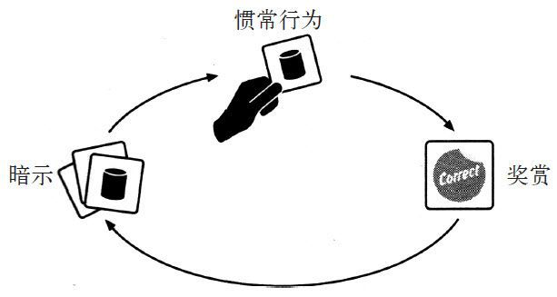

图1.6 尤金的习惯回路

实验表明，即便对涉及到的活动或物体的记忆连数秒钟都不到，尤金也有能力形成新的习惯。

斯奎尔在尤金身上做的实验在科学界掀起了一场革命，改变了大家对大脑工作原理的认识——人有可能在对所学的课程或者决策毫无记忆的情况下学会并做出无意识的选择。尤金让我们看到习惯与记忆以及逻辑一样，都是我们行为的基础。我们也许不记得自己的习惯是如何养成的，不过一旦这些习惯在大脑中形成，它们就会影响我们的行为，而我们自己往往是意识不到的。

我们通常无法识别这些慢慢发展的习惯回路，也看不到自己有可以控制它们的能力。但是通过学习观察暗示和奖赏，我们可以改变自己的惯常行为。

### 第二章 渴求的大脑 如何创造新习惯
#### “白速得”与全民刷牙的习惯
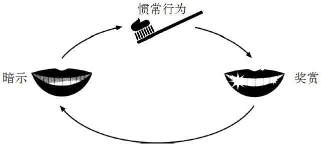

图2.1 霍普金斯对白速得习惯回路的构想

“‘白速得’为我赚了100万美元。”霍普金斯在该产品上架若干年之后写道。他说，其关键就在于他已经“了解到正确的人类心理”。这种心理的基础是两条基本规律：

1. 找出一种简单又明显的暗示。
2. 清楚地说明有哪些奖赏。

霍普金斯认为，如果你准确把握了这些要素，就会产生魔法般的效果。看看“白速得”吧。他发现了一种暗示——垢膜，以及一个奖赏——漂亮的牙齿，这使千百万人开始了每天的固定活动——刷牙。

事实表明，霍普金斯的两条规律是不够的。要创造一种习惯，还必须满足第三条规律。这条规律是如此微小，以至于霍普金斯本人在依赖这条规律的同时没有意识到它的存在。它为所有现象提供了解释：从为什么人如此难以对一盒甜甜圈视而不见，到晨跑为何变成几乎毫不费力的惯常行为。

#### “纺必适”的除异味策略
他们设计了两组电视广告。第一组表现的是一位女性在谈关于餐厅吸烟区的事情。每次她在那里用餐，外套都会沾上一股烟味。一个朋友告诉她，如果使用纺必适，她就能赶走烟味。其中暗示就是：烟味。奖赏是：清除衣服上的烟味。第二组描述了一位女性在为她那条经常坐到沙发上的狗“苏菲”烦恼。“苏菲闻起来总有一股它自己的味道”，她说，但是有了纺必适，“现在我的家具不再有‘苏菲’味了”。其中暗示就是：宠物气味。7000万拥有宠物的家庭都很熟悉这种气味。奖赏是：房子闻起来不再像个狗窝了。

纺必适滞销了。

同样的情况也发生在他们访问的其他有异味的家庭里。人们很少能察觉生活中的异味。如果你和9只猫生活在一起，那么你对它们身上的气味就会变得麻木。如果你吸烟，烟味会严重伤害你的嗅觉，你以后会闻不到烟味。

斯廷森弄清楚了很少有人购买纺必适的原因：产品身上的暗示（也就是促使人们日常使用产品的因素）无法被最需要它的人察觉。这些人偏偏经常闻不到异味，也就没法形成使用习惯。于是，纺必适被束之高阁。

#### 满足潜意识的成就感
胡里奥很喜欢喝黑莓汁。

开始时，胡里奥对屏幕显示的变化表现得兴致不高，多数时间都在尝试爬出椅子。但它喝到黑莓汁几次后，就对屏幕显示高度注意起来。随着多次重复，它开始明白屏幕上的图案是某种惯常动作（拉动拉杆）的暗示，而做了这个动作以后就可以获得奖赏（黑莓汁），于是开始像激光光束一样聚精会神地盯着屏幕，一动不动。黄色螺旋出现时，它伸手拉动拉杆；蓝色线条闪现时，它又去拉动拉杆。当黑莓汁滴下来时，胡里奥就心满意足地舔着嘴唇。

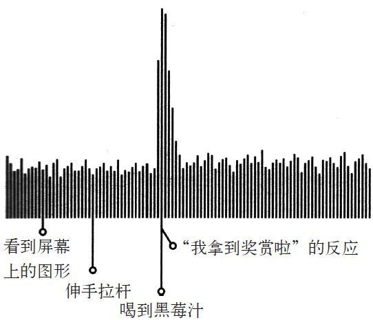

图2.2 胡里奥在喝到黑莓汁时大脑对奖赏的反应

当舒尔茨观察胡里奥大脑活动时，他发现它脑内形成了一个模式。每当胡里奥得到奖赏时，它脑内活动就会出现一个尖峰脉冲，显示它正感到快乐。一份神经活动的文字记录表明，这个模式其实就像猴子的大脑在欢呼：我拿到奖赏啦！舒尔茨让胡里奥反复进行同样的实验，记录下每次的神经反应。每当胡里奥喝到黑莓汁时，这个“我拿到奖赏啦”的模式就会在与植入猴脑的探测器相连的电脑上出现。久而久之，胡里奥的行为从神经学角度来说就形成了一种习惯。

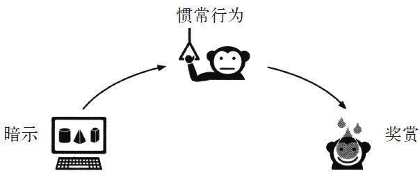

图2.3 胡里奥的习惯回路

当猴子对这行为越来越熟练，习惯更根深蒂固时，胡里奥的大脑就开始预期黑莓汁的出现。只要它看到屏幕上的图案，还没等尝到黑莓汁，探测器就已探测到“我拿到奖赏啦”的模式。

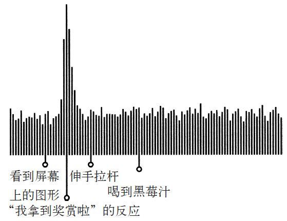

图2.4 胡里奥在喝到黑莓汁前大脑内发生的奖赏反应

当黑莓汁没有出现，或者晚出现，或者被稀释时，胡里奥就会生气，发出愤怒的声音，或者变得没精打采。舒尔茨在胡里奥的大脑内发现了一种新模式：渴求。每次胡里奥预期会出现黑莓汁，但却没有喝到时，它的大脑里就会突然出现一种与欲望和失望有关的神经模式。他看到暗示，就会开始兴高采烈地预期黑莓汁。但是如果黑莓汁没出现，这种欢欣就会变成渴求，要是得不到满足，胡里奥就会变得生气或沮丧。

这解释了为什么习惯如此强大：它们能够创造出神经渴求。在大部分时间里，这些渴求是逐渐产生的，而我们确实没有意识到它们的存在，所以往往看不到它们的影响。

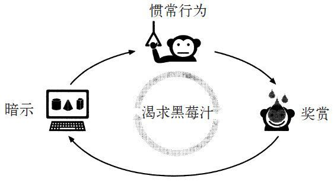

图2.8 胡里奥的习惯回路

**习惯是这样产生的：把暗示、惯常行为和奖赏拼在一起，然后培养一种渴求来驱动这一回路**。吸烟就是这样。烟民看到暗示，比如一包万宝路，那么烟民的大脑就会开始预期尼古丁的味道。

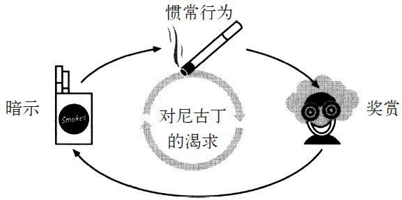

图2.9 烟民对尼古丁的渴求

如果你想在每天早上起来晨跑，那你就得选择一个简单的暗示（比如吃早餐前绑好跑鞋的鞋带或者把运动衣放在床边）和一个清晰的奖赏（作为一天之中的奖励，可以通过记录你的运动英里数来获得成就感，或者在跑步中产生大量的内啡肽）。**但是众多研究表明，暗示加上奖赏本身并不足以让新习惯长期持续。只有你的大脑开始预期奖赏，渴求内啡肽的分泌或成就感时，你才会自觉地在每天早上绑好跑鞋鞋带。而暗示除了能够触发惯常行为，还必须能够触发人对即将到来的奖赏的渴求。**

#### 渴求驱动习惯
“他们每一个人在打扫完之后都在做放松或开心的事，我们可以以此为基础！如果把纺必适塑造成在打扫卫生这种常规活动结束后要使用的东西，而不是在打扫卫生开始时使用的东西，会怎么样？如果把使用它变成打扫卫生中有趣的那部分会怎么样？”

每一种改变都针对一种特定的日常暗示，有清洁房间、铺床、用吸尘器清洁地毯。在每一个场景中，纺必适都被设定为奖赏：产品的香味在清洁这一常规活动结束时出现。更重要的是，每一个广告都经过精心设计，要勾出一种渴求感，要让所有的东西在打扫卫生的常规活动结束时，都能在看上去光洁亮丽的同时有好味道。本来设计用来去除异味的产品，现在变成了增添味道的东西——这种产品不是用来去除脏衣物的所有味道，而是一种在所有东西都已经打扫干净之后，收尾时使用的空气清新剂。

斯廷森告诉我说：“之前那位有臭鼬问题的公园管理员误导了我们，她让我们以为只要能证明纺必适可以解决异味的问题，它就会热卖。但是谁会承认自己家里臭烘烘的？

“我们的角度完全错了。没有人会在乎是否能完全除掉味道。从另一方面来看，很多人在花了30分钟打扫卫生后,都会渴求出现好闻的味道。”

因为霍普金斯成功背后的驱动因素与让猴子胡里奥去拉拉杆，让家庭主妇在刚铺好的床上喷纺必适的因素相同——白速得牙膏**创造了一种渴求感**。

在白速得牙膏雄霸市场之后，与之竞争的公司的研究人员立刻匆匆忙忙地寻找其中的原因。他们发现顾客说如果不记得用白速得牙膏，他们就觉得自己做错了事，因为他们嘴里没有那种凉丝丝的刺激感。他们预期、渴求这种微小的刺激感。如果没有这种感觉，他们就觉得口腔不干净。

**克劳德·霍普金斯并不是把美丽的牙齿作为卖点，而是把那种刺激感当成了卖点。一旦大家都渴求那种凉丝丝的刺激感，一旦他们将这种感觉等同于刷干净，那么刷牙就变成了一种习惯。**

品牌经理辛克莱尔说：“**泡沫是一种巨大的奖赏**，洗澡用的香波没有泡沫，但是我们加入了起泡的化学物质，因为大家每次都预期自己在洗头发时会有泡沫。洗衣剂也是同样的道理，还有牙膏，现在所有的公司都在牙膏里加入了月桂醇聚醚硫酸酯钠，目的就是增加牙膏的泡泡。**这东西不会让牙齿更干净，但是使用的人在嘴四周出现一堆泡沫时会有更好的感觉。一旦顾客开始预期牙膏会出现泡沫，习惯就形成了。**”

**是渴求在驱动着习惯。找到触发渴求的方式让创造新习惯变得更容易。现在是这样，100年之前也是如此。每天晚上，数百万人在刷牙，就是为了获得那种刺激感。每天早上，数百万人穿上跑鞋，就是想获得他们渴求的大量内啡肽。等他们回到家，打扫了厨房或卧室后，有些人又会喷点儿纺必适来满足自己对那种气味的渴求。**

### 第三章 习惯改变的黄金法则 为什么习惯会发生变化
#### 海盗队：不是创造新习惯，而是改变球员的旧习惯
所以邓吉不是要创造新习惯，而是要改变球员的旧习惯。而改变旧习惯的秘密是利用球员脑子里已经存在的习惯。习惯是一种分为三个步骤的回路，由暗示、惯常行为和奖赏组成，邓吉想做的只是调整中间那个步骤，即惯常行为。根据经验，他知道如果新行为模式的开头和结尾存在一个人熟悉的东西，那么就更容易说服这个人接受新的行为模式。

**要改变习惯，你必须留住旧习惯回路中的暗示，提供旧习惯回路中的奖赏，但要插入一个新的惯常行为。**

    习惯改变的黄金法则
    你无法根除坏习惯，你只能改变它
    原理：用同样的暗示，提供同样的奖赏，改变中间的惯常行为

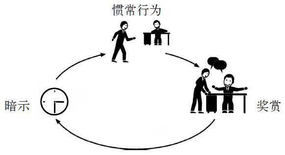

图3.1

#### 匿名戒酒社：是习惯还是成瘾？
研究人员说匿名戒酒互助社的方法之所以有效，是因为它强迫参与者识别能鼓励他们酗酒习惯的暗示和奖赏，然后帮助他们发现新的行为。克劳德·霍普金斯在营销白速得牙膏时，找到了一种可以触发新渴求感的新习惯。但是要改变旧习惯，你必须处理掉旧的渴求感——要保留以前同样的暗示和奖赏，并通过插入新的惯常行为来满足这种渴求。

“要实现那12步，按照他们规定的方法显然是不行的，你必须得为他们所有的酗酒欲望挨个创造暗示，当你做了这样一份自我清单，你就会看到所有导致你喝酒的因素。而且，向别人承认你的所有错误，这是个好办法，能让你明白成瘾症状失控时都会发生什么。”

接着，匿名戒酒互助社让酗酒者找出他们从酒中得到了什么奖赏。这个项目要找的是哪些渴求感在驱使着你的习惯回路。通常来说，喝醉本身并不属于渴求。酗酒者之所以想喝酒，是因为酒让他们能逃避现实，放松心情，又有人陪伴，而且缓解焦虑，情感也得到释放。或许他们想喝杯鸡尾酒来忘记烦心事，但并不一定想“买醉”。酒精的物理作用往往是嗜酒成瘾这个习惯回路中最次要的奖赏之一。

“匿名戒酒互助社迫使你去建立一种新的惯常行为，让你每天晚上有事可干，而不是酗酒。”托尼甘说，“你可以在聚会时放松自己，谈论你的焦虑。事件的诱因和回报还是一样，只是行为改变了。”

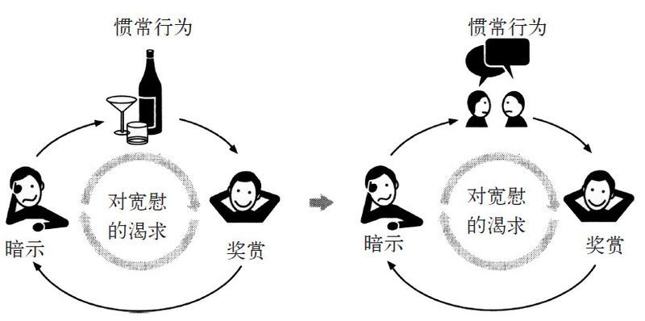

图3.2 留住暗示，提供同样的奖赏，插入新的惯常行为

这个研究和改变习惯的黄金法则是密切相关的：即使手术改变了酗酒者的大脑，也还是不够的。旧的暗示和对奖赏的渴求仍在那里，随时准备反击。只有当酗酒者养成了利用以前的暗示和让他们感到熟悉进而有宽慰感的新的惯常行为时，他们才能永久戒酒。

“我会觉得手指有点儿不自在，”曼蒂说，“指甲根部这里有点痛。有时我会用拇指摸其他指头，当我摸到皮肤的倒刺时，就会伸到嘴里。然后我就一个接一个，去咬所有指头粗糙的边缘。一旦我开始咬，就觉得必须把所有粗糙的地方都咬掉。”这种让病人描述引发他们习惯性行为的暗示的做法，叫做**意识训练**，正如匿名戒酒互助社坚持让酗酒者找出酗酒的暗示，这是相反习惯训练的第一步。曼蒂觉得指甲不舒服，这正是让她咬指甲的暗示。

这次，医师让曼蒂描述咬指甲的原因。开始时，她想不出原因。然而，当他们聊下去时，就发现她咬指甲是因为无聊。医师将她**置于一些典型的情境中**，比如说看电视或者做作业，她就会开始咬指甲。她说，当她咬完所有的指甲时，就会感到一种强烈的充实感。这就是这个习惯的奖赏：她渴望得到实质的刺激。

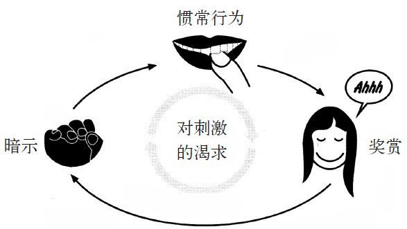

图3.3 曼蒂的习惯回路

在第一次治疗结束时，医师让曼蒂回家做一件事：随身带一张索引卡，每当感到习惯的暗示，即指尖的紧张感出现的时候，就在卡片上打个钩。一周后，曼蒂带回来的卡上打了28个钩。那个时候，**她已经清楚地意识到，做记号的意识已经超越了她咬指甲的习惯。** 她知道了自己上课或者看电视时咬指甲的次数。

然后医师教给曼蒂一种“竞争反应”的方法。他告诉曼蒂，每当她感到指尖不自在时，就立即将手插进口袋里或腿下，或者抓起一支铅笔或其他任何东西，使得自己没法将手指伸进嘴里。然后，曼蒂要找一些能迅速获得实质性刺激的事情来做，比如说摩擦手臂，或在桌子上敲指关节，只要能迅速产生实质性反应的事都行。

事情的暗示和奖赏还是一样。只是惯常行为改变了。

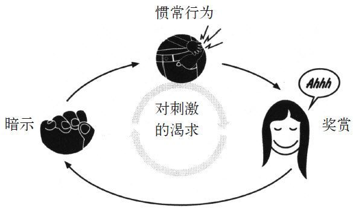

蒂的新习惯回路

他们在医疗室里练习了大概半小时，回家前医师又给了她一项新任务：继续使用索引卡，当觉得指尖不自在时，在上面打个钩，当成功克制住咬指甲的习惯时，就画一个斜杠。

一周后，曼蒂只咬了3次指甲，打了7个钩。因此她做了一次指甲护理来奖励自己，并坚持使用索引卡。一个月以后，咬指甲的习惯没再发生，针对咬指甲做出的竞争性惯常行为变成了自发行为。在这里，一个习惯代替了另一个习惯。

“这看上去简单得不可思议，而一旦你意识到你习惯的运作方式，一旦你认清习惯的暗示和回报，那么改变习惯就成功了一半。”相反习惯训练的发明者之一南森·阿兹林告诉我：“改变习惯看起来似乎应该更复杂，但事实上，大脑是可以接受重新编排的。你需要做的仅仅是**刻意为之**。”

例如，你想戒掉工作时吃东西的习惯，那你就要想想，奖赏是消除饥饿感，还是让自己不再觉得无聊。如果你只是想放松一下，那你能轻易找到替代的惯常行为，比如说快步走，或上网浏览3分钟，这能提供同等的休息机会，而不会让你变胖。

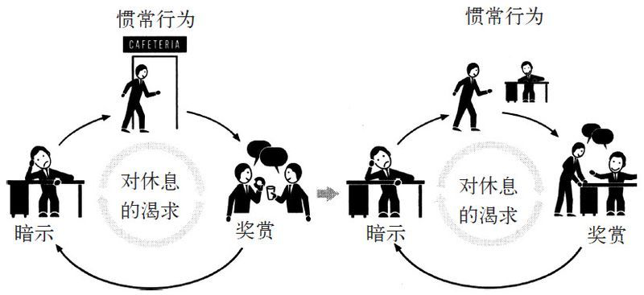

图3.5

如果你想戒烟，就问问自己：吸烟是因为喜欢尼古丁，因为能获得强烈的刺激，还是因为它是你日常生活固定的一部分，是社交方式的一种？一些研究表明，如果你吸烟是想获得刺激，那午后摄入一些咖啡因，能提高你戒烟成功的概率。超过1/3对已经戒烟者的研究发现，找出他们与香烟相关联的暗示和奖赏，然后选择具有相同回报的惯常行为来替代，更可能让他们成功戒烟。比如说吃一片尼古清、做几组快速的俯卧撑，甚至仅仅是花几分钟伸展放松一下，都能达到这个效果。

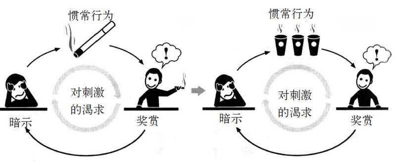

图3.6

#### 习惯不能被消除，只能被替代
匿名戒酒互助社单靠重塑参与者的习惯就取得成功的理论，在大约10年前开始出现漏洞，而导致漏洞的原因就是约翰这样的酗酒者的案例。研究人员发现，这种习惯替代对于多数人有效，但当生活的压力太大的时候，他们就会旧瘾复发。比如说发现母亲患上癌症，或婚姻破裂时，就会出现复发的情况。

他们发现了一种模式。数据表明，运用习惯替代方法的酗酒者能保持戒酒，但当一件压力大的事件发生时，不管他们养成了多少新的惯常行为，一些人还是又开始饮酒。

另一些酗酒者，他们像布鲁林克区的约翰一样，相信某种更高层次的力量融入了他们的生活。这些人更可能熬过压力大的时期，保持戒酒的习惯。

研究人员发现，起作用的并不是上帝，而是信仰本身。一旦人们学会信仰某种东西，这种信仰就会扩展到生活的其他方面，直到他们开始相信自己能改变。**信仰是将改造过的习惯回路变成永久性行为的要素。**

“队伍想要坚持信仰，但当比赛真正紧张起来时，他们心理上就会回到自己觉得舒适的状态，重拾旧习。”

大多数彻底改变了自己生活的人，并没有遇到意义重大的事件或致命的灾难，而仅仅是因为加入了团体，这个团体让他们相信改变是可能的，有时这个团体即使只有两个人，也会有同样的效果。

人们对信仰的具体运作机理仍然所知甚少。没有人能确定，为什么一群在心理课程班偶遇的人能让那位女士相信所有的事都变得截然不同，或者为什么邓吉的球队在他儿子过世后团结起来。现实里，也有很多人对朋友抱怨婚姻不幸福，却没有离婚；很多球队看着他们的教练遭遇悲剧，却照旧是一盘散沙。

但我们的确知道，**为了永久改变习惯，人们必须相信改变是可能的**。同样的过程也让匿名戒酒互助社的治疗屡屡获得成功，它利用团体的力量教人们学会去信仰，将人们聚集起来互帮互助，协助对方进行改变。因此，当处于团体之中时，信仰更容易建立。

习惯是怎么改变的呢？

可惜，并没有一套对每个人都有效的方法。我们知道，习惯是不能被消除的，而只能被代替。当使用改变习惯的黄金法则时，习惯最具可塑性：如果我们保持一样的暗示和奖赏，就能植入一种新的惯常行为。但这还不够，为了保持这个习惯，人们还得相信改变是可能的。而大多数时候，只有在团体的助力下，才能形成信仰。

## 第二部分 成功的组织机构习惯
### 第四章 核心习惯 最重要的习惯
#### 什么是核心习惯？
核心习惯说明成功并不需要做对每一件事情，而是要辨别出一些重要的优先因素，并将其变成有力的杠杆。书中的第一章节介绍了习惯的运作方式，以及它们的形成和改变过程。然而，善用习惯要从哪里着手呢？问题的答案在于了解核心习惯：最重要的习惯是那些自身变化后，会驱动和重塑其他行为模式的习惯。

核心习惯解释了迈克尔·菲尔普斯成为奥运冠军，以及一些大学生比同龄人更优秀的原因。它们解释了为什么一些人减肥多年没有成效，却在自己的工作效率提高，同时又准时下班回家和孩子共聚晚餐的情况下突然减了40磅。这些核心习惯也使美铝成为道琼斯指数中表现最佳的股票之一，使公司成为全球最安全的工作场所之一。

奥尼尔从来没承诺过，他对工人安全问题的重视会增加美铝的利润。然而，当他制定的新惯例在公司实行后，产品成本降下来了，质量也上去了，产量也出现了激增。如果熔融金属飞溅伤人，那他们就重新设计能减少受伤事故的浇注系统。而金属飞溅减少，也意味着浇注时金属材料浪费的减少。如果一台机器总是出现故障，他们就换一台，这也就减少了坏的传动装置绞断员工手臂的风险。而这也让产品质量得到了提高，因为美铝发现，机器故障是产生次品铝的重要原因。

研究人员发现，除了工业生产，在个人生活等很多方面都有类似的情况。

举个例子来说，过去10年有研究人员调查运动对日常行为的影响。当人们开始养成运动的习惯时，即使是一周一次的运动，他们也会不知不觉改变其他与之无关的行为模式。通常来说，做运动的人会吃得更香，工作更有效率。他们更少吸烟，对同事和家人更有耐心。而且更少使用信用卡，压力也更小。研究人员还没弄清楚这种变化的原因，但对于很多人来说，运动是引发广泛变化的核心习惯。美国罗德岛大学的研究人员詹姆斯·普罗查斯卡说：“运动有很大影响，它包含某些让其他好习惯更易形成的因素。”

研究记录表明，经常一起吃饭的家庭的孩子，更擅长做功课，学业成绩和情绪控制力更好，更有自信心。每天早上整理床铺，与更高的工作效率、更强的幸福感以及控制预算能力有关。事实上，并不是家庭一起用餐或者整齐的床铺带来好成绩或理智的开支，而是这些基本的变化会引起连锁反应，带动其他好习惯形成。

如果你注重改变或培养核心习惯，就能引发广泛的变化。然而，核心习惯并不容易发现，你得先知道从哪里着眼。寻找核心习惯意味着找出某些特性。核心习惯能为人提供学术文献中所称的“小成功”。它们通过建设新的结构以利于其他习惯的形成，并在变化扩散之处建立起某些文化。而奥尼尔和其他人一样，发现理解这些原则和运用它们不是一回事，这需要一点智慧。

#### 首先找到“小成功”
鲍曼能教给菲尔普斯的是，让他成为泳池里精神方面最强选手的习惯，正是这点让菲尔普斯从众多竞争者中脱颖而出。他不需要控制菲尔普斯生活的每一方面，他只需要着重于一些和游泳毫无关系，但和塑造正确思维有关的因素。他设计了一系列动作，帮助菲尔普斯在每场比赛前保持平静集中，找出在这种以毫秒取胜的竞技运动中能起到决定性作用的细微优势。

例如，在菲尔普斯十几岁的时候，每次练习完，鲍曼都会让他回家后“看录像带”——在入睡前看，在醒来时又看。其实这录影带并不是真正的录影带，而是对于完美比赛的脑内想象。于是每晚入睡前和每天早上醒来时，菲尔普斯都会想象自己跳进泳池后完美泳姿的慢动作。他会想象自己在水中划臂，触到池壁后，转身以及最后冲线。他会想象身后的水痕，嘴巴划过水面后从嘴唇滴落的水珠，强到似乎要扯走他泳帽的水的力量。他就这样躺在床上，闭上眼睛，“看”完整个比赛，一遍遍地看最小的细节，直到他用心记住每一秒。

在训练中，当鲍曼让菲尔普斯以比赛的速度游的时候，鲍曼就会喊：“让自己和录像带里一样！”然后菲尔普斯就会尽自己最大的能力逼自己前进。当他在水中穿行时，录像带就像慢放一样，他已在头脑里将这一切重复了成千上万遍，就像死记硬背，但这样做收到了效果。他游得越来越快，最后只要鲍曼在赛前喊一声“把录像带准备好”，他就会冷静下来，在比赛中取胜。

一旦鲍曼在菲尔普斯生活中建立起一些核心的惯常行为，其他的所有习惯，比如饮食和训练时间表、准备运动和睡眠习惯等，都会自动各自就位。而这些习惯如此有效，能成为核心习惯的核心原因就是学术文献中所称的 **“小成功”**。

“小成功其实是细微优势的稳定运用，一旦一个小成功完成了，就会推动下一个小成功的出现。”小成功能够带来改造性的变化，因为它能够将细微的优势转变为一种模式，让人们相信更大的胜利即将到来。

#### 建立能融入新价值观的文化
奥尼尔处理婴儿死亡率的经历，表明了核心习惯带动改变的第二条路径：**打造能促成其他习惯蓬勃发展的架构。** 在婴儿死亡率案例里，改革老师的大学课程，会引起一系列的连锁反应，最终影响到偏远地区女孩所受的教育，以及她们怀孕时是否营养充足。而奥尼尔驱使官员们继续调查直到他们找到问题根源的习惯，也极大地改变了政府对与婴儿死亡率相似的其他问题的思考方式。

美国的各个公司和组织开始采纳利用核心习惯去重整工作环境的方法。比如，在IBM，郭士纳将精力集中在公司的研究和销售方法这个核心习惯上，对公司进行了重整。在麦肯锡咨询公司，管理人员通过将内部全方位的批评作为每项工作核心的核心习惯，创造了公司不断进取的文化。而高盛投资公司利用风险评测的核心习惯来强化各项决策。

### 第五章 星巴克和成功的习惯 让意志力变成自发意识
#### 意志力甚于好奇心
星巴克教育的核心紧紧围绕着一项重要的习惯，就是意志力。大量研究表明，意志力是引导个人走向成功最关键的阶梯。

#### 当自律成为企业习惯
星巴克发现的解决方法，就是将自律精神转化成一个企业的习惯。

#### 关键时刻与惯例
直观上来说，每位病人都采用了克劳德·霍普金斯出售白速得牙膏时的规则。他们都辨识出了简单的暗示和明显的奖赏。例如，对那位与妻子在公共汽车站相会的病人来说，简单的暗示就是3点半了，老婆就在回家的路上！同时他也清晰地定义了奖赏：宝贝儿，我在这儿！在散步过程中，当半途而废的诱惑出现时，这位病人可以轻易地忽视它，因为自律已经形成了一种习惯。按理说，其他没有写下康复计划的病人没有理由不这样做。因为在医院，所有病人都接受了相同的训诫和警告，所有病人都知道体育锻炼对于康复的重要性，所有人都为康复治疗花了几周的时间。

而那些没有写出康复计划的病人则处于极大的劣势之中，因为**他们没有考虑到疼痛来袭时的应对措施。他们从没有刻意地规划过锻炼意志力的习惯。** 即便他们准备在街区散散步，其决心也会在刚迈出几步时，因遭遇到难以忍受的疼痛而土崩瓦解。

结果显示，有意志力缺陷的员工在完成工作时基本不存在什么困难。一般情况下，意志力较弱的员工的工作表现和其他员工没有什么差别。但有的时候，尤其是面对突如其来的压力或不确定性时，这些员工会骂骂咧咧，自我控制力也会瞬间瓦解。

这些员工真正需要的是一套行之有效的方案，能解决让他们半途而废的各种“诱惑”，这套方案应该类似于苏格兰病人用来记录行为的小册子：当意志力疲劳时应遵循的一套惯常行为。因此公司开发了新的培训材料，上面详细阐明了员工遭遇困扰时的惯常解决方法。手册中针对如尖叫的顾客或拥挤在收银台前的长队这样特定的暗示来为员工提供相应的指引。经理们开始用角色扮演训练员工，直到所有的应对行动都变成自发行为。公司同时也找来一些如顾客满怀感谢的表情或来自经理的赞扬认可这样的奖赏，作为员工工作出色的证明。星巴克通过培养员工形成意志力习惯回路，来帮助员工应对逆境。

针对各种让人备感压力、导致人放弃坚持的诱惑拐点，星巴克为员工准备了很多相应的惯常解决方案。例如针对客户投诉有3W（可以理解为倾听并解释）制度，当营业火爆时有“联系、发现、响应”制度。还有一些约定俗成的习惯，来帮助员工区分单纯需要咖啡的顾客（即语速很快，略显不耐烦，频繁看表的顾客）和需要更多体贴服务的顾客（即能够说出其他服务生姓名的、有固定偏好饮品的顾客）。整个培训手册中有数十页的空白，以供员工记录克服重压诱惑拐点的方案。然后员工们一遍又一遍地按照其实践，最终将意志力转化成自发意识。

这就是意志力转化成习惯的过程：在困境发生之前想好解决措施，然后在困境来临时依法处理。当苏格兰的病人们填好手册，或特拉维斯参透了拿铁方法之后，他们就学会了如何对像身体的疼痛或顾客的怒气这样的既定暗示做出正确的反应。当暗示出现时，就能有条不紊地执行惯常反应。

#### 自主支配的机会
为什么受到礼貌对待的学生具有更强的意志力呢？拉姆文在研究时发现，存在于两组参与者之间最关键的差异是他们在其中是否具有掌控感。“我们一次又一次地发现，”姆拉文向我解释说，“当被要求去做一些需要自我克制的事情时，如果参与者认为这是个选择或者因为可以帮助别人而让自己开心，那用到的意志力就会少很多。如果他们感到自己没有自主权，只是单纯地接受命令，他们意志力消耗的速度就会加快。”在这个例子中，学生都忽视了饼干，但当这些学生感觉自己被当成工具对待时，他们的意志力消耗得就会更快。

对于企业和组织来说，这个结论有巨大的意义。**仅仅赋予员工一种有所掌控、拥有真正决策权的感觉，就可以使员工将更多精力和心思投入到工作中。**

### 第六章 危机就是转机 领导者怎样通过事故创造新习惯
#### 合理的平衡点
缺乏组织习惯的企业无法顺利完成任何工作。惯例提供了公司在运营过程中应该遵守的成百上千条不成文的规定。

大多数情况下，惯例和“休战”的效果都不错。当然，在企业中，敌对情绪依然存在，但出于体制习惯，这种情绪会被控制在适当范围内，公司的业务也能蓬勃发展。

设计公司的惯例正是决定成功与否的关键：是否具有一套在批发商清空库存前获得意大利绒布的方法，是否有寻找最佳拉链和纽扣裁缝师的方法，是否具有在10日而不是3周内将货铺到店里的惯例。如果缺乏正确的运营程序，一个新企业可能会陷入物流停滞的困境，一旦这种情况出现，造成的损失会比创造力的缺失更加致命。时装界就是这样复杂。

那么哪些设计公司最后可能会形成正确的习惯呢？答案就是那些在适当的时机选择停止内耗，并与正确的伙伴结盟的企业。实现和平相处的时机十分重要，只有当企业的领导人与同行业的企业和平共处时，新的时尚品牌才会获得成功。

罗德岛医院最关键的问题是，护士往往是提出和解时做出妥协的一方。是护士们对病人的药物进行多次确认，花额外的时间认真填写病历；是护士们默默忍受着精疲力竭的医生们的辱骂；是护士们着手区分了好脾气和坏脾气的医生，其他人员才能够分辨出哪些医生能够在手术过程中接受建议，哪些医生会在你开口时大发雷霆。而医生们甚至懒得花时间去记住护士们的名字。“医生是老板，我们是跟班，”一位护士说道，“我们都是夹着尾巴求生存。”

罗德岛医院的和谐是一厢情愿的。因此在一些关键的时刻，如一位护士试图阻止医生草率开刀的时候，本来能够防止事故的惯例就会崩溃，86岁的患者头颅上出现了一个错位的创口。

有些人可能认为解决问题的办法是采取更公平的和解。如果医院在权责分配方面的工作更加到位，那么在医生和护士之间会出现一个更加合理的平衡点，双方也会被迫对彼此表示同等的尊重。

这是一个良好的开端，但还远远不够。并不是通过平衡权利就能创建一个成功的组织。组织要想正常运作，领导者必须在组织中培养出一种习惯，可以创造出真实与平衡的和平，有些矛盾的是，领导者还必须清楚地定下由谁负责。

#### 重新分配责任
我们首先要考虑伦敦地铁系统正常运转需要依靠的一些让人和平相处的规定：

- 票务人员的权责范围被限制于贩卖车票，因此，就算他们看到着火的纸团，也会为避免僭越之嫌保持沉默。车站的工作人员并没有接受过关于使用喷水灭火系统或灭火器的训练，因为这些设备是由其他部门负责的。
- 而伦敦消防队的火灾警告信被直接送到运营总监的手里，有关信息没有得到共享，因此车站安检员从来都没见过消防队的警告信。
- 而其他人员接到的指令是，尽量不要造成乘客的恐慌，因此不到万不得已的情况，不要擅自联系消防部门。
- 消防队则坚守着绝不使用其他机构安置的消防栓的命令，坚持使用自己的街道消防栓，而拒绝使用售票大厅的水管。

托尼·邓吉接手倒霉的海盗队时，保罗·奥尼尔担任麻烦重重的美铝CEO时，都发现并利用了同样的优势，而这就是答案。霍华德·舒尔茨在2007年回到萎靡不振的星巴克时，利用的也是同样的机会。所有这些领导者都抓住了源自危机的可能。**在变化动荡之中，组织习惯会变得极具可塑性，足以让人重新分配责任，创造出更加公平的权力均衡。** 危机是如此宝贵，实际上，有时候应该让人感觉灾难将至，而不是让其就此淡化。

#### 抓住危机，重塑组织习惯
优秀的领导者会抓住危机来重塑组织习惯。

事实上，对于英明的领导者来说，危机是一种可以延长危机感的宝贵的机会。

### 第七章 连锁销售商能预知消费者的行为 企业如何能预测操纵你的习惯
#### 如何预测哪些是怀孕的顾客？
研究人员随即发现，除了购物单上的商品之外，超过50%的购物决策都是在顾客看到货架上的商品时产生的。原因在于，除去消费者最优的购买意图，他们的消费习惯明显强于他们的书面意向。

安德里森的发现已经成为了现代市场营销理论的支柱：**当消费者遭遇到人生的重大事件时，他们的消费习惯更容易发生改变。**

#### 音乐行业：化生为熟
迈耶对我说：“有时候电台会通过致电一些听众来作研究，同时播放一首歌曲的一个片段，这时听众们会说，‘这首歌我都听了无数遍了，早就听烦了。’但事实上，当相同的歌声在电台响起时，你的潜意识会惊呼，‘我知道这首歌！我已经听了无数遍了！我还能跟着唱！’黏性歌曲就是那些你期望在电台中收听到的歌曲。你的大脑潜意识里想听这首歌，因为这首歌和其他你听过与喜欢的歌曲一样，让你觉得不仅很熟悉，而且还很喜欢，听上去就是对味儿。”

在听音乐的过程中，包括听觉皮层、丘脑、顶叶皮层在内的数个大脑区域的功能都被激活。这些区域与模式识别有关系，可以帮助大脑对输入的信息进行识别，以确定哪些信息值得关注，哪些信息应该忽略。

换句话说，对音乐进行处理的神经区域的结构，就是在寻找一种既定的模式和熟悉感。

这就是我们会对一些完全陌生的歌曲感觉“熟悉”，并百听不厌的原因了。我们的大脑更加偏爱似曾相识的听觉模式。

#### 用旧的习惯装扮新的内容
想要改变人们的饮食习惯，就必须让他们对这些“怪异”的食材习以为常。而为了达到这一目的，主妇们必须坚持每天对食材进行伪装。

科学家们得出结论：为了说服民众进食动物肝脏和肾脏，家庭主妇们必须寻找方法，让这些食材从外观到口味、再到气味都与家庭预期在餐桌上会出现的食材毫无二致。

饮食习惯委员会最终的结论是，改变美国民众饮食习惯的秘密，就蕴含在人对饮食的熟悉之中。很快，美国的家庭主妇们都接到了政府的信件，里边写着“每一位丈夫都喜欢牛排和腰子馅饼”。肉店也开始发放烹饪秘诀，解释了如何才能将动物肾脏做成美味的肉饼。

## 第三部分 社会的习惯
### 第八章 蒙哥马利公交车抵制事件 社会运动如何发生
#### 熟人社区与群体
而社会习惯会有如此大的影响，就在于许多运动的根源（比如大规模的革命，或者教会中的微小波动），即历史学家和社会学家所谓的三个过程，而这三个过程不断地循环往复：
- 运动的起因是友情或者亲密的熟人之间牢固的联系所形成的社会习惯。
- 运动的发展在于群体的习惯，以及社区与党派之间脆弱的联系。
- 而运动的持续在于运动领袖让参与者形成了新的习惯，树立了新的认同感和主人翁感。

#### 弱联系的力量
当社会学家研究人的看法如何在社群中传递，传言如何散播，或者政治性运动是怎样开始的时候，他们发现这一切都有一个共同点：弱联系的熟人拥有的影响力通常比好朋友大，或者两者不相上下。

弱联系的力量能解释朋友圈内的抗议如何扩大成更大规模的社会性运动。说服数量众多的人追求同样的目标是很难的，特别当这个目标确实难以达到时就更是如此——大至用走路上班代替搭车，小至因那家公司不支持有机种植而放弃在早上喝咖啡。多数人都不会义愤填膺到放弃搭公交或者不喝咖啡，除非他们的好朋友被羞辱或者被捕入狱。所以运动发起者们总将这个特点作为工具来发起抗议，即使一些人并不真的想加入进去，他们也会按照这个模式运作。这是劝说的一种形式，并且近百年来都屡试不爽。这就是社群或者邻里之间自发建立起来的义务感。换句话说，也就是同伴压力。

#### 灵性成长：习惯让精神丰满
这就是社会习惯驱动运动的第三个方面，即要想让一个理念扩展到社群之外，就必须让整个扩展过程能够自我推动。而实现这一点最靠谱的方法就是：要让人们养成可以帮助他们找到自我方向的新习惯。

运动并不是因为大家突然作了同样的决定而出现的。他们依靠的社会习惯模式一开始是作为友谊的习惯存在的，在社群习惯中成长，并由改变参与者自我感的新习惯维系。

### 附录 读者实践指南
理解框架：
- 找出惯常行为
- 用各种奖赏进行试验
- 将暗示隔离出来
- 制订计划

#### 第一步：找出惯常行为
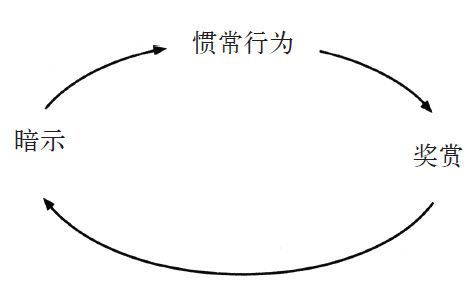

图1

要了解自己的习惯，你得找到回路的各个部分。一旦发现行为中存在的习惯回路，你就能想办法用新的惯常行为取代旧的坏习惯。

比如你有一个坏习惯，就像我为撰写本书做研究时的习惯一样，喜欢每天下午去咖啡厅买巧克力豆饼干。假设这个习惯让你胖了几磅，或者说这个习惯实际上让你胖了8磅，然后你妻子针对你的体重说了一些让你不爽的话。于是你总是强迫自己停止吃饼干，但徒劳无益，你觉得很累，你甚至还在电脑上贴了即时贴，写着再也不吃饼干了。但是每天下午你都会当这张即时贴不存在，照样晃悠着去咖啡厅，然后买饼干，接着在收银台附近与同事闲聊时就开始吃。吃的时候感觉很好，吃完就难受了。你跟自己发誓，说你明天会用全部的意志力来抵制饼干的诱惑，明天会是新的一天。

就是要弄清楚自己的习惯回路。第一步是找出自己的惯常行为。饼干的案例和大部分习惯一样，其中的惯常行为几乎是最明显的，是你想要改变的行为。你的惯常行为是下午从桌子旁起来，走到咖啡厅，买巧克力豆饼干，然后在和朋友聊天的时候吃，那么这就是你加入到习惯回路中的东西。

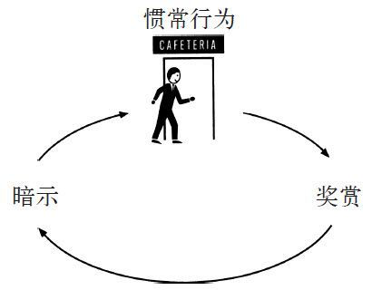

图2

接着，还有一些较为隐蔽的问题：这一惯常行为的暗示是什么？是饥饿吗？是无聊吗？是因为低血糖？还是说你在全身心投入到下一件工作前，需要休息下，而吃饼干就是休息的一种方式？

那么奖赏是什么？是饼干吗？还是换了环境？或者是暂时散散心？又或者是与同事聊天？也有可能通过突然摄入那么多糖获得了能量充沛的感觉?

要弄清楚究竟怎么回事，你需要做点儿实验。

#### 第二步：用奖赏做实验
奖赏的影响力很大，因为它们能满足人的渴求感。但人往往意识不到在背后驱动我们行为的渴求。

为了确定是哪些渴求在驱动习惯，就要用不同的奖赏做实验。这也许会花几天、一周或者更长的时间。在这段时间里，你在做出切实的改变时不应该感到任何压力，把自己想象成数据收集阶段的科学家就行。

在实验的第一天，你会非常想去咖啡厅买饼干，那么你得调整一下你的惯常行为，这样会得到不同的奖赏。比如，你没有去咖啡厅，而是在社区附近散步，然后回到办公桌前，什么也没吃。第二天，你去咖啡厅买了个甜甜圈，或者糖果条，然后回桌子那儿吃。第三天，你去了咖啡厅，买了个苹果，然后和朋友聊天时吃了。接着，你试着改成麦咖啡，然后你都不去咖啡厅了，而是到朋友的办公室闲聊几分钟，然后回去工作。

这下你应该懂了。你选择用什么行为取代买饼干并不重要，重要的是要测试各种假设，确定哪种渴求在驱动你的惯常行为。你是因为渴求饼干本身，还是想休息一下再工作？如果是饼干本身，那是因为你饿了吗？（如果是这样，苹果应该也可以满足你。）

或者是因为你需要饼干提供的能量？（如果是这样，咖啡应该可以满足你。）或者，你走去咖啡厅是因为你想找人闲聊，而饼干不过是个比较好的借口？（要是这样，走到别人办公桌前，和对方闲聊几分钟，应该能满足你的冲动。）

等你试了4~5个不同的奖赏后，你就可以用老办法寻找其中的规律：每次活动之后，拿支笔在纸上写下你一回到桌前就想到的头三样东西。可以是你的情绪或者思维，或者写下对自己感觉的想法，要么就写出头三个你想到的词。

图3

然后，在手表或电脑上设个15分钟后就响的闹钟。等到闹钟响了，你就问自己是否还有吃饼干的冲动。写下三样东西很重要，就算写下的词毫无意义，你也要写，原因有两个。其一，这样做会迫使你此刻意识到自己在想什么或者感觉如何。比如第三章中咬指甲的曼蒂，她就拿着一本写满了严厉措辞的笔记本，为的就是让她意识到自己习惯的冲动，所以写下三个词会让她临时注意到这一点。其二，研究表明，写几个单词有助于你今后回忆起自己当时在想什么。在实验结束时，如果你回顾自己的笔记，就能很容易记起自己当时的所思所想，在那一刻究竟是什么感觉。因为你写下的东西会帮助你进行全面的回忆。

那为什么闹钟设的时间是15分钟后呢？因为这些测试的重点是找出你渴求的奖赏是什么。如果吃掉甜甜圈15分钟后，你还是有冲动起身去咖啡厅，那驱动你习惯的就不是对糖的渴求。如果在和同事闲聊之后，你还是想吃饼干，那么与人接触的需求就不是你吃饼干行为的诱因。

从另一个角度看，如果和朋友聊天的15分钟后，你发现自己可以轻松地回去工作，那么你就找到了习惯回路中的奖赏，也就是临时散散心，和人聊聊天。这就是你的习惯想要满足的东西。

通过用不同的奖赏进行试验，你可以将你实际渴求的对象分隔出来，这就是重塑习惯最基本的要素。

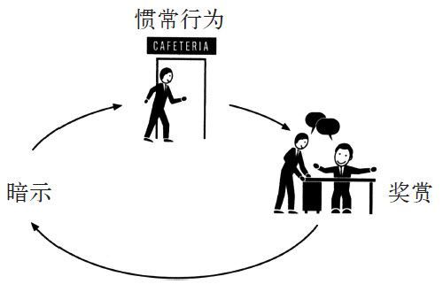

图4

一旦你找出惯常行为和奖赏，剩下要做的就是找到暗示了。

#### 第三步：分隔出暗示
之所以很难发现诱发人习惯的暗示，原因在于我们的行为包含了太多的信息量，远远超过了我们的处理能力。问问你自己，你每天早上定时吃早餐是因为你饿了吗？还是因为时钟显示已到7点半？或者因为你的孩子们已经开始吃早餐了？又或者因为你穿好了衣服，而这个动作完成后，吃早餐的习惯就出现了？

几乎所有的习惯性暗示都可以归为以下五大类中的一类：
- 地点
- 时间
- 情绪状态
- 其他人
- 之前紧挨着的动作

所以如果你想找到“去咖啡厅并买巧克力豆饼干”这个习惯的暗示，那请在这一冲动出现时写下5样东西（下面这些是我在分析自己的习惯时做的笔记）：

你在哪？（坐在我的办工桌前）

现在几点？（下午3点36分）

你的情绪怎样？（觉得无聊）

周围有谁？（空无一人）

在买饼干的冲动之前，你做了什么？（我回复了一封电子邮件）

第二天：

你在哪？（从复印机那儿往回走）

现在几点？（下午3点18分）

你的情绪怎样？（觉得开心）

周围有谁？（体育部的吉姆）

在买饼干的冲动之前，你做了什么？（我复印了一份东西）

第三天：

你在哪？（会议室）

现在几点？（下午3点41分）

你的情绪怎样？（累，对自己正在做的项目感到激动）

周围有谁？（其他来开会的编辑）

在买饼干的冲动之前，你做了什么？（我坐了下来，因为会议要开始了）

有这三天的记录，已经可以清楚地看到是什么暗示诱发了我买饼干的习惯，让我每天在固定的时间有吃零食的冲动。在第二步我就发现我有这个习惯并不是因为饿。我找寻的奖赏是暂时散散心，也就是通过与朋友闲聊得到消遣。我现在知道这一习惯诱发的时间是在下午3点到4点之间。

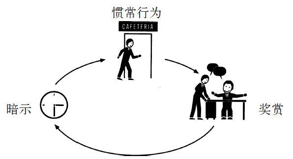

图5

#### 第四步：制订计划
一旦你发现了你的习惯回路，你就找到了驱动你行为的奖赏、诱发你习惯的暗示以及惯常行为本身，这样你就可以开始改变你的行为了。通过围绕暗示设计，选择能够满足你所渴求的奖赏的行为，你就可以改善你的习惯。你需要的是一个计划。在前言中，我们了解到习惯是一种在特定的时间，你会做出的选择，然后你便不会再去想，却会日复一日地重复它。

换句话说，习惯是大脑自动遵循的行为模式，也就是我看到暗示时，我会做出惯常行为，目的是要得到奖赏。为了调整这个模式，我们需要重新进行选择。许多研究表明，这样做最容易的方式是制订计划。在心理学里中，这些计划被称为“执行意图”。

比如，拿我在下午买饼干的习惯作为例子，通过这个框架，我发现我的暗示一般大约出现在下午的3点半。我知道我的惯常行为是去咖啡厅买饼干，同时还与朋友聊天。通过实验，我发现我渴求的并不是饼干本身，而是那一小段时间的悠闲以及与别人交往的机会。

于是我为自己制订了计划：
- 每天下午3点半，我会到朋友的办公室和他聊上10分钟。
- 为了确保我记得这样做，我在手表上设了下午3点半的闹钟。

这样做并没有立刻收到效果。我有时候太忙了，都忘记自己设了闹钟，然后旧瘾复发。其他时候好像是工作太多，要找个愿意跟你聊的朋友很难，而买饼干很简单，于是我又在冲动面前投降了。但在我按照自己的计划行事的日子里，每次闹钟一响，我就强迫自己走到朋友办公桌那和他聊上10分钟，我发现我每天工作结束时感觉更舒坦了。我没去咖啡厅，也没有吃饼干，而我依然感觉良好。最终，这变成了自发行为：每次闹钟一响，我就去找朋友，然后每天结束时，内心都有一种细微但是真实的成就感。几个星期以后，我不再去想自己的这种惯常行为了。等到我找不到人可以聊天时，我就去咖啡厅，和在那里的朋友们一起喝茶。

这一切都发生在6个月之前。我现在都不戴表了，因为丢了。但是，每天下午的3点半，我依然不知不觉地站起来，看看新闻编辑室里谁有时间可以和我闲谈，花10分钟时间聊聊新闻，然后回去工作。现在这一切都是在我不假思索的情况下发生的，这已经变成了一种习惯。

图6

显然，改变某些习惯很难，但是这个框架是一个好的开端。有时候改变习惯要花很长的时间，有时候会经历反复的实验与失败。不过，一旦你弄清楚了习惯背后的机理，也就是你能够分析出暗示、惯常行为和奖赏时，你就有了超越习惯的力量。

