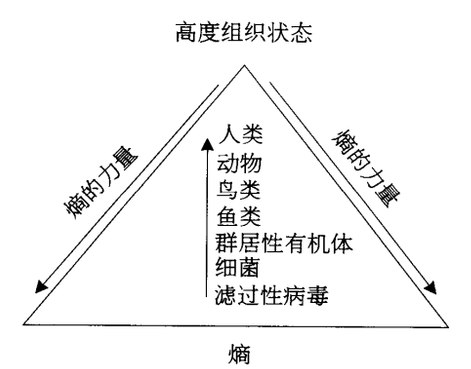
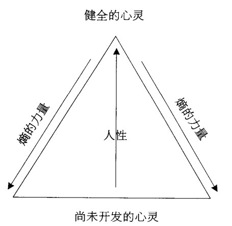

[豆瓣链接](https://book.douban.com/subject/1775691/)

    作者: [美] M·斯科特·派克 
    出版社: 吉林文史出版社
    副标题: 心智成熟的旅程
    原作名: The Road Less Traveled
    译者: 于海生 
    出版年: 2007-1
    页数: 231
    定价: 26.00元
    装帧: 平装
    丛书: 少有人走的路
    ISBN: 9787807023777

- [1 自律](#1-%e8%87%aa%e5%be%8b)
- [2 爱](#2-%e7%88%b1)
  - [2.1 爱的定义](#21-%e7%88%b1%e7%9a%84%e5%ae%9a%e4%b9%89)
  - [2.2 陷入情网](#22-%e9%99%b7%e5%85%a5%e6%83%85%e7%bd%91)
  - [2.3 浪漫爱情的神话](#23-%e6%b5%aa%e6%bc%ab%e7%88%b1%e6%83%85%e7%9a%84%e7%a5%9e%e8%af%9d)
  - [2.4 自我界限](#24-%e8%87%aa%e6%88%91%e7%95%8c%e9%99%90)
  - [2.5 依赖性](#25-%e4%be%9d%e8%b5%96%e6%80%a7)
  - [2.6 真正的爱、爱的感觉与精神贯注](#26-%e7%9c%9f%e6%ad%a3%e7%9a%84%e7%88%b1%e7%88%b1%e7%9a%84%e6%84%9f%e8%a7%89%e4%b8%8e%e7%b2%be%e7%a5%9e%e8%b4%af%e6%b3%a8)
  - [2.7 爱与勇气](#27-%e7%88%b1%e4%b8%8e%e5%8b%87%e6%b0%94)
  - [2.8 爱与关注](#28-%e7%88%b1%e4%b8%8e%e5%85%b3%e6%b3%a8)
  - [2.9 冲突的风险](#29-%e5%86%b2%e7%aa%81%e7%9a%84%e9%a3%8e%e9%99%a9)
  - [2.10 爱的自律](#210-%e7%88%b1%e7%9a%84%e8%87%aa%e5%be%8b)
- [3 熵、原罪与上帝](#3-%e7%86%b5%e5%8e%9f%e7%bd%aa%e4%b8%8e%e4%b8%8a%e5%b8%9d)

## 1 自律
人生苦难重重。一旦想通了它，就能实现人生的超越。人生是一个面对问题并解决问题的过程。人生的问题和痛苦具有非凡的价值。

**自律**，是解决人生问题的首要工具，也是消除人生痛苦的重要手段。通过自律，我们就知道在面对问题时，如何以坚毅、果敢的态度，从学习与成长中获得益处。简单地说，所谓自律，是以积极而主动的态度，去解决人生痛苦的重要原则，主要包括四个方面：推迟满足感、承担责任、尊重事实、保持平衡。

**推迟满足感**，意味着不贪图暂时的安逸，重新设置人生快乐与痛苦的次序：首先，面对问题并感受痛苦；然后，解决问题并享受更大的快乐，这是惟一可行的生活方式。直面问题会使人感觉痛苦。问题通常不可能自行消失，若不解决，就会永远存在，阻碍心智的成熟。我们都有这样的体验：问题降临，必将带来程度不同的痛苦体验。尽可能早地面对它们，意味着推迟满足感，放弃暂时的安逸和程度较轻的痛苦，体验程度较大的痛苦，如此才会得到回报。现在承受痛苦，将来就可得到更大的满足感；而不谋求解决问题，将来的痛苦会更大，延续的时间也更长。

“他们都面临一个共同的问题———感觉自己不能够‘对付’或者改变现状，因此产生恐惧、无助感和自我怀疑。”大多数病人力不从心的根源，在于他们总想逃避自由，不能够为他们的问题、他们的生活承担责任。他们感到乏力，在于他们放弃了自己的力量。如果得到治疗，他们就会知道，作为成年人，整个一生都充满选择和决定的机会。他们接受这一事实，就会变成自由的人；无法接受这种事实，永远都会感到自己是个牺牲品。

**尊重事实**，意味着如实看待现实，杜绝虚假，因为虚假与事实完全对立。我们越是了解事实，处理问题就越是得心应手；对现实了解得越少，思维就越是混乱。虚假、错觉和幻觉，只能让我们不知所措。

人生苦短，我们只想一帆风顺。我们由儿童成长为青年人、中年人乃至老年人，付出不懈的努力，才成就了人生观、世界观的地图，似乎各方面都完美无缺。一旦新的资讯与过去的观念发生冲突，需要对地图大幅度修正，我们就会感到恐惧，宁可对新的资讯视而不见。我们的态度也变得相当奇特-不只是被动抗拒新的资讯，甚至指责新的资讯混淆是非，说它们是异端邪说，是来自邪恶势力。我们想控制周围的一切，使之完全符合我们的地图。我们花费大量时间和精力(远比修订地图本身多得多)，去捍卫过时而陈腐的观念，却不去考虑如何更新旧的地图，这是多么可悲的事情啊！

逃避现实的痛苦和不幸，是人类的天性，只有通过自律，才能逐渐克服现实的痛苦。我们必须尊重事实，尽管这会带来痛苦，但远比我们的个人利益和暂时的舒适更为重要。我们必须淡化暂时的不适之感，应该追求真理而不是幻象，并愿意承受所有的痛苦。

为了减少痛苦，我们需要学习一种极为重要的保持平衡的心理技巧，我称之为“兼容并包”。这是促进心智成熟不可或缺的工具。兼容并包，意味着既要肯定自我，以保持稳定，又要放弃自我，以腾出空间，接纳新的想法和观念，实现自我平衡。

最好的决策者，愿意承受其决定所带来的痛苦，却毫不影响其做出决策的能力。一个人是否杰出和伟大，视其承受痛苦的能力而定，杰出和伟大本身，也会给人带来快乐和幸福。

## 2 爱
### 2.1 爱的定义
**自律的原动力——爱。**

爱的定义是：爱，是为了促进自我和他人心智成熟，而具有的一种自我完善的意愿。

首先，**爱与不爱最显著的区别之一，在与当事人的意识思维和潜意识的目标是否一致。** 如果不一致，就不是真正的爱。其次，爱是长期的和渐进的过程。爱是自我完善，意味着心智不断成熟。爱，能够帮助他人进步，也会使自我更加成熟。第三，真正意义上的爱，既是爱自己，也是爱他人。爱，可以使自我和他人感觉到进步。不爱自己的人，绝不可能去爱他人。第四，爱是自我完善，也是帮助他人完善。它意味着持续努力，超越自我界限。爱，不能停留在口头上，而要付诸行动。

### 2.2 陷入情网
坠入情网，通常涉及与性有关的欲望。只有意识和潜意识的性冲动，才会使我们陷入情网。陷入情网的“爱”不会持续太久。

关于“自我界限”

在新生婴儿的感觉里，在一切移动和固定的事物之间，在他和周围的人群之间，在单个个体和整个世界之间，没有任何界限和差别。随着婴儿慢慢成长，认识和经验不断增加，于是发现他和世界不是一回事，在这种情况下，婴儿的“自我”产生，自我意识开始出现。

当婴儿意识到他的愿望是他自己的，而不是周围世界的愿望，他就开始在自己和世界之间做出区分。他想活动的时候，他的胳膊甚至先于眼睛活动，可是童床和天花板却没有活动，于是婴儿知道，他的胳膊和他的愿望紧密相连，因此胳膊是他的“财产”，而不是别的东西，更不是别人的胳膊。

孩子到了两三岁左右，更能认识到能力有限。在此之前，尽管他知道，他无法让母亲完全按照自己的愿望行事，但他仍然会把自己的愿望和想法，同母亲的行动混为一谈。两三岁大的孩子，往往是家里的“小皇帝”，事不顺心，就会大发雷霆，甚至闹得天翻地覆。到了三岁，孩子的态度有所收敛，对自己能力的局限性有了更深刻的认识，但脑海里还是幻想如何随心所欲。这样的心态只有再过几年，当他经受到更多打击以后，才能够逐渐消失。

进入青春期的少年，他们更为真切地感受到，自己的肉体和能力有着多么大的局限性！他们也隐约意识到，所有的个体都要联合起来，惟有彼此合作，才能更好地生存。他们渴望突破自身局限，却要受到自我界限的限制，这通常使他们产生无助的痛苦。

永远活在“自我界限”中，只会给人带来孤寂。大部分人渴望摆脱寂寞，冲出自我界限的牢笼。坠入情网，似乎能够使之实现“逃亡”，摆脱孤独和寂寞；**坠入情网，意味着自我界限的某一部分突然崩溃，使我们的“自我”与他人的“自我”合而为一。** 与心爱的人结合在一起，跟童年时与父母相伴的记忆彼此呼应，仿佛体验到幼年时无所不能的快感，我们又感觉到强大有力，似乎没有什么能阻止我们实现愿望。但我们没有意识到，这样的感觉是虚幻的，常常与现实脱节。这种感觉就和一个两岁大的幼儿，自认为能称霸世界一样不可理喻。

坠入情网不是真正的爱，不过是一种幻觉而已。情侣只有脱离情网，才能够真正相爱。坠入情网，只能使自我界限的某一部分，发生暂时性的崩溃。坠入情网，惟一的好处就是消除寂寞。**坠入情网其本质是，它与人的“里比多”（性的需求和原动力）有关，或与受基因支配的生物交配本能有关。**

### 2.3 浪漫爱情的神话
坠入情网，可以造成“爱是永恒的”这一幻觉，浪漫的爱情神话使我们相信，世界上每个青年男子，都有属于他的惟一恋人。每一个青年女子同样如此。既然我们的相遇是天作之合，就永远都能满足对方的需求，永远幸福地生活在一起。如果和伴侣有了摩擦和冲突，如果曾经的激情慢慢消失，那么必然错在我们当初的选择———我们可能违背了上天旨意，错过了最适合我们的人。浪漫的爱情神话，从实质上说，它们是一种可怕的谎言。

### 2.4 自我界限
真正的爱，是自我完善的特殊体验，跟自我界限有着密切关联。陶醉在爱的情感里，我们感觉灵魂无限延伸，奔向心爱的对象。我们渴望给对方滋养，我们希望对方成长。被自我界限之外的对象吸引，迫使我们产生冲动，想把激情乃至生命献给对方，心理学家把这样的激情状态，称为“精神贯注”。我们贯注的对象，正是所爱的人或所爱的事物。

对于某种事物长期的爱，使我们生活在精神贯注的境界里，自我界限开始延伸。延伸到一定程度就会归于消失，而我们的心智就会成熟，爱不断释放，自我与世界的区别也越来越模糊，我们与外在世界融为一体。随着坠入情网的彻底终结，我们一次又一次产生狂喜，我们与所爱的对象真正结合。也许它不比坠入情网的激情更加狂热，但它更加稳定和持久，也使我们更为满足和惬意。

性和爱不是一回事，却可能同时发生。在特定情形下，性爱和自我界限的崩溃有着某种关联———后者同样让人产生狂喜。自我界限刹那间崩溃，我们才可能变得极度忘情，在妓女面前都可能大声疾呼“我爱你”或“上帝啊”，狂喜过后，自我界限就会恢复原状，我们重新恢复理智，对对方再也提不起精神来，甚至连起码的喜欢也谈不上。

恋爱或性交的“自我界限”暂时消失，可以使我们对对方做出承诺，而真正的爱可能由此产生。由于我们得以借此提前品尝到爱的滋味—即幻想中神秘的爱的感觉，所以在爱的激情过后，我们仍醉心于那种美好的感觉。恋爱本身不是爱，坠入情网不是爱，但它却是爱伟大而神奇的布局的一部分。

### 2.5 依赖性
还有一种最常见的对爱的误解，就是将依赖性当成真正的爱。没有别人的关心和照顾，就认为人生不够完整，以致无法正常生活，这就构成了心理学上的“依赖性”。

心理健康者承认这种感觉的合理性，却不会让它控制自己的生活。假如它牢牢控制我们的一言一行，控制我们的一切感受和需要，那么它就不再是单纯的渴望，而是会成为过分依赖的心理问题。因过分依赖而引起的心理失调，心理学家称为“消极性依赖人格失调”。

在“依赖”前冠以“消极性”的字样，是因为患者只在乎别人能为他们做什么，却从不考虑自己能为对方付出多少。消极性依赖患者未必永远自私自利，但其动机无非是想牢牢抓住某个人，获得需要的关心和照顾。假如无法达到目的，他们就不会为别人（乃至为自己）做任何事情。

在消极性依赖婚姻中，夫妻角色分工格外严格，不论做什么，总以过分依赖的心态为起点，致使婚姻变成可怕的陷阱。所谓“爱”，只是过分的依赖，而自由和独立并不存在。有些依赖性过强的人，婚后甚至宁可放弃婚前的本领和技能。

消极性依赖患者过度依赖的倾向，正是人格失调的一种特殊症状。他们不肯推迟满足感，只贪图暂时性的快乐，始终不能面对现实。他们从不考虑他人需要，即使情感关系行将破裂，仍然我行我素，不肯做出自我检讨和改变。他们不肯为个人成长负责，宁愿牺牲最亲近的人的感受。倘若情感出现问题，他们就会归咎他人。他们每每活在失望和沮丧中，而且认为是别人没有尽心尽力。他们容易忘记别人的好处，单单想到其缺点和不足，并为此感到消沉，产生怨恨。

### 2.6 真正的爱、爱的感觉与精神贯注
爱的惟一目标，乃是促进心智的成熟，或者推动人类的进步。我们爱的真正对象应该是人类。真正的爱的本质之一，就是希望对方拥有独立自主的人格。

爱的感觉与精神贯注密不可分。后者是把情感与兴趣“贯注”在外在对象上，并将其当成属于自己的一部分。精神贯注和真正的爱容易混淆，但仍有显著区别。首先，精神贯注的对象，不一定是有生命的事物，因此就不见得具有心灵的感受。其次，对某种事物产生精神贯注的人，未必会重视其心智的成熟。第三，精神贯注可能与智慧和责任无关。最后一点是，精神贯注随时都可能消失。

真正的爱，须以全部身心投入和奉献，需要付出全部的智慧和力量。使爱的对象得到成长，就必须付出足够多的努力（甚至是自我牺牲），不然爱的愿望就会落空。

健康的婚姻，双方都得做出适当的牺牲，把个人好恶暂且放在一旁，给予对方更多的关怀和照顾。同样，当伴侣双方的求偶本能结束，最终走出初恋的幻觉时，当双方愿意各自到别处呆上一段时间时，他们的爱才开始接受真正的检验，彼此之间才能够发现爱是否真的存在。

拥有健康情感的人，也可能产生精神贯注。两个彼此真爱的人，即便有了稳定的婚姻关系，仍会产生精神贯注，但其间更多的却是爱。精神贯注或坠入情网的感觉，会使爱具有更多的激情，带来更大的幸福感，不过，它们不是不可或缺的条件。真正有爱的人，不可能单凭爱的感觉行事。真正的爱，来自双方心灵的意愿，而不是一时冲动。真正的爱，是自我决定和选择，无论爱的感觉是否存在，都要奉献出情感和智慧。时刻都有爱的感觉，诚然是一件好事，而爱能否持久地延续，取决于我们是否有爱的意愿，是否有奉献精神。例如，我可能遇见一个心仪的女人，我很想去爱她，但这么做，就会毁掉我的婚姻，危及我的家庭，所以我会抑止这一想法，我会这样说：“我很想去爱你，可我不会这么做，因为我对妻子和家庭做过承诺。”

把真正的爱与爱的感觉混为一谈，只能是自欺欺人。

### 2.7 爱与勇气
扩充自我界限，意味着摆脱惰性，直面内心的恐惧，这就是说，爱可以使我们勇气倍增。所以，爱也是获得勇气的一种特殊形式。

爱，意味着自我完善，即让自我进入陌生领域，塑造出不同的、崭新的自我。在此过程中，我们接触的是从未接触过的事物，并由此获得改变。不熟悉的环境、不同的规章制度、陌生的人、事物和活动，都可能使我们面对痛苦，并由此而产生畏惧。人人都有对抗畏惧的方式，我们宁可拒绝改变，也不愿忍受改变带来的痛苦，此时，我们最需要的就是勇气。勇气，不意味着永不恐惧，而是面对恐惧也能坦然行动，克服畏缩心理，大步走向未知的未来。在某种意义上，心智的成熟（也即爱的实质）需要勇气，也需要冒险。

成年人也会经历类似的矛盾心理，年龄越大，越难以摆脱久已熟悉的事物。每天都要经历不同的变化：不同的人、不同的事件、不同的感觉，对于心灵而言，这都是极好的滋养。心智的成熟不可能一蹴而就，我经历过各种小步跳跃，偶尔也会出现意想不到的大步跳跃。一个人必须大踏步前进，实现完整的自我，获得心灵的独立。尊重自我的个性和愿望，敢于冒险进入未知领域，才能够活得自由自在，且使心智不断成熟，体验到爱的至高境界。

### 2.8 爱与关注
爱最重要的体现形式，就是关注。我们爱某个人，一定会关注对方，进而帮助对方成长。我们必须把成见放到一边，调整心理状态，满足对方的需要。我们对对方的关注，是出自自我意愿、摒弃惰性的行为。体现关注，一种最常见、最重要的方式，就是“倾听”。真正的倾听，意味着把注意力放在他人身上，它是爱的具体表现形式。此时，倾听者能够暂时把个人想法和欲望放在一旁，尽可能地体会说话者的感受。说话者和倾听者都能感受到爱的力量，进而都能实现自我完善。

只有持久的情感关系，才能使心智不断成熟。假如我们生来就缺乏安全感，不仅时刻担心遭到遗弃，而且感觉前途渺茫，心智永远都不可能成熟。夫妻面对依赖和独立、操纵和顺从、自由和忠贞等问题，如果没有解决方案，甚至将问题扩大化，整天生活在猜疑、恐惧的阴影中，就无法平心静气地找到出路，最终会使情感关系归于毁灭。

### 2.9 冲突的风险
真正具有爱的人，绝不会随意批评别人或与对方发生冲突，他们竭力避免给对方造成傲慢的印象。动辄与所爱的人发生冲突，多半是以为自己在见识或道德上高人一等。真心爱别人，就会承认对方是与自己不同的、完全独立的个体。基于这样的认识，我们就不会轻易地对心爱的人说：“我是对的，你是错的；我比你更清楚怎么做更合理，知道什么对你更有好处。”当然，在现实生活中，有的旁观者的确比当事人更清楚，知道怎么做才合乎逻辑。旁观者也可能拥有更高的道德或判断力，这时候，他们有义务指出问题的症结。因此，富有爱心的人，经常处于两难境地———既要尊重对方的独立性，又渴望给予对方爱的指导。

勤于自省，才能走出这种境地。如果你具有爱心，而且想帮助对方，首先必须进行自我反省，确认自己的观点是否有价值。“我看清了问题的本质吗？”“我的动机是为对方着想吗？”“我发现了问题的症结，还是出于模模糊糊的假想？”“我是否真正了解我所爱的人？”“他的选择是否可能是正确的，我却因经验有限才觉得他的选择不够明智呢？”“我想给所爱的人提供指导，是否出自一己的、自私的目的？”真正以爱为出发点的人，应该经常反思上述问题。

### 2.10 爱的自律
自律的力量来自于爱，而爱的本质是一种意愿。**自律，是将爱转化为实际行动的过程。** 所有的爱，都离不开自律。真正懂得爱的人，必然懂得自我约束，以此促进对方心智的成熟。

在有限的生命里，有限的爱只能给予少数特定的对象。即便很多人需要爱和关心，我们也必须有所选择，确定谁更适合作为爱的对象，谁更值得我们付出真正的爱。可以想象，这是艰难的选择，有时还会让你痛苦。你需要权衡多种因素，做出最终决定。你选择的爱的对象，应该能够通过你的帮助，迅速促进个人心智的成熟。

## 3 熵、原罪与上帝
依照我们对宇宙的认识，进化过程其实并不可能发生，进化现象本来不应存在。依照热力学第二定律，能量自然地从有规律的状态流向无规律的状态；从高度分化状态流向低度分化状态，宇宙处于逐渐分解的过程。通常，我们以“水往低处流”来描述这一过程。想使这一过程逆转，就必须借助于水泵、水闸、水桶提水等方式，使它回到原来的状态，使水从低处流向高处。也就是说，使这过程发生逆转的力量，必须来自别处。为维持某处的能量保持不变，必须从别的地方积蓄能量作为补充。同样，根据热力学第二定律，经过数十亿年时间，宇宙会完全分解，其高度降至最低点，成为没有任何形状和结构、不再发生分化的死寂状态。这种没有组织、不再发生分化的状态，我们称之为“熵”。能量自然地从高处流向低处，最终进入熵的状态，称为“熵的力量”。现在我们可以知道，进化过程与熵的力量彼此抵触。

归根结底，推动个人乃至整个物种克服懒惰和其他自然阻力的力量究竟是什么呢?我们已经给它取了名字，那就是“爱”。我们能够成长，在于持续的努力；我们能够付出努力，是因为懂得自尊自爱。爱，使我们愿意接受自律，我们爱别人，也能够帮助他们进步和完善。自我完善的爱是一种典型的进化行为，具有生生不息的特征。在生物世界中，存在着一种永久而普遍的进化力量，体现在人类身上，就是具有人性的爱。它违反熵的自然规律，是一种永远走向进步的神奇的力量。

**阻碍心智成熟最大的障碍就是懒惰。** 本质上，所有人都是懒惰的，只是程度不同而已。只要深入反省，就会发现自身懒惰的一面，它是我们内心嫡的力量。在心灵进化的过程中，它始终与我们对抗，阻止我们的心智走向成熟。懒惰的一个主要特征，就是恐惧感。并非所有恐惧都等于懒隋．但大部分恐惧确与懒隋有关。我曾指出：人们总是觉得，新的信息对他们是有威胁的，他们不得不做大量工作，修改关于现实的地图。他们会本能地避免这种情形的发生，他们宁可同新的信息较量，却不想吸收它们。他们抵抗现实的动机，固然源于恐惧，但恐惧的基础却是懒惰。他们害怕不得不做的大量工作。我们其实是害怕失去当前的地位或角色。我们害怕转换成新的角色，达到新的地位。我们害怕改变现状.害怕失去目前拥有的一切。

**我们的心中都有一个病态的自我和一个健康的自我。** 即便内心充满恐惧，性情无比固执，我们的身体里，仍有一部分神奇的力量——也许这力量很小，但它积极、健康、向上，它推动我们心智的成熟，它喜欢改变和进步，向往新的、未知的领域。它愿意做好属于自己的工作，甘愿冒心智成熟带来的一切风险。同样，不管我们表面看上去多么健康，心灵进化到了怎样的程度，我们的身体里也始终有另一部分力量——它同样很小，它不想让我们付出任何辛苦。它坚守熟悉的、陈旧的过去，害怕任何改变和努力。它只想不惜代价地享受舒适，逃避痛苦，宁愿为此付出“无效”、“停滞”乃至“退化”的代价。健康的自我必须时刻提防懒惰的病态的自我，后者始终潜伏在我们的身体中。我们都是平等的，人人都有两个自我，一个是病态的，一个是健康的；一个走向生存．一个走向死亡。在每一个人的身体中，都拥有向往神性的本能，都有达到完美境界的欲望；而在每一个人的身体中，同样都有懒惰的原罪。无所不在的熵的力量，试图把我们推倒到人类进化的初期——那里有我们的幼年，有母亲的子宫，还有荒凉的原始沼泽。

**我们人人的心灵深处，都有一个极为亲密的上帝，亲密到他甚至是属于我们自身的部分。** 要获得神的恩典，我们就必须见到上帝。最接近上帝的地方，就是我们的心灵。想达到崇高的精神境界，就应经常自我反思。上帝与我们的界面，相当于潜意识与意识的界面，简而言之，我们的潜意识就是上帝，我们内心的上帝。

心智成熟的终极目标是人神合一，即个人与上帝应当具有共同的认识和了解。既然潜意识就是上帝，我们不妨这样界定心智成熟的目标:使意识达到上帝的境界，使我们整个人完全成为上帝。那么，这是否意味着我们应该努力让意识与潜意识完全融合，最后只剩下潜意识呢?答案是否定的，我们的目标是一方面成为上帝，一方面仍需保留意识。不妨这样假设:在潜意识的"树根"的基础上，如果我们能让意识萌生出丰硕的果实，并最终使我们成为上帝的话，那就意味着"上帝"可以拥有另外一种生命形式，这就是我们自身。这也是**生命的意义和价值所在。作为意识的自我，我们生来注定要面对这一事实:我们可以不断成长，成长为具有"上帝"的一种崭新的生命形式。**

如果你想对上述观念有更深入的了解，就不妨去重读那些古老的经典，汲取更为深刻的人生见解。不过，我要提醒你的是：你不要期待从中获得更多的细节。也许出于被动、依赖、恐惧和懒惰的心理，你希望看清前方每一寸路而．确保旅途的每一步都是安全的，你的每一步都具有价值，可是很遗憾，这是不可能实现的愿望。心智的成熟之旅艰苦卓绝，无论是思考还是行动，你都离不开勇敢、进取和独立的精神。即便有先知的告诫，你仍需独自前行。没有任何一位心灵导师能够牵着你的手前进，也没有任何既定的宗教仪式能让你一蹴而就。任何训诫，都不能免除心灵旅行者必经的痛苦。你只能自行选择人生道路，忍受生活的艰辛与磨难，最终才能达到人生新的境界。
