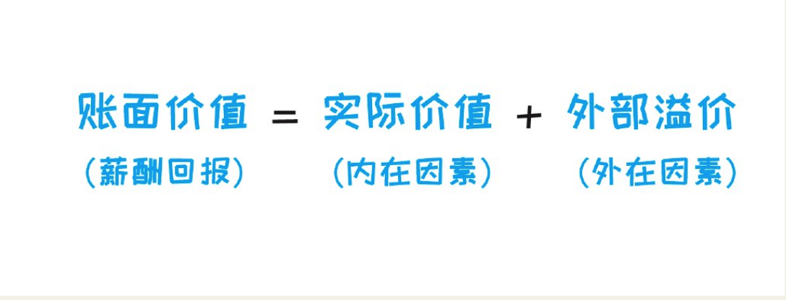
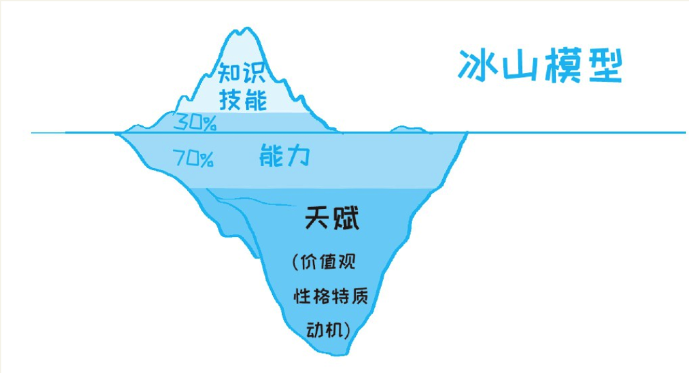

    作者: 孙圈圈 
    出版社: 团结出版社
    副标题: 如何用正确的方法快速进阶
    出版年: 2017-1-1
    页数: 296
    定价: 38.00元
    装帧: 平装
    ISBN: 9787512646759

[豆瓣链接](https://book.douban.com/subject/26936065/)

## 01  人人都有天赋  如何快速找到你的天赋优势
### 你没钱，真的不是因为不努力——找到正确的定位才是关键
1. 你个人能够创造出多大的价值，离不开三大内在要素：第一个要素，知识和技能。第二个要素。能力，比如学习和思考能力、人际交往能力等等。第三个要素，天赋，包括潜在能力、性格特质、动机、价值观。
2. 决定你最终能够收获多少回报的，除了内在因素之外，还有三大外在因素：出身、选择、运气。
3. 个人价值定位有五种不同的类型：投机型、知识型、技能型、能力型、天赋型。
4. 在五种不同的价值定位类型中，最优的选择有两个，一是提升能力，二是不断认识自己、发掘自己的天赋。
5. 大多数人没有采取最优选择，而是将自己定位在知识型和技能型，原因是：第一，知识和技能型最容易提升。第二，受限于岗位的定位。
6. 如果想要收入更高，你需要在学习新知识的时候，内化成能力。有技能的，需要找到稀缺技能。当然，这种稀缺性只能维持一段时间，一旦供求达到平衡之后，收入就会下降。能力，才是长久需要提升的，因为世界变化太快，只有能力是各种岗位间通用的。同时，要不断尝试和总结，发现自己的天赋。

#### 决定你的价值的六个因素
你的收入不完全是你能创造的价值，这其中，是存在一个差值的。用公式表示就是：

你的实际价值又取决于什么呢？这里有一个基础模型，称为冰山模型：

说完了内部因素，我们简单看一下外部因素。外在因素也包括三个方面：出身、选择、运气。

#### 价值定位的五种类型

刨除不可变因素，我们可以把个人所选择的定位（也可以称之为增值方式）分成五种不同的类型：投机型、知识型、技能型、能力型、天赋型。

#### 你的价值定位决定你的高度
- 投机型：追求账面价值最大化。目前的人才市场，还不是一个信息完全对称的市场。所以，同等能力，可能A 企业支付1 万，B 企业支付1.2万，C 企业支付1.5 万。投机型的人竭尽全力，通过各种渠道，找到愿意支付更高价格的地方，不惜频繁跳槽。这类人，天花板很明显，就是企业愿意为他们所支付的最高价格。
- 知识型：或许你觉得知识很值钱？但事实并非如此。为什么呢？
  - 其一，当今社会，你想知道什么，网上搜索就可以了，或者通过社交网络找到那个领域的人就可以了，可替代性太高。你就算把《百科全书》背下来，最后还得靠卖记忆力课程赚钱。
  - 其二，知识跟思维，是有差别的。现代社会，随便一个人，知识储备都超过孔子、老子、亚里士多德……但你为什么还在学他们的思想？所以，起作用的不是知识，而是思维。不能内化为能力的知识，是很难为你增加财富的。
  - 另外，你可能会想，“逻辑思维”难道不是贩卖知识吗？是的，可罗振宇能贩卖知识，靠的是他的商业运作能力。
  - 所以，**不能结合思维能力的知识，价值是很低的**。
- 技能型：技能型跟知识型其实有点类似，你能想到的最典型的技能型应该是操作工，熟练地修理仪器、操作机器。
  - 技能型的人的天花板是，企业愿意为技能付的钱，而这取决于该技能在市场上的稀缺性。
- 能力型：比如一些做专业服务类以及管理类工作的人，其定位基本是能力型的。比如咨询顾问，每天用PPT，但不会有谁是因为PPT 用得好而成为一个好顾问的。恰恰相反，一些PPT 用得一般，但能力很强的人，也没有因此太影响职业生涯。
  - 技能不行，能力可以弥补，但能力不行，技能无法代替。能力型的人，天花板往往是他们自己，而不是外在的限制。
- 天赋型：比如搞艺术、做设计的，同等努力的情况下，最终能够做得比一般人好的人，个人价值定位常常是天赋型的。

从这张图可以看出来，**想要获得更高的回报，最优的选择有两个，一是提升能力，二是不断认识自己、发掘自己的天赋**。

总之，如果想要收入更高，你需要：

1. 在学习新知识的时候，内化成能力。
2. 有技能的，需要找到稀缺技能，当然，这种稀缺性只能维持一段时间，一旦供求达到平衡之后，收入就会下降。
3. 能力，才是长久需要提升的，因为世界变化太快，只有能力是各种岗位间通用的。
4. 同时，要不断尝试和总结，发现自己的天赋。

### 努力，到底是不是天赋——80%的人对天赋的理解都错了

