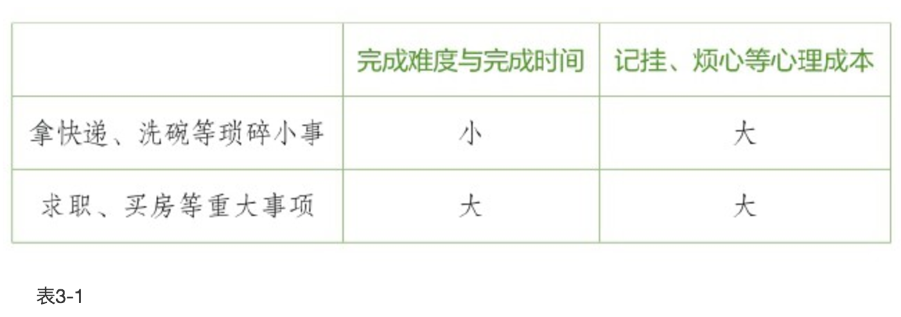
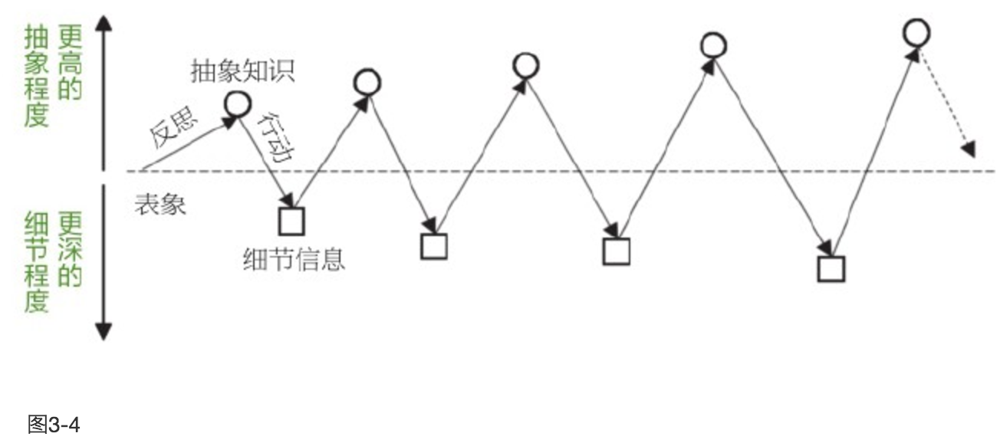
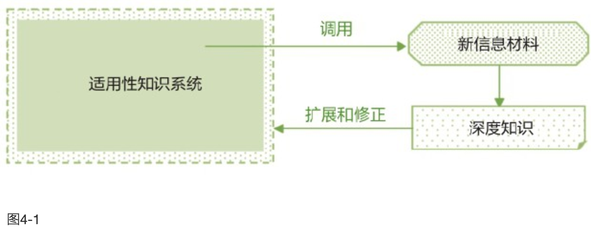

[豆瓣链接](https://book.douban.com/subject/26761696/)

    作者: 采铜
    出版社: 江苏凤凰文艺出版社
    副标题: 如何成为一个很厉害的人
    出版年: 2016-4-1
    页数: 304
    定价: 38.00元
    装帧: 平装
    ISBN: 9787539990484

- [01 时间之尺 我们应该怎样对待时间](#01-%E6%97%B6%E9%97%B4%E4%B9%8B%E5%B0%BA-%E6%88%91%E4%BB%AC%E5%BA%94%E8%AF%A5%E6%80%8E%E6%A0%B7%E5%AF%B9%E5%BE%85%E6%97%B6%E9%97%B4)
  - [活在“全部的现在” 从当下出发，联结过去与未来](#%E6%B4%BB%E5%9C%A8%E5%85%A8%E9%83%A8%E7%9A%84%E7%8E%B0%E5%9C%A8-%E4%BB%8E%E5%BD%93%E4%B8%8B%E5%87%BA%E5%8F%91%E8%81%94%E7%BB%93%E8%BF%87%E5%8E%BB%E4%B8%8E%E6%9C%AA%E6%9D%A5)
  - [对五年后的自己提问 如何解决远期未来与近期未来的冲突？](#%E5%AF%B9%E4%BA%94%E5%B9%B4%E5%90%8E%E7%9A%84%E8%87%AA%E5%B7%B1%E6%8F%90%E9%97%AE-%E5%A6%82%E4%BD%95%E8%A7%A3%E5%86%B3%E8%BF%9C%E6%9C%9F%E6%9C%AA%E6%9D%A5%E4%B8%8E%E8%BF%91%E6%9C%9F%E6%9C%AA%E6%9D%A5%E7%9A%84%E5%86%B2%E7%AA%81)
  - [我们总是在重复地抓起沙子 把时间花在值得做的事情上](#%E6%88%91%E4%BB%AC%E6%80%BB%E6%98%AF%E5%9C%A8%E9%87%8D%E5%A4%8D%E5%9C%B0%E6%8A%93%E8%B5%B7%E6%B2%99%E5%AD%90-%E6%8A%8A%E6%97%B6%E9%97%B4%E8%8A%B1%E5%9C%A8%E5%80%BC%E5%BE%97%E5%81%9A%E7%9A%84%E4%BA%8B%E6%83%85%E4%B8%8A)
  - [“快”与“慢”的自由切换 为什么我们的时间永远不够用？](#%E5%BF%AB%E4%B8%8E%E6%85%A2%E7%9A%84%E8%87%AA%E7%94%B1%E5%88%87%E6%8D%A2-%E4%B8%BA%E4%BB%80%E4%B9%88%E6%88%91%E4%BB%AC%E7%9A%84%E6%97%B6%E9%97%B4%E6%B0%B8%E8%BF%9C%E4%B8%8D%E5%A4%9F%E7%94%A8)
- [02 寻找心中的“巴拿马”如何做出比好更好的选择](#02-%E5%AF%BB%E6%89%BE%E5%BF%83%E4%B8%AD%E7%9A%84%E5%B7%B4%E6%8B%BF%E9%A9%AC%E5%A6%82%E4%BD%95%E5%81%9A%E5%87%BA%E6%AF%94%E5%A5%BD%E6%9B%B4%E5%A5%BD%E7%9A%84%E9%80%89%E6%8B%A9)
  - [从终极问题出发 以人生最高目标作为第一原则](#%E4%BB%8E%E7%BB%88%E6%9E%81%E9%97%AE%E9%A2%98%E5%87%BA%E5%8F%91-%E4%BB%A5%E4%BA%BA%E7%94%9F%E6%9C%80%E9%AB%98%E7%9B%AE%E6%A0%87%E4%BD%9C%E4%B8%BA%E7%AC%AC%E4%B8%80%E5%8E%9F%E5%88%99)
  - [逃离隐含假设的牢笼 发现人生中的更多可能选项](#%E9%80%83%E7%A6%BB%E9%9A%90%E5%90%AB%E5%81%87%E8%AE%BE%E7%9A%84%E7%89%A2%E7%AC%BC-%E5%8F%91%E7%8E%B0%E4%BA%BA%E7%94%9F%E4%B8%AD%E7%9A%84%E6%9B%B4%E5%A4%9A%E5%8F%AF%E8%83%BD%E9%80%89%E9%A1%B9)
- [03 即刻行动 最有效的，是即刻行动](#03-%E5%8D%B3%E5%88%BB%E8%A1%8C%E5%8A%A8-%E6%9C%80%E6%9C%89%E6%95%88%E7%9A%84%E6%98%AF%E5%8D%B3%E5%88%BB%E8%A1%8C%E5%8A%A8)
  - [“现在”就是最好的时机 不管怎样，只要开始就好](#%E7%8E%B0%E5%9C%A8%E5%B0%B1%E6%98%AF%E6%9C%80%E5%A5%BD%E7%9A%84%E6%97%B6%E6%9C%BA-%E4%B8%8D%E7%AE%A1%E6%80%8E%E6%A0%B7%E5%8F%AA%E8%A6%81%E5%BC%80%E5%A7%8B%E5%B0%B1%E5%A5%BD)
  - [精益创业的行动启示 把“未完成”变成“已完成”](#%E7%B2%BE%E7%9B%8A%E5%88%9B%E4%B8%9A%E7%9A%84%E8%A1%8C%E5%8A%A8%E5%90%AF%E7%A4%BA-%E6%8A%8A%E6%9C%AA%E5%AE%8C%E6%88%90%E5%8F%98%E6%88%90%E5%B7%B2%E5%AE%8C%E6%88%90)
  - [三行而后思 在实践中，通过复盘积累智慧](#%E4%B8%89%E8%A1%8C%E8%80%8C%E5%90%8E%E6%80%9D-%E5%9C%A8%E5%AE%9E%E8%B7%B5%E4%B8%AD%E9%80%9A%E8%BF%87%E5%A4%8D%E7%9B%98%E7%A7%AF%E7%B4%AF%E6%99%BA%E6%85%A7)
- [04 怎样的学习，才能够直面现实 如何成为一个高段位的学习者](#04-%E6%80%8E%E6%A0%B7%E7%9A%84%E5%AD%A6%E4%B9%A0%E6%89%8D%E8%83%BD%E5%A4%9F%E7%9B%B4%E9%9D%A2%E7%8E%B0%E5%AE%9E-%E5%A6%82%E4%BD%95%E6%88%90%E4%B8%BA%E4%B8%80%E4%B8%AA%E9%AB%98%E6%AE%B5%E4%BD%8D%E7%9A%84%E5%AD%A6%E4%B9%A0%E8%80%85)
  - [找到一切学习的向导 好的学习者，首先要向自己提问](#%E6%89%BE%E5%88%B0%E4%B8%80%E5%88%87%E5%AD%A6%E4%B9%A0%E7%9A%84%E5%90%91%E5%AF%BC-%E5%A5%BD%E7%9A%84%E5%AD%A6%E4%B9%A0%E8%80%85%E9%A6%96%E5%85%88%E8%A6%81%E5%90%91%E8%87%AA%E5%B7%B1%E6%8F%90%E9%97%AE)
  - [不要只做信息的搬运工 通过解码，深入事物的深层](#%E4%B8%8D%E8%A6%81%E5%8F%AA%E5%81%9A%E4%BF%A1%E6%81%AF%E7%9A%84%E6%90%AC%E8%BF%90%E5%B7%A5-%E9%80%9A%E8%BF%87%E8%A7%A3%E7%A0%81%E6%B7%B1%E5%85%A5%E4%BA%8B%E7%89%A9%E7%9A%84%E6%B7%B1%E5%B1%82)
  - [技能，才是学习的终点 你能够调用的知识有多少？](#%E6%8A%80%E8%83%BD%E6%89%8D%E6%98%AF%E5%AD%A6%E4%B9%A0%E7%9A%84%E7%BB%88%E7%82%B9-%E4%BD%A0%E8%83%BD%E5%A4%9F%E8%B0%83%E7%94%A8%E7%9A%84%E7%9F%A5%E8%AF%86%E6%9C%89%E5%A4%9A%E5%B0%91)
    - [写作式操练](#%E5%86%99%E4%BD%9C%E5%BC%8F%E6%93%8D%E7%BB%83)
    - [游戏式操练](#%E6%B8%B8%E6%88%8F%E5%BC%8F%E6%93%8D%E7%BB%83)
    - [设计式操练](#%E8%AE%BE%E8%AE%A1%E5%BC%8F%E6%93%8D%E7%BB%83)
- [05 向未知的无限逼近 修炼思维，成为真正的利器](#05-%E5%90%91%E6%9C%AA%E7%9F%A5%E7%9A%84%E6%97%A0%E9%99%90%E9%80%BC%E8%BF%91-%E4%BF%AE%E7%82%BC%E6%80%9D%E7%BB%B4%E6%88%90%E4%B8%BA%E7%9C%9F%E6%AD%A3%E7%9A%84%E5%88%A9%E5%99%A8)
- [06 努力，是一种最需要学习的才能 不断优化你的“努力”方式](#06-%E5%8A%AA%E5%8A%9B%E6%98%AF%E4%B8%80%E7%A7%8D%E6%9C%80%E9%9C%80%E8%A6%81%E5%AD%A6%E4%B9%A0%E7%9A%84%E6%89%8D%E8%83%BD-%E4%B8%8D%E6%96%AD%E4%BC%98%E5%8C%96%E4%BD%A0%E7%9A%84%E5%8A%AA%E5%8A%9B%E6%96%B9%E5%BC%8F)
  - [挑战是设计出来的 不断为自己设计“必要的难度”挑战](#%E6%8C%91%E6%88%98%E6%98%AF%E8%AE%BE%E8%AE%A1%E5%87%BA%E6%9D%A5%E7%9A%84-%E4%B8%8D%E6%96%AD%E4%B8%BA%E8%87%AA%E5%B7%B1%E8%AE%BE%E8%AE%A1%E5%BF%85%E8%A6%81%E7%9A%84%E9%9A%BE%E5%BA%A6%E6%8C%91%E6%88%98)
  - [不痛苦地坚持到底 只有深入下去，才能培养出真正的兴趣](#%E4%B8%8D%E7%97%9B%E8%8B%A6%E5%9C%B0%E5%9D%9A%E6%8C%81%E5%88%B0%E5%BA%95-%E5%8F%AA%E6%9C%89%E6%B7%B1%E5%85%A5%E4%B8%8B%E5%8E%BB%E6%89%8D%E8%83%BD%E5%9F%B9%E5%85%BB%E5%87%BA%E7%9C%9F%E6%AD%A3%E7%9A%84%E5%85%B4%E8%B6%A3)
- [07 每一个成功者，都是唯一的 创造成功，而不是复制成功](#07-%E6%AF%8F%E4%B8%80%E4%B8%AA%E6%88%90%E5%8A%9F%E8%80%85%E9%83%BD%E6%98%AF%E5%94%AF%E4%B8%80%E7%9A%84-%E5%88%9B%E9%80%A0%E6%88%90%E5%8A%9F%E8%80%8C%E4%B8%8D%E6%98%AF%E5%A4%8D%E5%88%B6%E6%88%90%E5%8A%9F)
  - [从“游乐场”到“荒野求生” 怎样从大学走向社会？](#%E4%BB%8E%E6%B8%B8%E4%B9%90%E5%9C%BA%E5%88%B0%E8%8D%92%E9%87%8E%E6%B1%82%E7%94%9F-%E6%80%8E%E6%A0%B7%E4%BB%8E%E5%A4%A7%E5%AD%A6%E8%B5%B0%E5%90%91%E7%A4%BE%E4%BC%9A)
  - [独特性，就是最好的竞争力 请坚持你的与众不同！](#%E7%8B%AC%E7%89%B9%E6%80%A7%E5%B0%B1%E6%98%AF%E6%9C%80%E5%A5%BD%E7%9A%84%E7%AB%9E%E4%BA%89%E5%8A%9B-%E8%AF%B7%E5%9D%9A%E6%8C%81%E4%BD%A0%E7%9A%84%E4%B8%8E%E4%BC%97%E4%B8%8D%E5%90%8C)

## 01 时间之尺 我们应该怎样对待时间
- 用平衡观点看待过去、现在和未来，用郑重的态度过好当下的生活，并联结起过去和未来。
- 明确工作和生活的界限，用未来视角工作，用享乐主义视角生活。
- 使用“时间之尺”，审视事件的长期价值，尽可能删减非必要事件。
- 让“远期未来”更加具体，为“近期未来”增加挑战。
- 把握好做事的节奏，区分“求快”的事件和“求慢”的事件。
- 提升时间使用的“深度”，减少被动式休闲的比例，保持至少一项长期的业余爱好。

### 活在“全部的现在” 从当下出发，联结过去与未来
不同场合，不同的时间视角

根据不同的时间视角可以划分出五种人：

1. 积极过去视角，具有这种视角的人总以积极的心态往回看，他们是怀旧的，经常怀念过去美好的事情，珍视亲情和友情，对已经拥有的东西怀有感恩之心。但这样的人容易忽视当下的快乐。
1. 消极过去视角，具有这种视角的人总以消极的心态往回看，他们经常回忆人生中的负面经历，沉浸在以前的伤害中无法自拔，因而出现心理问题的风险比较大。
1. 享乐主义视角，具有此种视角的人总以享乐的心态看待当下，他们认为及时行乐是第一要务，回首过去和展望未来都无太大必要，尽情享受当下便好了。他们的幸福感比较高，但出现成瘾行为如吸烟、酗酒或暴饮暴食的风险比较大。
1. 以宿命的观点看待当下的人，即具有宿命论视角，他们对现时发生的事情感到无能为力，认为一切都是命中注定，自己只能顺从和忍受外界的安排。
1. 习惯往前看、为未来谋划的人，这种视角被称为未来视角，他们具有前瞻性，更关注有待完成的目标和任务。为了完成未来的目标，他们愿意舍弃当下的享乐，时间的利用更有效率，因而更容易取得比较高的成就。但是由于一直为未来担心，所以幸福感并不强。

津巴多建议不要维持单一的时间视角。因为这五种时间视角里每一种都不是完美的，都有各自的缺点，所以最好采用混合和折中的方式：多采纳积极过去视角、享乐主义视角和未来视角，并且在三者中取得平衡，少采纳负面作用明显的消极过去视角和宿命论视角。并且，在采纳前三种视角时还要“随需而变”，即根据不同现实场景加以灵活选择。

由当下向过去与未来延伸

下面是这十条建议以及我对每一条建议的阐释：
1. 生活在当下——不瞻前顾后，不左顾右盼，不患得患失；
2. 严肃地对待时间——审慎、郑重地思考时间对我们的价值并用好它；
3. 留意自己拥有的空间并享受它——找到自己的“独享时刻”，不要疲于奔命；
4. 反思自己和其他人的时间视角——认识到自己和他人时间视角的异同，换位思考；
5. 从现在出发联结过去——过去并没有远去，它对今天仍具有意义；
6. 并不完全沉浸于过去——比过去更重要的是现在；
7. 制订实现目标的计划——未来视角让我们的行动更加有序；
8. 平衡计划和非计划时间——由于随机性和不可预见因素的影响，我们的生活并不能完全被计划，平衡计划和非计划就是在未来视角和现在视角之间找到平衡点；
9. 视未来存在于当下——未来并非遥不可及，它就出现在即将到来的每一分每一秒；
10. 对未来保持积极的态度——既然未来难以预测，那么以积极的心态面对它能让我们在当下更有行动力。

### 对五年后的自己提问 如何解决远期未来与近期未来的冲突？
两种未来视角下的思维差异

有研究时间的心理学家把未来分为“近期未来”（near future）和“远期未来”（distant future），而“五年”恰巧是一个典型的远期未来的长度。

“五年设想”实在是一个很有用的技巧，它让我们用情境化、具象化的方式来构想远期未来，把时间拉近到眼前，使未来鲜活生动起来，这就有利于从实施的角度去具体设计实现未来的方式。同时，也正是由于“五年”的时间跨度很长，我们就不会把可行性、便利性作为主要的判断依据，就不会因为一件事简单易实现就去做，而是从它的长期价值出发，同时考虑确实具有可行性后才去做。

如何解决生活里两种未来的冲突？

产生拖延症的一个原因是，“远期未来”中有一个抽象且意义重大的目标，例如“完成博士论文，拿到博士学位”，而“近期未来”则遇上了实际的阻碍和便利的替代性活动，例如阻碍是实验结果不理想，而便利的替代性活动包括成天看电影和打游戏，借此逃避阻碍。在这种状况下，人们通常的应对方式是不断地强化远期目标的意义，“完成博士学业是我的全部”“如果博士退学就真的走投无路了”，但这不仅无法解决问题，还可能因为加大了“近期未来”和“远期未来”的冲突而使问题更加严重。

那该怎么办呢？

- 从“远期未来”的角度，我们应该“重战术、轻战略”，减少对价值和意义的强调，也不要一个劲地担忧目标没有完成怎么办，而是应该多思考实现目标的具体途径，把注意力放到“怎样去做”上，特别是放到那些立即可实施的行动上。
- 从“近期未来”的角度，应该提高逃避的成本，甚至可以采用一些“极端”措施，比如删除电脑里所有的电影、游戏，剪断网线，把手机换成非智能机等等。可能有人会说，电影删了还可以再下，网线剪了可以再接，手机换了可以再换，这个方法有用吗？有用。因为虽然可能会出现反复，但这种反复会使得原来简单且惯常的替代性行为变得更麻烦了，逃避的便利性大大减小，这便增加了当事人转而去做实验、看论文的可能性。

要想处理好“远期未来”和“近期未来”，我们可以采用下面两个策略：
1. 使远期未来的目标更加具体化、情境化和可实施；
2. 降低近期未来中的“非期望行为”的便利性，主动增加挑战的难度。

### 我们总是在重复地抓起沙子 把时间花在值得做的事情上
如何评判一件事情是否值得做？

在分析一件事情值不值得去做、花多少精力去做的时候，可以从两个角度来评估：一是这件事在当下将给“我”带来的收益大小，这个收益可以是心智、情感层面的，也可以是身体、物质层面的，我称之为“收益值”；二是这项收益随时间衰减的速度，我称之为`“收益半衰期”`，半衰期长的事件，其影响会持续较久。

以此类推，我们生活、学习和工作中的大多数事情都可以从这两个角度来衡量，由此便可得到由这两个角度组合成的四类事件：
- 高收益值、长半衰期事件：找到真爱；学会一种有效的思维技巧；与“大牛”进行一场意味深长的谈话。
- 高收益值、短半衰期事件：买一件当季流行的衣服；玩一下午手机游戏；以“扶墙进、扶墙出”的方式吃一顿自助餐。
- 低收益值、长半衰期事件：练一小时书法；背诵三首诗；读懂哲学著作的一个章节；多重复一组技能练习；认真地回复一封友人的邮件。
- 低收益值、短半衰期事件：挑起或参与一次网络掐架；漫无目的地刷微博；使用社交软件窥视陌生人的隐私。

“采铜法则”：尽量少做“短半衰期”的事情。

这个法则暗含着两层含义：
1. 收益值的高低无关紧要，只要不是短半衰期的事情，只要这个收益可以被累加，就尽管去做。
2. 不要只盯着那些“高大上”的事情。一些不重要、不紧急的事情，只要对你有长期的益处，仍旧可以去做。

长半衰期事件指南
- 积累可信的知识
- 训练实践技能
- 构建新的思维模式
- 提升审美品味
- 反思和总结个人经历
- 保持和促进健康
- 建立和维持相互信任的关系
- 寻找和获得稀缺性资源
- 探索、提出独创性的构思或者发明

获得高峰体验

### “快”与“慢”的自由切换 为什么我们的时间永远不够用？
`“心流”（flow）`这个由心理学家齐克森米哈里创立的概念已经渐渐为大众所熟知，它是指人全情投入于一件事中的状态。在心流发生时，人心无旁骛、全神贯注，甚至忘记了自己的存在，忘记了时间的流逝，在这个过程中，人会获得很大的满足感。当然，人也不可能一直处于心流状态中，也需要很简单地放松、闲适，只不过，在时间的“深”与“浅”之间需要某种平衡。获得高质量的休闲满足其实很简单，就是：找到并保持至少一项长期的业余爱好。

## 02 寻找心中的“巴拿马”如何做出比好更好的选择
- 所谓选择，就是要权衡好本末轻重，清楚自己人生中到底想要什么、追求什么。
- 为自己设定更高的目标，就会发现更多更好的选项，做出更加完美的决定。
- 过去的经历、习惯和思维惯性，常在我不到更多的“可能选项”。如果有太多的可选项，应该把选择对象分解为不同的维度，然后对可选项从不同的维度做出评估。
- 在做涉及情感、喜好等主观性特别强的选择时，最好的方法是聆听内心的声音。
- 不管你做了哪个选择，你的某些东西永远不会改变，最终带着你走向目的地的，可能并不是某一个选择，而是那些你不会改变的东西。

### 从终极问题出发 以人生最高目标作为第一原则
- 零度格局：盲众（“看不见”）
  - 目标：无目标或只是追随当下的潮流。
  - 眼界：主要为流行文化，以及身边亲友的观点。
  - 信念：以“人生苦短、及时行乐”等流行文化所潜移默化传递的价值观为典型。实际上这类人并无稳定的信念，很容易被他人诱导和说服，因而经常大喊“毁三观”。
- 一度格局：逐利者（“看自己”）
  - 目标：作为精致或粗放的利己主义者，旨在寻求自身利益的最大化。
  - 眼界：与逐利相关联的各种知识和技能，包括对利益机会的洞察，同时兼具比较完整的常识体系。
  - 信念：笃信丛林法则，认为每个人都是逐利性动物，且能力越强的人能获得越大的利益。
- 二度格局：理念人（“看天地”）
  - 目标：“理念人”（man of ideas），即指为理念而生的人，他们毕生的行动就是追求和捍卫真理。
  - 眼界：对某个甚至多个知识领域有非常深入、系统的钻研，并常常能提出极具创造性的观点。
  - 信念：真理是美的，人生的价值就在于追寻真理之美，与此相应地，必须保持内心的诚实。这类人的代表人物有维特根斯坦、哥德尔和埃尔德什。
- 三度格局：至善之人（“看众生”）
  - 目标：以改良社会、增进人类的福祉为最高目标。
  - 眼界：往往对他人有很强的同理心，对人类社会的历史和现状有深刻的认识，部分人可能同时具有某个专业领域的知识，兼具理念人的特性。
  - 信念：个人对整个社会负有责任，应该努力地去改善世界，减少世界的苦难和不公，部分人可能有坚定的宗教信仰。

### 逃离隐含假设的牢笼 发现人生中的更多可能选项
当我们在人生中遇到某个无法摆脱的僵局时，先不妨试试这三步：
1. 找出潜意识中的隐含假设；
2. 识别隐含假设中的不合理性，进行校正；
3. 形成新的更灵活的思维框架，在此基础上思考出“可能选项”并进行尝试。

四种最普遍的隐含假设

1. “赛道假设”。 “不要让孩子输在起跑线上”这句话就是赛道假设的体现。暗自认同赛道假设的人，认为人生就是一场漫长的比赛，比赛的项目是设定好的，而获胜者寥寥无几。于是他们就容易陷入对竞争的焦虑和对失败的恐惧中。
1. “低关联假设”。暗自认同这种假设的人认为，人生的种种经历之间相互独立，不存在什么关联。比如很多人小时候学过画画，但是长大后就再也不画了，他们不会想到，这些绘画基础对于在职场中运用视觉化思考很有帮助。
1. 心理学中讲的“僵固型心智”（fixed mindset）。暗自认同这种假设的人会用一种固定的眼光看待自己的能力，其中很多人会认为自己的天赋不够，或者智商平平，于是在遇到一些挫折时就自怨自艾，失去了继续努力的勇气。与之相对的是“成长型心智”（growth mindset），拥有这种心智的人认为智力和才能是可以通过努力不断增长的，因而并不惧怕短期的失败，反而会愈挫愈勇，这样的人往往能获得更高的成就。
1. “零和博弈”。暗自认同零和博弈假设的人，在人与人的竞争中，更倾向于从别人那里争夺利益，而很少去构想双赢的方案。

新的思维框架，探寻新的可能

1. “目标悬置”。很多人的烦恼来自同时有多个不同的人生目标想实现，但又不知道怎么处理多个目标之间的关系，因此感到无所适从。“目标悬置”是什么意思呢？顾名思义，就是把你的目标停下来、放一放，但这个“放”不是放弃，只是悬置。在这个停下来的时间（比如几天、几个月甚至几年）里，你可以休息放松，也可以去做完全不同的事情。等到时机成熟时，你又可以重新开始。
1. “能力嫁接”。出于将复杂问题简单化的需要，我们潜意识里会把整体分解成局部，把不同的事物划分类别，建立区隔，最典型的就是我们的知识体系，被人为划分成不同的学科，每一个学科下又形成了不同的分支。这种分解性思维在我们的生活中影响深远，有时候它确实是解决问题的利器，但有时候它也会是局限我们思维的阻碍。很多时候，我们之所以认为工作和爱好之间有不可调和的对立和冲突，往往是因为我们没有发现两者之间的潜在关联，因而没法把它们统合在一起。
1. “特性改造”。关于工作和爱好，我们可能早已形成了某些僵化的看法，比如工作是“要我做”，爱好是“我要做”，工作是被动接受的苦差事，爱好就是图个消遣娱乐。这种简单的二分法把工作和爱好隔绝开来，容易造成我们生活的割裂。为何不换个角度看问题呢？工作是否也可以变得活泼、主动而享受，爱好是否能不单单是消遣而也具有工作一样的严肃成分呢？这就是“特性改造”。“改造”爱好的一个常见方法，是把对一件事情的“消费型兴趣”升级为“生产型兴趣”。人生是持续而反复的构造校正选择，做出建设性的改变。

## 03 即刻行动 最有效的，是即刻行动
- 当一件事，你不知道怎么做的时候，就直接开始做吧。只要开始了第一步，就会有第二步、第三步。
- 克服“过度准备”的惯性，向前一步，把未完成的事情完成。
- 乐于接受反面意见，有勇气否定并重新构造自己的产品。
- 多线程工作，首先需要一段专注不受干扰的时间，完成工作中最核心部分的思考。
- 集中处理同质性的工作，可以减少不同质工作间的转换损耗。
- 从理论出发不一定能指导实践，只有在实践中通过反思积累的知识才能指导实践。
- 行动后要及时反思，并梳理这件事情的“反应链”，特别关注其中发生的意外现象。

### “现在”就是最好的时机 不管怎样，只要开始就好
与求职、买房等人生大事相比，小事情造成的心理负担可一点都不轻，但搞定后者则显然容易很多（见表3-1）。

我们可以把一个人的心理成本比作一个可以张开和缩小的弹性薄膜，这个薄膜会被各种事情撑开。从图3-1可以看到，各种小事的堆积可以把人的心理成本撑得很大，而当这些小事被基本消除后，人就可以轻松多了。

### 精益创业的行动启示 把“未完成”变成“已完成”
“精益创业”中有个关键概念叫 “最小化可行产品”（minimum viable product，MVP），它指的是可以使用最少资源、被最快制作出来的、可执行基本功能的、能被用户使用的试验性产品，创业者应该尽快把最小化可行产品发布出去，然后根据用户使用它的反馈来进行优化，这一过程称为`“构建—测量—学习”`（Build-Measure-Learn）的循环。

可以把外界反馈分为三种：正面肯定、否定和批评、提示之前未知的方面。每一种反馈都有特定的价值：正面反馈能坚定我们犹豫不决的心态，增强我们的自信；否定和批评会促使我们反思，校正之前的错误想法；而提示之前未知的方面则让我们发现新的世界，让我们的思考更加周全。

每个人都会觉得自己的想法是对的，而对别人的否定意见产生本能的抗拒。不喜欢听批评恐怕是人的一种天性。因此对于那些能克服这种天性，理性和虚心接受批评的人，我总是心怀敬意。

所以对待批评的合理态度是，把批评作为一种“信息”而不是一种“评价”来看待。也就是，批评我的人，并不是在评价我，而只是在给我提供信息，因此没有理由去排斥这些批评。

当然“接收”不等于“接受”，因为所有输入的信息都需要慎重地审视，只不过不要一开始就情绪化地加以排斥。

所以以精益创业的方式去走向人生的成功，便要做到这三点：
1. 克服“过度准备”的惯性，向前一步，把未完成的事情完成；
2. 克服“自我防卫”的心态，乐于接受反面意见并加以慎重地审视；
3. 克服“沉没成本”的固执，有勇气否定并重新构造自己的产品。

### 三行而后思 在实践中，通过复盘积累智慧
在日本知识管理大师野中郁次郎看来，我们行动中蕴含的知识属于不易用语言表达的隐性知识（tacit knowledge），比如一个拉面师傅怎样才能拉出很细的面条，这些技巧蕴含在他的动作中，但要他说出来恐怕就没那么容易了，而书本中的知识属于可用语言清晰表达的显性知识。他还认为，知识创造的过程，其实是隐性知识和显性知识相互转化的过程。从显性知识到隐性知识的转化，类似于知识的内化，即通过实际的练习来掌握书中的知识，而从隐性知识到显性知识的转化，则是知识的显化。在这个过程中，就需要我们对行动进行细致的反思，把那些原本并非用语言承载的知识，用语言归纳和总结出来。而这些知识一旦可以用语言表达出来，就容易被重复使用和迁移到其他应用场景中。

我们应该如何去反思？

就像图3-4所显示的：

## 04 怎样的学习，才能够直面现实 如何成为一个高段位的学习者
- 学习，应该以学习者心中的问题为中心，让问题引导着我们去探求答案。
- 问题的提出，需要基于已有的知识体系，并通过问题将新、旧知识串联起来。
- 通过深入事物内部的解码，我们可以发现事物深厚的内涵，有机会掌握其中精巧细微的技法，不断重建自己的知识体系。
- 掌握了多少知识，并不取决于记忆了多少知识以及知识的关联，而是取决于能调用多少知识以及知识关联。
- 求知分为三个层级：信息、知识和技能。技能是学习的终点，信息和知识是迈向这个终点的路与桥。
- 对一个现实问题的解决，或者对一个现实情境的洞察，往往需要同时调用不同知识谱系上的知识。
- 学会有意识地去分析不同领域知识之间的潜在关联，通过不同知识的迁移、印证、互补，获得启发，甚至生成新的思想或者发现。

只有最后能够作用于现实的学习，才是唯一有效的学习。

### 找到一切学习的向导 好的学习者，首先要向自己提问
打开新旧知识之间的通道

问题就像向导，引领着我们去接近这座知识的高山。而这个引领本身，又有赖于我们已经看到的、模糊的轮廓。这里就引出一个关键的命题，问题并非空中楼阁，而是建立于已有知识的地基。因此，我们对新旧知识的梳理和反思就特别重要。

### 不要只做信息的搬运工 通过解码，深入事物的深层
教育心理学家把在某一领域有专长的人士，分为“常规型专长”（routing expertise）和“适应型专长”（adaptive expertise）两类，其中具有常规型专长的人具有一个基本固定的知识系统，可以以很高的效率把他们所接触到的信息材料按照已有的框架进行分析，而具有适应型专长的人则可以让自己的能力不断地“进化”，通过对知识的广度和深度的扩展来适应问题解决的需要。常规型专家往往是象牙塔里的学者，因为他们主要接触的信息内容是固定领域内的理论著作，这些著作通常已经不对应具体而现实的问题，而是直接就最深层的问题进行探讨，这样一来，他们就失去了从表层解码到深层的练习机会。而适应型专家通常是实践型的专家，因为他们必须经常去应对那些超出单一领域的、非常规性的问题，接受各式新奇刺激的挑战，在这个过程中，他们必须在表层和深层之间穿梭，因而他们的知识系统也就能够不断扩展。

一个高段位的学习者，通常是一个适应型专家，他们可以有意识地构筑一个信息解码和知识扩展的良性循环（见图4-1）：

### 技能，才是学习的终点 你能够调用的知识有多少？
一个重要的学习方法：做中学（learning by doing）。

你掌握了多少知识，并不取决于你记忆了多少知识以及知识的关联，而是取决于你能调用多少知识以及知识关联。因为人的长时记忆存储并非像硬盘一样可以直接拷贝粘贴，不是说我们记住了多少知识，当我们提取时，就会原封不动地把它们提取出来。认知心理学已有大量研究表明，记忆提取的操作其实起到了“记忆修改器”（memory modifier）的作用，一个曾经被调用过的知识，和从未调用过的知识相比，在今后更有可能被再次调用。

把知识当成一项技能操练

但是，对很多学习者来说，他们的主要问题不是不愿操练、不肯操练，而是不知道如何操练。

我想再提出一个重要的学习理念 ，就是：把知识当成一项技能来学习。

求知分为三个层级：信息、知识和技能。最差的学习者只接收信息，贪多求广；好一点的学习者看重知识，以记忆为目标；高手磨炼技能，只求日日精进。信息、知识和技能本不冲突，只不过技能是终点，前两者是迈向这个终点的路与桥。

在“知识技能化”的理念之下，我们至少可以尝试以下三种知识操练的方法：

#### 写作式操练
写作是一种典型的知识建构活动，或者更准确地说，是一种对知识的重构活动。

在阅读时，我们对信息的理解和纳入，常常满足于从一个“浅表”的层面去理解它们（这也是为什么我在上一章里花那么多篇幅去谈“解码”的重要性）。但是在写作时，也就是进行信息输出的时候，我们必须去分析知识的“深层结构”，观察和调用知识与知识之间的深层关联，不然我们无法自如地将它们组织起来。因为一篇文章要被人读懂、要把人说服，需要缜密的思维、清晰的表达和翔实的依据，这些都要求我们对知识的编码和组织达到一个相对高的水准才行。除了更深层的理解，写作带来的另一个的益处，是获得反馈。

#### 游戏式操练
如果我们把对知识的操练当成一种游戏，那么这种操练就会具有相当高的参与性、互动性和投入性，同时它摆脱了现实规则的制约，使我们可能在更丰富多样的情境下去应用我们的知识。

#### 设计式操练
所谓设计式操练就是调用已有的知识，设计某一种解决方案，来解决某个特定的问题。

## 05 向未知的无限逼近 修炼思维，成为真正的利器
- 既要简化外界输入的信息，也要简化我们表达出来的信息，为思维腾出更多的使用空间。
- 基于深入了解的简洁，不是乏味，而是意味着更加丰富的内涵。
- 为了让思维更好地发散，获得更多的灵感，一是要关掉大脑里评价的声音，二是要适当地引入混乱与随机。
- 思维依赖于工作记忆，通过将思维外显为图像，给予思维更多的探索空间，也能进一推动思考的进行。
- 现实中的问题，总是牵涉太多的因素，借助矩阵、清单等工具，可以完善思考的周密程度。

世界上没有轻而易举的答案 只有极少数的人能做到周密思考

## 06 努力，是一种最需要学习的才能 不断优化你的“努力”方式
- 每个人都具有自己的独特优势，并且可以通过努力变得更优秀。
- 努力不是一味地用力，而是一种具有策略性的活动，可以不断学习和优化。
- 在个人资源有限的情况下，我们首先应该集中资源，投入发展自己的一项优势才能。
- 把时间主要投放在一个领域里，以尽量高的标准要求自己，培养出非常高的才能。
- 用相对少量的时间广泛涉猎，以捕捉和发展未曾预料的资源和机会，实现个人才能的最大化。
- 不断为自己设计有难度的“非标准动作”，在挑战中获得才能的提升与飞跃。

### 挑战是设计出来的 不断为自己设计“必要的难度”挑战
如果总是一帆风顺，就会一直待在自己的“舒适区”里不肯出来，潜能就无法被充分地激发。从这个角度来说，挑战和才能是相伴相生的，没有足够的挑战就催生不出杰出的才能，而越是具有杰出才能的人也越有可能接近高难度的挑战。

### 不痛苦地坚持到底 只有深入下去，才能培养出真正的兴趣
如果我能长期坚持去做一件事，一定是这件事带给我的丰盈感和满足感超过了我的所有付出，一定是这件事日日夜夜萦绕在我的心头让我欲罢不能，一定是这件事唤起了我内心深处最强烈的兴趣。也就是说，赐予我力量的，是激情的驱动，而不是意志力的鞭策。

因为努力而热爱

改变这种局面是有一些方法可循的。

一是放弃对“兴趣”的执念，不把“兴趣”作为做事的先决条件。宁可傻一点、笨一点，去做一些并不特别喜欢但看上去又富有挑战的事，或者去做一些少有人做但又看上去很有意义的事，并且咬咬牙，多坚持一段时间，或许就能把死循环的闭环打破，开启新的良性的循环。不以兴趣作为先决条件，并不是说不再追求兴趣或者忽视兴趣的重要性，而是调整一下顺序，不再是要求先有兴趣再努力做事，而是先努力做事再在努力的过程中获得乐趣和热爱。

二是提升“浸润”的深度：尽量让自己全身心地投入到所做的事情里面，不只用冰冷的理性，更用温暖的情感和良好的心理体验来激发兴趣。

## 07 每一个成功者，都是唯一的 创造成功，而不是复制成功
- 每个人都具有自己的独特优势，并且可以通过努力变得更优秀。
- 努力不是一味地用力，而是一种具有策略性的活动，可以不断学习和优化。
- 在个人资源有限的情况下，我们首先应该集中资源，投入发展自己的一项优势才能。
- 把时间主要投放在一个领域里，以尽量高的标准要求自己，培养出非常高的才能。
- 用相对少量的时间广泛涉猎，以捕捉和发展未曾预料的资源和机会，实现个人才能的最大化。
- 不断为自己设计有难度的“非标准动作”，在挑战中获得才能的提升与飞跃。

### 从“游乐场”到“荒野求生” 怎样从大学走向社会？
塔勒布的人生历程生动地展现了这样一种路径的可行性：从现实和历史中提问，在思想的海洋中寻觅，在实践中验证，又在写作中升华。

### 独特性，就是最好的竞争力 请坚持你的与众不同！
下面是我总结的具有心智独特性的人所具有的优势：
1. 在主流观点之外洞察出别人未曾发现的机会；
2. 形成个人核心竞争力，避免低层次的同质化竞争，使自己不可替代；
3. 拒绝他人和大众给自己贴上的标签，以更开放和自由的心态发展自己；
4. 因为不必迎合社会主流而节约了大量时间精力，可以专注于做好自己的事情；
5. 为大众带来新鲜的见解和启发，形成对公众的影响力；
6. 具有更高的可辨识性，更易于形成个人品牌；
7. 吸引到其他独特而优秀的人，与他们成为朋友或者合作伙伴。

当我们避开了追求社会认同的陷阱，也意识到去做酷事的价值以后，我们可能便走上了因独特而成功的道路。在这条道路上，下面七个方法能够助我们一臂之力：
1. 抗拒自己的欲望，或者延迟满足欲望；
2. 质疑貌似最可信的言论，不盲从任何人；
3. 屏蔽流行信息，或者只在固定的时段接收流行信息；
4. 思考最不可能的事，为其发展出可能性；
5. 保留和发展自己的“怪癖”，并将其发展成自己的竞争力；
6. 为小事物狂热，并在小事物中发现大世界；
7. 开展思想试验和行动试验，让思想和行动相互激发。
