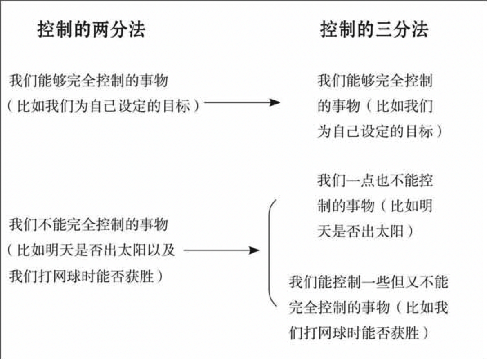

# 生命安宁

    作者: 【美】威廉•B. 欧文 
    出版社: 中央编译出版社
    副标题: 斯多葛哲学的生活艺术
    原作名: A guide to the good life : the ancient art of Stoic joy
    译者: 胡晓阳 / 芮欣 
    出版年: 2013-5
    定价: 32.80
    ISBN: 9787511716514

[豆瓣链接](https://book.douban.com/subject/24732489/)

- [生命安宁](#%e7%94%9f%e5%91%bd%e5%ae%89%e5%ae%81)
- [第1部分 斯多葛主义的兴起](#%e7%ac%ac1%e9%83%a8%e5%88%86-%e6%96%af%e5%a4%9a%e8%91%9b%e4%b8%bb%e4%b9%89%e7%9a%84%e5%85%b4%e8%b5%b7)
  - [第一章 哲学对生活感兴趣](#%e7%ac%ac%e4%b8%80%e7%ab%a0-%e5%93%b2%e5%ad%a6%e5%af%b9%e7%94%9f%e6%b4%bb%e6%84%9f%e5%85%b4%e8%b6%a3)
  - [第二章 最早的斯多葛主义者](#%e7%ac%ac%e4%ba%8c%e7%ab%a0-%e6%9c%80%e6%97%a9%e7%9a%84%e6%96%af%e5%a4%9a%e8%91%9b%e4%b8%bb%e4%b9%89%e8%80%85)
  - [第三章 罗马斯多葛主义](#%e7%ac%ac%e4%b8%89%e7%ab%a0-%e7%bd%97%e9%a9%ac%e6%96%af%e5%a4%9a%e8%91%9b%e4%b8%bb%e4%b9%89)
- [第2部分 斯多葛主义的心理技巧](#%e7%ac%ac2%e9%83%a8%e5%88%86-%e6%96%af%e5%a4%9a%e8%91%9b%e4%b8%bb%e4%b9%89%e7%9a%84%e5%bf%83%e7%90%86%e6%8a%80%e5%b7%a7)
  - [第四章 消极想象：能发生的最坏结果是什么？](#%e7%ac%ac%e5%9b%9b%e7%ab%a0-%e6%b6%88%e6%9e%81%e6%83%b3%e8%b1%a1%e8%83%bd%e5%8f%91%e7%94%9f%e7%9a%84%e6%9c%80%e5%9d%8f%e7%bb%93%e6%9e%9c%e6%98%af%e4%bb%80%e4%b9%88)
  - [第五章 控制的两分法：论变得无敌](#%e7%ac%ac%e4%ba%94%e7%ab%a0-%e6%8e%a7%e5%88%b6%e7%9a%84%e4%b8%a4%e5%88%86%e6%b3%95%e8%ae%ba%e5%8f%98%e5%be%97%e6%97%a0%e6%95%8c)
  - [第六章 宿命论：放下过去……以及现在](#%e7%ac%ac%e5%85%ad%e7%ab%a0-%e5%ae%bf%e5%91%bd%e8%ae%ba%e6%94%be%e4%b8%8b%e8%bf%87%e5%8e%bb%e4%bb%a5%e5%8f%8a%e7%8e%b0%e5%9c%a8)
  - [第七章 自我否定：论应对快乐的阴暗面](#%e7%ac%ac%e4%b8%83%e7%ab%a0-%e8%87%aa%e6%88%91%e5%90%a6%e5%ae%9a%e8%ae%ba%e5%ba%94%e5%af%b9%e5%bf%ab%e4%b9%90%e7%9a%84%e9%98%b4%e6%9a%97%e9%9d%a2)
  - [第八章 沉思：监督自我践行斯多葛主义](#%e7%ac%ac%e5%85%ab%e7%ab%a0-%e6%b2%89%e6%80%9d%e7%9b%91%e7%9d%a3%e8%87%aa%e6%88%91%e8%b7%b5%e8%a1%8c%e6%96%af%e5%a4%9a%e8%91%9b%e4%b8%bb%e4%b9%89)
- [第3部分 斯多葛主义的忠告](#%e7%ac%ac3%e9%83%a8%e5%88%86-%e6%96%af%e5%a4%9a%e8%91%9b%e4%b8%bb%e4%b9%89%e7%9a%84%e5%bf%a0%e5%91%8a)
  - [第九章 责任：论热爱人类](#%e7%ac%ac%e4%b9%9d%e7%ab%a0-%e8%b4%a3%e4%bb%bb%e8%ae%ba%e7%83%ad%e7%88%b1%e4%ba%ba%e7%b1%bb)
  - [第十章 社会关系：论与人交往](#%e7%ac%ac%e5%8d%81%e7%ab%a0-%e7%a4%be%e4%bc%9a%e5%85%b3%e7%b3%bb%e8%ae%ba%e4%b8%8e%e4%ba%ba%e4%ba%a4%e5%be%80)
  - [第十一章 侮辱 论容忍奚落](#%e7%ac%ac%e5%8d%81%e4%b8%80%e7%ab%a0-%e4%be%ae%e8%be%b1-%e8%ae%ba%e5%ae%b9%e5%bf%8d%e5%a5%9a%e8%90%bd)
  - [第十二章 悲伤：论用理性战胜眼泪](#%e7%ac%ac%e5%8d%81%e4%ba%8c%e7%ab%a0-%e6%82%b2%e4%bc%a4%e8%ae%ba%e7%94%a8%e7%90%86%e6%80%a7%e6%88%98%e8%83%9c%e7%9c%bc%e6%b3%aa)
  - [第十三章 愤怒：论战胜反快乐](#%e7%ac%ac%e5%8d%81%e4%b8%89%e7%ab%a0-%e6%84%a4%e6%80%92%e8%ae%ba%e6%88%98%e8%83%9c%e5%8f%8d%e5%bf%ab%e4%b9%90)
  - [第十四章 个人价值观：论追求名誉](#%e7%ac%ac%e5%8d%81%e5%9b%9b%e7%ab%a0-%e4%b8%aa%e4%ba%ba%e4%bb%b7%e5%80%bc%e8%a7%82%e8%ae%ba%e8%bf%bd%e6%b1%82%e5%90%8d%e8%aa%89)
  - [第十五章 个人价值观：论奢侈生活](#%e7%ac%ac%e5%8d%81%e4%ba%94%e7%ab%a0-%e4%b8%aa%e4%ba%ba%e4%bb%b7%e5%80%bc%e8%a7%82%e8%ae%ba%e5%a5%a2%e4%be%88%e7%94%9f%e6%b4%bb)
  - [第十六章 放逐：论在环境的变故中求生存](#%e7%ac%ac%e5%8d%81%e5%85%ad%e7%ab%a0-%e6%94%be%e9%80%90%e8%ae%ba%e5%9c%a8%e7%8e%af%e5%a2%83%e7%9a%84%e5%8f%98%e6%95%85%e4%b8%ad%e6%b1%82%e7%94%9f%e5%ad%98)
  - [第十七章 老年：论被赶到养老院](#%e7%ac%ac%e5%8d%81%e4%b8%83%e7%ab%a0-%e8%80%81%e5%b9%b4%e8%ae%ba%e8%a2%ab%e8%b5%b6%e5%88%b0%e5%85%bb%e8%80%81%e9%99%a2)
  - [第十八章 死亡：论良好生活的善终](#%e7%ac%ac%e5%8d%81%e5%85%ab%e7%ab%a0-%e6%ad%bb%e4%ba%a1%e8%ae%ba%e8%89%af%e5%a5%bd%e7%94%9f%e6%b4%bb%e7%9a%84%e5%96%84%e7%bb%88)
  - [第十九章 论成为一个斯多葛主义者：现在就开始，并准备遭受嘲弄](#%e7%ac%ac%e5%8d%81%e4%b9%9d%e7%ab%a0-%e8%ae%ba%e6%88%90%e4%b8%ba%e4%b8%80%e4%b8%aa%e6%96%af%e5%a4%9a%e8%91%9b%e4%b8%bb%e4%b9%89%e8%80%85%e7%8e%b0%e5%9c%a8%e5%b0%b1%e5%bc%80%e5%a7%8b%e5%b9%b6%e5%87%86%e5%a4%87%e9%81%ad%e5%8f%97%e5%98%b2%e5%bc%84)
- [第4部分 斯多葛主义在现代生活中](#%e7%ac%ac4%e9%83%a8%e5%88%86-%e6%96%af%e5%a4%9a%e8%91%9b%e4%b8%bb%e4%b9%89%e5%9c%a8%e7%8e%b0%e4%bb%a3%e7%94%9f%e6%b4%bb%e4%b8%ad)
  - [第二十一章 重新考虑斯多葛主义](#%e7%ac%ac%e4%ba%8c%e5%8d%81%e4%b8%80%e7%ab%a0-%e9%87%8d%e6%96%b0%e8%80%83%e8%99%91%e6%96%af%e5%a4%9a%e8%91%9b%e4%b8%bb%e4%b9%89)
  - [第二十二章 践行斯多葛主义](#%e7%ac%ac%e4%ba%8c%e5%8d%81%e4%ba%8c%e7%ab%a0-%e8%b7%b5%e8%a1%8c%e6%96%af%e5%a4%9a%e8%91%9b%e4%b8%bb%e4%b9%89)

# 第1部分 斯多葛主义的兴起
## 第一章 哲学对生活感兴趣
古典学者弗朗西斯·麦克唐纳·康福德(Francis MacDonald Cornford)以类似的言辞描述了苏格拉底哲学的意义：“苏格拉底之前的哲学是从发现自然开始的；苏格拉底的哲学则是从发现人类的灵魂开始的。”

`昔勒尼学派`认为生活的宏伟目标就是体验快乐，因此主张抓住每一个机会去体验快乐。`犬儒派`则主张禁欲主义的生活方式：他们论证说，如果要过良好的生活，你就得学会接受近乎于一无所有的状况。`斯多葛学派`位于昔勒尼学派和犬儒派之间的某个位置：他们认为人们应该享受生活所能提供的良好事物，包括友谊和财富；只要他们不紧紧抓住这些良好的事物不放就行。

根据历史学家西蒙·普赖斯(Simon Price)的说法，“坚守一个哲学派别不仅仅是头脑的事情，或者不仅仅是智力生活的结果。那些严肃地对待他们的哲学观的人力图日复一日地在生活中践行那种哲学。” 根据历史学家保罗·维恩(Paul Veyne)的说法，“做一个真正的哲学家，就是要在生活中践行某种教派的教义，就是要在行动上(甚至服装上)与其保持一致；如果有需要，甚至为它而死。”

## 第二章 最早的斯多葛主义者
`芝诺`(Zeno，公元前333-前261)是第一个斯多葛学派哲学家。(我所说的芝诺，是季蒂昂的芝诺，不要和因为涉及阿克琉斯和一只乌龟的悖论而出名的埃里亚的芝诺相混淆，也不要和第欧根尼·拉尔修斯在他的传记描写中提到的另外七个芝诺中的任何一个相混淆。)

芝诺的哲学由伦理学、物理学和逻辑学组成。斯多葛学派对于逻辑学的兴趣，是他们相信人类独有的属性是他们的理性这一观念的自然结果。毕竟，逻辑学研究的就是对推理论证的正确使用。父母们把孩子送到哲学学校，不仅仅是为了让他们学会怎样才能生活得更好，而且也是为了强化他们劝说别人的技能。斯多葛学派用教学生逻辑的方法来发展他们的这种技能：懂得逻辑的学生能够识别他人的谬论，因此能够在辩论中击败对手。

物理学是芝诺的斯多葛主义的第二个组成部分。生活在一个没有科学的时代，芝诺的学生无疑会珍视这种对周围世界的解释。除了像现代物理学那样提供对自然现象的解释之外，斯多葛学派的物理学还与我们所说的神学有关。

伦理学是芝诺的斯多葛主义的第三个也是最重要的组成部分。我们认为伦理学就是关于道德上正确和错误事情的学问。比如说，一个现代的伦理学家会考虑堕胎在道德上是不是被允许，以及(如果被允许)在哪种情况下被允许的问题。相比较而言，斯多葛学派的伦理学，就是所谓的`伊达蒙主义的伦理学`，来自于希腊语eu(意为“好”)和daimon(意为“精神”)。所以它不是与道德上的正确和错误相关联的，而是与有一个“好精神”相关联的。也就是说，是与过一种良好、幸福的生活或者有时人们所说的道德智慧相关联的。

罗得岛的`潘纳修斯(Panaetius)`。他在斯多葛主义的历史中并不是作为改革创新者而是作为本学派的对外传播者被记录下来。大约是在公元前140年，当潘纳修斯旅行到罗马时，他把斯多葛主义也一同带了去。他同西皮奥·阿弗里卡纳斯(Scipio Africanus)以及罗马的其他绅士结交为友，激发他们对哲学的兴趣，因而成为罗马斯多葛主义的创始人。

在引进斯多葛主义之后，罗马人对这个学说进行了修改，以适应他们的需要。一方面，他们对逻辑学和物理学所表现出来的兴趣要少于希腊人。罗马人对希腊斯多葛学派的伦理模式也做了微妙的修改。我们已经看到，希腊斯多葛学派的主要伦理目标就是**获取德行**。罗马斯多葛学派保留了这个目标，但是我们也发现他们不断地推进第二个目标，即**获得安宁**。

对于罗马斯多葛学派来说，获取安宁的目标和获取德行的目标是相联系的。因为这个原因，他们讨论德行时也有可能就是在讨论安宁。他们尤其可能会指出，获取德行的益处之一就是我们因此而体验到安宁。

## 第三章 罗马斯多葛主义
最重要的罗马斯多葛学派哲学家——也就是我认为现代人从他们那里可以获益最多的斯多葛学派哲学家——包括`塞涅卡`、`墨索尼亚斯·鲁弗斯`、`爱比克泰德`和`马可·奥勒留`。

- 塞涅卡是这群人当中最好的作家，他的文章和给鲁基里乌斯(Lucilius)的信，成为对罗马斯多葛主义通俗易读的入门介绍。
- 墨索尼亚斯是以实用主义而闻名的：他对于斯多葛主义的践行者应该如何吃饭、穿衣、对待他们的父母，甚至如何进行性生活，都提供了详细的建议。
- 爱比克泰德的特点是分析，他从许多其他的事情中，解释了为什么践行斯多葛主义能够给我们带来安宁。
- 从马可以一种日记体写成的《沉思录》中，我们了解到一个践行斯多葛学派的哲学家秘密的内心世界：对于作为罗马皇帝碰到的问题和日常生活中碰到的问题，他同样都寻求斯多葛主义的解决办法。

卢修斯·阿纳犹斯·`塞涅卡`(Lucius Annaeus Seneca)，又叫做小塞涅卡，于公元前四年到公元前一年之间的某个时候在西班牙的柯杜巴出生。像其他斯多葛学派哲学家一样，他也是一个复杂的人物。的确，即使塞涅卡没有写过一个关于哲学的字，他也会因为另外三个原因而将哲学带到历史记载中来。他会作为一个成功的剧作家而被记住。他会因为他的金融事业而被记住：他似乎是一位典型的投资银行家，部分因为自己的敏锐而变成了一位巨富。最后，他会因为在一世纪的罗马政治中所起的作用而被记住：除了元老之外，他还是皇帝尼禄(Nero)的家庭教师，并且后来成为了尼禄的首席顾问。

塞涅卡的散文《论幸福生活》是为他的哥哥加里奥(Gallio)写的。在这篇散文中，塞涅卡解释了怎样做才是追求安宁的最佳方法。从根本上讲，**我们需要使用理性来赶走“所有那些使我们激动或使我们受到惊吓的事物”。如果可以做到这一点，就可以保证有“无法被破坏的安宁和持久的自由”，我们就能体验“坚实的、永恒的、无穷尽的愉悦”**。

在另一个地方，我们发现塞涅卡告诉他的朋友鲁基里乌斯，如果他想要践行斯多葛主义，就**必须把“学习如何感到愉悦”当做一件正事来做**。他补充说，他要鲁基里乌斯践行斯多葛主义的原因之一，是因为他不想让鲁基里乌斯“在任何时候都可能被剥夺欢乐”。

盖厄斯·`墨索尼亚斯`·鲁弗斯(Gaius Mosonius Rufus)，是四个伟大的罗马斯多葛学派哲学家中名气最小的一个，大约出生于公元30年。根据墨索尼亚斯的思想，我们都应该研习哲学，因为除此之外，我们靠什么才能生活得更好呢？ 墨索尼亚斯也认为，践行哲学并不要求一个人逃避现实，就像伊壁鸠鲁主义者们所忠告的那样，反之应成为公共事务的积极参与者。因此，墨索尼亚斯是在让学生参与现实的情况下教他们如何获得斯多葛主义的安宁的。

`爱比克泰德`是墨索尼亚斯最著名的学生，大约于公元50年至60年的某个时候出生于一个奴隶家庭。他先后被皇帝尼禄的秘书厄帕洛狄托(Epaphroditus)和皇帝多米田(Domitian)赏识。爱比克泰德认为，**哲学的主要关注应该是生活的艺术：正如木材是木匠的介质、青铜是雕塑家的介质一样，你的生活就是你践行人生艺术的介质**。 爱比克泰德也是通过演示从生活中成就事情的技巧来给学生传授生活的艺术。这里所说的技巧相当实际，完全可以运用于学生的日常生活。在各种各样的事情中，他教导他们如何应对侮辱，如何应对不称职的仆人，如何应对生气的兄弟，如何应对失去所爱的人，以及如何应对流放。爱比克泰德许诺说，如果能够掌握这些技巧，他们就能够体验目标明确、富有尊严的生活，更重要的是，他们就能够获得安宁。更进一步地说，哪怕生活可能让他们承受各种苦难，他们还是能够保持这种尊严和安宁。

`马可`16岁时，皇帝哈德良收养了马可的姨父安东尼乌斯，安东尼乌斯又收养了马可(马可很小时他的父亲就死了)。从马可进入宫廷生活起，他就有了政治权力；当安东尼乌斯成为皇帝时，马可实际上就是一个联合执政的皇帝。像其他的罗马斯多葛学派哲学家一样，马可不认为安宁的价值需要证明。相反，他认为其价值是显而易见的。假使有人告诉马可，我们的平常生活也可以提供某种比“心灵的安宁”还要好的东西，马可是不会试图反驳他的；相反，他会忠告这个人转向所说的那种东西，“全身心地投入，并欣喜于你发现的宝藏。”

# 第2部分 斯多葛主义的心理技巧
## 第四章 消极想象：能发生的最坏结果是什么？
>我们应该这样生活，仿佛此时此刻就是我们的最后时刻。——塞涅卡

任何爱思考的人都会定期预想可能对他发生的坏事情。这样做的明显理由就是要阻止这些事情的发生。

但是无论我们多么努力地阻止坏事发生在我们身上，有些坏事还是会发生。因此，塞涅卡指出了预想可能发生在我们身上的坏事情的第二个理由。尽管我们努力试图避免，但它们还是发生了，这时如果我们考虑过这些事情，就能减轻它们的影响：“能够事先觉察劫难来临的人，就能将它带来的伤害掠走。”

预想可能发生在我们身上的坏事，除了这两个理由之外，还有第三个，也可以说是重要得多的理由。我们人类不幸福，很大程度上是因为我们不知足；努力工作、得到我们想要的之后，我们会惯常地失去对所渴望事物的兴趣。我们得到的并不是满足的感觉，而是感到有些乏味，并且作为对这种乏味的反应，我们会继而形成新的、更大的欲望。

心理学家沙恩·弗雷德里克(Shane Frederick)和乔治·洛温斯坦(George Loewenstein)研究了这种现象，并给了它一个名称：`享乐适应`。

所以，**幸福的关键就是阻止这个适应的过程**。一旦得到了经过辛苦工作才得到的东西，我们要采取步骤来阻止自己把这些东西看得习以为常。但是由于过去大概没有能够采取这样的步骤，所以在生活中无疑有许多东西我们都已习以为常，就是那些我们曾经梦想获得而现在视为理所当然的东西，其中也许包括我们的配偶、孩子、房子、汽车和工作。

这意味着，**我们不仅需要找到一个办法来阻止这个适应的过程，还需要找到一个办法来逆转它**。换句话说，我们需要一种技巧来给自己创造一种对于已经拥有的事物的欲望。

斯多葛主义者认为，他们有这个问题的答案。他们建议我们花时间想象我们失去了自己所珍视的东西——比如妻子离开了我们，汽车被偷了，或者失去了工作。斯多葛主义者认为，这样做，相对于不这样做，会让我们更加珍视我们的妻子、汽车和工作。这个技巧——让我们把它叫做`消极想象`吧——至少早在克里希帕斯的时代就为斯多葛主义者所使用了。

斯多葛主义者说，除了预想失去生命之外，我们还应该预想失去财产。大多数人都是把闲暇时分用来思考我们想要而又没有的东西。马可说，**如果把时间花在念及所有那些我们已经拥有的东西，并且反省如果失去了它们我们会多么想念它们，那么我们就会富裕得多**。

`享乐适应`拥有终止我们享受世界的能量。因为这种适应，我们把我们的生活和我们所拥有的东西看得习以为常，而不是对它们感到欣喜。但是，`消极想象`却是对付享乐适应一剂有力的解药。用有意识地想象失去我们所拥有的事物的方法，我们就能够重新获得对这些东西的珍视；用这种重获的珍视，我们就能够使喜悦的能力死而复生。

顺便说一下，消极想象的技巧，也可以反方向使用：除了想象发生在别人身上的事情发生在我们身上之外，也可以想象发生在我们身上的坏事发生在别人身上。爱比克泰德就在他的《手册》中倡导这种`“投射式想象”`。他说，假定我们的仆人打破了一个杯子。我们有可能生气，这样我们的安宁就被这件事情破坏了。转移这种怒气的一个方法就是想想如果这件事发生在另外某个人身上，我们会作何感想。

和佛教徒一样，斯多葛主义者也倡导我们思考世界的非永恒性。“人类的一切事物，”塞涅卡提醒我们说，“都是短暂的和可以消亡的。”同样，马可也提醒我们说，我们珍视的事物，就像树上的树叶一样，风一吹就有可能掉落。他还论证说，我们周围世界的“流转和变迁”，并不是一种偶然，而是我们宇宙本质的一部分。

## 第五章 控制的两分法：论变得无敌
>任何无意义的事情都是不值得做的。——马可·奥勒留

根据爱比克泰德的看法，我们生活中最重要的选择就是：使自己关注外部世界还是内心世界？大多数人选择了前者，因为他们认为，危害和裨益都来自他们自身之外。但是，根据爱比克泰德的看法，一个哲学家——按照他的意思就是一个对斯多葛哲学有所理解的人——所要做的却正相反。他会 **“从他自身寻找所有的裨益和危害”**。尤其是他会放弃外部世界所能提供的赠与，以便获得“安宁、自由和镇定”。

首先，我们把时间和精力花在自己完全能够控制的事情上，这是有意义的。这种情况下，我们的努力能保证收到效果。并且我们也会注意到，由于我们对事物控制的程度，通常只需要付出相对很少的时间和精力，就能保证它们的发生。如果不关注这样的事情，我们就是愚蠢的。

什么是我们能够完全控制的事物呢？我认为**我们首先能够完全控制我们为自己设定的目标**。例如，我的目标是要成为下一任大主教、百万富翁还是一所特拉普派修道院里的修道士，我是完全可以控制的。说到这里，我应该补充一点，那就是，虽然我可以完全控制为自己设定哪些目标，但是是否能够实现这些目标当中的任何一个，我却显然是不能完全控制的；相反，我为自己设定的目标的实现与否，典型地属于我能够控制一些但又不能完全控制的事物的范畴。另一个我认为**我们能够完全控制的事物就是我们的价值观**。例如，我们对自己是否看重名誉、财富、快乐或安宁是完全可以控制的。当然，我们是否根据自己的价值观来生活，就是另一个问题了：这也是一件我们能够控制一些但又不能完全控制的事情。

马可指出，除了对自己的目标和价值观能够完全控制之外，**我们还能够完全控制我们的品质**。他说，我们是唯一能够阻止自己获得善良和诚实的人。

现在，让我们把注意力转向控制的三分法的第二个分支，也就是转向我们一点也不能控制的事物，比如明天太阳是否会升起。如果花时间和精力去关注这样的事物，显然是愚蠢的。因为完全不能够控制所谈的事物，我们花费的时间和精力对事情的结果不会有任何作用。

这把我们带到了控制的三分法的第三个分支：我们能够控制一些但又不能完全控制的事物。

斯多葛主义者意识到，我们内在的目标会影响到我们外在的表现；但是他们也意识到，我们刻意设定的目标对我们随后的情绪状态有巨大的影响。特别是，如果有意识地把赢得一场网球比赛设定为我们的目标，可以说，这不会增加赢得比赛的机会。实际上，我们甚至可能会破坏我们的机会：如果比赛一开始和在接下来不久的时间里，我们看起来就像要输掉比赛，那么我们就可能会变得慌乱，而且这可能在剩下的比赛中对我们的表现产生消极影响，因而最终破坏我们赢球的机会。不仅如此，把赢得比赛作为目标，我们就大大增加了因比赛结果而烦恼的机会。而反过来，如果把在比赛中尽力发挥作为目标的话，我们也许不会增加赢得比赛的机会，但确实会减少因比赛结果而沮丧的机会。所以，在网球比赛的问题上**使我们的目标变得内在化**，也就是不言而喻的了：把目标设定为尽我们的能力发挥到最佳水平，这样做至少有一个积极效果——减少随后情感上的苦恼——却很少有甚至没有消极效果。

至于生活中其他更重要的方面，斯多葛主义者在为自己制定目标时也同样会小心谨慎。例如，斯多葛主义者会建议，我应该关注妻子是否爱我，尽管这是一件我能够控制一些但又不能完全控制的事情。不过当我关注这件事情时，我的目标不应该是“使她爱我”这样一个外在目标；无论多么努力，我也可能完不成这个目标，结果就会很烦恼。相反，**我的目标应该是一个内在的目标**：尽我最大的能力，让自己的所作所为值得被爱。同样，针对老板，我的目标应该是尽我最大的能力做好工作。这些是我能够实现的目标，无论我的妻子和老板随后对我的努力怎样反应。**用使日常生活中的目标内在化的方式，斯多葛主义者就能够在应对他只能部分控制的事物时保持他的安宁**。

事物的类别 | 例子 | 爱比克泰德的忠告
------|----|---------
我们完全能够控制的事物 | 我们为自己设定的目标，我们形成的价值观 | 我们应当关注这些事物
我们一点也不能控制的事物 | 明天是否会出太阳 | 我们不应当关注这些事物
我们能够控制一些但又不能完全控制的事物 | 打网球时我们是否能赢 | 我们应当关注这些事物，但是要注意，在设立相关目标时别忘了将它内化

## 第六章 宿命论：放下过去……以及现在
>一个优秀的人应该迎接命运的织布机为他织出的所有经历。——马可·奥勒留

就像大多数古罗马人一样，斯多葛主义者把命运之事看成是理所当然。更准确地说，他们相信命运三女神的存在。命运三女神中的每一位都有一份自己的工作：克洛索(Clotho)编织生活，莱克西斯(Lachesis)度量它，阿特洛波斯(Atropos)裁剪它。不管人们怎样努力，他们都逃不出命运三女神为他们选择的宿命。

斯多葛主义者并不是漠然地坐在那里，顺从地等待着未来无论怎样的发落；相反，他们日日努力劳作，以求能够影响未来事情的结果。

自然，这给我们留下了一个难题：虽然斯多葛主义者主张宿命论，他们却似乎并不践行宿命论。那么，怎么理解他们要我们对发生在自己身上的事情采取宿命论的态度这个忠告呢？

要解决这个难题，我们需要区分`针对未来的宿命论`和`针对过去的宿命论`。如果一个人针对未来持宿命论的观点，那么她在决定做什么的时候就会在心里牢牢地记住，她的行动对未来的事情是不会有影响的。这样一个人就不可能花时间和精力去思考未来或者试图去改变未来。如果一个人针对过去持宿命论的观点，那么她对过去的事情也会采取同样的态度。她在决定做什么时会牢牢地在心里记住，她的行动对过去是不会有影响的。这样一个人就不会花时间和精力去假想“过去或许会不是那样”。

斯多葛主义者主张宿命论时，我认为他们主张的是宿命论某一限定的形式。更准确地说，他们是在忠告我们针对过去持宿命论的观点；**他们要我们牢记在心，过去是不能改变的**。

斯多葛主义者说到**我们不应该沉溺过去，意思并不是说永远都不要去想它。我们有时候应该思考过去，以便吸取教训，帮助我们努力构建未来**。

除了推荐我们针对过去采取宿命论的态度之外，我认为斯多葛主义者还提倡针对现在的宿命论。毕竟，我们显然是不能够通过我们的行动来影响现在的，如果我们所说的现在指的是此时此刻的话。

**斯多葛主义者在主张宿命论时，并不是忠告我们针对未来采用宿命论，而是忠告我们针对过去和现在采用宿命论**。

关于此时此刻，我们还有一个重要的选择：可以把眼下的时刻用于希望事情变得有所不同，也可以拥抱眼下这个时刻。如果习惯于前面一种做法，我们就会在不满足的状态中度过许多的时日；如果习惯于后面一种做法，我们就会享受我们的生活。我认为，这就是为什么斯多葛主义者建议我们针对现在采取宿命论态度的原因。

与`三分法`的关系：要注意，对过去和现在采取宿命的态度，这个忠告和前一章里不要关注我们不能控制的事物的忠告是一致的。我们对于过去是不能控制的；我们对于现在也是不能控制的，如果我们所说的现在是指此时此刻的话。所以，**如果担忧过去和现在的事情，就是在浪费时间**。

与`消极想象`的关系：我们不是考虑自身情况如何可能会更糟，而是拒绝考虑自身的情况如何可能会更好。在对过去和现在采取宿命态度的时候，我们拒绝把自己的现状同另外一种更佳的境遇进行比较，在那种更佳的境遇中，我们可能已经发现或者正在发现自己的身影。斯多葛主义者认为，这样做，无论现在的境遇如何，我们都能够使它变得更可忍受一些。

## 第七章 自我否定：论应对快乐的阴暗面
>追求快乐确实就像追逐一只野兽一样：当野兽被追上时，它会转过身来扑向我们，并且把我们撕成碎片。——塞涅卡

相比较而言，斯多葛主义者是欢迎生活中有一定程度的不舒适的。但是，即使弄清楚了斯多葛主义者对于自寻不适所持的态度，也还会使许多现代读者感到迷惑：“当有可能享受完美的舒适时，我们为什么要对哪怕是丁点的不舒适表示欢迎呢？”为了回答这个问题，墨索尼亚斯指出了三个源于自寻不适的好处。

首先，实施自寻不适的行为——例如，在能够获得温饱的时候选择饥饿和寒冷——**能使自己变得更坚韧，以便抵御将来有可能降临的厄运**。如果我们知道的全部都是舒适，那么我们被迫经历痛苦或不舒适的时候，就可能受伤，而我们有朝一日经历痛苦或不舒适是完全有可能的。换句话说，自寻不适可以被想成一种疫苗：现在将自己暴露给少量弱化的病毒，我们就在自己体内创造了一种免疫力；这种免疫力将来就能保护我们免遭病害的侵袭。

实施自寻不适行为的第二个好处并不出现在将来，而是会立竿见影。**一个时不时经历微小不适的人会变得有信心**，认为他同样也可以承受严重的不适。所以，对未来某个时候经历这种不舒适的想象，就不会成为他现在焦虑的一个根源。墨索尼亚斯说，通过体验微小的不适，一个人其实是在锻炼使自己变得更有胆量。

实施自寻不适行为的第三个好处，就是它能帮助我们享受我们已经拥有的东西。尤其是靠有意识地给自己制造不适的方法，**我们可以更好地享受我们所经历的舒适**。当外面狂风呼啸、寒冷难耐时，呆在暖和的房间里当然是很温馨的；但是如果真的要享受那种温暖和居有定所的感觉，我们就应该出去在寒冷中待一会然后再回到屋里。同样，我们也可以(正如第欧根尼所观察到的那样)用等到饿了再吃的方法来大大强化对任何一顿饭的享受，也可以用等到渴了再喝的方法来大大强化对任何饮料的享受。

斯多葛主义者发现，毅力就像是肌肉中的能量：人越锻炼肌肉，肌肉就越变得强壮；越锻炼意志，意志也越变得强壮。的确，长期践行斯多葛主义自我否定的技巧，斯多葛主义者就可以把自己改造成具有非凡魄力和自控能力的人。

斯多葛主义者首先会承认，锻炼自控是需要付出努力的。但是，承认这一点之后，他们还会指出，不锻炼自控，也是需要付出努力的：墨索尼亚斯说，想想人们耗费在不正当男女关系上的那些时间和精力吧；假使人们有自控能力，他们就不会干这种事。用类似的话语，塞涅卡表达了他的观察结果：“贞洁为我们省下了光阴，而淫荡却让人片刻不宁。”

接下来，斯多葛主义者会指出，锻炼自控还会有一些不那么显而易见的好处。特别是，有意识地避免快乐，本身也会让人快乐，这看起来似乎有些奇怪。假定你在节食时突然渴望吃一块冰激凌，而你知道冰箱里就有。如果你吃了，你肯定会得到那特有的口腹之乐，但也肯定会伴有某种程度的悔意。不过如果你坚持不吃这块冰激凌，你放弃了这种口腹之乐，却会体验到另一种不同的快乐：正如爱比克泰德所观察的那样，你会因为没吃它“而感到快乐，并且还会褒奖自己”。

这最后一种快乐，肯定与吃冰激凌的快乐是全然不同的，但它却是一种真正的快乐。进一步说，如果我们在吃冰激凌之前先停一下，做一个成本收益分析——也就是把吃和不吃冰激凌的代价和好处进行对比衡量——我们可能会发现，要将快乐最大化的明智之举，就是不吃这块冰激凌。正是由于这个原因，爱比克泰德劝告我们，每当考虑要不要抓住获取快乐的机会时，要进行这种分析。沿着这个思路走下去，假定我们遵循斯多葛主义的忠告，简化我们的饮食。我们可能会发现，这种饮食方式虽然缺乏多样化的口腹之乐，却是一种完全不同种类的快乐之源：“水，大麦饭，还有大麦面包皮，”塞涅卡告诉我们说，“并不算美味佳肴，然而**正是从这类饮食中可以衍生出快乐，而且是最高级的快乐。**”

**放弃快乐的行为本身就可能给人带来欢愉**，让斯多葛主义者去领悟这个真谛吧。正如我所说的那样，他们是他们时代一些最有洞见的心理学家。

## 第八章 沉思：监督自我践行斯多葛主义
>你今天治愈了自身的什么病患？抵制了自身的什么弱点？你在哪方面显出有所进步？——塞克提乌斯

一个斯多葛主义者的头脑，在睡前沉思中是相当活跃的。他会**反思一天中的要事**。有什么事情扰乱了他的安宁吗？他生气过吗？还是嫉妒？还是贪求性欲？为什么一天当中的事情使他心烦意乱？有没有他本来可以做的事来避免这种烦恼？

爱比克泰德将塞涅卡睡前沉思的忠告又往前发展了一步：他建议，处理日常事务时，我们应该**同时扮演参与者和旁观者这两个角色**。换句话说，我们应该在自己的内心创造一个斯多葛主义的观察者，来监视我们，对我们践行斯多葛主义的努力做出评价。以类似的思路，马可也建议我们检验自己所做的每一件事情；弄清我们做事情的动机；并且无论我们试图完成的事是什么，考虑它的价值。我们**应该持续不断地问自己，我们是由自己的理性主宰，还是由别的什么东西主宰**。当确定不是由理性主宰自己时，我们应该问一问，是什么东西在主宰我们。是一个孩子的灵魂吗？一个暴君？一头沉默无言的牛？还是一只野兽？

除了对日常事件的反省之外，我们还可以把部分的省思用于理清自己精神世界的备忘录。我们是在践行斯多葛主义者所推荐的心理技巧吗？例如，我们是否定期进行了消极想象？我们是否花时间来区分我们能够完全控制的事情、一点也不能控制的事情以及能够控制一些但又不能完全控制的事情？我们是否注意到了将自己的目标内在化？我们是否做到了不沉溺于过去而把注意力集中在未来？我们是否有意识地实践了自我否定的行为？

进行斯多葛主义的沉思期间还可以做另外一件事情，就是评价我们作为斯多葛主义者的进步。有几个可以用以衡量这种进步的指标。其一，由于斯多葛主义的影响，我们会注意到，我们同其他人的关系发生了变化。

爱比克泰德提到的其他进步的标志如下：我们将不再批评、指责和褒奖别人；我们将不再吹嘘自己以及自己知道得很多；当我们的欲望被阻扰时，我们将责备自己而不是外部条件。

在我们践行斯多葛主义的过程中，另一个进步的标志就是，我们的哲学是由行为而不是言语构成的。爱比克泰德说，最要紧的事情，并不是滔滔不绝地讲述斯多葛主义原则的能力，而是根据这些原则来生活的能力。因此，在一个宴会上，一个斯多葛主义的新手会花时间来谈论一个在哲学上有见识的人应该吃什么东西；而一个进一步践行了斯多葛主义的人只是按这个方法去吃就行了。同样，一个斯多葛主义的新手可能会吹嘘她简单的生活方式，或者吹嘘她已经戒酒而更喜欢喝白开水；而一个更资深的斯多葛主义者，已经沿用一种更简单的生活方式、已经以水代酒，却会感到不必对这样的事实进行任何评价。

除此以外，作为斯多葛主义者取得进步的最显著标志，就是我们情感生活的变化。不过这并不像那些对斯多葛主义真正的本质一无所知的人通常相信的那样，是要我们不再体验情感。相反，我们会发现我们经历的消极情感更少。我们还将发现，我们现在在希冀事情发生变化方面花的时间比原来少了，而有更多的时间来享受事物原本的面目。更概括地说，我们会发现，我们在经历一定程度上的安宁，这正是我们以前的生活中所缺乏的。

然而，要获得作为斯多葛主义者取得进步的最终证明，我们还必须等到自己面临死亡时。

# 第3部分 斯多葛主义的忠告
## 第九章 责任：论热爱人类
>人类的本质非常像蜜蜂的本质。蜜蜂是不能单独生活的：一只蜜蜂被孤立起来就会死亡。——墨索尼亚斯

人的功用是什么呢？斯多葛主义者认为，**我们主要的功用，就是富有理性**。要发现我们次级的功能，只需要运用我们的推理能力就行了。我们会发现，我们被设计出来，就是要生活在其他人当中，要以一种相互有利的方式进行互动。

要履行我的社会责任——要尽我对于人类的责任——我就必须对全人类有所关心。我必须记住，我们人类是为着相互的需要而被创造出来的，正如马可所说的那样，我们生下来就是要一起工作的，就像我们的左右手和上下眼睑一样。所以，在我做的所有事情中，必须把“为所有人服务和所有人的和谐”作为我的目标。更确切地说，“我有义务为我的同类做好事并且与他们相互体谅。”

贯穿整个《沉思录》，马可多次清楚地表达了他把他的同胞看得多么渺小的情绪。"我们每天开始要做的事情，就是提醒自己，我们将要碰到的人会多么地令人讨厌——就是提醒我们自己要注意他们的干预是非、忘恩负义、傲慢无礼、背信弃义、恶毒用意和自私自利。"

马可建议，当我们知道自己死期临近时，只要花一小会儿思考一下，我们走后再也不用和所有那些令人讨厌的人打交道了，离开世界的痛苦就能减轻很多。他对同胞的厌恶在下面一段话中得到了很好的总结：“吃饭、睡觉、交媾、排泄，如此等等；他们是一帮什么东西!”

现代读者自然会感到奇怪：马可怎么能够完成这样的伟业，他怎么能够克服他对同胞的厌恶而为他们工作呢？我们惊叹马可的成就，部分原因是因为我们对责任所持的观念和马可不一样。激励我们大多数人尽到责任的东西，是我们害怕会受到——也许是上帝、政府或者老板的惩罚——如果我们没有尽到责任的话。但是，激励马可尽到责任的东西，并不是他害怕惩罚，而是他对一种回报的期望。

这里所说的回报，并不是那些受惠之人对我们的感谢；马可说，他不再指望别人对他的服务给予感谢，比一匹马不指望因参加赛马而得到感谢还要有过之而无不及。他也不寻求别人的仰慕甚至同情。相反，马可说，履行自己社会责任的回报，是比感谢、仰慕或者同情还要好得多的某种东西。

马可说，的确，**如果做了被创造出来就该做的那些事情，我们就会享受“人的真正喜悦”**。但是，像我们已经看到的那样，我们功用的一个重要部分，就是与我们的同胞一起工作，也为他们工作。因此，马可得出结论说，尽自己的社会职责，可以给他拥有良好生活的最佳机会。这对于马可来说，就是尽一个人责任的回报：良好的生活。

## 第十章 社会关系：论与人交往
>没有什么宗教的游行，比一群孩子牵着他们父母的手、照顾着他们、引导着他们从街市上穿行而过更加美好了。——墨索尼亚斯

斯多葛主义者面临着这样的问题：怎么能在与别人互动的情况下保持自己的安宁？斯多葛主义者对这个问题进行了既长久又艰难的思考。在回答这个问题的过程中，他们发展出了一整套关于如何与别人打交道的忠告。

马可建议，在和一个令人讨厌的人交往时，我们要在脑子里记住，毫无疑问会有人发觉我们也是令人讨厌的。更概括地说，当发现自己被某人的缺点激怒时，我们应该停下来想一想自己的缺点。这样会帮助我们更加理解和体会这个人的过失，从而变得更加包容。还有一个对我们有所帮助的做法，就是要记住，不管这个人正在做什么，我们对他所做事情的厌恶之情都会毫无例外地伤害到我们自己。

马可建议，我们还能通过抑制我们对别人的想法，减少别人对我们生活的消极影响。比如，他劝告我们不要浪费时间去揣摩我们的邻居在干什么、说什么、想什么，或者策划、图谋什么。我们也不应该让自己的头脑里充满了对他们的“色情的想象、羡慕、嫉妒、怀疑或者任何其他的情感”，这些都让我们感觉脸红，不愿意承认。马可说，一个好的斯多葛主义者，是不会考虑别人在想什么的，除非他必须这样做，以便能够为公众的利益服务。

马可认为最重要的是，如果我们记住没有粗鲁的人这个世界就不能存在，那么我们和他们打交道就会容易得多。马可提醒我们说，人们并不是故意具有他们的缺点。

根据马可的说法，在与令人讨厌的人打交道的过程中，最大的风险是我们会憎恨他们；而仇恨会给我们带来伤害。因此，我们需要努力，以确保这些人不会成功地破坏我们对他们的仁慈感情。

## 第十一章 侮辱 论容忍奚落
>记住，侮辱你的不是那个辱骂或打击你的人，而是你认为他们正在侮辱你的这种判断。——爱比克泰德

受了侮辱，人们通常会生气。由于生气是一种消极情绪，**会干扰我们的安宁**，所以斯多葛学派的哲学家认为需要发展一些策略来防止侮辱激怒我们——即消除侮辱带给我们痛苦的策略。他们的策略之一，是在受到侮辱时停下来想想那些侮辱者所说的是否真实。如果他们所说的是真实的，那么我们就没有什么理由感到沮丧。

爱比克泰德提出了另外一种消除痛苦的策略，就是停下来想想侮辱者到底了解多少。他说出一些不利于我们的事情，并不是因为他想伤害我们的情感，而是因为他真的相信他所说的属实，或者他只是讲出了对于事物的感受。我们与其为他的诚实生气，倒不如心平气和地纠正他的看法。

随着在实践斯多葛主义过程中的不断进步，我们会越来越不在意别人对我们的看法。我们将不再以赢得别人的赞赏、避免别人的批评为目标来度过我们的生命；而且，由于我们不在乎别人的意见，因而当他们侮辱我们的时候，我们也不会为此而感到痛苦。

斯多葛学派的哲学家指出，还有另外一种重要的消除痛苦的方法，即我们要牢记，当你被侮辱了，伴随着侮辱而来的任何痛感其实都源于你自身。爱比克泰德说：“记住，侮辱你的不是那个辱骂或打击你的人，而是你认为他们正在侮辱你的这种判断。”

这最后一个建议实际上是将更宽泛的斯多葛主义信念付诸实践，正如爱比克泰德所说：“困扰人们的不是事情本身，而是人们对于这些事情的看法。”为了更好地理解这句话，让我们假设某人掠走了我的财产。除非我非常看重这些财产，否则他的行为不会对我造成伤害。

## 第十二章 悲伤：论用理性战胜眼泪
>只有理智才能终结我们的眼泪，连命运都无法做到这一点。——塞涅卡

一个斯多葛主义者应该悲伤到何种程度？塞涅卡告诉波利比乌斯，在适度的悲伤中，我们的理智“将坚守一种中间状态，它既不冷漠也不疯狂，使我们保持在理智和情感的平衡而非头脑的失衡状态”。于是，他劝告波利比乌斯，“让你的眼泪尽情地流淌吧，但也要让它们停止，让那最深沉的叹息从你胸中抒发出来吧，但也要让它们结束。”

斯多葛学派的哲学家对抗悲痛的主要策略是进行`消极想象`。如果我们事先设想过亲人死亡这件事，一旦哪天他们离世，这种打击带来的痛苦将会有所减弱；因为在某种意义上，我们已预知过它的到来。而且，如果我们认真设想了这件事，我们就会好好地珍惜与所爱的人相处的时光，这样当他们去世的时候，我们就不会为了那些本来能够或本来应该为他们做或与他们一起做但实际却没有做的事情而感到遗憾了。

## 第十三章 愤怒：论战胜反快乐
>我们是生活在一群坏家伙之中的坏家伙，只有一件事情能够使我们平静下来——大家共同致力于和平相处。——塞涅卡

关于如何防止发怒，塞涅卡提出了许多具体建议。他说，我们应该克制自己的某些倾向，不要把别人朝着最坏的方面想，不要对别人的动机妄下结论。我们需要谨记，事情的发展常常只是未如我们所愿，我们不要由此认为这是某人对我们做出了不公正的事情。

塞涅卡称，为了避免动怒我们还应该记住，那些激怒我们的事情通常并不会真正伤害我们，只是使我们烦恼。如果允许自己因为很小的事情而恼怒，那说明我们已经注意到了那些原本不易察觉的扰乱我们生活的因素，并把这种因素转变成了破坏安宁的激动状态。

关于避免发怒，马可也提出了建议。正如我们已知的，他劝告人们思考周围世界的转瞬即逝。他说，如果这样做，就会意识到许多我们原本认为重要的事物实际上并不重要，至少在宏大的事物体系中是这样。

斯多葛学派的哲学家告诉我们，这种状况很是悲惨。首先，生命太短暂，不应将它浪费在愤怒之中。而且，如果一个人总是生气，对周围的人也是一种折磨。

## 第十四章 个人价值观：论追求名誉
>如果将自己的目标设定为取悦别人，那我们就无法自由地取悦自己。……我们将使自己变成奴隶。——爱比克泰德

如果我们追求社会地位，就赋予了别人控制我们的权力：我们不得不盘算着做一些事情，以便让他们称赞我们，而且还必须抑制自己不要做出一些使他们不悦的事情。所以，爱比克泰德忠告我们不要去追求社会地位，因为如果我们将自己的目标设定为取悦别人，那我们就无法自由地取悦自己。他说，我们将使自己变成奴隶。

## 第十五章 个人价值观：论奢侈生活
>“认为要紧的是钱的数量而不是头脑的状态”，这种观念是非常愚蠢的!——塞涅卡

如果习惯于奢侈的生活方式，这当中确实存在着一种危险，那就是我们将失去从简单事物中获得快乐的能力。

奇怪的是，习惯这种奢侈生活的结果，就是人们变得难以感到心满意足。但是他们并没有因为失去享受简单事物的能力而感到悲伤，相反，他们会为新近获得的只能享受“最好”事物的能力而感到骄傲。斯多葛学派的哲学家却会觉得这些人好可怜。他们指出，由于这些人享受简单、易得的事物(例如，一碗奶酪通心粉)的能力已经被破坏，所以他们严重损害了自己享受生活的能力。斯多葛学派的哲学家竭力避免的正是沦为这种鉴赏家式的受害者。的确，斯多葛学派的哲学家非常珍视他们享受普通生活的能力——而且，就算生活在原始的条件下，他们也能发现快乐的源泉。

一个斯多葛主义者尽管不追求财富，但是仍然会获得财富。毕竟，一个斯多葛主义者会尽其所能成为一个对她周围的人有用的人。因为得益于对斯多葛主义的践行，她会是一个自律且做事专一的人，而这些特质有助于她完成她为自己设定的任务。这样一来，她就有可能高效地帮助别人，而别人也会为此而报答她。换句话说，正因为对于斯多葛主义的践行，一个斯多葛主义者能够得到很好的经济回报。

## 第十六章 放逐：论在环境的变故中求生存
>心智让我们变得富有：在最荒蛮的旷野中，心智与我们一起流放；在找到维系身体所需要的一切后，它饱尝着对自己精神产品的享受。——塞涅卡

塞涅卡说，的确，流放迫使他离开他的国家、朋友、家庭和财产，但他在流放时却带着自身最重要的东西：他的本性和德行。

墨索尼亚斯说，要想在流放中生命坚韧甚至强盛，一个人必须谨记：他的幸福更多地依赖于他的价值观而不是他居住在哪里。

## 第十七章 老年：论被赶到养老院
>如果上帝高兴增加一天，那我们就应该用高兴的心来欢迎它。——塞涅卡

一个20岁的人也许会拒绝斯多葛主义，坚信世界将属于她；一个80岁的人则深知世界并不属于她，而且她的状况也只会随着岁月的流逝而变得越来越糟。尽管她20岁时曾经相信自己是不死的，但是如今她的必死性带给她的痛苦却越来越明显。面对死亡，她最后有可能愿意“仅仅”满足于“安宁”，结果，她就有可能变得成熟，以至于可以接受斯多葛主义。

这样一来，死亡的临近不仅不会令我们沮丧，反而有利于我们。年轻时，由于认为自己可以永远活着，所以我们理所当然、习以为常地看待我们的日子，结果浪费了许多时间。然而，年老时，每天早上能够醒来就是一个值得庆幸的理由。正如塞涅卡指出的那样，“如果上帝高兴增加一天，那我们就应该用高兴的心来欢迎它。”在庆祝又可以多活一天之后，我们就能够带着感恩的生活态度来度过这一天。一个80多岁的老妪比她20岁的孙女更加快乐，这是完全可能的，尤其是在这样的情况下：即这位老人部分因为健康恶化的原因而不把任何事情都看得理所当然；而她的孙子则部分因为身体健康的原因认为一切都是理所当然的，因而认定生命是无聊的。

## 第十八章 死亡：论良好生活的善终
>好死胜于赖活着。——墨索尼亚斯

斯多葛学派的哲学家沉迷于死亡这个问题。正如我们已知的，他们建议我们认真思考自己的终结。他们告诉我们，度过每一天都要像度过生命中的最后一天那样。他们劝告我们践行斯多葛主义，部分的目的是要使我们不再害怕死亡。

斯多葛学派的哲学家思考自己的死亡，并不是因为他们渴望死亡，而是因为想要最大限度地发挥生命的价值。正如我们已经看到的那样，一个认为自己将永远活着的人比一个充分认识到自己的时光有限的人浪费生命的可能性要大得多，而认识到自己日子有限的一个途径就是要时常认真地思考自身的死亡问题。

对于许多现代人而言，斯多葛学派哲学家的这种行为是令人费解的。他们之所有这种感受，部分的原因是因为对他们而言没有任何事情值得付出生命的代价。事实上，他们没有将自己的精力集中在义无反顾的责任的履行之上，更不会将自己的精力用于坚持原则性的立场而让自己陷入麻烦，相反，他们只专注于那些能给他们带来生活享乐的事物。我确信，对于他们这样的想法，斯多葛学派的哲学家会以这样的质疑加以回应：如果生活中没有任何事情值得为之牺牲生命，这样的生活还值得一过吗？

## 第十九章 论成为一个斯多葛主义者：现在就开始，并准备遭受嘲弄
>践行斯多葛主义就像是为参加奥林匹克运动会而进行训练，但是两者间却有一个重要的区别：我们为之训练的奥林匹克竞赛是在将来的某一天进行的，而我们生活的竞赛现在就已经开始了。——爱比克泰德

拥有一种人生哲学，无论它是斯多葛主义或是其他哲学，都能大大地使日常生活简单化。如果你有一种人生哲学，做决定就会变得相对直截了当：当你需要在生活提出的众多选择之间做决定的时候，由于你的人生哲学已经为你设定了目标，所以你只需要选择那个最能帮助你达到目标的选项就行了。如果没有一种人生哲学，即便是相当简单的选择也会使你堕入生命意义的危机之中。

我们践行斯多葛主义会得到什么回报呢？在斯多葛学派的哲学家看来，我们能够期望使自己变得更有“德行”，这是在这个词语的古代意义上讲的。斯多葛学派的哲学家还说，我们会经历更少的诸如愤怒、悲伤、失望和焦虑等消极情感，正因为这样我们才可以享受到一定程度的、以往难得的安宁。而由于避免了消极情感，我们就会有更多的机会体验到一种特别重要的积极情感：对我们周围的世界感到喜悦。

对于大多数人而言，体验喜悦需要境况的转变；比如，他们不得不靠获得一种新的消费品来实现这种喜悦。相比之下，斯多葛主义者则不需要任何这样的改变就能够体验到喜悦；因为他们践行消极想象，所以他们会深深地珍视他们已经拥有的事物。此外，对于大多数人而言，他们体验到的喜悦会蒙上某种阴影，这就是他们害怕会失去他们喜悦的源泉。然而，斯多葛学派的哲学家拥有一种三步战略，可以最大限度地减少或者完全避免这种恐惧。

首先，斯多葛主义者会尽最大努力去享受那些不能被从他们身边夺走的东西，其中最显著的就是他们的品质。

此外，当斯多葛主义者享受那些能够从他们身边夺走的东西时——正如我们已经看到的那样，他们并不会反对做这样的事情——即他们也同时在准备着失去这些东西。斯多葛学派的哲学家说，尤其是作为践行消极想象的部分内容，我们需要谨记的是，我们现在无论在享受着什么，这都是一种幸运的偶然事件，我们对它的享受可能会突然终止，也有可能再也不能够享受它。换句话说，我们需要学会如何享受事物，但是不要觉得自己就有权利拥有这些事物，而且也不要抓住它们不放。

最后，斯多葛主义者是小心谨慎的，以避免变成最坏意义上的鉴赏家——也就是说变成除了“最好的事物”之外就不能从任何其他的事物中获得喜悦的人。结果，他们就能够从广泛的、容易得到的事物中获得享受。他们会谨记塞涅卡的意见，即虽然“任何人都没有能力希求一切”，但是每个人都有能力“不渴望他没有的东西，而是欢愉地享受正好来到他面前的东西”。

# 第4部分 斯多葛主义在现代生活中
## 第二十一章 重新考虑斯多葛主义
斯多葛学派的哲学家为所有寻求安宁的人提出的建议:

第一，我们应该变得**具有自我意识**：在处理日常事务的时候，我们应该观察自己，定期反思自己是如何回应每天发生的各种事件的。我们如何回应一个侮辱？如何回应财产的损失？如何回应一个充满压力的环境？在回应中，我们运用斯多葛主义心理学的策略了吗？

第二，我们应该**运用理性思考的能力来克服消极情感**。我们也应该在可能的程度上运用理性思考来控制自己的欲望。尤其应该运用理性让自己确信，诸如名声、财富这样的事物是不值得拥有的——如果我们追求的是安宁，那么这些东西无论如何也是不值得拥有的——所以像名声、财富这样的事物也就不值得去追求了。同样，我们应该运用我们的理性思考使自己确信，尽管某些活动是令人快乐的，但是从事那些活动会干扰我们的安宁，这样一来获得的快乐与失去的安宁相比就变得得不偿失。

第三，在我们没有追求财富但却富有的情况下，我们应该享受我们的富裕；主张禁欲苦修的是犬儒主义者，而不是斯多葛主义者。不过，虽然我们应该享受财富，却不应该执着于财富；事实上，即便在我们享有财富的时候，也要为财富的失去做好打算。

第四，我们是社会动物；如果试图切断与其他人的联系，我们就会变得非常糟糕。所以，如果我们寻求的是安宁，就应该构建与其他人的关系并保持这种关系。但是，在这样做的时候，我们对于与什么人做朋友需要小心谨慎。我们还应该尽可能地远离那些价值观已经腐坏的人，以避免他们的价值观污染我们。

第五，其他人总会不可避免地令我们烦恼，所以，如果我们与他们保持关系，他们就会时常干扰我们的安宁——如果我们容许他们这样做的话。斯多葛学派的哲学家用了大量时间设计出一些技巧，来消除我们在与其他人交往时遇到的麻烦。尤其，他们想出了一些技巧，用以应对别人对我们的侮辱和防止他们激怒我们。

第六，斯多葛学派的哲学家指出了人类不幸福的两个最主要原因——那就是我们的贪得无厌以及我们担心超出我们控制力的事物的倾向——而且他们也开发出一些技巧，来帮助我们将这些不幸福的根源从我们的生命中移除。

第七，为了征服我们的贪得无厌，斯多葛学派的哲学家建议我们进行**消极想象**。我们应该认真思考**一切事物的非永恒性**。我们应该想象失去了自己最珍视的事物，包括财富与挚爱。我们还应该想象失去了自己的生命。如果这样做，我们就会变得珍惜自己现在所拥有的事物，并且由于我们珍惜它们，就不那么可能再去对其他的事物形成渴望。我们不光要设想事物可能变得比它们本来的状态更糟糕，有时还应该极力去体验更糟糕的事情；比如，塞涅卡就建议我们“体验贫穷”，而墨索尼亚斯则建议我们主动放弃快乐和舒适的机会。

第八，为了抑制我们去操心那些超出我们控制力的事物的倾向，斯多葛学派的哲学家建议我们对生活中的各种事物采取分类加优先处理的方法，也就是将这些事物分成我们**完全无法控制的事物、我们能够完全控制的事物以及我们能够控制一些但又不能完全控制的事物**。这样分类之后，我们就不应该为那些我们完全无法控制的事物而烦心了。相反，我们应该花一些时间来处理那些我们能够完全控制的事物，例如确定我们的目标和价值观，并且把大多数时间用来处理那些我们能够控制一些但又不能完全控制的事物。如果这样做，我们就能够避免经历许多不必要的焦虑。

第九，当我们花时间来处理那些我们能够控制一些但又不能完全控制的事物时，我们应该注意将目标内在化。例如，在打网球时我们的目标不应该是赢得比赛，而是尽可能地打一场漂亮的比赛。

第十，**对于外部世界，我们应该持一种宿命论的态度**：我们应该认识到,过去已经发生在我们身上的事情以及此刻正发生在我们身上的事情是超越我们的控制的，所以，为这些事情烦恼是愚蠢的。

## 第二十二章 践行斯多葛主义
斯多葛主义者在他们的人生哲学中选择了正确的目标——即**安宁**，而且发现了一整套有益的技巧来实现这个目标:

* 消极想象（认真思考一切事物的非永恒性）
* 三分法（完全无法控制的事物、完全控制的事物、能够控制一些但又不能完全控制的事物）
* 目标内在化（避免企图控制：能够控制一些但又不能完全控制的事物）
* 宿命论（『过去』与『现在』已经发生无法控制，对『将来』目标内在化）
* 实行自寻不适的行为
* 定期放弃体验快乐的机会
* 内心创造一个斯多葛主义的观察者
* 人的主要功用：富有理性（运用理性思考的能力来克服消极情感）
* 人类是为了相互的需要而被创造出来的

自从开始践行斯多葛主义以来我所发生的一个重要的心理变化，就是我现在感觉到的不满足比过去少多了。

在践行斯多葛主义的过程中，我的另外一个发现是关于快乐的。斯多葛主义者感兴趣的快乐最好是被描述为一种无目的的享受——**不是享受某一特定的事物，而是享受一切**。这是仅仅因为能够参与生活而感到的喜悦。
