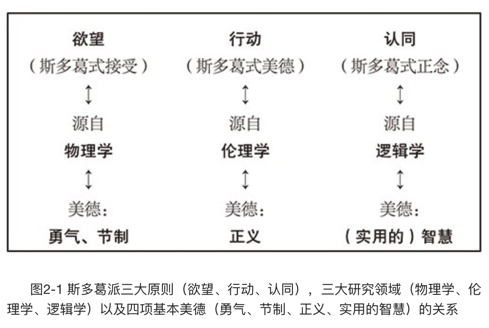
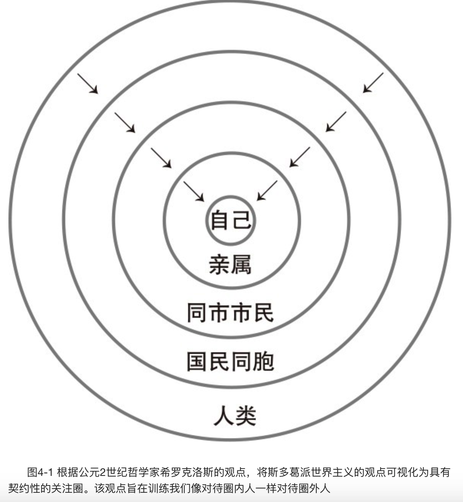

    作者: 马西莫·匹格里奇
    出版社: 未读·思想家·北京联合出版公司
    出品方: 未读·思想家
    副标题: 斯多葛哲学的生活之道
    原作名: How to Be a Stoic: Using Ancient Philosophy to Live a Modern Life
    译者: 王喆
    出版年: 2018-7-1
    页数: 224
    定价: CNY 49.80
    装帧: 平装
    ISBN: 9787559619617

[豆瓣链接](https://book.douban.com/subject/30206364/)

- [哲学的指引](#%e5%93%b2%e5%ad%a6%e7%9a%84%e6%8c%87%e5%bc%95)
  - [01 曲折之路：我们如何生活](#01-%e6%9b%b2%e6%8a%98%e4%b9%8b%e8%b7%af%e6%88%91%e4%bb%ac%e5%a6%82%e4%bd%95%e7%94%9f%e6%b4%bb)
  - [02 斯多葛哲学旅行路线图](#02-%e6%96%af%e5%a4%9a%e8%91%9b%e5%93%b2%e5%ad%a6%e6%97%85%e8%a1%8c%e8%b7%af%e7%ba%bf%e5%9b%be)
- [第一部 欲望原则：何物可求，何物不可求](#%e7%ac%ac%e4%b8%80%e9%83%a8-%e6%ac%b2%e6%9c%9b%e5%8e%9f%e5%88%99%e4%bd%95%e7%89%a9%e5%8f%af%e6%b1%82%e4%bd%95%e7%89%a9%e4%b8%8d%e5%8f%af%e6%b1%82)
  - [03 有些事我们能够掌控，有些事我们无能为力](#03-%e6%9c%89%e4%ba%9b%e4%ba%8b%e6%88%91%e4%bb%ac%e8%83%bd%e5%a4%9f%e6%8e%8c%e6%8e%a7%e6%9c%89%e4%ba%9b%e4%ba%8b%e6%88%91%e4%bb%ac%e6%97%a0%e8%83%bd%e4%b8%ba%e5%8a%9b)
  - [04 依从自然去生活](#04-%e4%be%9d%e4%bb%8e%e8%87%aa%e7%84%b6%e5%8e%bb%e7%94%9f%e6%b4%bb)
  - [05 和苏格拉底一起踢球](#05-%e5%92%8c%e8%8b%8f%e6%a0%bc%e6%8b%89%e5%ba%95%e4%b8%80%e8%b5%b7%e8%b8%a2%e7%90%83)
  - [06 善的本质：是神还是原子](#06-%e5%96%84%e7%9a%84%e6%9c%ac%e8%b4%a8%e6%98%af%e7%a5%9e%e8%bf%98%e6%98%af%e5%8e%9f%e5%ad%90)
- [第二部 行动原则：如何处世](#%e7%ac%ac%e4%ba%8c%e9%83%a8-%e8%a1%8c%e5%8a%a8%e5%8e%9f%e5%88%99%e5%a6%82%e4%bd%95%e5%a4%84%e4%b8%96)
  - [07 以品格与美德为准则](#07-%e4%bb%a5%e5%93%81%e6%a0%bc%e4%b8%8e%e7%be%8e%e5%be%b7%e4%b8%ba%e5%87%86%e5%88%99)
  - [08 至理名言：理智改变生活](#08-%e8%87%b3%e7%90%86%e5%90%8d%e8%a8%80%e7%90%86%e6%99%ba%e6%94%b9%e5%8f%98%e7%94%9f%e6%b4%bb)
  - [09 榜样的力量](#09-%e6%a6%9c%e6%a0%b7%e7%9a%84%e5%8a%9b%e9%87%8f)
  - [10 如何对抗残疾与抑郁](#10-%e5%a6%82%e4%bd%95%e5%af%b9%e6%8a%97%e6%ae%8b%e7%96%be%e4%b8%8e%e6%8a%91%e9%83%81)
- [第三部 认同原则：随机应变](#%e7%ac%ac%e4%b8%89%e9%83%a8-%e8%ae%a4%e5%90%8c%e5%8e%9f%e5%88%99%e9%9a%8f%e6%9c%ba%e5%ba%94%e5%8f%98)
  - [11 假如我们非死不可](#11-%e5%81%87%e5%a6%82%e6%88%91%e4%bb%ac%e9%9d%9e%e6%ad%bb%e4%b8%8d%e5%8f%af)
  - [12 应对愤怒、焦虑、孤独](#12-%e5%ba%94%e5%af%b9%e6%84%a4%e6%80%92%e7%84%a6%e8%99%91%e5%ad%a4%e7%8b%ac)
  - [13 论爱与友谊](#13-%e8%ae%ba%e7%88%b1%e4%b8%8e%e5%8f%8b%e8%b0%8a)
  - [14 实用主义十二条守则](#14-%e5%ae%9e%e7%94%a8%e4%b8%bb%e4%b9%89%e5%8d%81%e4%ba%8c%e6%9d%a1%e5%ae%88%e5%88%99)
    - [1.检验你的印象](#1%e6%a3%80%e9%aa%8c%e4%bd%a0%e7%9a%84%e5%8d%b0%e8%b1%a1)
    - [2.提醒自己世事无常](#2%e6%8f%90%e9%86%92%e8%87%aa%e5%b7%b1%e4%b8%96%e4%ba%8b%e6%97%a0%e5%b8%b8)
    - [3.保留条款](#3%e4%bf%9d%e7%95%99%e6%9d%a1%e6%ac%be)
    - [4.当下我该如何使用美德？](#4%e5%bd%93%e4%b8%8b%e6%88%91%e8%af%a5%e5%a6%82%e4%bd%95%e4%bd%bf%e7%94%a8%e7%be%8e%e5%be%b7)
    - [5.停下来，做一次深呼吸](#5%e5%81%9c%e4%b8%8b%e6%9d%a5%e5%81%9a%e4%b8%80%e6%ac%a1%e6%b7%b1%e5%91%bc%e5%90%b8)
    - [6.他者化](#6%e4%bb%96%e8%80%85%e5%8c%96)
    - [7.说话务必少而精](#7%e8%af%b4%e8%af%9d%e5%8a%a1%e5%bf%85%e5%b0%91%e8%80%8c%e7%b2%be)
    - [8.谨慎选好你的同伴](#8%e8%b0%a8%e6%85%8e%e9%80%89%e5%a5%bd%e4%bd%a0%e7%9a%84%e5%90%8c%e4%bc%b4)
    - [9.幽默地回应侮辱](#9%e5%b9%bd%e9%bb%98%e5%9c%b0%e5%9b%9e%e5%ba%94%e4%be%ae%e8%be%b1)
    - [10.别过多谈论自己的事情](#10%e5%88%ab%e8%bf%87%e5%a4%9a%e8%b0%88%e8%ae%ba%e8%87%aa%e5%b7%b1%e7%9a%84%e4%ba%8b%e6%83%85)
    - [11.说话时不带评价](#11%e8%af%b4%e8%af%9d%e6%97%b6%e4%b8%8d%e5%b8%a6%e8%af%84%e4%bb%b7)
    - [12.反思你的一天](#12%e5%8f%8d%e6%80%9d%e4%bd%a0%e7%9a%84%e4%b8%80%e5%a4%a9)

# 哲学的指引
## 01 曲折之路：我们如何生活
斯多葛派学说有一条核心原则：我们应该认识并区分自己所能掌控的事情和无法掌控的事情。

斯多葛派信徒接受普遍因果律这一科学原理：一切皆有缘由，宇宙万物皆按照自然规律发展变化。他们认为，世上没有鬼神之类的超自然存在，但他们同时相信宇宙的构造必然遵循他们所谓的`“逻各斯”（logos）`。“逻各斯”可以理解为上帝，有时也可以简单称其为“爱因斯坦之神”——一个简单却毋庸置疑的事实：自然是可以用理性来解释的。

## 02 斯多葛哲学旅行路线图
尽管斯多葛派学说一开始就被设计成一种相当实用的哲学，但如果没有某种理论框架作为基础，它就无法上升为“哲学”。这一框架就是——过上（幸福论意义上的）好的生活，人们必须了解两件事：世界的本质（引申开来还包括个人在世界中所处的位置），以及人类理性的本质（包括理性何时会失效，因为这种情况十分常见）。

首先，`欲望原则`（也被称作斯多葛式接受）告诉我们追求什么是合适的，追求什么是不合适的。之所以这么说，是因为有些事情在我们能力范围之内，有些在我们能力范围之外。我们只要对世界如何运作有所了解，便能领会这一关键区别，因为只有没受过物理学教育的人才会产生错觉，认为他们能够掌控自身能力之外的东西（也就是盲目乐观）。在斯多葛派四种美德中有两种和控制欲望相关：（面对事实并采取相应行为的）勇气和（管控欲望，使其同我们力所能及之事相匹配的）节制。

其次，`行动原则`（从关爱他人的意义上说，也叫斯多葛式美德）告诉我们在这个世界上该如何做人。它源于对伦理学的充分理解，伦理学所研究的是如何生活，依凭的美德是正义。

最后，`认同原则`（或称斯多葛式正念）告诉我们如何应对各种状况——对我们的第一印象采取认同或否定的态度。这一原则是通过研究逻辑学——怎样思考合理，怎样不合理——而得出的，依凭的美德是实用的智慧。

# 第一部 欲望原则：何物可求，何物不可求
## 03 有些事我们能够掌控，有些事我们无能为力
下面这段话是我在读《五号屠场》的时候看到的，它被装裱在比利位于地球的验光办公室中，也被铭刻在梦坦妮佩戴的盒式吊坠里：

>神啊，请赐予我内心安宁以接受我所不能改变的，请赐予我勇气以改变我所能改变的，请赐予我智慧以分辨这二者之间的差别。

这段“安宁祷文”浓缩了主人公贯穿全书的追求——比利极其渴望安宁，并且认为只有意识到过去的事无法改变，能左右的只有当下，这样才能获得安宁。认识到这一点需要勇气——不是打仗时那种勇气，而是一种更加微妙，或者说更加重要，能让你最大限度上过好这一生的勇气。

还有更古老的说法：“充分利用我们所能掌控的事物，其余的顺其自然。有些事由得我们做主，有些事由不得我们左右。看法、冲动、渴望、厌恶——简而言之，我们的所作所为，自己能够做主。肉体、财产、名誉、职位——我们所作所为之外的事，由不得我们做主。”这段话见于爱比克泰德《手册》（The Enchiridion）的开篇。

## 04 依从自然去生活
亚里士多德认识到我们生来便兼具社会性与理性，斯多葛派由此得出：人类的生活就是将理性运用到社会生活中。

斯多葛派转而强调社会性，其本质上认为人类生活的意义在于运用理性，尽力创造出一个最好的社会。

人类天性的话题：爱比克泰德向我们传达的意思是——人类最基本的特点是社会性，而所谓`社会性`，不仅仅指喜欢他人的陪伴，从更深层面上看，没有他人的帮助，我们将无法存在；言下之意就是，当我们为国家组织服务时，实际上（可能是间接地）就是在让自己获益。这种说法深刻地阐释了人性，并且与爱比克泰德死后16个世纪的发现不谋而合，即事实上人类演化成了一种具有社会性的灵长类动物，与我们演化树上的表亲具有相同的本能——具有适应性强，亲社会的本能。

把斯多葛派关于这些问题的思想整合得最好的人或许是希罗克洛斯（Hierocles）——另一位生于公元2世纪的斯多葛派哲学家。他把这些内容收录在《伦理学要素》一书中，不幸的是，这本书只留下了部分残卷。以下是希罗克洛斯的说法：

>可以说，我们每一个人都被限定在许多圈子中……每个人都把自己的思想描述为中心，而第一个圈子，便是最接近于中心的那个圈子……第二个圈子，距离中心稍远一些，但也包含了第一个圈子，其中涵盖了父母、兄弟、妻子、孩子……在此之外的圈子包含我们日常接触的人，再往外的圈子包括同一个部族的人，再往外包括一个国家的同胞……但在最外围，最大的圈子包含着其中所有的圈子，囊括了全人类……人们需要严格自律，适应每一个群体（从某种意义上说就是圈子），同时又不偏离中心，在所有圈子中做到游刃有余。

身为斯多葛派信徒，希罗克洛斯有一种务实的倾向，他甚至提出要怎样做才能帮助我们内化不同圈子里和自己有关的人。

斯多葛学派完善了这一道德发展的理念，并将其称为oikeiôsis，这个词通常被翻译为“了解”或“占用”别人的担忧，即将别人的担忧视为己有。由此，他们（以及比他们更早并对他们影响很大的犬儒学派）塑造并使用了一个迄今仍对我们现代语汇影响至深的词：`世界主义（Cosmopolitanism）`，字面意思就是“做世界公民”。

## 05 和苏格拉底一起踢球
斯多葛派伦理不仅规范了我们的所作所为——我们的行为——而且更广泛地规范了我们如何凭借品格来指引现实生活。我们生活的社会环境太过复杂，以至于我们无法总是做对的事，我们甚至不能做到经常把事情做对，从而自信满满地知道应从哪一件对的事开始做。从不同角度看待问题的原则，在大多数情况下会对我们提出不同的要求，因此我们需要一个伦理维度（动物苦难、环境破坏、服务员的待遇）。另一些要求则更加实际。（我要吃饭，而我的食物从哪儿来？我要存钱，而我选择哪家银行？）斯多葛派为了使人们力所能及地解决好由此导致的冲突，从而发明了一些工具，这些工具不必完美，也不必提供具体的答案：“（爱比克泰德说）愚蠢的人才会相信世界黑白分明、正邪相对，一眼便能分辨善人恶人。这并非我们所生活的世界，假装生活在那种世界中是十分危险且愚不可及的。”

## 06 善的本质：是神还是原子
记得有一天，他的一名学生伤了腿，然后怨天尤人，说：“我以后就要变成瘸子了吗？”他告诉我他当时的回答，可以说十分就事论事：“奴隶，你要为了一条瘸腿控诉全宇宙吗？”（爱比克泰德也经常叫我“奴隶”或“小子”，尽管有些政治不正确，我倒是觉得这叫法既讨人喜欢也无从反驳）。

虽然爱比克泰德可说是历史上最虔敬的斯多葛派信徒了，但是他肯定不会觉得神应该为人类的种种杂事烦心（更别说为姬蜂科的昆虫了——就算神知道它们，也不会去操那份心的）。这一点从他的调侃中展露无遗——他讽刺某人厚颜无耻、装腔作势，妄想整个宇宙都应该为了让他的腿不再疼而重新安排。更重要的是，许多斯多葛派信徒并不相信任何类似当代一神论中神的概念。他们更喜欢用“逻各斯”这个词，它可以解释为“神的道说”（正像继承诸多斯多葛派思想的基督徒所理解的那样），或者可以看成一种存在于宇宙空间里的天道。更简单地说，这是一种相当直观的看法，即无论宇宙如何形成，它都能有理性的解释。

从这个意义上讲，斯多葛派信徒可以被认为相信泛神论（或者说是万有神在论），也就是说，他们认为神是宇宙本身，因此我们都具有神性。而人与动物的唯一区别就是，我们可以拥有神（宇宙）的最高属性——理性。这就解释了为何运用理性解决问题才是正确的生活方式。

# 第二部 行动原则：如何处世
## 07 以品格与美德为准则
苏格拉底认为，**智慧就是“主善”**，这一观点很好理解，因为它是唯一在任何情况下都良善的人类能力。我们不难想象，其他善的事物只存在于特定的情形下。一旦情况改变，这一事物可能，或者说应该就要被替换掉。

斯多葛派学说吸纳了苏格拉底对美德四个层面的分类，他们认为这是四种紧密难分的品格特质：**（实用的）智慧、勇气、节制、正义**。实用的智慧让我们做出抉择，提高幸福感，过上（从道德上来说的）美好生活。勇气可以是身体上的，但更广泛地说是指道德方面——比如说，具备像普利斯库斯和马拉拉那样面对危难镇定自若、泰然处之的能力。节制让我们能够控制自己的欲望与行动，从而免于放纵。对于苏格拉底和斯多葛派信徒而言，正义并不是描绘社会应该怎样运转的抽象理论，而是以尊严和公正对待他人的具体实践。

在文化相对主义盛行的今天，不同文化中美德定义的相似性远远超出了我们的预期。凯瑟琳·达尔斯伽德（Katherine Dahlsgaard）、克里斯托弗·彼得森（Kristoffer Peterson）、马丁·塞利格曼（Martin E.P. Seligman）等人进行了一项研究，探讨了佛教、基督教、儒家学说、印度教、犹太教、道教，以及他们所谓的“雅典哲学”（主要是苏格拉底、柏拉图、亚里士多德三人的思想）如何定义美德。他们在所有这些宗教-哲学传统中发现了相当惊人的一致性，并确立了一套六大“核心”美德体系：

- 勇敢——情感力量，包含磨炼意志，从而在面对内忧或外患的时候达成目标。例如勇气、毅力、可靠（诚实）。
- 正义——公民力量，构成了健康社区生活的基础。例如公平、领导才能、公民权利与义务、团队合作等。
- 人性——人际力量，能够“抚慰和结交”他人。例如爱、仁慈等。
- 节制——免于放纵的力量。例如宽恕、谦虚、审慎、自控等。
- 智慧——认知力量，包含获取和使用知识。例如创造力、好奇心、判断力、洞察力（向他人提供建议）等。
- 超凡——与更广阔宇宙建立联系从而提供意义的力量，例如感恩、希望、灵性等。

在以上六种美德中，有四种与斯多葛派美德毫无二致。斯多葛派信徒也接受了“人性”和“超凡”的重要性，尽管他们并不将其视作美德，而是看作对他人（人性）和对广阔宇宙（超凡）的态度。斯多葛派所说的人性扎根于“视为己有”这一概念，以及赫罗克莱斯与此相对的`“关注圈”`概念——这些都是犬儒主义和斯多葛派学说中`“世界主义”`概念的中心：该观点认为我们应该像对待亲人一样对待朋友、熟人、同胞乃至全人类（一些斯多葛派信徒甚至暗示，应该将所有生物都包含在内）。

至于超凡，斯多葛派理论中的`逻各斯`蕴含着一种洞察力，这种洞察力能让我们看到自己同宇宙之间的关系，并了解自己居于宇宙中的何处。

## 08 至理名言：理智改变生活
在对话录《欧西德莫斯篇》（Alcibiades Major）中，柏拉图借苏格拉底之口说：“智慧是人类唯一的善，无知是唯一的恶。”这句话一直被误解。柏拉图用的词是`amathia`，事实证明它的确切含义并不是“无知”。哲学家舍伍德·贝兰吉亚（Sherwood Belangia）就这一话题做了广泛论述，这很值得我们探讨。

贝兰吉亚一开始引用了苏格拉底与其友人欧西德莫斯之间的对话（摘自《欧西德莫斯篇》）。欧西德莫斯是雅典的将军、政治家，可以说他是经历过大风大浪的。两人的对话从道德角度展开：

>苏格拉底：但是如果你感到困惑，那按我们先前所说的，你是否不仅不了解那些最伟大的事情，而且没有意识到自己的无知？ 
>
>欧西德莫斯：恐怕是吧。
>
>苏格拉底：哎呀！欧西德莫斯啊，你这是遭了什么罪啊！我都害怕把你的罪名说出口，但既然当下只有我们两人，我就开诚布公吧。我的好友啊，你陷入了深深的愚昧，变得愚不可及，你用自己的话谴责自己；而这似乎也就导致了你未接受教育就急匆匆地投身政治。遭这罪的也不止你一个，那些执掌城邦事务的人几乎个个如此，不过你的保护人伯里克利算得上是例外。

“无知”和“愚蠢”这两个词在希腊语中分别是agnoia和amathia。在雅典人中，欧西德莫斯受过最高等的教育——这里的“最高等的教育”就是我们平常说的意思——因而他显然聪慧过人，当然这里的“聪慧过人”也是我们平常说的意思。所以不论英语中的无知（ignorance）还是愚蠢（stupidity）都不能真正表达出苏格拉底的意思。相反，欧西德莫斯缺少智慧：他还未接受适当的“教育”就“急匆匆地投身政治”。也就是说，**他没有那种来自美德的智慧**。

`愚蠢（amathia）`一词最贴切的解释是缺少智慧，它的反义词是sophia——哲学（philosophy）一词的词根。

贝兰吉亚对此做了很好的补充：“agonia一词字面义为‘不知道’；amathia字面义为‘不学’。‘不学’除了没有能力学习之外，还指不愿意学习……罗伯特·穆齐尔（Robert Musil）在《论愚蠢》一文中区分了两种形式的愚蠢：一种源于缺乏自然能力，他称之为‘光荣之愚’；而另一种则险恶得多，他称之为‘聪明之愚’。”

贝兰吉亚还引用了哲学家格伦·休斯的论点，休斯对amathia的概念进行了进一步阐释，并将其与纳粹德国联系在一起。对休斯而言，“聪明之愚”并不是“像傻子那样极度缺乏智慧，因为聪明之愚只是想要去达成无权达成之事”。聪明之愚“不是心理疾病，但是极为有害；是一种危险的思想病，会危及生命本身”。其危险在于“并非无法理解而是拒绝理解，（并且）无论通过理性论证，还是通过积累大量数据和知识，抑或体验全新的不同感受，都无法治疗或逆转这一疾病”。

因此，amathia似乎是英语中缺少的关键词语。与智慧相反，它是一种对与其他人类相处的不了解，这种不了解导致除此之外身心健全的聪明人犯下恶行。而且，具备amathia人格的人无法简单地被理性论证说服，因为他们虽然能够理解论证，但是人格有着致命缺陷。而正如斯多葛派所言，人格是随着时间的推移，由本能、环境影响（特别是家庭引导），以及理性结合而成的。

`认知失调`，是指某人意识到自己的两个判断之间存在矛盾，而这两个判断又同等正确的情况下产生的一种极为不适的心理状态。人们不愿经历认知失调，就如同爱比克泰德所说的人们不愿明知故犯。于是，他们为了缓解不适而胡乱找个自己认为可靠的，能够推导出正确判断的理由，哪怕这些理由和判断在他人看来明显是牵强附会。

由于深陷amathia状态，即不知道什么才是对自己真正有益的，作恶者不知道他首先伤害的是自己，伤得最深的也是自己。对他自己有益的事和对全人类有益的事之间其实并无分别。用斯多葛派的观点来说，即运用理性来改善日常生活。

## 09 榜样的力量
1965年9月9日，就在前一年，随着“北部湾事件”的爆发，美国开始全面介入越南战争。这一事件着实古怪，美军军舰于夜间发了几枚空炮，随后美国总统林登·约翰逊将其作为官方借口，下令对北越政权采取“报复性”轰炸。当时正担任美国海军战斗机第51中队指挥官的斯托克代尔其实就在北部湾，对于此事件他评论道：“有什么可报复的？”随后被严令保持沉默。

9月9日，斯托克代尔驾驶的战机在北越上空被击落，随后被捕，关到了所谓“河内希尔顿”的战俘营中，一关就是7年半。在此期间，他遭受了非人的对待，被拷打、折磨，常常戴着脚铐被关在一间2.5平方米的牢房里，连窗户都没有。尽管处境异常艰难，斯托克代尔依然设法将他的狱友们组织起来，为他们量身打造了一套日常行为规范。另外，为了不被北越当局利用，成为其宣传工具，斯托克代尔先是用剃刀把头皮割破，自毁容貌。发现这招并不奏效后，他用凳子猛砸自己的脸，砸得鼻青脸肿，让自己对敌人没有利用价值。有一次，为了避免被拷打从而暴露战友们的地下活动，他甚至选择了割腕。最后，斯托克代尔终于获释重回美国，而当时的他已经奄奄一息。回国后，他的身体逐渐复原，并于1976年获得了荣誉勋章。

斯托克代尔接受采访的时候，有人问他哪些人没能从“河内希尔顿”中生还，对此斯托克代尔答道：

>哦，很简单，乐天派。对了，就是那些说“等到圣诞节我们就能出去了”的人。他们眼睁睁看着圣诞节来了又去。于是他们又说“等到复活节我们就能出去了”。接着，眼睁睁看着复活节来了又去。接着是感恩节，然后又是圣诞节。他们就这样在伤心绝望中死去……这件事教会了我很多。你不能搞混两样东西：一是你终将胜利的信念——这是你最输不起的；二是训练自己直面残酷现实——无论现实有多残酷。

采访者将这段话称为`“斯托克代尔悖论”`（The Stockdale Paradox），但他也可以将这一思维模式寻根溯源——源头就是爱比克泰德。

他在后来说是爱比克泰德给予他道德的力量，帮助他克服了监狱中的种种折磨，并且让他保持理智清醒的头脑，从而认识到什么是自己能做的，什么是自己无能为力的，从而让他在越南活了下来。这是斯多葛派控制二分法在极端情况下的应用范例。

斯托克代尔明白一条关于战争的真理，而这条真理也能推广到人生诸事：无论面对敌我双方的武器（以战时为例），还是面对日常生活中的不同环境，掌握道德制高点并保持自尊，比实打实的现实更为重要。但这样做需要一番心理斗争，这也正是斯多葛派学说特别有用的原因：斯多葛派学说本身就是一场心战，专门让人们保持道德制高点和自尊。

那一年的9月9日，斯托克代尔驾驶的飞机被击落，他必须第一次面对真正的考验。对于此事，他如此回忆道：“从驾驶座上弹射出来之后，距离在前方小村庄主街上降落大约还有30秒，在这段时间里，我尚能以自由之身做最后的声明。我做的这一声明对我帮助很大，我当时轻声对自己说：‘至少要在那里待上5年。该离开科技世界，进入爱比克泰德的世界了。’”

在他着陆并落到敌人手中之时，斯托克代尔对爱比克泰德的控制二分法了然于心，尤其明白如何掌控自己人生的道德制高点。短短几分钟之内，他就从一个受人敬仰的、指挥着100名飞行员和1000多名士兵的军官，“摇身一变”，成了受人诋毁的罪犯。斯托克代尔刚把降落伞从身上快速地解下来，就被12个男子围了起来：“他们对我又摔又打，拳脚相加，一直打了大概有3分钟时间，直到一个戴着木髓帽的男子吹了声口哨才罢手。我有一条腿伤得很重，当时我就觉得这条残腿肯定要跟着我一辈子了。后来证明，我当时的直觉是对的。”他随后回想起爱比克泰德还是奴隶时被第一个主人打断了腿，从而终身残疾，他还记得爱比克泰德对此是这么评价的：“跛足是腿的障碍，而非意志的障碍。记住这句话，今后无论发生什么，都对自己这样说。因为你会发现，它可能会成为其他事情的障碍，但其实不会成为你的障碍。” 斯托克代尔有7年半的时间来好好体会这位希腊哲学家的话无比正确。

当斯托克代尔被带到“河内希尔顿”时，他便下定决心践行爱比克泰德所提出的建议：竭尽所能演好命运给他安排的角色。他时刻谨记，只有当他向两件事屈服时，敌人才会获胜，那就是恐惧和丧失尊严。斯托克代尔对那群抓他的人，尤其是那个负责拷打他的人做了研究。斯托克代尔发现拷打他的那个人并不邪恶，而只是在做他自认为正直的工作，如果爱比克泰德和阿伦特在那里，他们也会得出同样的结论。有一点可能挺令人吃惊的，即斯托克代尔并没有对那个拷打他的人产生憎恨，反而产生了敬意。负责拷打的人的工作是击垮囚犯的精神，向他们灌输恐惧。深知如此的爱比克泰德得出了唯一可能的回应：“当一个心意已决，雷打不动，既不求死亦不求生的人出现在暴君面前，还有什么能让他恐惧吗？没有。”

斯托克代尔的另一个同伴豪伊·拉特利奇最终在活着回家后进修了硕士课程并写了一篇论文，研究酷刑和关禁闭哪个更可能击溃人的精神。为了收集研究资料，他向自己的战友以及其他曾经沦为战俘的人发了调查问卷。结果令人震惊——那些被禁闭不到两年的人认为酷刑是最糟糕的，而那些被单独关押了两年以上的人说后者的经历比遭受拷打更为难熬。那是因为一个人一旦长期独处，便会迫切地需要朋友，而不管对方是谁，意识形态、政治立场如何。根据爱比克泰德的教导，斯托克代尔解释了拉特利奇的发现——真正摧毁人类的不是身体上的疼痛，而是羞耻。

在柏拉图谈话录《美诺篇》（Meno）中，美诺问苏格拉底：“苏格拉底啊，你能告诉我人的卓越能被教会吗？或者，如果无法被教会，是否能通过训练而习得呢？再或者，如果既无法通过训练习得，又无法被教会，那美德是天生的，还是可以通过其他方式获得？”经过漫长的讨论，苏格拉底总结出“卓越”（或者美德）在原则上可以被教会，但是由于不存在能够教授卓越的老师，所以实际上是做不到的。那么，这意味着拥有卓越的人可能在出生时就获得了这种禀赋。然而，亚里士多德对此有不同的看法。他将道德美德和智力美德严加区别，前者源于自然性格和后天成长养成的习惯，而后者则来源于成熟心灵的反思。因此，美德有了三个来源：一些美德是我们生而有之的；一些美德源于习惯，在幼年尤其如此；还有一些美德可以通过智力获得，因此是可以被教会的。

斯多葛派持有一种注重发展的道德模式，认为我们天生拥有一种能力——从儿时开始便不仅会考虑自己，还会考虑那些照顾我们的人以及日常与我们接触的人。然而，一旦我们成长到具备理性思考的年纪（大约七八岁时），我们便开始进一步通过两种方式塑造具有美德的性格。这两种方式分别是习惯和（在人生较为靠后的阶段）清晰的哲学思考。

## 10 如何对抗残疾与抑郁
拉里·贝克是一位退休哲学教授，曾任职于威廉玛丽学院（College of William and Mary），写过一本现代斯多葛学派思想概论。

拉里之前患过脊髓灰质炎，并在之后的几十年间饱受后遗症折磨。通过拉里，我又了解了他为国际脊髓灰质炎后遗症健康组织所录制的一段视频，他在2006——2009年担任该组织的会长兼主席。我正是通过观看这段视频才完全明白为什么拉里·贝克会成为深得斯多葛派学说精髓的现代榜样。

他提出了一些建议来帮助人们建立一种关于生活的个人哲学，无论这些人是否残疾。

第一，拉里意识到了主动力的重要性。对他来说，感觉自己不是病人，而是在世上具有主动权，这是至关重要的事情。然而，他必须完成一些艰巨的任务——例如，**首先要做一个能够主动影响世界的人**。我们的生命从没有自理能力的婴儿（他称为“入门级人类”）开始，当时的我们都算是“病人”，完全依赖于他人。慢慢地，在摸爬滚打中，我们学习如何去主动影响世界。当我们长大成人，掌控自我人生，索取并获得了自己的主动力（所有这些，都与我们现在熟悉的斯多葛派道德发展学说完全符合）。对拉里来说，最具毁灭性的残疾，使我们的主动力被严重限制或完全剥夺。然而，他说，即使脊髓灰质炎使你完全瘫痪，瘫痪本身也不会永久剥夺你的主动力，只不过你可能要像他那样，缓慢而艰难地把它重新夺回来。事实上，他将应对残疾这件事，看作重新夺回主动力的过程。拉里指出，在你重新获得主动力后，你的地位和其他人一样，你必须成为主动影响世界的优秀的人。他说，这需要将下列因素组织起来：价值观、偏好、目标、思考、决定、行动。如果这些要素不连贯、不完整或较弱，那么无论你身体状况如何，你都会陷入瘫痪。

第二，我们要关注的是人的健全能力，而非残疾。拉里已经学会忽视他的残疾，或者至少把它看成不可取的无关紧要之物。这就需要掌握一些其他的技能，比如心无旁骛地把注意力集中在能力上。对于每个人来说，重点应该放在我们能做到的事情上，而非我们做不到的事情上。

我们还需要实践苏格拉底布置的任务：“认识你自己。”**认识我们的生理与心理能力——包括认识我们的极限。对自己的能力抱着无知（甚至自欺欺人）的态度是非常危险的**。我们要对自己所能做到的事保持最新的、最准确的认识。这不仅取决于我们的能力，也依赖于不同时期我们所处的特定（和可变的）物质环境及社会环境。拉里还建议我们训练自己去察觉自身能力和行为之间何时会失调。我们必须建立一套所谓的内部警报系统，它能告诉我们什么时候应该放弃隐忍，开始（或重新）由自己做主。拉里从经验中学到，认识自我十分困难，不仅需要很多实践，也需要客观看问题的能力。

第三，我们要制订人生规划。为此，我们必须总览人生，制订计划，得出“将一切都列入考量”（哲学家都喜欢这么说）的结论。这不是让你早早地找出自己一辈子想做的事，然后按部就班地实施计划，这种模式的计划十分幼稚。相反，拉里建议我们养成一个习惯：**思考什么事对我们至关重要和做这些事的最佳方式是什么，并根据我们的能力和环境的变化不断修正生活计划**。我们的这份动态计划，应该前后连贯、志存高远、切实可行、可以修订，最好还能带来生活满意度的普遍提高。

第四，我们应当**尽力做到内心和谐，即不断做出努力，协调我们的（动态）生活计划的各个组成部分。我们要协调精神体验和理性体验，协调欲望和需求，协调理智和行为**。

最后，拉里提醒我们：要当心难以逾越的“高墙”。我们碰壁的时候，得知道它的存在，最好能在狠狠碰壁之前就看到迎面而来的这堵墙。根据拉里的说法，诀窍在于知道何时退出：早一分钟也不行，晚一分钟也不行。避开那堵墙不仅需要我们在一生中不断了解自己的能力，还需要我们确定挡在自己面前的确实是堵墙，还是看起来像堵墙。“如果它只是一个幻象，那么你就可以通过它；如果不是，那你就得想方设法规避它，或者彻底改变前进的方向。”他补充道，问题是我们似乎很难分辨哪些高墙值得担心，哪些应该试着拆除。拉里处理这个问题的方法是回溯本源。首先，**他会寻找自己的基本人生目标，自己所承担的义务：对结婚46年的妻子以及他俩共同生活目标的义务，对完成他职业目标的义务，对为所有人创造一个真正意义上物质丰富、友好的社会环境所承担的义务**。只有当这些义务岌岌可危，遇到一堵真正的高墙并且狠狠碰壁之后，才会愿意停止。

运用自己的哲学处理困境的第二位现代斯多葛信徒，是安德鲁·奥弗比，而他对抗的是抑郁症。

通过了解斯多葛派学说，安德鲁学到了将抑郁转化为优势。他解释道：“抑郁的人自我意识都很强。确实，他们的自我意识太强，而且过于消极，所以经常因为和自己的理想稍有不符，就看不起自己。即便他们认为自己所在的世界充满缺陷，还特别浪费人力资本，也会担心自己不够完美而情绪低落。抑郁还有一部分原因是对过去的失败纠缠不休，不断回忆曾经发生过的事情或所处的环境，更有甚者，彻底丧失自信。这种思维方式与我们当下还不错的结果是对立的——大多数时候是这样。它会造成当下的失败，并恶性循环，周而复始，难以断绝。一次失败会导致下一次失败，而下一次失败又会导致更多次失败。”

安德鲁一旦意识到消极思维和抑郁症之间的联系，立马回想爱比克泰德的控制二分法。我们能控制的事包括我们自身的决定和行动；我们控制不了的事情，包括我们身处的环境、他人的想法和行为。

安德鲁发现斯多葛派学说还有一个特别有益的地方：他们强调把逆境当作生活的训练场。斯多葛派渴望与敌手对峙，因为这是自我提升的途径。正如现代斯多葛派学者比尔·欧文所说：“我在实践斯多葛派学说过程中最有趣的自我提升，就是我从一个惧怕侮辱的人摇身一变，成了侮辱鉴赏家。一方面，我会搜集侮辱——遭到侮辱时，我对其进行分析、归类。另一方面，我盼望着被侮辱，因为它给我机会，让我打好‘侮辱比赛’。我知道这听上去有点儿怪，但是实践斯多葛派的一个结果就是：你会寻找机会把斯多葛派的方法付诸行动。”

安德鲁的亲身体验，还强调了斯多葛派实践里另外两点对抑郁者有帮助的地方，第一个方面，就是爱比克泰德坚称我们应该审视“第一印象”——我们对呈现在我们面前的事物的第一反应，而且要明白在很多情况下这些事和我们的印象是有出入的。想想欧文的“侮辱比赛”：人们所说的不过是他们的观点，可能有理有据，也可能含血喷人。无论说话者的态度如何，要不要将他们的言论理解为侮辱，完全取决于我们自己。有人叫我胖子，我小时候的确没少被人这么叫过。那么，如果他说的是真的，会怎样？我在生命的某一个阶段的确胖过。在这种情况下，为什么要觉得别人冒犯了我呢？别人是在陈述一个事实，这难道也能算侮辱吗？反过来说，假如他们说的不是真的，又能怎样？那个想侮辱我的人很幼稚而且不懂事。这样的话，又怎么能伤到我呢？相反，他才是这场冲突里的失败者。

安德鲁说的第二个很有用的方面——有些出人意料——就是现代斯多葛派所说的“想象消极的事”。作为又一种被现代认知行为疗法和其他心理疗法采用的基本思想，它要求人们经常关注可能会发生的糟糕情况，还有不断提醒自己事实并没有看起来那么糟，因为你拥有解决它们的内在力量。想象消极的事的练习，就是古罗马人所说的`“坏事预演”（premeditatio malorum）`，比如把注意力放在被人超车这种小事上，或者关注爱人死去甚至自己死去这种大事上。

至于第三位现代斯多葛信徒，我甚至都不知道此人的姓名，我读到的文章是匿名的。在写这篇文章的十年前，她被确诊为自闭症谱系障碍（ASD）。意识到自己的学术梦想就此终结，她患上了抑郁症——不是因为这是她从事历史学家或相关工作的外在障碍（虽然这些障碍也十分难以克服），而是因为她内心的障碍：她根本无法应对现代学术界的社会环境。

塞涅卡在文章里谈到自我认识，他认为有时候我们自我提升最大的阻碍就是自己：我们知道自己应该去哪儿，自己想去的地方，却无法下定决心踏上旅程。这个观点明显引起了这位匿名作者的共鸣：“一些谱系障碍者的问题是知道什么对自己有益。据报道，一些自闭症患者大半辈子都找不到人生目标。”

斯多葛派哲学让这位自闭症作家感同身受的第二个方面，是塞涅卡对于人类存在的社会维度的坚持。在一篇著名的文章中，他说道：“我们彼此之间的关系就像石拱，如果不相互支撑，就会坍塌。”以一种有效的社交方式同他人建立联系，仍是这位作家面临的最大挑战，但至少，在斯多葛派学说的引导下，她头脑中有了更为明晰的目标。并且，就像她每次寻求帮助时塞涅卡反复对她说的那样：“我不知道自己能不能进步，但我宁愿不成功，也不愿没有信念。”

所有重要的斯多葛派作家，都坚持认为我们必须反思自己当下的处境，切实地用不同的，更理性、更有同情心的眼光看待事物。

# 第三部 认同原则：随机应变
## 11 假如我们非死不可
爱比克泰德提出了三个相关联的观点。

第一，我们与其他生物一样：正如玉米穗注定会在阳光下成熟，我们也注定会面临“收割”。相较于今天的大多数人，斯多葛派比较倾向于从字面上看待“命运”，因为他们相信某种宇宙的意志。但即使从完全现代科学的观点来看，我们也仅仅是一颗宜居行星上数以百万计的物种中的一员，而在宇宙中这类行星可能有数十亿颗。

他讲的第二点至关重要：我们之所以会对将来要死这一事实忧心如焚，也许是因为我们拥有深入思考这个问题的能力，这是玉米和其他大多数物种所不具备的。当然，知道某件事并不能改变它的本质——只能改变我们对它的看法。所以，这条思路又回到了斯多葛学派控制二分法的基本思想：死亡本身并不受我们的控制（它不以这种方式发生，就会以那种方式发生），但如何看待死亡，肯定在我们的掌控之中。因此，这也是我们可以努力且需要努力的方面。

第二点又引出了第三点：首先，将研究人类事务和研究马相提并论。爱比克泰德提醒我们，倘若我们害怕死亡，那是出于无知：如果我们能够像驯马师了解马一样对人类自身状况做到进一步了解或真正意义上的理解，那我们面对死亡的态度将有所不同。

爱比克泰德比其他斯多葛信徒更相信天意，即“宇宙的总计划”。然而，该计划并非由某个会回应祈祷或关心个人命运的人格神来制订。爱比克泰德运用另一个类比向我解释了这个概念：“（例如）脚这个东西，我会说保持脚干净是天经地义的事。但如果我们把脚看成人体的一部分，而不是割裂来看，那么它行走在污泥中，踩踏在荆棘上，有时为保护整个身体而被锯掉都是合适的；否则它将不能被称为脚。我们必须以同样的眼光看待自己。”这就解释了为什么有人会感受到某种“召唤”——让自己脱离宇宙的总体。但是我们怎么才能感受这种召唤呢？我们如何解读宇宙的意志呢？当然是运用理性。因此，审时度势，确定自己是否听到了所谓“宇宙的召唤”，完全由我们说了算。换言之，是穿过敞开的门走出去，还是留下再抗争一天，我们自己的判断终将给出答案。

我列举了芝诺、小加图和塞涅卡的例子，都是以史为鉴，因为他们的故事说明了走出那扇敞开的门的三种不同的原因。芝诺是由于难以忍受的痛苦与日俱增，此外他还认为自己已经对社会百无一用——贝齐·戴维斯也经历了类似的情况。小加图为了捍卫政治事业，坚守原则，走出敞开的门。塞涅卡为了维护个人尊严和保护幸存者，采取同样的措施。（詹姆斯·斯托克代尔也可以作为一个例子加入他们的行列。）时至今日，以上部分自杀原因依然在军事、道德、医学领域有争论，因此，斯多葛派对于促进我们发展世界观具有巨大贡献。

## 12 应对愤怒、焦虑、孤独
让我们像一个真正的斯多葛派那样冷静、理智地，怀着真实的预期来处理人生的问题。

当然，这种态度也是我在跟好友爱比克泰德的一次谈话中学到的，当时他对我说：

>昨天，我把一盏铁质台灯放在家里的神像旁，接着突然听到一阵声响，我便冲到了窗前，发现台灯已经被人搬走了。据我推断，那个偷走灯的人向某些看似合理的感觉屈服了。我的结论是什么呢？我对自己说，明天买一盏陶质台灯吧。小偷的警觉性比我强，所以我丢了灯。但他也付出了代价：他为区区一盏灯做了贼人，为一盏灯打破了信仰，为一盏灯沦为禽兽。

首先，我注意到他并没有因为失窃心烦意乱，或是愤怒不满，而是就事论事。此外，他立即得出了几个实用的结论：他所失去的东西很容易被替代（明天我会换盏灯），另外，时时警惕、日日防贼并不值得，所以如果想避免再次遭窃，也许他应该选择更为便宜的家具（陶质而非铁质的台灯）。然后，他分析了其中的深层含义。爱比克泰德承认，窃贼一定是屈服于某些看似合理的感觉，他一定认为自己做的事情很值得。但我们这位圣贤并不赞同窃贼的逻辑，确定这种结论问题很大：他得到了一盏铁质台灯，但作为交换，他失去了更珍贵的东西——正直。

美国心理学会（APA）为愤怒和沮丧的人提出的建议给了我们一些启发，这很像斯多葛派早期的直觉感知理论——当然，心理学会的建议背后有大量实证研究做支撑。首先，他们建议进行一整套放松训练，如深呼吸（用膈进行腹式呼吸）的同时，喊一句简单又管用的口号。你也可以借助意象，想象一个平静、舒适的情境，同时做些简单运动（如瑜伽拉伸）。事实上，整本《手册》（阿利安对《论说集》的总结），就可看成是爱比克泰德《论说集》的纲要，以供我们在冲动时使用。而塞涅卡明确提出：一旦感到体内涌现一股无名之火（一种暂时的疯狂状态）要马上深呼吸，出去散散步。他在给朋友鲁基里乌斯的信中也说过，就算老了以后也要经常锻炼，不光因为锻炼有助于身体健康，还能让我们心绪平和。我发现这些建议都特别有效：每当我意识到自己情绪要失控时，最喜欢的反应是借故逃跑，藏到某个可以深呼吸的安静场所（洗手间也行），再在心里默念最喜欢的箴言：“一忍再忍！”多么标准的斯多葛警句啊。

另外还有一则建议是**将“要求”转化为“渴求”，认识到世界不会因为我们的喜好而迁就我们**。这与比尔·欧文提出的现代斯多葛派思想非常相似，他提出要学会把目标内化：我渴求（不是想要，也不是需要）升职，所以我会尽力做到让自己配得上这件事。而其实我能不能升职，并不在我的掌控之中，这取决于我意愿以外的很多因素。正像美国心理学会一篇关于愤怒管理的文章（爱比克泰德很可能早就写过了）提醒我们的：“逻辑能战胜愤怒，因为即便愤怒情有可原，它也会很快让人失去理智，所以，用冷酷、严谨的逻辑帮助自己吧。”

接着，文章建议我们**亲自参与解决问题（而不是一味抱怨）**，但也提醒我们避免一个常见谬误：我们必须意识到，和常见的社会文化观念相反，不是每个问题都有解决办法。因此，我们不要对自己无法解决所有问题太过苛责，只要在当时情况下尽力而为就行了。

还有一个处理愤怒的重要方法，美国心理学会将其归纳为 **“更好地沟通”，尤其是与那些惹怒你的人更好地沟通**。很有趣，这个建议很大一部分还是依赖斯多葛派的行为准则——应该尽可能心平气和、准确无误地描述惹怒我们的情境，爱比克泰德称之为认同/不认同我们的印象，就像我丢钱包那时所做的一样。相较于对他人的话立刻做出回应——绝非上策，这样做只会火上浇油——我们可以稍等片刻，重新理顺他人的话，花些时间去分析可能潜藏的道理，然后才去回应。

心理学专家还给出了更多的建议，包括：改变你所处的环境——例如从问题情境中抽身而出，稍作休憩；如果当下不是处理问题的最佳时机，那么就改变你与他人互动的时间，但是一定要确保择日再谈，说明你没有逃避问题；如果可以，避免让自己直面烦恼的根源；找其他途径做你该做的事情，这样可以减少冲突的机会，同时让你达到目标。这些建议没有全部收录在古代斯多葛派文本之中，但基本都符合斯多葛派思想——为了过上好的生活，我们必须了解这个世界其实是如何运作的（而不是我们“希望”世界是如何运作的），我们也必须学会如何正确地去推理，以便更好地应对现实世界。

爱比克泰德关于同一个话题(孤独)的建议：

>所谓孤独，即孤立无援。因为人不会因为独处而孤独，也不会因为众人围绕而不孤独。从“孤独”的概念上看，它意味着一个人暴露于要加害他的人面前孤立无援。不过，人要时刻准备承受孤独——他必须能自足，能和自己交流。

孤独和独处的区别，在斯多葛派看来无比清楚：独处是一种对事实的描述，而孤独则是我们对这种描述强加的判断。让我们感到被排斥、感到无力的正是这种判断，而不是事实本身。但有一点很重要，爱比克泰德的话中传达了一条积极的信息，乍一看似乎挺严苛的：承受的另一面是适应力，适应孕育出力量。在生活中，外部环境有时会迫使我们独处，对此我们无能为力。但是（生病除外，这种情况下要寻求医疗救助），我们的选择和态度把独处变成了孤独。我们可能是一个人，但我们没有必要因此感到无助。

## 13 论爱与友谊
古希腊人其实发展出了一套关于“爱”的复杂理论。该理论支持许多对爱的不同概念，其中一些与本章第二主题——友谊有关。通常，学者将agápe，éros，philía和 storgē区分开来。agápe指的是你对配偶子女的那种爱意，后来基督教将其引申为上帝对全人类的爱——正如托马斯·阿奎纳所说，agápe即希望他人好。如果你认为你知道什么是éros，那么你可能要三思了。是的，这个词确实带有感官愉悦和性吸引的明显含义，但正如柏拉图在《会饮篇》中所阐释的那样，性爱发展成对人内在美的欣赏，我们由此表达对美本身的爱慕——无论它的具体化身是什么。philía是我们对朋友、家庭、社会展现的那种平静如水、高尚的爱意，因为我们视他们为自身，会像对待自己那样对待他们。最后，storgē这个使用频率很小的词语，具体指的是对你孩子的爱意，但有趣的是，还指对你的国家或是运动队的爱。这种爱人生而有之，和理性与思考无关。

从斯多葛学派的角度而言——友谊，就像任何我们自己道德之外的东西，是一个可取的无关紧要之物。这就引出了一个有趣的问题，因为它意味着，例如，在罪犯之间不能有任何类似（斯多葛）友谊的东西，当然前提是“罪犯”并非仅仅指那些违反法律遭受通缉的人（毕竟，纳尔逊·曼德拉在南非种族隔离制政府的眼中就是罪犯），而是指从事暴力或偷窃等卑劣行径之人。这个观点是正确的，不仅因为很难想象一个罪犯道德高尚，而且因为每一次罪犯帮助同伙，比方说，逃脱正义的惩罚，那他就将友谊放在道德之前——这恰恰和斯多葛派对两者排列的优先顺序相反。

同样的问题也适用于爱——我们对亲属和伴侣的爱。世界文学（包括希腊-罗马文学）中不乏这类故事：人们将爱置于一切之上，给他们自己、他人或者无辜的第三方带来了严重的后果。但是我们经常被鼓励去欣赏这些人，因为，毕竟“爱能战胜一切”。然而，“爱能战胜一切”只存在于理想化的童话世界，斯多葛信徒对此只会说这类感情并非真正的友情或爱，因为他们置“友情”和“爱”于个人的品德之上。我们已经接触过美狄亚，（据说出于爱情），为了帮助伊阿宋偷得金羊毛，她叛父杀兄，随后完全失心发疯，杀害自己的孩子以报复不忠的丈夫伊阿宋。根据斯多葛派的说法，不管美狄亚对伊阿宋怀着何种情感，都不算真爱。

亚里士多德划分了友情的3种类型，我认为这种框架在当今依然实用：功利的友情、愉悦的友情、向善的友情。

- 功利的友情就是我们现在所说的基于互惠结识的熟人，比如说，你和你最喜欢的发型师之间的关系。
- “愉悦的友情”，第二类亚里士多德式philía，很明显是基于（亦是互惠的）愉悦。想一想你的酒肉朋友，或者与你有着相同爱好的人。和功利的友情一样，这种友情也是基于互利，只不过这次的利不是工具性的，而是令人愉悦的。
- 第三类亚里士多德式友情远远高于大多数人称呼某人为朋友的最低标准：向善的友情是一种罕见的现象，在这种关系中，两人发现彼此之间有一种无须商业交流或业余爱好等外力支持的吸引力，爱意源于对方本人。亚里士多德针对这种情况说过一句名言：正因为友人关心我们，所以他们成了我们灵魂的镜子，帮助我们成长，从而成为更好的人。这里你又看到了为什么“向善的友情”不仅指现代意义上的友情，也涵盖了与家庭成员或伴侣之间的关系。

## 14 实用主义十二条守则
为了使大家从灵修练习中获得最大收益，我将斯多葛学派的三大原则提炼成最为精练的语句，罗列如下：

1. **美德是至善，其余均无关紧要**。这句话的前半句是斯多葛派从苏格拉底那里获得的，苏格拉底认为美德是主善，因为它是唯一在任何情况下都具有价值的东西，它能帮助我们正确地使用健康、财富、教育。从斯多葛的角度来看，其余一切均无关紧要这句话指没有什么东西能够与美德进行交换。在不折损美德的情况下，斯多葛会追求可取的无关紧要之物，并尽量远离不可取的无关紧要之物。在现代经济理论中，这种广为人知的方法被称为“字典序偏好”。举例来说，无论你多想拥有一辆兰博基尼，你都不会拿自己的女儿去交换，那么你就在用“字典序偏好”做事。
2. **遵循自然**。即把理性应用于社交生活。斯多葛派信徒认为，我们应该从宇宙的组成中获得提示，领悟出该如何生活。由于人类天生是理性的社会动物，所以我们应该努力运用理性去建设一个更好的社会。
3. **控制二分法**。有些事在我们的掌控之中，有些则不然（尽管我们也许可以对其施加影响）。如果我们在精神上足够健康，我们的决定和行为就在我们的掌控之中。而其余的一切则在我们的控制之外。我们应该关注自己掌控之中的事情，对于其他事则应怀着平常心去对待。

此外，在做下面的练习时，请记住，这些练习旨在让你进一步掌握斯多葛派四大美德：

- 智慧（实用的）：以最好的方式驾驭复杂情况。
- 勇气：不论面对什么情况，都要做（从生理和道德层面上看都是）正确的事。
- 正义：公平、善意地对待每一个人，不分贵贱。
- 节制：在生活的方方面面践行适度原则和自我控制。

斯多葛学派基本原理复习完毕，我们现在就可以更好地检验（并实践）我从爱比克泰德（实际上是阿里安的）《手册》中提炼的12条守则：

### 1.检验你的印象
“现在就来做一个练习：对每一个强烈的印象说：‘你只是一个表象而已，你所表现的并非本质。’然后用你的准则来检验它、评估它，其中最重要的一条便是问自己：‘这个表象我是否能够掌控？’若它在你的掌控之外，那你就可以这么回应：‘这对我来说是无所谓的事情。’”

这就是本书开篇提到的经典理论——控制二分法。爱比克泰德倡导我们实践的原则可以说是他学说的根本：不断检验我们的“印象”——也就是我们对事件、对他人，以及对听闻之事的第一反应——暂退一步，留下理性思考的空间，避免轻率的情绪反应，并询问抛给我们的东西是在我们的掌控之中（在这种情况下，我们应该采取行动）还是在我们的掌控之外（在这种情况下，我们不应把它放在心上）。

再多说一句：“这对我来说是无所谓的事情”这句话经常被误解。这并不是说我们不应该关心正发生在我们身上的事情。举个例子，在我食物中毒期间，我不断提醒自己，健康在斯多葛派信徒看来是可取的无关紧要之物——健康值得去寻求，除非它损害了我们的正直和美德。但是，如果处在某个的确让人无能为力的情况之下，我们就不该再让自己“操心”了——我们应该停止尝试改变当下的情况——准确地说，因为它在我们的掌控之外。

### 2.提醒自己世事无常
“对于那些让你感到快乐、对你有利，或者你已经逐渐喜欢上的东西，你得提醒自己那些东西是什么。从那些不那么值钱的东西开始，例如，如果你喜欢瓷器，就说：‘我喜欢的是一个瓷器。’当它碎了的时候，你就不会那么惊慌失措。当你亲吻妻儿时，请对自己说：‘我亲吻的是一个凡人。’那么，若他们死了，你就不会那么心烦意乱。”

### 3.保留条款
“准备着手做一件事的时候，要在心里把做这件事的计划先过一遍。如果你要去洗澡，先在脑中描绘一下在浴室里常发生的事——有些人洗澡会把水溅到你身上，有些人会推搡你，有些人会大喊大叫，还有些人会偷走你的衣服。如果你从一开始就说‘我想洗个澡，但同时还想要自己的意愿和自然本性保持一致’（也就是说将理性应用于社会生活），洗澡过程中每做一件事都要这么想。因为这样的话，哪怕出现突发状况让你洗不成澡，你也已经做好心理准备：‘嗯，洗澡并非我唯一想要做的事，此外我还想要让自己的意愿和自然本性保持一致——如果一旦不好的事发生，我就崩溃的话，那我肯定就没法做到这一点了。’”

此外还请注意，爱比克泰德此时以一个非常简单的情形开头：他要去洗澡，然后享受这一经历。正如我们可能想去电影院，希望能够在不被手机晃到眼（有些讨厌的人每过一段时间非要拿起手机看消息不可）的情况下看电影。当然，下面我说的也是我的个人经验：我曾经因为这样的事情暴跳如雷，偶尔还会和那些人高声理论，可以预见，肯定争不出个所以然。而如今，我会运用我们讨论过的两种斯多葛派技巧做回应。当然，首先我会想到控制二分法。去看电影是在我掌控之中的事（毕竟我可以在家另选一部电影看，或者去做完全不同的事），对其他人的行为我也可以抱有同样的态度。尽管其他人的行为肯定不在我的掌控之中，但我可以影响他们：通过礼貌地向这位票房贡献者解释他（她）这么做为什么是一种不替别人着想的行为，或是寻找电影院管理方——同样冷静而礼貌地——投诉这一情况，因为他们有责任确保客户光顾时能有一个愉快的体验。

第二种能运用的技巧是正确地理解保留条款。再次以爱比克泰德的话来说，他并不是想让我们被动接受他人的无礼行径，而是提醒我们，我们可能心中已经有预设的特定目标了，但是事情很可能不遂我们的心意。在这种情况下，我们的选择是让自己痛苦，从而故意将情况变得更糟，还是谨记我们的首要目标：做一个得体的人，不做任何不道德的或者有损自身正直的事情（例如以不文明的方式回敬不文明的举动）。

在斯多葛学派中，有一个很好的类比可以解释这一点。这个比喻来自克利西波斯——雅典斯多葛学派中第三位集大成者，而且据说这一比喻曾收录于爱比克泰德《论说集》未能存世的一卷之中。设想一只狗被用皮带系在马车上，车开始前进，决定马车前进方向的是车夫而不是狗。现在，系狗的皮带足够长，狗有两个选择：要么小心翼翼地跟随马车前进的大致方向（这是它无法控制的事），由此享受这一旅途，甚至还能有时间探索周边环境，做一些自己的事情；要么拼尽全力顽抗到底，最终一路上被拖拽踢打，痛苦号叫，落得浑身是伤、垂头丧气，将时间浪费在注定徒劳难过的努力上。我们人类，自然就是那条狗——宇宙按照神的意志（如果你信教的话）或是无处不在的因果律（如果你的思想较为世俗化）不断翻腾运转。但是你依然有一定回旋的余地，趁你健在之时，你可以选择享受这段旅程，即使你很清楚天下为笼，也知道无论自己想达成什么，都会附带着一个条件：成事在天（马车夫、神、宇宙）。这就是无论你做什么都要“遵循自然之道”的意思。

### 4.当下我该如何使用美德？
“不论遇到什么样的挑战，都不要忘了自己所拥有的应对挑战的能力。面对俊男靓女的诱惑，你将发现自己拥有自制力来应对。面对痛苦，你将发现自己拥有忍耐力来应对。面对侮辱，你将发现自己拥有容忍力来应对。随着时间的推移，你会更有自信，相信自己面对任何表象，都能运用道德的方式耐受。”

### 5.停下来，做一次深呼吸
“记住，一个人殴打或侮辱了你，并不足以让你受到伤害，你之所以受到伤害，肯定因为你认为自己受到伤害了。如果有人激怒了你，你要知道是你自己的想法也参与了其中。所以，关键在于不要冲动地对表象做出回应，而应该腾出时间缓一缓，这样你就会比较容易控制自己了。”

让我们以一种较为理性的方式审视自己的印象，无论是消极的印象（比如侮辱），或者是积极的印象（比如欲望），我们都需抑制自己的冲动，不要凭本能立即对似乎不好的情况进行回应，相反，我们需要停下来，做一次深呼吸，或许去街上走一圈也是个好办法，此后再尽可能平心静气（平静并非不在乎）地考虑这个问题。这个建议说起来简单，做起来难，但特别特别重要。一旦你开始认真地进行这一练习，你将会发现自己处理事情的方式大为改观，你也会从其他人那里得到积极的反馈——因为他们也看到了你的改进。

### 6.他者化
“我们可以从与他人共同的经历上熟悉自然的愿望。当我们的朋友打碎玻璃杯时，我们会很快地回应：‘唉，真不巧。’那么当你自己的杯子被打碎时，应当用同样的耐心接受这一结果。至于更严重的情况，见到友人妻子或是孩子去世，我们都会随口说出‘节哀顺变’这样的话，但如果是我们自己的亲人过世，我们口中的话立马就会变成‘我好可怜啊，天理何在！’我们最好不要忘了别人痛失亲人时我们是如何回应的。”

### 7.说话务必少而精
“让沉默成为你大部分时间里追求的目标；只说必要的话，并且要言简意赅。在极少数情况下，你会被要求说话，这时才说，但绝不要说那些陈词滥调，比如角斗士、赛马、运动、食物、美酒等庸俗的东西。尤其不要背后议论他人，不管是夸奖、谴责，还是拿人做比较。”

### 8.谨慎选好你的同伴
“避免与哲学家以外的人深交。若非要如此，当心别让自己滑落到他们的水平；只因‘白沙在涅，与之俱黑’。”

### 9.幽默地回应侮辱
“如果你发现有人在诋毁你，别去为自己辩解；你应该这么回答：‘是啊，但我还有许多别的毛病他不知道呢，不然他就不会只提这些事情了。’”

### 10.别过多谈论自己的事情
“和人交谈时，不要过多谈论自己的事迹或经历过的危险。因为你在谈论自己的冒险之时兴高采烈，并不能说明别人也能从你的话语中得到同等的快乐。”

### 11.说话时不带评价
“有人洗澡洗得很快，不要说他洗得不干净，你应该说他洗得很快。有人喝酒喝得很多，不要说他喝酒没个分寸，应该说他喝得很多。如果你不知道他们这么做的理由，又怎会知道他们的行为很不好呢？这将会让你无法看清一件事，反而认同与其不同的表象。”

### 12.反思你的一天
“不要让睡意合上你疲倦酸涨的眼睛，在此之前，务必将一天中所做的事一一检验：我哪里做错了，我做完了什么，还有什么没做完？从头至尾审视自己的所作所为。为恶行而自责，为善行而喜悦。”

在这一点上，说实话我只能引用塞涅卡本人的一段话，他可算是斯多葛派作家里文笔最迷人优雅的一位了：

>你应当每日审视自己的灵魂。塞克斯塔斯在每天结束前都会这么做，不断质询自己的灵魂，并在余生一以贯之：我今天改正了什么恶习？审视了何种罪恶？在哪些方面得到了提升？
>
>如果“愤怒”知道每天都会被审判，它就会自己消退，变得温和。还有什么能比这样讨论每日的事更让人钦佩呢？经过自省，我的睡眠将会多么香甜！当我的灵魂被褒贬时，内心的法庭对我的道德做出裁判时，我将会多么平静、甜蜜、无忧无虑啊！我用这一特权，每天面对自己进行申辩。当台灯熄灭，我的妻子（她知道我的习惯）不再说话，我会对自己回放这一天，重播所有说过的话，做过的事，毫不自欺，坦诚相见。我为什么要害怕面对自己的缺点呢？因为说出“这次我原谅你，以后再不这样做了”是我可以掌控的事……优秀的人爱听忠告，顽劣的人恼于批评。
