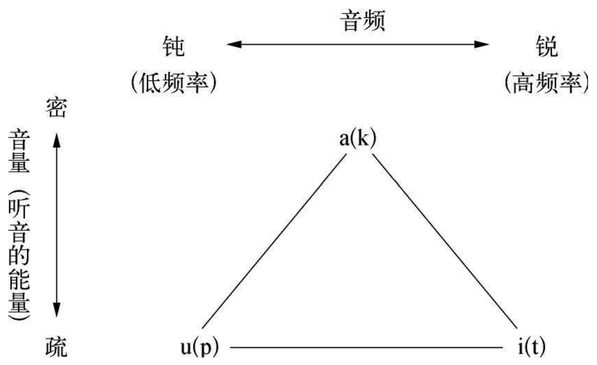

    作者: [法] 高宣扬
    出版社: 上海交通大学出版社
    出版年: 2017-7-20
    页数: 400
    定价: 79.00
    装帧: 精装
    丛书: 高宣扬文集
    ISBN: 9787313171559

[豆瓣链接](https://book.douban.com/subject/27056206/)

- [第1章 结构主义的孕育过程](#%e7%ac%ac1%e7%ab%a0-%e7%bb%93%e6%9e%84%e4%b8%bb%e4%b9%89%e7%9a%84%e5%ad%95%e8%82%b2%e8%bf%87%e7%a8%8b)
  - [第一节 结构主义在现代语言学的最初表现](#%e7%ac%ac%e4%b8%80%e8%8a%82-%e7%bb%93%e6%9e%84%e4%b8%bb%e4%b9%89%e5%9c%a8%e7%8e%b0%e4%bb%a3%e8%af%ad%e8%a8%80%e5%ad%a6%e7%9a%84%e6%9c%80%e5%88%9d%e8%a1%a8%e7%8e%b0)
  - [第二节 结构主义在现代社会学的最初表现](#%e7%ac%ac%e4%ba%8c%e8%8a%82-%e7%bb%93%e6%9e%84%e4%b8%bb%e4%b9%89%e5%9c%a8%e7%8e%b0%e4%bb%a3%e7%a4%be%e4%bc%9a%e5%ad%a6%e7%9a%84%e6%9c%80%e5%88%9d%e8%a1%a8%e7%8e%b0)

## 第1章 结构主义的孕育过程
### 第一节 结构主义在现代语言学的最初表现
在1878年，法国著名的语言学家索绪尔（Ferdinand de Saussure，1857—1913）发表了题名为《关于印欧语言中元音的原始系统报告》（Mémoire sur le systéme primitif des voyelles dans les langues Indoeuropéennes）的著作。他认为语言乃是一种集体的习俗，也就是说，反映在语法、语源、语音等方面许多具有普遍性的现象，例如，在语音方面大多数民族都以a、e、i、o、u作为母音——东方各国是这样，西方各国更是这样——表明人类的语言具有某种共同的结构，也反映那些发明和使用不同语言的人们——不管是什么民族——都采用了几乎完全一致的“形式”和“结构”。不过，在索绪尔那里，还没有明确地使用“结构”这个概念，而是采用“习俗”这一概念。

实际上，所谓“习俗”，已经很自然地表达了如下的基本特征：

1. 它们是先天的，或者，起码是在无意识中继承了祖辈的做法。
2. 它们是无需经周密思索就可以实行的。任何一种习俗，当人们使用或实行它们的时候，几乎都是出自一种本能。
3. 它们是为大多数人所奉行的。所有已经成为习俗的事物，都是被大多数人所公认和遵守的。在这点而言，它们是具有普遍性的。

在19世纪的语言学中，占统治地位的是比较语言学，其中心内容则是从假定的原则出发，重新建构起比较理想的母语系统。与此相反，索绪尔把研究的重点转向语言的本质及其一般性的结构。他的研究结果，使他得出这样的结论：“语言是相互规定的实体体系”。换句话说，语言乃是一个完整的体系或系统，而构成这一系统的元素是各自独立又相互制约的实体。索绪尔的这一见解非常重要，因为这一见解实际上把语言看作是一种完整的、有内在联系的结构。

索绪尔的这一见解对以后的结构主义产生深远的影响，因为他认为语言结构的关键原则是：语言基本上是一个由对比和相互关联的元素构成的系统。由此，这就向语言学家们提出了一系列的问题：这一系列的结构是什么？这些元素的相互关系是什么？为什么语言有这样或那样的系统？这些具有普遍意义的结构究竟是怎样形成的？它为什么具有普遍的有效性？如此等等。

后来的结构主义从索绪尔的观点中引申出这样的结论：语言结构是共时或同时依存的。

索绪尔的思想中有四点对结构主义的形成具有重要意义：

1. 他把语言看成是一种社会系统，就整体来说，这种系统是互相关联的、有条理的，且是可以被理解的。句法学和语义学一起制定了加于个人之上的一套规则，如果个人要求表达思想，必须遵守这些规则。
2. 他指出了语言符号，即表意记号的随意性。约定俗成的表意记号既不假定在它与构成意义的概念（即它所表示的意义）之间有一个内在的紧密联系，也不假定它因此具有任何固有的稳定性。这一点非常重要，因为后来的结构主义者同样认为：事物的结构具有一种难于说明的随意性，与该事物所表达和所显示的意义毫无联系，也没有任何稳定的性质。
3. 索绪尔在以下两者之间作了一个基本的区别，即一方面是语言——语言习俗，语言学习惯的集合，使得一个人可以了解和被了解；另一方面是说话或言词，或口语，即语言表达的特殊和个别的活动，二者一起构成语言。换句话说，所谓言语，即语言习俗，就是在语言使用者的头脑中所显示的形式和对比的完整体系。而所谓说话，就是在某一个特定的时间内，某一个特定的个人的说话行为。顺便说一句，20世纪的结构主义语言学家乔姆斯基（Avram Noam Chomsky，1928—　）进一步把索绪尔的上述理论区分确定为“能力”和“效行”。
4. 语言的要素绝不是孤立存在，而是始终互相关联的。索绪尔最直接的继承人曾经倾向于把这一见解发展为如下观点，即结构完全独立于历史。

20世纪二三十年代，以雅各布森（Roman Jakobson，1896—1982）和特鲁别兹科伊（Nikolai Trubetzkoy，1890—1938）为代表的布拉格学派（Prague School）在研究语言的深层结构方面取得了决定性的成果，对于列维－斯特劳斯结构主义的产生发生了直接的影响。

雅各布森认为，幼儿必须能够控制基本的母音和子音，然后才能衍生出具有标准化顺序的声音模式［见雅各布森与哈勒著：《语言的基本因素》（Jakobson，R. & Halle，M.，Fundamentals of Language，1956，The Hague）］。幼儿首先依照音量的大小建立基本母音和子音的对立关系：

```
母音（v）        子音（c）
（高能量声音）—— （低能量声音）
（高——密）      （低——疏）
```

然后再依音调不同，将子音（c）加以区分为低频率（钝）的元素（p）和高频率（锐）的元素（t）。高能量（密）的数颚塞音（k）对应于高能量（密）的母音（a），而低能量（疏）的子音（p，t）则对应于低能量（疏）的母音（钝母音u和锐母音i）。

这段话可以用两个重叠的三角图形来表示（见下图）——这两个三角形分别代表母音和子音系统，而其区分标准是密疏和钝锐状况：



语言学中的哥本哈根学派（the Linguistic Circle of Copenhagen）是由丹麦著名语言学家路易斯·耶姆斯列夫（Louis Hjelmslev，1899—1965）创建的。在他看来，语言不过是一种符号体系罢了，而语言这一符号体系的特点，只有在与其他不同种类的符号体系（如逻辑体系、舞蹈体系等）相比较时，才能清楚地显示出来。哥本哈根学派还主张，语言学的研究不能仅仅局限于语言现象的范围内，而且必须更广泛地研究人类本身。他们认为，语言作为人类特有的现象与“人性”有密切的关系。

由此看来，哥本哈根学派有两个观点对结构主义造成影响：

1. 他们把语言看作是许许多多不同种类的符号体系的一种；
2. 他们主张使语言学的研究引申到人类本性的研究。

布龙菲尔德学派是由美国语言学家莱纳德·布龙菲尔德（Leonard Bloomfield，1887—1949）创立的。他在1933年出版了《语言》（Language）一书，奠定这一学派的理论基础。这一学派在20世纪30年代形成以后，曾在20世纪50年代兴盛于美国及世界各国。他们特别强调在行为中研究语义，并坚持要揭示行为过程和语言的使用过程关系，因此，他们的原则也被称为“行为主义的原则”。

综上所述，就是结构主义产生以前，语言学方面所取得的有关研究成果。仅从以上简略的材料，我们就已有足够的证据说明：结构主义的产生是直接与一百多年来的语言学发展成果互相联系的。

### 第二节 结构主义在现代社会学的最初表现
