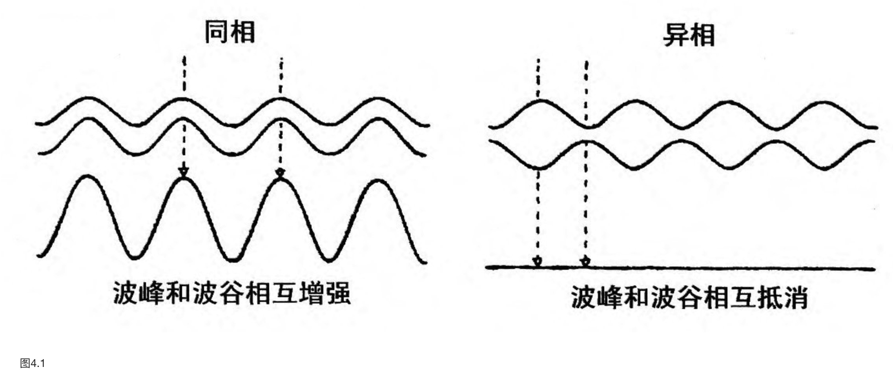
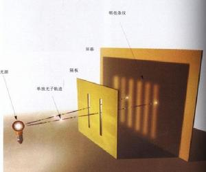

    作者:  [英] 史蒂芬·霍金 
    出版社: 湖南科学技术出版社
    副标题: 插图本
    原作名: A Brief History of Time
    译者: 许明贤 / 吴忠超 
    出版年: 2010-4
    页数: 245
    定价: 45.00元
    装帧: 平装
    ISBN: 9787535732309

[豆瓣链接](https://book.douban.com/subject/1034282/)

- [第一章 我们的宇宙图象](#%e7%ac%ac%e4%b8%80%e7%ab%a0-%e6%88%91%e4%bb%ac%e7%9a%84%e5%ae%87%e5%ae%99%e5%9b%be%e8%b1%a1)
- [第二章 空间和时间](#%e7%ac%ac%e4%ba%8c%e7%ab%a0-%e7%a9%ba%e9%97%b4%e5%92%8c%e6%97%b6%e9%97%b4)
- [第三章 膨胀的宇宙](#%e7%ac%ac%e4%b8%89%e7%ab%a0-%e8%86%a8%e8%83%80%e7%9a%84%e5%ae%87%e5%ae%99)
- [第四章 不确定性原理](#%e7%ac%ac%e5%9b%9b%e7%ab%a0-%e4%b8%8d%e7%a1%ae%e5%ae%9a%e6%80%a7%e5%8e%9f%e7%90%86)
- [第五章 基本粒子和自然的力](#%e7%ac%ac%e4%ba%94%e7%ab%a0-%e5%9f%ba%e6%9c%ac%e7%b2%92%e5%ad%90%e5%92%8c%e8%87%aa%e7%84%b6%e7%9a%84%e5%8a%9b)
- [第六章 黑洞](#%e7%ac%ac%e5%85%ad%e7%ab%a0-%e9%bb%91%e6%b4%9e)
- [第七章 黑洞不是这么黑的](#%e7%ac%ac%e4%b8%83%e7%ab%a0-%e9%bb%91%e6%b4%9e%e4%b8%8d%e6%98%af%e8%bf%99%e4%b9%88%e9%bb%91%e7%9a%84)

## 第一章 我们的宇宙图象
引力理论，牛顿意识到恒星应该相互吸引，这样它们似乎不能保持基本上不动。难道它们不会都一起落到某处去吗？在1691年写给同时代另一位最重要的思想家理查德·本特里的一封信中，牛顿论证道，如果只有有限数目的恒星分布在一个有限的空间区域里，这确实是会发生的。但是另一方面，他推断说，如果存在无限数目的恒星，大体均匀地分布于无限的空间中，对它们而言，因为这时不存在一个中心落点，这种情形就不会发生。

很久以后才意识到正确的方法，即是先考虑有限的情形，这时所有恒星都相互落到一起，然后加上在这个区域以外大体均匀分布的更多恒星，看事情会如何改变。按照牛顿定律，平均地讲，这额外的恒星对原先的那些根本没有什么影响，所以这些恒星还是同样快地落到一起。我们愿意加上多少恒星就可以加上多少，但是它们仍然总是向自身坍缩。现在我们知道，不可能存在一个无限静态的引力总是吸引的宇宙模型。

在1929年，埃德温·哈勃作出了一个里程碑式的观测，即不管你往哪个方向观测，远处的星系都正急速地飞离我们而去。换言之，宇宙正在膨胀。

一个好的理论必须满足以下两个要求：首先，这个理论必须能准确地描述大量的观测——这些观测是根据只包含少数任选的元素的模型所做出的；其次，这个理论能对未来观测的结果作出明确的预言。

科学哲学家卡尔·波普强调的，**一个好的理论的特征是，它能给出许多在原则上可以被观测否定或证伪的预言**。每回观察到与这预言相符的新的实验，则这理论就存活，并且增加了我们对它的信任度；然而若有一个新的观测与之不符，则我们只得抛弃或修正这理论。

科学的终极目的是提供描述整个宇宙的单一的理论。

## 第二章 空间和时间
麦克斯韦方程预言，在合并的电磁场中可以存在波动的微扰，它们以固定的速度，正如池塘水面上的涟漪那样行进。如果这些波的波长（两个相邻波峰之间的距离）为1米或更长一些，它们就是我们所谓的射电波。更短波长的波称做微波（几厘米）或红外线（长于万分之一厘米）。可见光的波长在一百万分之四十至一百万分之八十厘米之间。更短的波长被称为紫外线、X射线和伽马射线。

麦克斯韦理论预言，射电波或光波应以某一固定的速度行进。但是牛顿理论已经摆脱了绝对静止的观念，所以如果假定光以固定的速度行进，人们就必须说清这固定的速度是相对于何物来测量的。因此有人提出，存在着一种无所不在的称为“以太”的物质，甚至在“真空的”空间中也是如此。

阿尔伯特·爱因斯坦，在1905年的一篇著名的论文中指出，只要人们愿意抛弃绝对时间观念的话，整个以太的观念则是多余的。

相对论的基本假设是，不管观察者以任何速度作自由运动，相对于他们而言，科学定律都应该是一样的。这对于牛顿的运动定律当然是对的，但是现在这个观念被扩展到包括麦克斯韦理论和光速：**不管观察者运动多快，他们应测量到一样的光速。** 这简单的观念有一些非凡的结论。可能最著名者莫过于质量和能量的等价，这可用爱因斯坦著名的方程$E=mc^{2}$来表达（E是能量，m是质量，c是光速），以及没有任何东西可能行进得比光还快的定律。

当一个物体接近光速时，它的质量上升得越来越快，这样它需要越来越多的能量才能进一步加速上去。实际上它永远不可能达到光速，因为那时质量会变成无限大，而根据质量能量等价原理，这就需要无限大的能量才能做到。

我们必须接受，时间不能完全脱离开和独立于空间，而必须和空间结合在一起形成所谓的时空的客体。

狭义相对论非常成功地解释了如下事实：对所有观察者而言，光速都是一样的（正如迈克耳孙——莫雷实验所展示的那样），并成功地描述了当物体以接近于光速运动时会发生什么。

**在广义相对论中，物体总是沿着四维时空的直线走。尽管如此，在我们看来它在三维空间中是沿着弯曲的路径**。（这正如同看一架在非常多山的地面上空飞行的飞机。虽然它沿着三维空间的直线飞，它在二维的地面上的影子却是沿着一条弯曲的路径。）

太阳的质量以这样的方式弯曲时空，使得在四维的时空中地球虽然沿着直线的路径，它却让我们看起来是沿着三维空间中的一个圆周轨道运动。

广义相对论的另一个预言是，在像地球这样的大质量的物体附近，时间显得流逝得更慢一些。这是因为光能量和它的频率（光在每秒钟里波动的次数）有一种关系：能量越大，则频率越高。当光从地球的引力场往上行进，它失去能量，因而其频率下降（这表明两个相邻波峰之间的时间间隔变大）。1962年，人们利用一对安装在水塔顶上和底下的非常准确的钟，验证了这个预言。发现底下的那只更接近地球的钟走得较慢，这和广义相对论正好相符。

如果有一个孩子在以近于光速运动的航天飞船中作长途旅行，这种差别就会大得多。当他回来时，他会比留在地球上另一个年轻得多。这叫做`双生子佯谬`。

## 第三章 膨胀的宇宙
可见光由电磁场的起伏或波动构成。光的波长（或者相邻波峰之间的距离）极其微小，约为0.0000004至0.0000008米。光的不同波长正是人眼看成不同颜色的东西，最长的波长出现在光谱的红端，而最短的波长在光谱的蓝端。现在想像在离开我们固定的距离处有一个光源——例如一颗恒星——以固定的波长发出光波。显然，我们接收到的波长和发射时的波长一样（星系的引力场没有强到足以对它产生明显的效应）。现在假定这恒星光源开始向我们运动。当光源发出第二个波峰时，它离开我们较近一些，这样两个波峰之间的距离比恒星静止时较小。这意味着，我们接收到的波的波长比恒星静止时较短。相应地，如果光源离开我们运动，我们接收的波的波长将较长。这意味着，当恒星离开我们而去时，它们的光谱向红端移动（`红移`），而当恒星趋近我们而来时，光谱则被`蓝移`。这个称作`多普勒效应`的频率和速度的关系是我们日常熟悉的。

在哈勃证明了其他星系存在之后的几年里，他花时间为它们的距离编目以及观察它们的光谱。当他发现大部分星系是红移的：几乎所有都远离我们而去时，确实令人十分惊异！1929年哈勃发表的结果更令人惊异：甚至星系红移的大小也不是随机的，而是和星系离开我们的距离成正比。或换句话讲，星系越远，它离开我们运动得越快！这表明宇宙不能像人们原先所想像的那样处于静态，而实际上是在膨胀；不同星系之间的距离一直在增加着。

所有的弗里德曼解都具有一个特点，即在过去的某一时刻（约100至200亿年之前）邻近星系之间的距离一定为零。

广义相对论（弗里德曼解以此为基础）预言，在宇宙中存在一点，在该处理论本身崩溃。这样的点正是数学中称为`奇点`的一个例子。

广义相对论是否预言我们的宇宙一定有过大爆炸或时间的开端？对于这个问题，英国数学家兼物理学家罗杰·彭罗斯在1965年以完全不同的手段给出了回答。利用广义相对论中光锥行为的方式以及引力总是吸引这个事实，他证明了，坍缩的恒星在自己的引力作用下陷入到一个区域之中，其表面最终缩小到零。并且由于这区域的表面缩小到零，它的体积也应如此。恒星中的所有物质将被压缩到一个零体积的区域里，所以物质的密度和时空的曲率变成无限大。换言之，人们得到了一个奇点，它被包含在一个叫做`黑洞`的时空区域中。

## 第四章 不确定性原理
你对粒子的位置测量得越准确，你对速度的测量就越不准确，反之亦然。海森伯指出，粒子位置的不确定性乘以粒子质量再乘以速度的不确定性不能小于一个确定量，该确定量称为`普朗克常量`。

不确定性原理使拉普拉斯的科学理论，即一个完全决定性论的宇宙模型的梦想寿终正寝：如果人们甚至不能准确地测量宇宙现在的状态，那么就肯定不能准确地预言将来的事件！

在量子力学中存在着波和粒子的二重性：为了某些目的将考虑粒子成波是有用的，而为了其他目的最好将波考虑成粒子。这导致一个很重要的结果，人们可以观察到两束波或粒子之间的所谓的`干涉`。那也就是，一束波的波峰可以和另一束波的波谷相重合。这两束波就相互抵消，而不像人们预料的那样，叠加在一起形成更强的波（图4.1）。

由于量子力学引进的二重性，粒子也会产生干涉。所谓的`双缝实验`即是著名的例子（图4.2）。

美国科学家理查德·费恩曼引入的所谓对历史求和（即`路径积分`）的方法是一个摹写波粒二象性的好方法。

爱因斯坦广义相对论制约了宇宙的大尺度结构。它是所谓的经典理论；那就是说，它没有到考虑量子力学的不确定性原理，而为了和其他理论一致这是必需的。

## 第五章 基本粒子和自然的力
一个自旋为0的粒子像一个点：从任何方向看都一样〔图5.1（i）〕。另一方面，自旋为1的粒子像一个箭头：从不同方向看是不同的〔图5.1（ii）〕。只有把它转过一整圈（360°）时，这粒子才显得一样。自旋为2的粒子像个双头的箭头〔图5.1（iii）〕：只要把它转过半圈（180°），它看起来便一样。类似地，把更高自旋的粒子转了整圈的更小的部分后，它看起来便一样。所有这一切都是这样的直截了当，但惊人的事实是，把有些粒子转过一圈后，它仍然显得不同：你必须使其转两整圈！这样的粒子就说具有1/2的自旋。

宇宙间所有已知的粒子可以分成两组：自旋为1/2的粒子，它们组成宇宙中的物质；自旋为0、1和2的粒子，正如我们将要看到的，它们在物质粒子之间产生力。物质粒子服从所谓的`泡利不相容原理`。

泡利不相容原理是说，两个类似的粒子不能存在于相同的态中，也就是说，在不确定性原理给出的限制下，它们不能同时具有相同的位置和速度。不相容原理是非常关键的，因为它解释了为何物质粒子，在自旋为O、1和2的粒子产生的力的影响下，不会坍缩成密度非常高的状态的原因：如果物质粒子几乎处在相同的位置，则它们必须有不同的速度，这意味着它们不会长时间存在于相同的位置。

直到保罗·狄拉克在1928年提出一个理论，人们才对电子和其他自旋1/2的粒子有了正确的理解。狄拉克理论是第一种既和量子力学又和狭义相对论相一致的理论。它在数学上解释了为何电子具有1/2的自旋，也即为什么将其转一整圈不能、而转两整圈才能使它显得一样。它还预言了电子必须有它的配偶——反电子或正电子。

携带力的粒子按照其强度以及与其相互作用的粒子可以分成四个种类。必须强调指出，这种将力划分成四种是人为的；它仅仅是为了便于建立部分理论，而并不别具深意。

第一种力是引力，这种力是万有的，也就是说，每一个粒子都因它的质量或能量而感受到引力。引力比其他三种力都弱得多。它是如此之弱，它若不具有两个特别的性质，我们根本就不可能注意到：它能作用到大距离去，以及它总是吸引的。这意味着，在像地球和太阳这样两个巨大的物体中，单独粒子之间的非常弱的引力能都叠加起来而产生相当大的力量。其他三种力要么是短程的，要么时而吸引时而排斥，所以它们倾向于相互抵消。

另一种力是电磁力。它作用于带电荷的粒子（例如电子和夸克）之间，但不和不带电荷的粒子（例如引力子）相互作用。它比引力强得多：两个电子之间的电磁力比引力大约大100亿亿亿亿亿（在1后面有42个O）倍。然而，存在两种电荷——正电荷和负电荷。同种电荷之间的力是相互排斥的，而异种电荷之间的力则是相互吸引的。一个大的物体，譬如地球或太阳，包含了几乎等量的正电荷和负电荷。这样，由于单独粒子之间的吸引力和排斥力几乎全被抵消了，因此两个物体之间净的电磁力非常小。

第三种力称为弱核力。它负责放射性现象，并只作用于自旋为1/2的所有物质粒子，而对诸如光子、引力子等自旋为0、1或2的粒子不起作用。直到1967年伦敦帝国学院的阿伯达斯·萨拉姆和哈佛的史蒂芬·温伯格提出了弱作用和电磁作用的统一理论后，弱作用才被很好地理解。他们提出，除了光子，还存在其他3个自旋为1的被统称作重矢量玻色子的粒子，它们携带弱力。`温伯格-萨拉姆理论`展现了称作对称自发破缺的性质。这意味着，在低能量下一些看起来完全不同的粒子，事实上发现都只是同一种粒子处于不同的状态。所有这些粒子在高能量下都有相似的行为。

第四种力是强核力。它将质子和中子中的夸克束缚在一起，并将原子核中的质子和中子束缚在一起。人们相信，称为胶子的另一种自旋为1的粒子携带强作用力。它只能与自身以及与夸克相互作用。强核力具有一种称为禁闭的古怪性质：它总是把粒子束缚成不带颜色的结合体。由于夸克有颜色（红、绿或蓝），人们不能得到单独的夸克自身。相反，一个红夸克必须用一串胶子和一个绿夸克以及一个蓝夸克连接在一起（红+绿+蓝=白）。这样的三胞胎构成了一个质子或中子。其他的可能性是由一个夸克和一个反夸克组成的对（红+反红，或绿+反绿，或蓝+反蓝=白）。这样的结合体构成了称为介子的粒子。介子是不稳定的，因为夸克和反夸克会相互湮灭，而产生电子和其他粒子。类似地，由于胶子也有颜色，色禁闭使得人们不可能得到单独的胶子自身。相反，人们所能得到的胶子的团，其叠加起来的颜色必须是白的。这样的团形成了称为胶球的不稳定粒子。

## 第六章 黑洞
昌德拉塞卡计算出，一个质量比大约太阳质量一倍半还大的冷的恒星不能维持本身以抵抗自己的引力。（这质量现在称为`昌德拉塞卡极限`。）

如果一颗恒星的质量比昌德拉塞卡极限小，它最后会停止收缩，并且变成一种可能的终态即`“白矮星”`。

恒星还存在另一种可能的终态。其极限质量大约也为太阳质量的一倍或二倍，但是其体积甚至比白矮星还小得多。这些恒星是由中子和质子之间，而不是电子之间的不相容原理排斥力支持的。所以它们叫做`中子星`。

## 第七章 黑洞不是这么黑的
`热力学第二定律`是这个观念的一个准确描述。它陈述道：一个孤立系统的熵总是增加的，并且将两个系统连接在一起时，其合并系统的熵大于所有单独系统熵的总和。